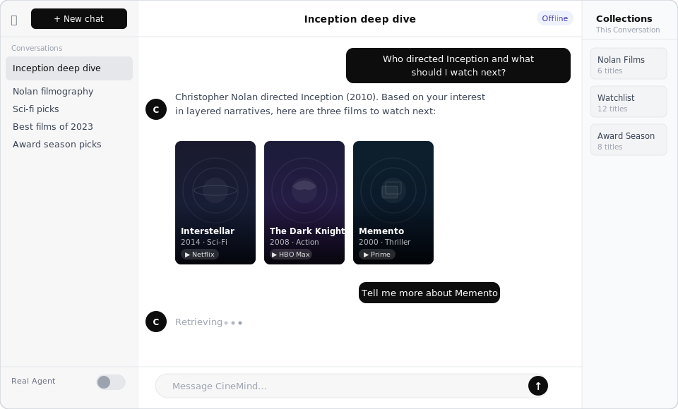
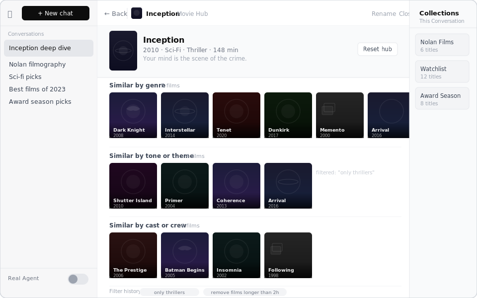
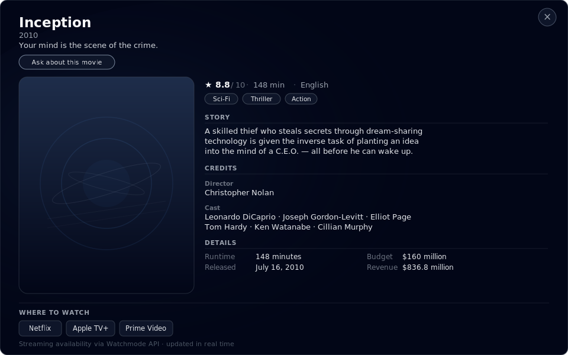
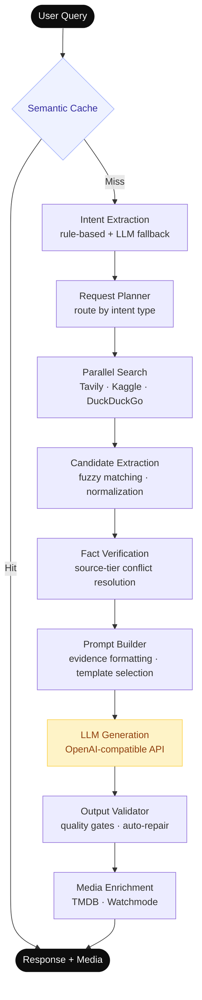

# CineMind

[](https://python.org)
[](https://fastapi.tiangolo.com)

**An applied AI system for real-time movie intelligence.** CineMind combines agentic LLM orchestration, multi-source retrieval, fact verification, and semantic caching into a production-quality pipeline — built to explore what it takes to ship a reliable, grounded LLM-powered product end-to-end.

---

## Features

### Chat — conversational interface with TMDB-enriched poster cards

<p align="center">
  
</p>

Ask anything about movies — cast, directors, recommendations, trivia. Responses are grounded through real-time web search and an offline Kaggle dataset before the LLM generates an answer. Movies mentioned in the response are automatically enriched with TMDB poster images, release year, genre, and streaming availability.

### Movie Hub — sub-context exploration

<p align="center">
  
</p>

Click any movie in a response to open its **Movie Hub** — a dedicated sub-conversation with three AI-curated clusters of similar titles organised by **genre**, **tone/theme**, and **cast/crew**. Ask follow-up questions within the hub to filter the results in real time; each filter is logged in a **filter history** strip so you can see how the LLM narrowed the selection. The breadcrumb header keeps you oriented and lets you return to the main conversation at any point.

### Movie Details — full-screen view with cast, streaming availability, and direct ask-about CTA

<p align="center">
  
</p>

Open any movie card to a full-screen details overlay: story overview, director and cast credits, runtime/budget/revenue, and live streaming availability via the Watchmode API. An **Ask about this movie** button pre-loads the movie as context so follow-up questions land in the right conversation.

---

## Applied AI Techniques

| Technique | Component | Description |
|-----------|-----------|-------------|
| **Agentic orchestration** | `agent/core.py` | 10-stage pipeline with conditional branching, tool selection, and graceful degradation |
| **RAG** | `search/` · `prompting/` | Grounded answers from real-time web search + offline Kaggle dataset before every LLM call |
| **Intent classification** | `extraction/intent_extraction.py` | Hybrid rule-based + LLM routing — avoids full LLM cost on unambiguous queries |
| **Semantic caching** | `infrastructure/cache.py` | Similarity-based cache lookup before LLM call; configurable threshold, measurable cost reduction |
| **Fact verification** | `verification/fact_verifier.py` | Source-tier ranking (curated dataset > web > fallback) resolves conflicts before generation |
| **Prompt engineering** | `prompting/templates.py` | Versioned structured prompts with evidence injection and two-message format |
| **Output validation** | `prompting/output_validator.py` | Quality gates (verbosity, forbidden terms, structure) with auto-repair on violation |
| **LLM abstraction** | `llm/client.py` | Vendor-agnostic OpenAI-compatible client; `FakeLLMClient` enables full offline testing |
| **Graceful degradation** | `workflows/` | Real agent → Playground fallback on API key missing or timeout — zero downtime |
| **Multi-source retrieval** | `search/search_engine.py` | Tavily (real-time web) · Kaggle (offline dataset) · DuckDuckGo (fallback), run in parallel |

---

## Architecture



---

## Key Design Decisions

**Hybrid intent classification** — Rule-based patterns handle the majority of queries at zero LLM cost; an LLM fallback activates only for ambiguous or novel intents. This keeps latency low without sacrificing coverage.

**Source-ranked fact verification** — LLMs hallucinate. Before prompting, search results are ranked by source trust (curated dataset > structured web > open web) and conflicts are resolved deterministically. The LLM receives pre-verified evidence, not raw retrieval.

**Vendor-agnostic LLM client** — `HttpChatLLMClient` speaks the OpenAI chat completions format but can target any compatible endpoint (vLLM, llama.cpp, Ollama). A `FakeLLMClient` returns deterministic responses, making the full pipeline testable with no API keys.

**Semantic cache before LLM** — Every query is similarity-checked against the cache before any LLM call. Cache hits return instantly at zero API cost; the hit threshold is configurable for the precision/recall tradeoff you need.

**Output validation with repair** — Every LLM response passes quality gates before reaching the user. Violations (verbosity, forbidden terms, missing structure) trigger auto-repair rather than hard failure, keeping the system robust without brittleness.

---

## Tech Stack

| Layer | Technologies |
|-------|-------------|
| **Backend** | Python 3.11 · FastAPI · Pydantic v2 · httpx (async LLM calls) |
| **AI / Search** | Tavily · Kaggle datasets · OpenAI-compatible LLM endpoint |
| **External APIs** | TMDB (movie metadata, images) · Watchmode (streaming availability) |
| **Infrastructure** | SQLite / PostgreSQL · semantic cache · observability DB |
| **Frontend** | Vanilla JS modules (no build step) · SSE streaming · CSS design tokens |
| **Testing** | pytest · pytest-asyncio · FakeLLMClient · 28 gold regression scenarios |

---

## Quick Start

Runs fully offline — no LLM API keys required in Playground mode.

```bash
git clone https://github.com/mayad123/movieAgent && cd movieAgent
make venv          # creates .venv and pip install -r requirements.txt
source .venv/bin/activate
make demo          # starts server + prints browser URL
# Open http://localhost:8000
```

**Poster cards:** styled placeholders by default. Add a free TMDB token for real images (2-minute signup at [themoviedb.org](https://www.themoviedb.org/signup) → Settings → API):

```bash
# .env
TMDB_READ_ACCESS_TOKEN=<your_token>
ENABLE_TMDB_SCENES=true
```

For the full real agent (Tavily web search + LLM), copy `.env.example` → `.env`, add your keys, and toggle **Real Agent** in the sidebar. The backend falls back to Playground automatically if any key is missing.

---

## Docker

**Zero-config demo** — no API keys, no `.env` file needed:

```bash
make docker-demo
# Open http://localhost:8000
# Stop with: make docker-demo-down
```

**Full agent** — copy `.env.example` → `.env`, fill in your keys, then:

```bash
docker compose -f docker/docker-compose.yml up --build
```

The compose file passes all environment variables with safe empty defaults, so the service starts in Playground mode even if `.env` is absent or incomplete.

---

## Tests

```bash
make test-unit        # Fast unit tests across 10 modules
make test-integration # Offline agent end-to-end
make test-scenarios   # 28 gold + 42 explore scenario regression
```

The **gold scenario suite** (`tests/fixtures/scenarios/gold/`) defines 28 must-pass query/response contracts verified against `FakeLLMClient` — runs fully in CI with no external dependencies. An additional 42 **explore scenarios** track informational regressions without hard failure requirements.

---

## Quality Signal

| Metric | Value | Notes |
|--------|-------|-------|
| Gold regression scenarios | **28** | Must-pass; cover factual queries, recommendations, streaming, multi-intent |
| Explore scenarios | **42** | Informational; flag regressions without hard CI gates |
| Unit test modules | **10** | Extraction · prompting · media · TMDB · search · infrastructure |
| Output validator violation types | **3** | `forbidden_terms` · `freshness` · `verbosity` — tracked as artifacts per run |
| Offline test coverage | **100%** | Full pipeline exercisable with zero external API calls |

---

## Project Layout

```
src/
├── cinemind/
│   ├── agent/          # Pipeline orchestration + mode selection
│   ├── extraction/     # Intent classification · title parsing · candidate ranking
│   ├── planning/       # Request routing · tool planning · source policy
│   ├── search/         # Tavily · Kaggle · DuckDuckGo integration
│   ├── verification/   # Fact checking against source tiers
│   ├── prompting/      # Prompt building · output validation · versioned templates
│   ├── llm/            # Vendor-agnostic LLM client abstraction
│   ├── media/          # TMDB + Watchmode enrichment · hub filtering
│   └── infrastructure/ # Semantic cache · observability · tagging
├── api/                # FastAPI server (REST + SSE streaming)
├── integrations/       # TMDB · Watchmode HTTP clients
└── schemas/            # Pydantic API contracts
web/                    # Vanilla JS frontend (no build step)
tests/                  # Unit · integration · gold + explore scenario regression
docs/                   # Feature docs · architecture · engineering practices
```

---

> Developer documentation and architecture details live in [`docs/`](docs/README.md).

## Addendum

This project is a work in progress. Features, APIs, and behavior may change as development continues.
