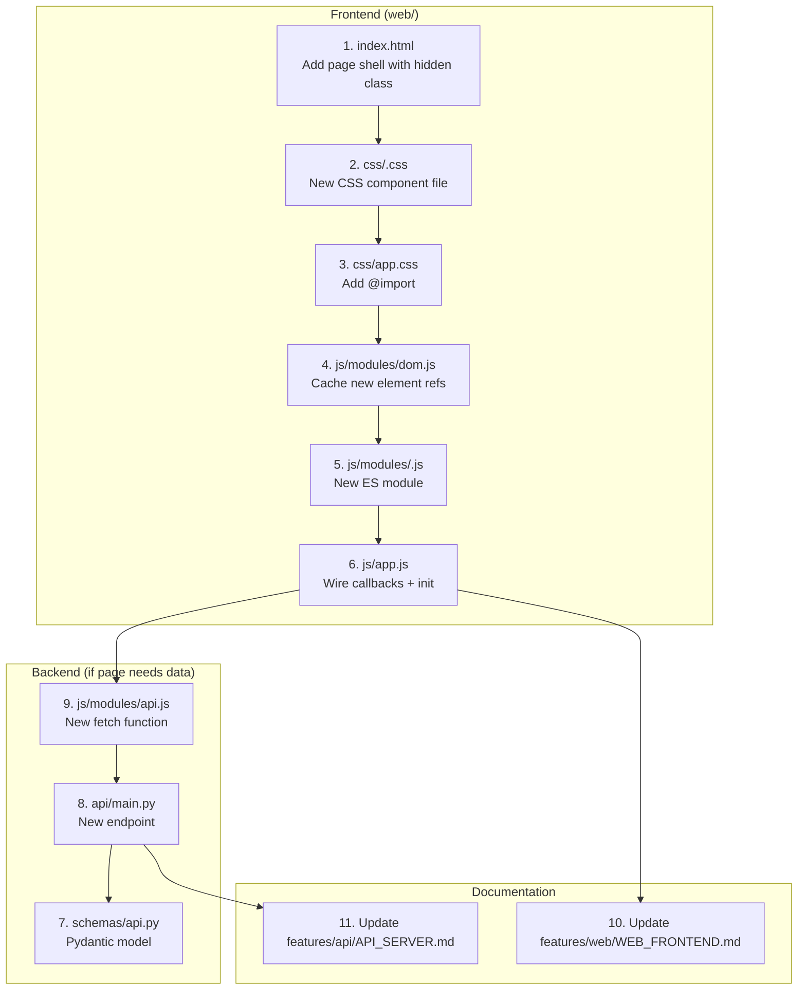
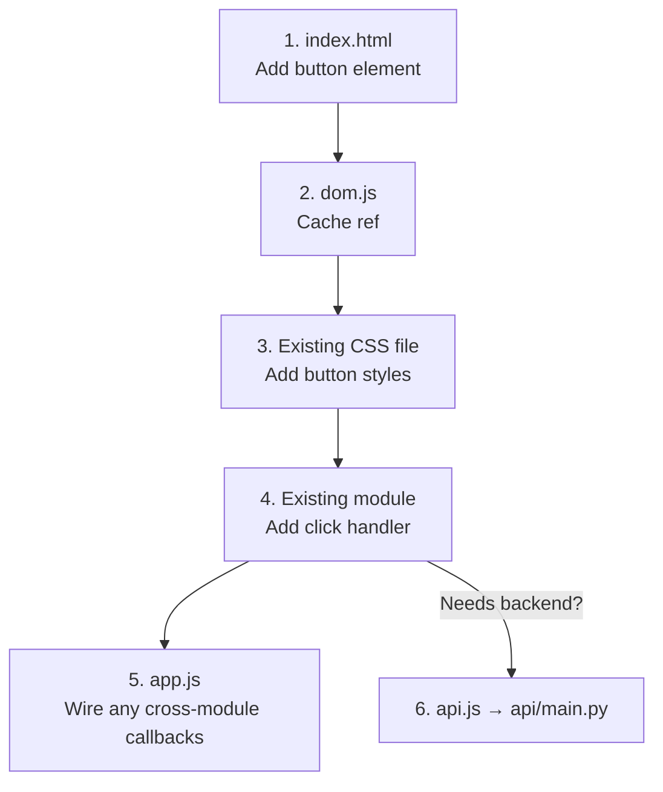
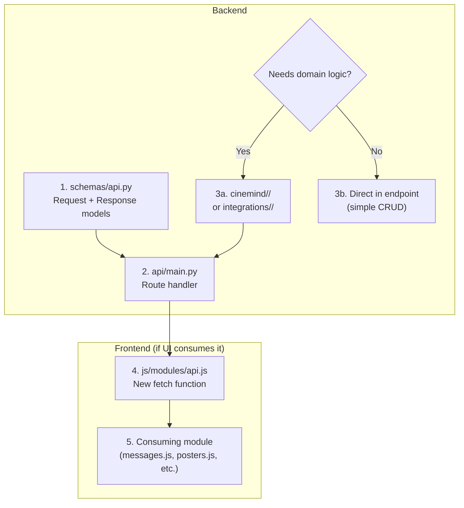
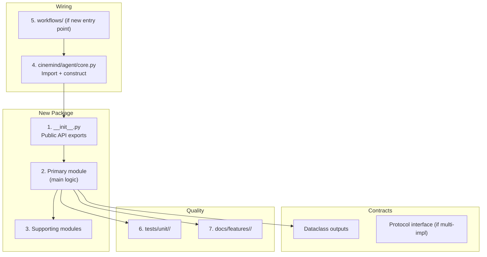
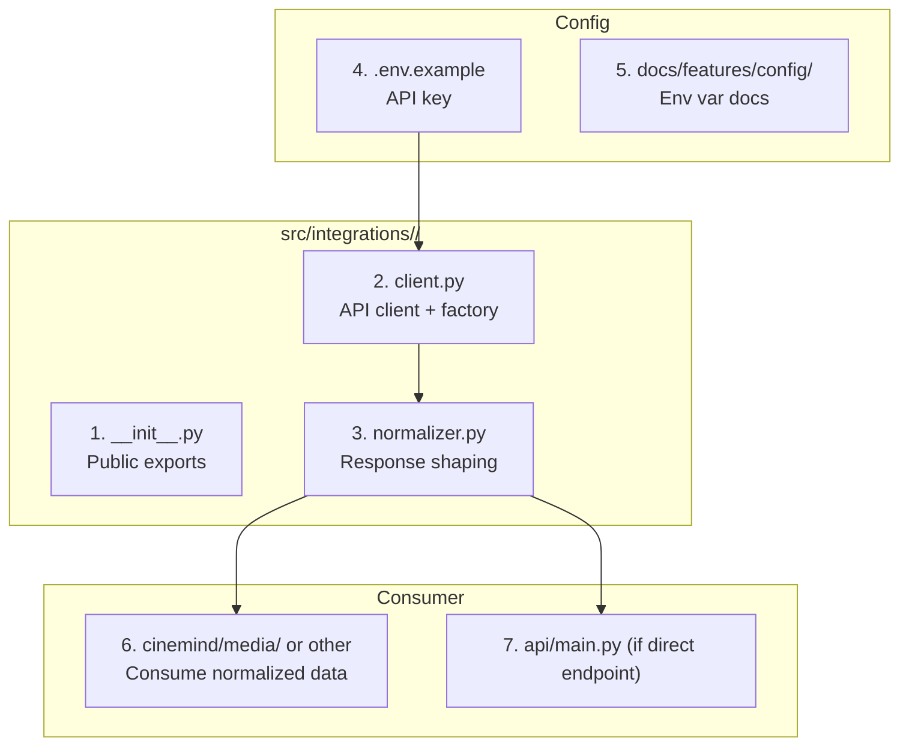
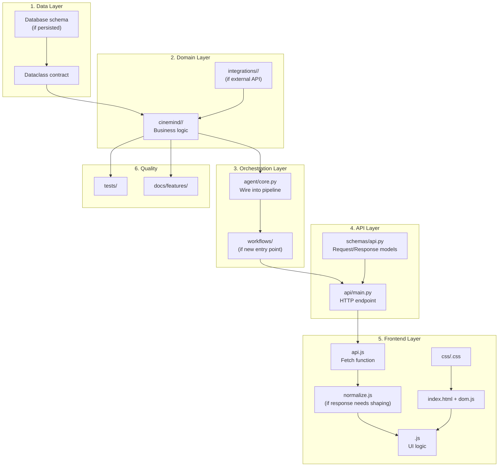

# Add Feature Context

> **Include this document when asking an AI to add something new to CineMind.**
> Covers: new pages, new API endpoints, new buttons/UI components, new backend modules, new integrations, new data pipelines. Routes to the right patterns and checklists so nothing is missed.

<details>
<summary><strong>Quick AI Context</strong> — Jump to what you need</summary>

| I want to add... | Jump to |
|-----------------|---------|
| A new page / view | [Adding a New Page / View](#adding-a-new-page--view) |
| A button or UI action | [Adding a New Button / UI Action](#adding-a-new-button--ui-action) |
| A backend API endpoint | [Adding a New API Endpoint](#adding-a-new-api-endpoint) |
| A backend Python module | [Adding a New Backend Module](#adding-a-new-backend-module--sub-package) |
| An external API integration | [Adding a New External Integration](#adding-a-new-external-integration) |
| A CSS component | [Adding a New CSS Component](#adding-a-new-css-component) |
| Something full-stack | [Full-Stack Feature Trace](#full-stack-feature-trace) |
| Verification checklists | [Completeness Checklists](#completeness-checklists) |

</details>

---

## How to Use This Document

1. **Identify what you're adding** in the Feature Type Router below
2. **Follow the full-stack trace** — most features touch multiple layers
3. **Use the checklist** at the end to verify completeness
4. **Include the listed companion docs** as additional AI context

**Always also include:** [AI_CONTEXT.md](AI_CONTEXT.md) for the dependency chain map and system overview.

---

## Feature Type Router

### Adding a New Page / View

A full new screen in the frontend (e.g., "Movie Quiz", "User Profile", "Watchlist").



**Include these docs:**

| Document | Why |
|----------|-----|
| [Web Frontend](features/web/WEB_FRONTEND.md) | Understand current UI structure, callback wiring, state |
| [Frontend Patterns](practices/FRONTEND_PATTERNS.md) | Module conventions, DOM patterns, state management |
| [CSS Style Guide](practices/CSS_STYLE_GUIDE.md) | Naming, custom properties, responsive patterns |
| [API Server](features/api/API_SERVER.md) | If the page needs a new endpoint |
| [Directory Structure](practices/DIRECTORY_STRUCTURE.md) | File placement rules |

**Step-by-step pattern:**

```
Step 1 — HTML Shell
  File: web/index.html
  Add inside #app, with class="hidden" by default:
    <section class="<page>-view hidden" id="<page>View">
      <div class="<page>-header">...</div>
      <div class="<page>-content" id="<page>Content">...</div>
    </section>

Step 2 — CSS Component
  File: web/css/<page>.css
  Naming: .<page>-view, .<page>-header, .<page>-content, etc.
  Use CSS custom properties from base.css for colors/spacing.
  Import: add @import "<page>.css"; to web/css/app.css

Step 3 — DOM References
  File: web/js/modules/dom.js
  Add: export const <page>View = document.getElementById('<page>View');
  Add refs for every interactive element.

Step 4 — State (if needed)
  File: web/js/modules/state.js
  Add any new state fields to appState.

Step 5 — JS Module
  File: web/js/modules/<page>.js
  Structure:
    import * as dom from './dom.js';
    import { appState } from './state.js';

    let _callbacks = {};
    export function set<Page>Callbacks(cb) { _callbacks = cb; }

    export function open<Page>() { dom.<page>View.classList.remove('hidden'); }
    export function close<Page>() { dom.<page>View.classList.add('hidden'); }
    export function init<Page>() { /* event listeners */ }

Step 6 — Wire in app.js
  File: web/js/app.js
  Import: import { set<Page>Callbacks, init<Page> } from './modules/<page>.js';
  Wire: set<Page>Callbacks({ /* refs from other modules */ });
  Init: init<Page>();

Step 7 — API (if needed)
  File: web/js/modules/api.js — add fetch function
  File: src/schemas/api.py — add Pydantic model
  File: src/api/main.py — add endpoint
```

---

### Adding a New Button / UI Action

A new interactive element on an existing page (e.g., "Save to Watchlist" button on poster cards, "Share" button in header).



**Include these docs:**

| Document | Why |
|----------|-----|
| [Web Frontend](features/web/WEB_FRONTEND.md) | Find the right module and CSS file |
| [Frontend Patterns](practices/FRONTEND_PATTERNS.md) | Event listener and callback patterns |
| [CSS Style Guide](practices/CSS_STYLE_GUIDE.md) | Button naming convention |

**Key decisions:**

| Question | If Yes | If No |
|----------|--------|-------|
| Does it trigger a backend call? | Add to `api.js`, add endpoint | Handle in JS only |
| Does it communicate across modules? | Add callback in `app.js` | Handle within the owning module |
| Does it change app state? | Mutate `appState`, then re-render | Fire-and-forget |
| Is it on a dynamically created element? | Attach listener during creation in the module | Add ref in `dom.js` |

**Pattern for a button on a poster card:**

```javascript
// In posters.js (where cards are created)
const btn = document.createElement('button');
btn.className = 'hero-card-action hero-card-<action>';
btn.textContent = 'Action Label';
btn.addEventListener('click', () => {
    _callbacks.<actionName>(movieData);
});
card.appendChild(btn);
```

```css
/* In media.css (where poster styles live) */
.hero-card-<action> {
    /* button styles using existing tokens */
    background: var(--sub-surface-soft);
    color: var(--sub-text-primary);
    border: 1px solid var(--sub-border);
}
```

---

### Adding a New API Endpoint

A new backend endpoint (e.g., `/api/reviews`, `/api/quiz`, `/api/watchlist`).



**Include these docs:**

| Document | Why |
|----------|-----|
| [API Server](features/api/API_SERVER.md) | Existing endpoints, response schema patterns |
| [Configuration](features/config/CONFIGURATION.md) | Env vars, Pydantic models |
| [Backend Patterns](practices/BACKEND_PATTERNS.md) | Error handling, async, naming |
| [Directory Structure](practices/DIRECTORY_STRUCTURE.md) | Where to place domain logic |
| [Web Frontend](features/web/WEB_FRONTEND.md) | If the frontend consumes the endpoint |

**Pattern:**

```python
# 1. schemas/api.py
class WatchlistResponse(BaseModel):
    movies: List[Dict[str, Any]]
    count: int

# 2. api/main.py
@app.get("/api/watchlist", response_model=WatchlistResponse)
async def get_watchlist(user_id: str):
    # Thin controller — delegate to domain
    service = get_watchlist_service()
    return await service.get_watchlist(user_id)
```

**Rules:**
- Endpoint handlers are thin controllers — no business logic
- Response models defined in `schemas/api.py`
- Domain logic lives in `cinemind/<feature>/` or `integrations/<service>/`
- External API calls live in `integrations/`, never in `api/main.py`

---

### Adding a New Backend Module / Sub-Package

A new domain capability (e.g., `cinemind/recommendations/`, `cinemind/analytics/`).



**Include these docs:**

| Document | Why |
|----------|-----|
| [Directory Structure](practices/DIRECTORY_STRUCTURE.md) | Package structure template |
| [Backend Patterns](practices/BACKEND_PATTERNS.md) | Dataclass, Protocol, DI, naming conventions |
| Nearest feature doc (e.g., [Extraction](features/extraction/EXTRACTION_PIPELINE.md)) | See how existing packages are structured |
| [Agent Core](features/agent/AGENT_CORE.md) | Understand how to wire into the pipeline |
| [Testing Practices](practices/TESTING_PRACTICES.md) | Test file layout |

**Package template:**

```
src/cinemind/<feature>/
├── __init__.py         # from .engine import FeatureEngine, FeatureResult
├── engine.py           # Main class with business logic
├── helpers.py          # Pure utility functions (if needed)
```

**Mandatory conventions:**
- `__init__.py` re-exports only the public API
- All data structures are `@dataclass`
- Logger: `logger = logging.getLogger(__name__)`
- Constructor injection for dependencies
- No upward imports (never import from `agent/` or `api/`)

---

### Adding a New External Integration

A new third-party API (e.g., Letterboxd, Rotten Tomatoes scraper, JustWatch).



**Include these docs:**

| Document | Why |
|----------|-----|
| [External Integrations](features/integrations/EXTERNAL_INTEGRATIONS.md) | See TMDB/Watchmode patterns |
| [Directory Structure](practices/DIRECTORY_STRUCTURE.md) | Integration template |
| [Backend Patterns](practices/BACKEND_PATTERNS.md) | Error handling, factory functions |
| [Configuration](features/config/CONFIGURATION.md) | Env var registry |

**Integration template:**

```python
# __init__.py
"""<Service> integration: <what it provides>."""
from .client import get_<service>_client, <Service>Client
from .normalizer import normalize_<service>_response

# client.py
class <Service>Client:
    def __init__(self, api_key: str):
        self.api_key = api_key
    async def <primary_method>(self, ...): ...

def get_<service>_client() -> <Service>Client:
    return <Service>Client(api_key=os.environ.get("<SERVICE>_API_KEY", ""))

# normalizer.py
def normalize_<service>_response(raw):
    """Transform raw API response into domain-friendly format."""
    ...
```

**Rules:**
- Integration modules never contain business logic
- Always provide a factory function (`get_<service>_client()`)
- Always normalize at the boundary (raw API → clean dataclass)
- Graceful degradation: missing API key → empty/disabled provider, not crash

---

### Adding a New CSS Component

A new styled UI element that doesn't require a full new page.

**Include these docs:**

| Document | Why |
|----------|-----|
| [CSS Style Guide](practices/CSS_STYLE_GUIDE.md) | Naming, tokens, file organization |
| [Web Frontend](features/web/WEB_FRONTEND.md) | Component-to-CSS mapping |

**Decision: new file or existing file?**

| Scenario | Where |
|----------|-------|
| New UI region (drawer, panel, overlay) | New `css/<region>.css` + `@import` in `app.css` |
| New element within existing region | Existing CSS file that owns that region |
| New card type in the media area | `css/media.css` |
| New sidebar element | `css/sidebar.css` |
| New chat message variant | `css/chat.css` |

**Naming pattern:**

```css
/* New component in an existing file */
.existing-region-new-element { }
.existing-region-new-element-child { }
.existing-region-new-element.state { }

/* New component file */
.new-region { }
.new-region-header { }
.new-region-content { }
.new-region-item { }
```

---

## Full-Stack Feature Trace

For features that span both backend and frontend, follow this layer-by-layer trace:



---

## Completeness Checklists

### New Backend Feature Checklist

- [ ] Package created with `__init__.py` and public exports
- [ ] All data structures are `@dataclass` with type annotations
- [ ] Logger uses `logging.getLogger(__name__)`
- [ ] Dependencies injected via constructor
- [ ] No upward imports (never imports from `agent/`, `api/`, or `workflows/`)
- [ ] Env vars added to `.env.example` with comment
- [ ] Env vars documented in `docs/features/config/CONFIGURATION.md`
- [ ] Feature doc created at `docs/features/<name>/<NAME>.md`
- [ ] `docs/features/README.md` updated with new entry
- [ ] `docs/AI_CONTEXT.md` routing table updated
- [ ] Unit tests added at `tests/unit/<name>/`
- [ ] Integration test if feature crosses module boundaries
- [ ] Graceful degradation on failure (no crashes)

### New Frontend Feature Checklist

- [ ] HTML shell added to `index.html` with `class="hidden"`
- [ ] DOM refs cached in `dom.js`
- [ ] CSS file created (or existing file extended) with correct naming prefix
- [ ] CSS file imported in `app.css` (if new file)
- [ ] Uses CSS custom properties from `base.css` for colors/spacing
- [ ] JS module uses callback wiring (`set<Feature>Callbacks()`)
- [ ] No direct cross-module imports (only via callbacks)
- [ ] State changes go through `appState`
- [ ] API calls go through `api.js`
- [ ] User data rendered with `textContent` or `escapeHtml()`
- [ ] Error states handled and shown to user
- [ ] `docs/features/web/WEB_FRONTEND.md` updated

### New API Endpoint Checklist

- [ ] Pydantic request/response model in `schemas/api.py`
- [ ] Endpoint handler is a thin controller (no business logic)
- [ ] Domain logic lives in `cinemind/` or `integrations/`
- [ ] Error responses follow existing FastAPI pattern
- [ ] `docs/features/api/API_SERVER.md` updated
- [ ] Frontend `api.js` updated (if UI consumes it)
- [ ] Env vars documented (if new)

### New Integration Checklist

- [ ] Package at `src/integrations/<service>/` with `__init__.py`, `client.py`, `normalizer.py`
- [ ] Factory function: `get_<service>_client()`
- [ ] Response normalized at integration boundary
- [ ] API key read from env var with graceful fallback
- [ ] `.env.example` updated
- [ ] `docs/features/integrations/EXTERNAL_INTEGRATIONS.md` updated
- [ ] `docs/features/config/CONFIGURATION.md` updated
- [ ] Consumer module wired (e.g., `cinemind/media/`)
- [ ] Tests mock the external API (never hit real endpoints in tests)
