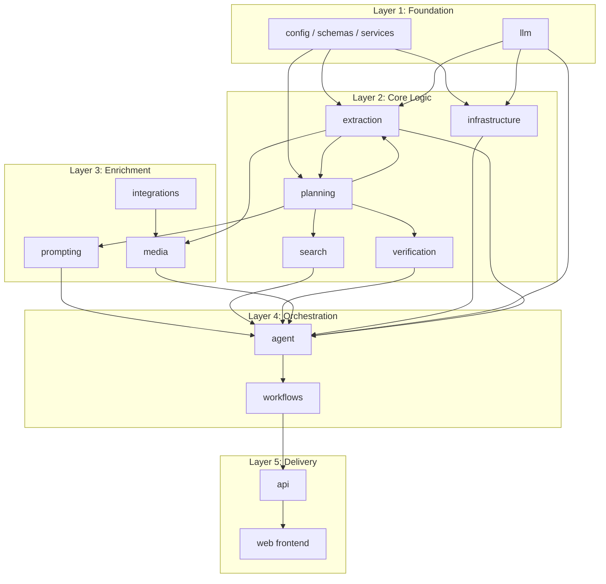

# AI Context Guide

> **Start here when using an AI assistant to modify CineMind.**
> This document routes you to the right feature documentation based on what you're changing, maps dependencies between systems, and links to best practices.

<details>
<summary><strong>Quick AI Context</strong> — Jump to what you need</summary>

| I need to... | Jump to |
|-------------|---------|
| Pick which companion doc to add | [Companion Context Documents](#companion-context-documents) |
| Route my change to the right docs | [Change Routing Table](#change-routing-table) |
| Understand dependency ripple effects | [Dependency Chain Map](#dependency-chain-map) |
| See exact doc combos for common tasks | [Context Assembly Recipes](#context-assembly-recipes) |
| See the full doc tree | [Full Documentation Map](#full-documentation-map) |

**Quick routing:**
- Adding something new → also include `ADD_FEATURE_CONTEXT.md`
- Changing existing code → also include `CHANGE_FEATURE_CONTEXT.md`
- Both → include both companion docs

</details>

---

## Companion Context Documents

This is the base context. Depending on the task, **also include one of these:**

| Task | Include | Purpose |
|------|---------|---------|
| Adding something new | [ADD_FEATURE_CONTEXT.md](ADD_FEATURE_CONTEXT.md) | Full-stack traces, templates, and checklists for new pages, endpoints, buttons, modules, integrations |
| Modifying existing code | [CHANGE_FEATURE_CONTEXT.md](CHANGE_FEATURE_CONTEXT.md) | Investigation strategies, dependency tracing, breaking-change analysis, verification checklists |

**Usage pattern:**
- Small change → `AI_CONTEXT.md` alone (use the routing table below)
- Adding a feature → `AI_CONTEXT.md` + `ADD_FEATURE_CONTEXT.md` + relevant feature docs
- Fixing / changing behavior → `AI_CONTEXT.md` + `CHANGE_FEATURE_CONTEXT.md` + relevant feature docs

---

## How to Use This Document

1. **Identify what you're changing** using the routing table below
2. **Include the listed documents** as context for the AI
3. **Check the dependency chain** to understand what else might be affected
4. **Follow the best practices** linked for the type of change

---

## Change Routing Table

### "I want to change how the agent answers queries"

| Specific Change | Primary Doc | Also Include | Best Practice |
|----------------|-------------|-------------|---------------|
| Agent pipeline / orchestration | [Agent Core](features/agent/AGENT_CORE.md) | [Workflows](features/workflows/WORKFLOWS.md) | [Backend Patterns](practices/BACKEND_PATTERNS.md) |
| How queries are understood | [Extraction Pipeline](features/extraction/EXTRACTION_PIPELINE.md) | [Request Planning](features/planning/REQUEST_PLANNING.md) | [Backend Patterns](practices/BACKEND_PATTERNS.md) |
| Which tools/sources are selected | [Request Planning](features/planning/REQUEST_PLANNING.md) | [Search Engine](features/search/SEARCH_ENGINE.md) | [Backend Patterns](practices/BACKEND_PATTERNS.md) |
| What the LLM prompt looks like | [Prompt Pipeline](features/prompting/PROMPT_PIPELINE.md) | [LLM Client](features/llm/LLM_CLIENT.md) | [Backend Patterns](practices/BACKEND_PATTERNS.md) |
| How facts are verified | [Fact Verification](features/verification/FACT_VERIFICATION.md) | [Request Planning](features/planning/REQUEST_PLANNING.md) | [Backend Patterns](practices/BACKEND_PATTERNS.md) |
| Caching behavior | [Infrastructure](features/infrastructure/INFRASTRUCTURE.md) | [Extraction Pipeline](features/extraction/EXTRACTION_PIPELINE.md) | [Backend Patterns](practices/BACKEND_PATTERNS.md) |

### "I want to change the API"

| Specific Change | Primary Doc | Also Include | Best Practice |
|----------------|-------------|-------------|---------------|
| Add/modify endpoints | [API Server](features/api/API_SERVER.md) | [Configuration](features/config/CONFIGURATION.md) | [Backend Patterns](practices/BACKEND_PATTERNS.md) |
| Change response shape | [API Server](features/api/API_SERVER.md) | [Web Frontend](features/web/WEB_FRONTEND.md) | [Backend Patterns](practices/BACKEND_PATTERNS.md), [Frontend Patterns](practices/FRONTEND_PATTERNS.md) |
| Add environment variables | [Configuration](features/config/CONFIGURATION.md) | Relevant feature doc | [Directory Structure](practices/DIRECTORY_STRUCTURE.md) |
| Change mode/fallback behavior | [Workflows](features/workflows/WORKFLOWS.md) | [Agent Core](features/agent/AGENT_CORE.md) | [Backend Patterns](practices/BACKEND_PATTERNS.md) |

### "I want to change the UI"

| Specific Change | Primary Doc | Also Include | Best Practice |
|----------------|-------------|-------------|---------------|
| Chat messages / rendering | [Web Frontend](features/web/WEB_FRONTEND.md) | [API Server](features/api/API_SERVER.md) | [Frontend Patterns](practices/FRONTEND_PATTERNS.md) |
| Poster cards / media display | [Web Frontend](features/web/WEB_FRONTEND.md) | [Media Enrichment](features/media/MEDIA_ENRICHMENT.md) | [Frontend Patterns](practices/FRONTEND_PATTERNS.md), [CSS Style Guide](practices/CSS_STYLE_GUIDE.md) |
| Where-to-Watch feature | [Web Frontend](features/web/WEB_FRONTEND.md) | [External Integrations](features/integrations/EXTERNAL_INTEGRATIONS.md) | [Frontend Patterns](practices/FRONTEND_PATTERNS.md) |
| Layout / sidebar / panels | [Web Frontend](features/web/WEB_FRONTEND.md) | — | [CSS Style Guide](practices/CSS_STYLE_GUIDE.md) |
| Styling / themes | [Web Frontend](features/web/WEB_FRONTEND.md) | — | [CSS Style Guide](practices/CSS_STYLE_GUIDE.md) |

### "I want to change media / poster behavior"

| Specific Change | Primary Doc | Also Include | Best Practice |
|----------------|-------------|-------------|---------------|
| What attachments appear | [Media Enrichment](features/media/MEDIA_ENRICHMENT.md) | [Extraction Pipeline](features/extraction/EXTRACTION_PIPELINE.md) | [Backend Patterns](practices/BACKEND_PATTERNS.md) |
| TMDB integration | [External Integrations](features/integrations/EXTERNAL_INTEGRATIONS.md) | [Media Enrichment](features/media/MEDIA_ENRICHMENT.md) | [Backend Patterns](practices/BACKEND_PATTERNS.md) |
| Watchmode integration | [External Integrations](features/integrations/EXTERNAL_INTEGRATIONS.md) | [API Server](features/api/API_SERVER.md) | [Backend Patterns](practices/BACKEND_PATTERNS.md) |
| Media caching | [Media Enrichment](features/media/MEDIA_ENRICHMENT.md) | [Infrastructure](features/infrastructure/INFRASTRUCTURE.md) | [Backend Patterns](practices/BACKEND_PATTERNS.md) |

### "I want to change search / data retrieval"

| Specific Change | Primary Doc | Also Include | Best Practice |
|----------------|-------------|-------------|---------------|
| Web search (Tavily) | [Search Engine](features/search/SEARCH_ENGINE.md) | [Request Planning](features/planning/REQUEST_PLANNING.md) | [Backend Patterns](practices/BACKEND_PATTERNS.md) |
| Kaggle dataset | [Search Engine](features/search/SEARCH_ENGINE.md) | — | [Backend Patterns](practices/BACKEND_PATTERNS.md) |
| When Tavily is skipped | [Search Engine](features/search/SEARCH_ENGINE.md) | [Request Planning](features/planning/REQUEST_PLANNING.md) | [Backend Patterns](practices/BACKEND_PATTERNS.md) |

### "I want to add a new feature / module"

| Specific Change | Primary Doc | Also Include | Best Practice |
|----------------|-------------|-------------|---------------|
| New Python sub-package | [Directory Structure](practices/DIRECTORY_STRUCTURE.md) | Nearest feature doc | [Backend Patterns](practices/BACKEND_PATTERNS.md) |
| New API endpoint | [API Server](features/api/API_SERVER.md) | [Configuration](features/config/CONFIGURATION.md) | [Backend Patterns](practices/BACKEND_PATTERNS.md) |
| New frontend feature | [Web Frontend](features/web/WEB_FRONTEND.md) | — | [Frontend Patterns](practices/FRONTEND_PATTERNS.md), [CSS Style Guide](practices/CSS_STYLE_GUIDE.md) |
| New external integration | [External Integrations](features/integrations/EXTERNAL_INTEGRATIONS.md) | [Directory Structure](practices/DIRECTORY_STRUCTURE.md) | [Backend Patterns](practices/BACKEND_PATTERNS.md) |

---

## Dependency Chain Map

Use this to understand ripple effects. When you change a package, everything downstream may be affected.



### Reading the Chain

- **Upstream change** (e.g., changing `extraction`) → check all arrows pointing away from it
- **Downstream change** (e.g., changing `web`) → usually safe, only affects the frontend
- **Foundation change** (e.g., changing `config`) → potentially affects everything

### Impact Severity Guide

| Layer Changed | Impact Radius | Risk |
|--------------|---------------|------|
| Foundation (config, llm) | All layers | High — run full test suite |
| Core Logic (extraction, planning, search) | Agent + delivery | Medium — run feature + integration tests |
| Enrichment (prompting, media, integrations) | Agent + delivery | Medium — run related feature tests |
| Orchestration (agent, workflows) | API + web | Low-Medium — run API tests |
| Delivery (api, web) | End users only | Low — run smoke tests |

---

## Context Assembly Recipes

For common tasks, here's exactly which docs to include:

### Recipe: "Fix a bug in how movie titles are extracted"

```
Include:
  1. docs/features/extraction/EXTRACTION_PIPELINE.md
  2. docs/practices/BACKEND_PATTERNS.md
Check after fix:
  - media enrichment (uses extracted titles)
  - attachment classifier (uses parsed response)
```

### Recipe: "Add a new request type (e.g., 'box_office_info')"

```
Include:
  1. docs/features/planning/REQUEST_PLANNING.md
  2. docs/features/extraction/EXTRACTION_PIPELINE.md
  3. docs/features/prompting/PROMPT_PIPELINE.md
  4. docs/practices/DIRECTORY_STRUCTURE.md
  5. docs/practices/BACKEND_PATTERNS.md
Changes needed in:
  - RequestTypeRouter (add patterns)
  - ResponseTemplate (add template)
  - IntentExtractor (add intent patterns)
  - HybridClassifier (add to REQUEST_TYPES)
```

### Recipe: "Change how the poster gallery looks"

```
Include:
  1. docs/features/web/WEB_FRONTEND.md
  2. docs/practices/CSS_STYLE_GUIDE.md
  3. docs/practices/FRONTEND_PATTERNS.md
Files to modify:
  - web/css/media.css (styling)
  - web/js/modules/posters.js (rendering logic)
```

### Recipe: "Add a new external API integration"

```
Include:
  1. docs/features/integrations/EXTERNAL_INTEGRATIONS.md
  2. docs/practices/DIRECTORY_STRUCTURE.md
  3. docs/practices/BACKEND_PATTERNS.md
Steps:
  1. Create src/integrations/<name>/ with __init__.py, client.py, normalizer.py
  2. Add env vars to src/config/ and .env.example
  3. Wire into the consuming feature module
  4. Update docs/features/integrations/EXTERNAL_INTEGRATIONS.md
```

### Recipe: "Improve response quality for recommendations"

```
Include:
  1. docs/features/prompting/PROMPT_PIPELINE.md
  2. docs/features/planning/REQUEST_PLANNING.md
  3. docs/features/extraction/EXTRACTION_PIPELINE.md
  4. docs/practices/BACKEND_PATTERNS.md
Files to modify:
  - prompting/templates.py (ResponseTemplate for "recommendation")
  - prompting/prompt_builder.py (if changing message structure)
  - prompting/output_validator.py (if changing validation rules)
```

---

## Full Documentation Map

```
docs/
├── AI_CONTEXT.md              ← YOU ARE HERE (base context)
├── ADD_FEATURE_CONTEXT.md     ← Include when adding new features
├── CHANGE_FEATURE_CONTEXT.md  ← Include when modifying existing code
├── README.md                  ← Documentation index
├── getting-started/           ← Setup & deployment
├── features/                  ← Feature documentation
│   ├── README.md              ← System architecture + feature index
│   ├── agent/                 ← Agent core & modes
│   ├── api/                   ← REST API
│   ├── config/                ← Config, schemas, env vars
│   ├── extraction/            ← NLP extraction
│   ├── infrastructure/        ← Cache, DB, observability
│   ├── integrations/          ← TMDB, Watchmode
│   ├── llm/                   ← LLM client
│   ├── media/                 ← Media enrichment
│   ├── planning/              ← Request planning
│   ├── prompting/             ← Prompt pipeline
│   ├── search/                ← Search engine
│   ├── verification/          ← Fact verification
│   ├── web/                   ← Frontend
│   └── workflows/             ← Orchestration
└── practices/                 ← Best practices & standards
    ├── BACKEND_PATTERNS.md
    ├── FRONTEND_PATTERNS.md
    ├── CSS_STYLE_GUIDE.md
    ├── DIRECTORY_STRUCTURE.md
    └── TESTING_PRACTICES.md
```
