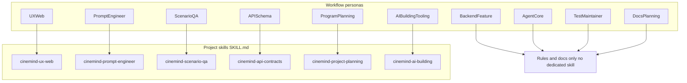
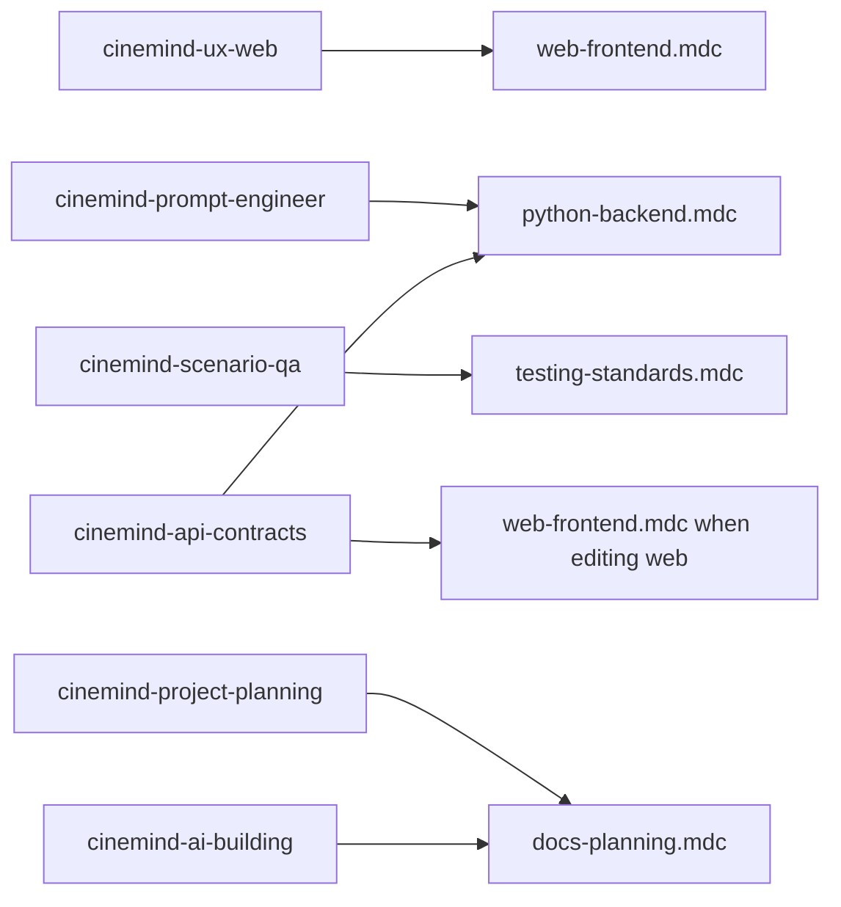
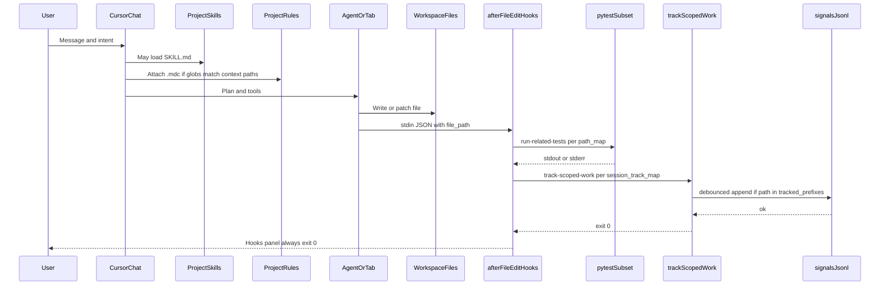
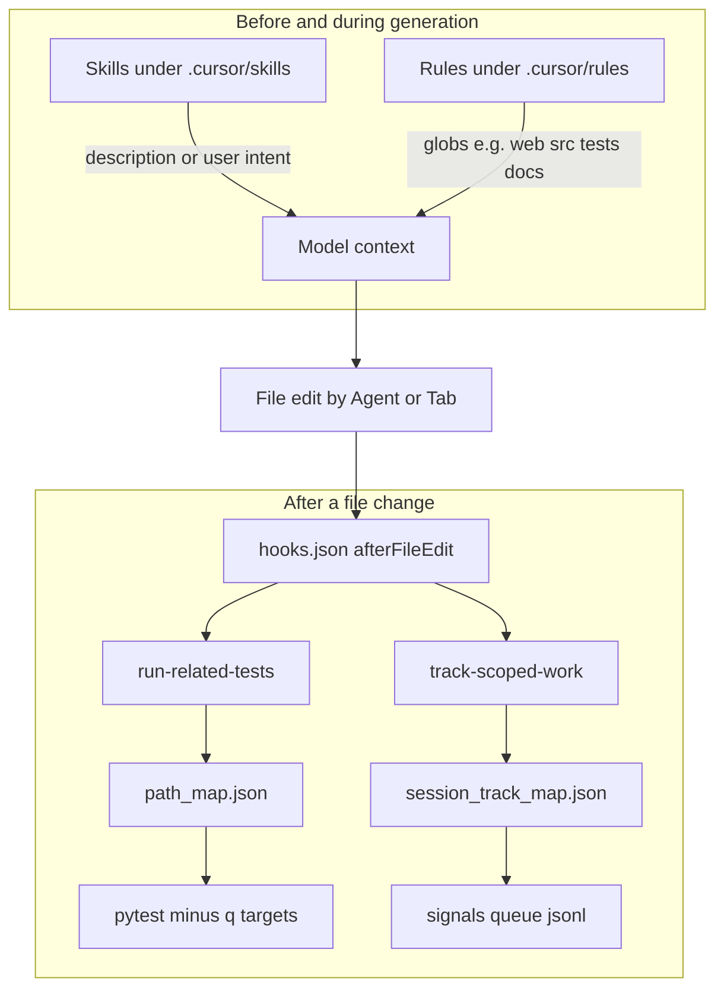
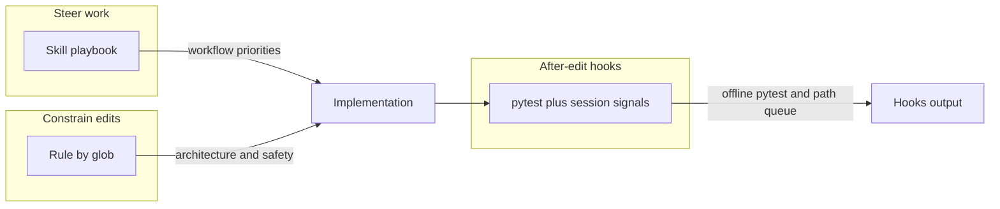
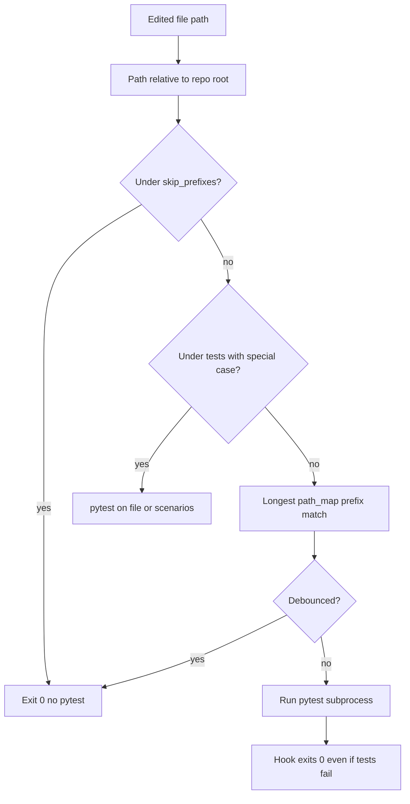
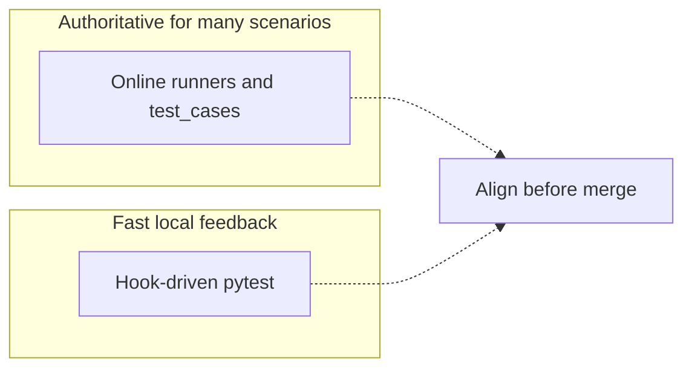

# Cursor mechanisms flow (rules, skills, hooks)

How **rules**, **skills**, and **hooks** fit together in this repo. For prose and tables, see [CURSOR_RULES.md](CURSOR_RULES.md), [CURSOR_SKILLS.md](CURSOR_SKILLS.md), [CURSOR_TEST_HOOKS.md](CURSOR_TEST_HOOKS.md), and the full persona matrix in [CURSOR_WORKFLOW_AGENTS.md](CURSOR_WORKFLOW_AGENTS.md). **Docs history / manifests / `rg`:** [README.md](README.md) § Docs history and [QUERYING.md](QUERYING.md).

## Project rules (concrete)

All live under [`.cursor/rules/`](../../.cursor/rules/). Each uses `alwaysApply: false`; Cursor attaches them when matched paths are in context.

| File | Glob pattern |
|------|----------------|
| [`docs-planning.mdc`](../../.cursor/rules/docs-planning.mdc) | `docs/**/*.md` |
| [`python-backend.mdc`](../../.cursor/rules/python-backend.mdc) | `src/**/*.py` |
| [`testing-standards.mdc`](../../.cursor/rules/testing-standards.mdc) | `tests/**/*.py` |
| [`web-frontend.mdc`](../../.cursor/rules/web-frontend.mdc) | `web/**/*.{js,css,html}` |

## Project skills (concrete)

Each skill is a directory with `SKILL.md` under [`.cursor/skills/`](../../.cursor/skills/).

| Skill `name` (folder) | Link | Role |
|----------------------|------|------|
| `cinemind-ux-web` | [`SKILL.md`](../../.cursor/skills/cinemind-ux-web/SKILL.md) | UX, CSS tokens, vanilla `web/` |
| `cinemind-prompt-engineer` | [`SKILL.md`](../../.cursor/skills/cinemind-prompt-engineer/SKILL.md) | Prompt pipeline, templates, validator, evidence |
| `cinemind-scenario-qa` | [`SKILL.md`](../../.cursor/skills/cinemind-scenario-qa/SKILL.md) | Online `tests/test_cases/`, interactive/parallel runners |
| `cinemind-api-contracts` | [`SKILL.md`](../../.cursor/skills/cinemind-api-contracts/SKILL.md) | `src/api/`, `src/schemas/`, `api.js` contracts |
| `cinemind-project-planning` | [`SKILL.md`](../../.cursor/skills/cinemind-project-planning/SKILL.md) | Cross-cutting initiatives; [`docs/planning/`](../planning/), archive, [`session_logs/`](../session_logs/) (see [PLANNING_DOCS_ARCHIVE.md](PLANNING_DOCS_ARCHIVE.md), [SESSION_LOGS.md](SESSION_LOGS.md)) |
| `cinemind-ai-building` | [`SKILL.md`](../../.cursor/skills/cinemind-ai-building/SKILL.md) | Meta-tooling: [`docs/AIbuilding/`](README.md), `.cursor` rules/skills/hooks; [AI_BUILDING_MAINTAINER.md](AI_BUILDING_MAINTAINER.md) |

## Workflow personas (agents in this repo)

In [CURSOR_WORKFLOW_AGENTS.md](CURSOR_WORKFLOW_AGENTS.md), an **agent** means a **persona** (how you steer Cursor), not the CineMind runtime. Personas map to **zero or one** primary project skill plus whichever **rules** match the files you touch.

| Persona | Primary project skill | Typical rules in play |
|---------|------------------------|----------------------|
| UX / Web | `cinemind-ux-web` | `web-frontend.mdc` |
| Prompt engineer | `cinemind-prompt-engineer` | `python-backend.mdc` |
| Scenario QA | `cinemind-scenario-qa` | `testing-standards.mdc` |
| API / schema | `cinemind-api-contracts` | `python-backend.mdc`, sometimes `web-frontend.mdc` |
| Backend feature | _(none — rules + docs)_ | `python-backend.mdc` |
| Agent core / orchestration | _(none — overlap prompt/scenario skills)_ | `python-backend.mdc` |
| Test maintainer | _(optional: scenario skill for online cases)_ | `testing-standards.mdc` |
| Program / cross-cutting planning | `cinemind-project-planning` | `docs-planning.mdc` (+ other rules if code touched) |
| AI building / Cursor tooling | `cinemind-ai-building` | `docs-planning.mdc` when editing `docs/**`; no rule glob for `.cursor/**` alone |
| Docs / planning | _(none — use Program persona for deep `docs/planning/` work)_ | `docs-planning.mdc` |

The **pytest** hook follows **`path_map.json` only**; the **session-track** hook uses **`session_track_map.json`**. Neither reads skills or switches by persona.

### Personas to skills (Mermaid)

### Skills to rules overlap (Mermaid)

When you adopt a skill, **globs still apply** if you edit matching files—e.g. **API** work on `src/api/*.py` loads `python-backend.mdc`; editing `web/js/modules/api.js` also loads `web-frontend.mdc`.

## Planning docs history (archive)

Cross-cutting edits under [`docs/planning/`](../planning/) can hit **line-budget** or **supersede** triggers. Use **`docs/planning/archive/`** (manifest + YAML snapshots + live stubs) so history stays queryable—see [PLANNING_DOCS_ARCHIVE.md](PLANNING_DOCS_ARCHIVE.md) and [QUERYING.md](QUERYING.md). **`cinemind-project-planning`** + **`docs-planning.mdc`** both apply when those paths are in context.

## Session work logs

For **work-session narratives** (what shipped, which paths/commits, and dependencies between sessions), use **`docs/session_logs/`**—append-only [`MANIFEST.md`](../session_logs/MANIFEST.md), YAML front matter, and the same `rg` patterns as planning archive. See [SESSION_LOGS.md](SESSION_LOGS.md). **Unified query recipes:** [QUERYING.md](QUERYING.md).

## End-to-end: one chat turn through an edit

The model may load **skills** (from your wording and each skill’s `description`). **Rules** attach when conversation context includes files whose paths match rule **globs**. **Hooks** run only *after* a file change from the Agent or Tab—not on every message.

## Where each mechanism attaches

Rules and skills shape **what the model sees** while it reasons; hooks run **after** the edit.

## Skill vs rule vs hook roles

## Hook path to pytest and session signals

Hooks do **not** read skills. **Pytest** uses [`path_map.json`](../../.cursor/hooks/path_map.json) and the edited path only. **Session tracking** uses [`session_track_map.json`](../../.cursor/hooks/session_track_map.json) (same stdin payload).

## Online-first skills vs hook pytest

[Skills](CURSOR_SKILLS.md) treat **online** runs (`tests/test_cases/`, interactive/parallel runners) as authoritative for prompt/scenario work. Hooks provide **offline** pytest for speed.

## Related paths in the repo

| Mechanism | Location |
|-----------|----------|
| Rules | [`.cursor/rules/*.mdc`](../../.cursor/rules/) |
| Skills | [`.cursor/skills/*/SKILL.md`](../../.cursor/skills/) |
| Hooks config | [`.cursor/hooks.json`](../../.cursor/hooks.json) |
| Path map | [`.cursor/hooks/path_map.json`](../../.cursor/hooks/path_map.json) |
| Session track map | [`.cursor/hooks/session_track_map.json`](../../.cursor/hooks/session_track_map.json) |
| Pytest hook | [`.cursor/hooks/run-related-tests`](../../.cursor/hooks/run-related-tests) |
| Session-track hook | [`.cursor/hooks/track-scoped-work`](../../.cursor/hooks/track-scoped-work) |
| Planning archive | [`docs/planning/archive/`](../planning/archive/README.md) |
| Session logs | [`docs/session_logs/`](../session_logs/README.md) |
| Query playbook | [QUERYING.md](QUERYING.md) |

See also: [README.md](README.md), [AI_BUILDING_MAINTAINER.md](AI_BUILDING_MAINTAINER.md), [PLANNING_DOCS_ARCHIVE.md](PLANNING_DOCS_ARCHIVE.md), [SESSION_LOGS.md](SESSION_LOGS.md).
