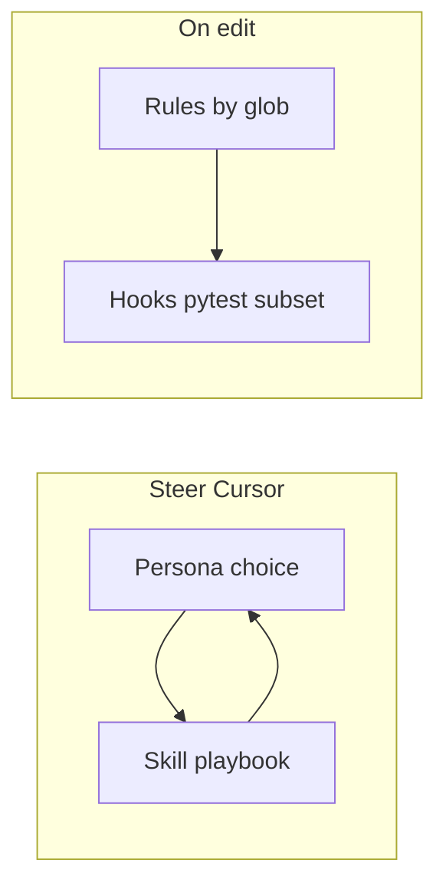

# Workflow agents (personas): rules, skills, and hooks

In this doc, an **agent** is a **repeatable workflow persona**—how you steer Cursor for a kind of task—not CineMind’s runtime [`cinemind.agent`](../../src/cinemind/agent/) and not a separate Cursor product you check into this repo.

Three mechanisms work together:

| Mechanism | Doc |
|-----------|-----|
| **Rules** (globs) | [CURSOR_RULES.md](CURSOR_RULES.md) |
| **Skills** (discovery / playbooks) | [CURSOR_SKILLS.md](CURSOR_SKILLS.md) |
| **Hooks** (post-edit pytest) | [CURSOR_TEST_HOOKS.md](CURSOR_TEST_HOOKS.md) |

For Mermaid diagrams of how these connect in one flow, see [CURSOR_MECHANISMS_FLOW.md](CURSOR_MECHANISMS_FLOW.md).

**Cursor Custom Modes** (Settings → Features → Chat → Custom modes) can mirror these personas by pasting short instructions that say “follow CURSOR_WORKFLOW_AGENTS.md row X.” There is no stable project-level modes file to commit here; treat Custom Modes as **local or team** setup.

## Persona matrix

Typical **hooks** behavior comes from [`.cursor/hooks/path_map.json`](../../.cursor/hooks/path_map.json) via [`run-related-tests`](../../.cursor/hooks/run-related-tests): one `python -m pytest -q …` invocation with debouncing and skips for `docs/`, `data/`, `tests/test_reports/`, `.cursor/`. For `tests/**/*.py`, the hook often runs **pytest on the edited file** (see CURSOR_TEST_HOOKS). **[Project skills](CURSOR_SKILLS.md) prioritize online scenario validation** where applicable; hooks give quick offline pytest signal only.

| Persona | When to use | Skill | Rules (auto when editing matching paths) | Hooks (typical pytest slice) | Manual checks | Docs to sync |
|--------|-------------|-------|------------------------------------------|------------------------------|---------------|--------------|
| **UX / Web** | Layout, theme, a11y, `web/` styling | [`cinemind-ux-web`](../../.cursor/skills/cinemind-ux-web/SKILL.md) | [`web-frontend.mdc`](../../.cursor/rules/web-frontend.mdc) (`web/**/*.{js,css,html}`) | `tests/smoke/` for `web/**` | Browser smoke; spot-check both HTML entrypoints if shared CSS | [FRONTEND_PATTERNS](../practices/FRONTEND_PATTERNS.md) |
| **Prompt engineer** | Prompts, templates, evidence text, validator | [`cinemind-prompt-engineer`](../../.cursor/skills/cinemind-prompt-engineer/SKILL.md) | [`python-backend.mdc`](../../.cursor/rules/python-backend.mdc) (`src/**/*.py`) | `tests/unit/prompting/` + `tests/test_scenarios_offline.py` for `src/cinemind/prompting/**` (offline signal) | **Primary:** run relevant [`tests/test_cases/`](../../tests/test_cases/) suites via [`interactive_runner`](../../tests/helpers/interactive_runner.py) / [`parallel_runner`](../../tests/helpers/parallel_runner.py). **Then** `make test-scenarios` / YAML updates if CI parity needed | [PROMPT_PIPELINE](../features/prompting/PROMPT_PIPELINE.md), [TEST_COVERAGE_MAP](../practices/code-review/TEST_COVERAGE_MAP.md) |
| **Scenario QA** | Curated prompts and acceptance criteria, live eval | [`cinemind-scenario-qa`](../../.cursor/skills/cinemind-scenario-qa/SKILL.md) | [`testing-standards.mdc`](../../.cursor/rules/testing-standards.mdc) (`tests/**/*.py`) | `tests/test_scenarios_offline.py` only if you touch offline fixtures; hooks also hit that file for `tests/test_cases/` edits | **Primary:** online runners + env keys; maintain [`tests/test_cases/`](../../tests/test_cases/). Optional: gold YAML / `CINEMIND_SCENARIO_SET` per [TESTING_PRACTICES](../practices/TESTING_PRACTICES.md) for CI | TEST_COVERAGE_MAP, PROMPT_PIPELINE (test sections) |
| **API / schema** | FastAPI, Pydantic, client JSON shapes | [`cinemind-api-contracts`](../../.cursor/skills/cinemind-api-contracts/SKILL.md) | `python-backend.mdc` + `web-frontend.mdc` if you touch `web/js/**` | `tests/unit/integrations/` + `tests/integration/` for `src/api/**`, `src/schemas/**` | Contract tests; align [`web/js/modules/api.js`](../../web/js/modules/api.js) | [API_SERVER](../features/api/API_SERVER.md), TEST_COVERAGE_MAP |
| **Backend feature** | `src/cinemind/*` outside narrow skills (extraction, media, planning, search, workflows, infrastructure) | _(none—use rules + domain docs; optional future `cinemind-backend` skill)_ | `python-backend.mdc` | Per prefix in `path_map.json` (e.g. `tests/unit/media/`, `tests/unit/extraction/`, …) | `make test-unit` or `make test` as needed | [AI_CONTEXT](../AI_CONTEXT.md), feature docs under `docs/features/` |
| **Agent core / orchestration** | `src/cinemind/agent/**`, playground wiring | Same as backend row; overlap with prompt/scenario | `python-backend.mdc` | `tests/integration/test_agent_offline_e2e.py` + `tests/test_scenarios_offline.py` | Full offline integration pass | [AGENT_CORE](../features/agent/AGENT_CORE.md) |
| **Test maintainer** | New tests, refactors in `tests/**` | _(none—or pair **Scenario QA** skill for YAML)_ | `testing-standards.mdc` | Edited test file or directory rules in hook script | `make test`, flaky hunt, no network in unit tests | [TESTING_PRACTICES](../practices/TESTING_PRACTICES.md), TEST_COVERAGE_MAP |
| **Program / cross-cutting planning** | Epics, multi-package refactors, roadmap/backlog/STATE/SUMMARY shifts, `docs/planning/**` must stay coherent | [`cinemind-project-planning`](../../.cursor/skills/cinemind-project-planning/SKILL.md) | `docs-planning.mdc`; `python-backend.mdc` / `web-frontend.mdc` / `testing-standards.mdc` if the same change touches `src/` or `web/` or `tests/` | **Skipped** while edits stay under `docs/`; otherwise per `path_map.json` | `make check` and targeted tests when code moves; align [planning/](../planning/), [features/](../features/), optional [`session_logs/`](../session_logs/README.md); archive planning per [PLANNING_DOCS_ARCHIVE.md](PLANNING_DOCS_ARCHIVE.md); lookup [QUERYING.md](QUERYING.md) | [`docs/planning/`](../planning/), [AI_CONTEXT](../AI_CONTEXT.md), [AIbuilding README](README.md) |
| **AI building / Cursor tooling** | Rules, skills, hooks, `path_map`, `docs/AIbuilding/**`, cross-link audits, mechanism docs | [`cinemind-ai-building`](../../.cursor/skills/cinemind-ai-building/SKILL.md) | [`docs-planning.mdc`](../../.cursor/rules/docs-planning.mdc) when editing `docs/**` (includes AIbuilding); **no** dedicated glob rule for `.cursor/**` alone | **Skipped** for `docs/` and `.cursor/` (see [CURSOR_TEST_HOOKS](CURSOR_TEST_HOOKS.md)); touch a mapped `src/` or `tests/` file or run pytest manually to verify hook mapping after `path_map` / runner changes | Sync CURSOR_RULES / SKILLS / MECHANISMS_FLOW / TEST_HOOKS tables with disk; follow [AI_BUILDING_MAINTAINER.md](AI_BUILDING_MAINTAINER.md) | [README](README.md), [AI_BUILDING_MAINTAINER.md](AI_BUILDING_MAINTAINER.md), [`.cursor/`](../../.cursor/) |
| **Docs / planning** | Lightweight edits across `docs/**` (typos, links) without a program-wide pass | _(none—for deep updates under `docs/planning/`, use **Program / cross-cutting planning**)_ | [`docs-planning.mdc`](../../.cursor/rules/docs-planning.mdc) (`docs/**/*.md`) | **Skipped** for `docs/` (no automatic pytest) | `make check` before PR if code also changed | Nearest index or README per [docs-planning.mdc](../../.cursor/rules/docs-planning.mdc) |

[`tests/test_cases/`](../../tests/test_cases/) are **online** scenario definitions (not pytest). Hooks map edits there to `tests/test_scenarios_offline.py` as a coarse **offline** signal only. Authoritative checks for scenario/prompt skills use [`tests/helpers/interactive_runner.py`](../../tests/helpers/interactive_runner.py) and related live-API helpers.

## How it fits together

Program-level work often uses [`cinemind-project-planning`](../../.cursor/skills/cinemind-project-planning/SKILL.md) while [`docs-planning.mdc`](../../.cursor/rules/docs-planning.mdc) attaches on any `docs/**/*.md` edit. **Planning history** ([`docs/planning/archive/`](../planning/archive/)), **session logs** ([`docs/session_logs/`](../session_logs/)), and **query recipes** ([QUERYING.md](QUERYING.md)) are documented under this folder—see [README.md](README.md). **Cursor meta-tooling** (rules, skills, hooks, AIbuilding docs) uses [`cinemind-ai-building`](../../.cursor/skills/cinemind-ai-building/SKILL.md)—see [AI_BUILDING_MAINTAINER.md](AI_BUILDING_MAINTAINER.md).

- **Skill** = what you ask the model to optimize for (workflow).
- **Rules** = constraints injected when files match globs.
- **Hooks** = fast feedback loop after file edits (non-blocking exit code).

## How to use in Cursor

1. **Name the role** in your first message (“Act as scenario QA; update gold fixture expectations for …”) so the model is likelier to load the matching [project skill](CURSOR_SKILLS.md).
2. **Trust globs**—editing `web/**` loads web rules; editing `src/**/*.py` loads backend rules; editing `tests/**/*.py` loads testing rules.
3. **Watch Hooks** — Cursor **Output → Hooks** shows `run-related-tests` output; failures do not block further edits by design.
4. **Do not rely on hooks alone** — debouncing (30s), skips (`docs/`, `.cursor/`, etc.), and environment (which `python` runs the hook) mean you should still run **`make test`**, **`make test-scenarios`**, or **`make check`** before merge. For **prompt** and **scenario QA** personas, add **online** runs (interactive/parallel runners) per [CURSOR_SKILLS.md](CURSOR_SKILLS.md).
5. **Custom modes** — Optional: create a mode per persona with a single instruction: “Follow the row for [Persona] in `docs/AIbuilding/CURSOR_WORKFLOW_AGENTS.md`” (include **AI building / Cursor tooling** when maintaining `.cursor/` or `docs/AIbuilding/`).

See also: [README.md](README.md), [QUERYING.md](QUERYING.md).
