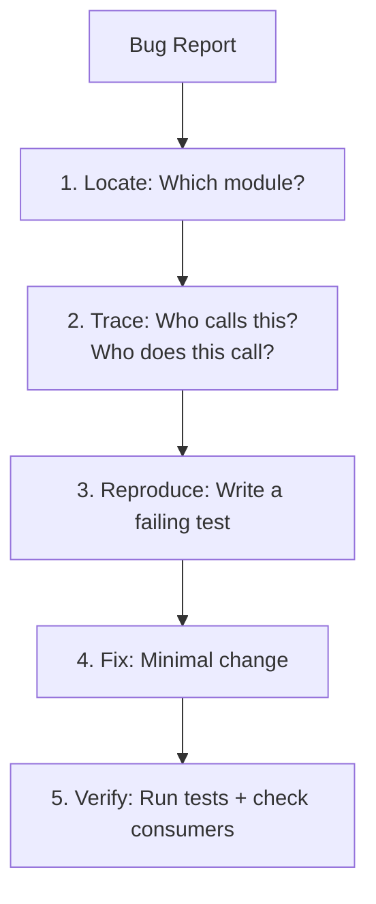
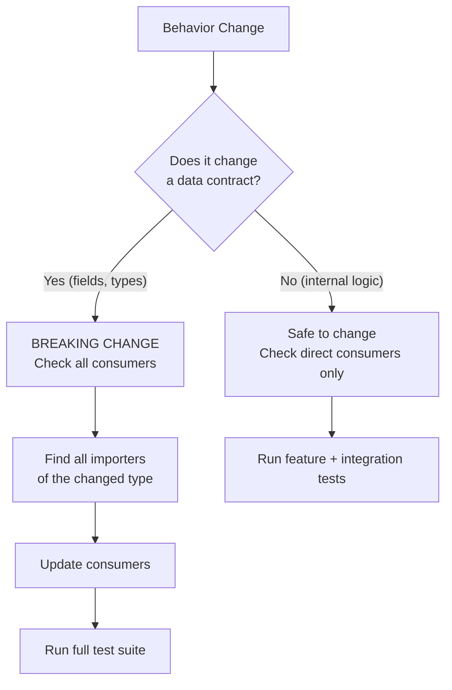
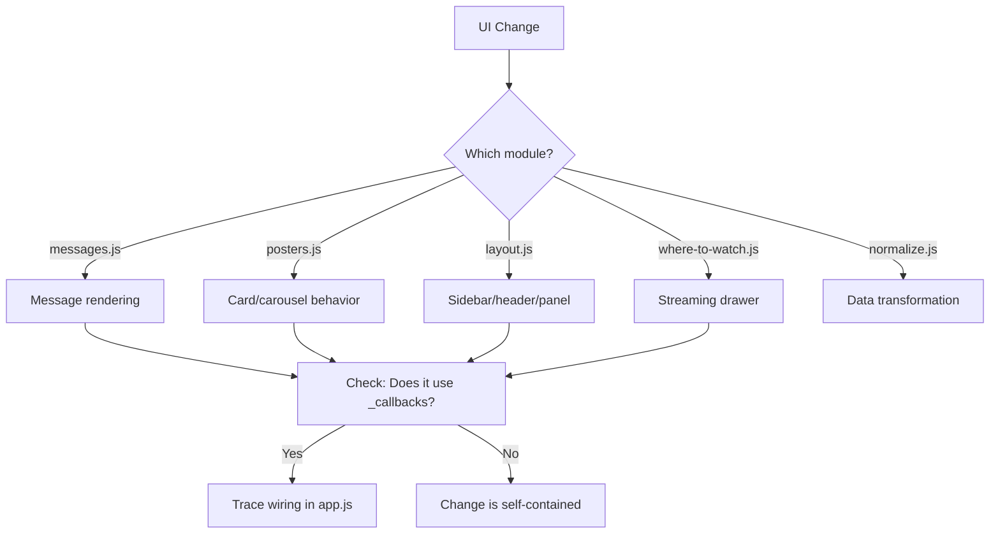
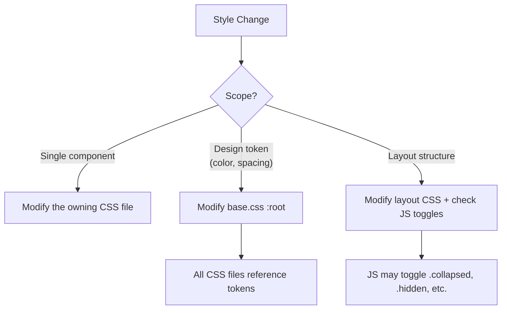
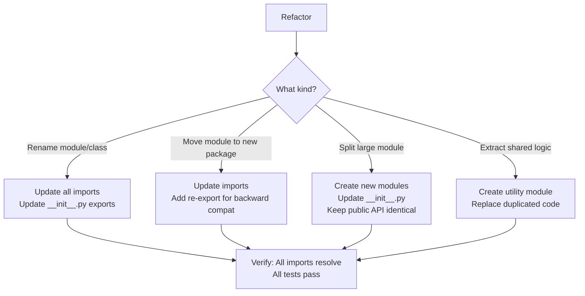
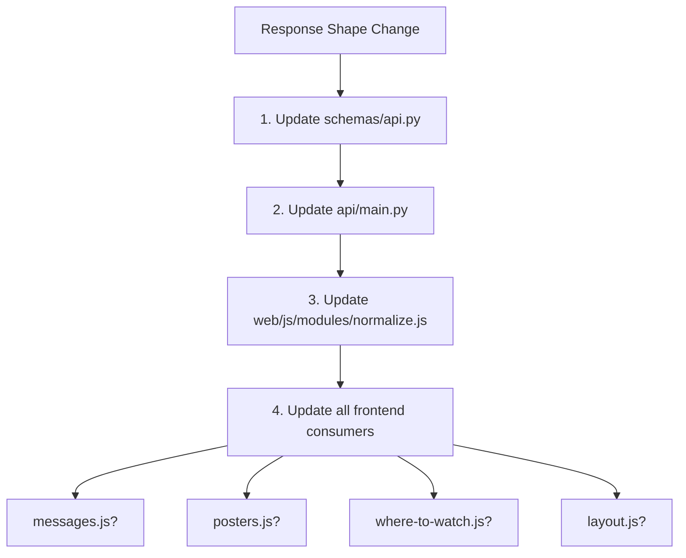

# Change Feature Context

> **Include this document when asking an AI to modify, fix, or refactor existing CineMind code.**
> Covers: bug fixes, behavior changes, refactoring, performance improvements, style changes, dependency updates. Routes to the right investigation strategy and safety checks so changes don't break downstream systems.

<details>
<summary><strong>Quick AI Context</strong> — Jump to what you need</summary>

| I want to... | Jump to |
|-------------|---------|
| Fix a bug | [Fixing a Bug](#fixing-a-bug) |
| Change backend behavior | [Changing Backend Behavior](#changing-backend-behavior) |
| Change frontend behavior | [Changing Frontend Behavior](#changing-frontend-behavior) |
| Change CSS/styling | [Changing CSS / Styling](#changing-css--styling) |
| Refactor / restructure code | [Refactoring / Restructuring Code](#refactoring--restructuring-code) |
| Change API response shape | [Changing API Response Shape](#changing-api-response-shape) |
| Improve performance | [Performance Improvement](#performance-improvement) |
| Trace dependencies | [Dependency Tracing Recipes](#dependency-tracing-recipes) |
| Run verification after changes | [Verification Checklist](#verification-checklist-after-any-change) |

</details>

---

## How to Use This Document

1. **Identify what you're changing** in the Change Type Router below
2. **Trace the dependency chain** to understand what's affected
3. **Follow the investigation steps** before making changes
4. **Run the verification checklist** after changes

**Always also include:** [AI_CONTEXT.md](AI_CONTEXT.md) for the dependency chain map and system overview.

---

## Change Type Router

### Fixing a Bug



**Include these docs based on the bug location:**

| Bug is in... | Primary Doc | Also Check |
|-------------|-------------|------------|
| Query understanding | [Extraction Pipeline](features/extraction/EXTRACTION_PIPELINE.md) | Planning, Media (uses extracted data) |
| Wrong search results | [Search Engine](features/search/SEARCH_ENGINE.md) | Planning (tool selection), Agent Core |
| Bad LLM response | [Prompt Pipeline](features/prompting/PROMPT_PIPELINE.md) | Extraction (evidence), Templates |
| Missing/wrong posters | [Media Enrichment](features/media/MEDIA_ENRICHMENT.md) | Integrations (TMDB), Extraction (title parsing) |
| API returns error | [API Server](features/api/API_SERVER.md) | Workflows, Agent Core |
| Frontend rendering issue | [Web Frontend](features/web/WEB_FRONTEND.md) | API response shape, normalize.js, [Sub-context Page](features/web/WEB_SUB_CONTEXT_PAGE.md) |
| Cache returns stale data | [Infrastructure](features/infrastructure/INFRASTRUCTURE.md) | Extraction (intent = cache key) |
| Wrong request classification | [Request Planning](features/planning/REQUEST_PLANNING.md) | Extraction, Prompting (template selection) |
| Facts are wrong | [Fact Verification](features/verification/FACT_VERIFICATION.md) | Planning (source policy), Extraction |

**Investigation strategy:**

```
1. Read the module's feature doc to understand its responsibility
2. Check the "Change Impact Guide" table at the bottom of that doc
3. Identify the contract (dataclass, response shape) that's producing wrong output
4. Write a test that captures the bug
5. Fix the bug
6. Run the module's tests + all consumer tests
```

---

### Changing Backend Behavior

Modifying how an existing feature works (e.g., "change how recommendations are ranked", "add a new intent type", "adjust cache TTL").



**Breaking vs non-breaking changes:**

| Change Type | Breaking? | What to Check |
|------------|-----------|---------------|
| Adding a field to a dataclass | No (if optional with default) | Nothing extra |
| Removing a field from a dataclass | **Yes** | All modules importing that type |
| Changing a field's type | **Yes** | All consumers of that type |
| Changing internal algorithm | No | Direct callers and their tests |
| Adding a new enum value | No (usually) | Switch/match statements on that enum |
| Changing function signature | **Yes** | All call sites |
| Changing return type | **Yes** | All callers |

**Include these docs:**

| Document | Why |
|----------|-----|
| Feature doc for the module being changed | Understand dependencies and design |
| [Backend Patterns](practices/BACKEND_PATTERNS.md) | Ensure change follows conventions |
| Feature docs for consumers (see Change Impact Guide) | Understand ripple effects |

**Pattern for adding a new intent type:**

```
Modules to update (in order):
1. extraction/intent_extraction.py — add pattern rules
2. extraction/fuzzy_intent_matcher.py — add typo/paraphrase patterns
3. planning/request_type_router.py — add classification patterns
4. prompting/templates.py — add ResponseTemplate
5. infrastructure/tagging.py — add to REQUEST_TYPES
6. Tests for each modified module
```

**Pattern for changing cache behavior:**

```
Modules affected:
1. infrastructure/cache.py — the change itself
2. Check: Does intent signature change? → extraction/intent_extraction.py
3. Check: Does TTL logic change? → freshness rules in cache.py
4. Check: Does cache key format change? → all cached lookups become misses (one-time)
5. Tests: cache unit tests + integration tests that assert cache behavior
```

---

### Changing Frontend Behavior

Modifying how the UI works (e.g., "change message rendering", "update poster card layout", "modify sidebar behavior").



**Include these docs:**

| Document | Why |
|----------|-----|
| [Web Frontend](features/web/WEB_FRONTEND.md) | Module map, callback wiring, state shape |
| [Frontend Patterns](practices/FRONTEND_PATTERNS.md) | Conventions to follow |
| [CSS Style Guide](practices/CSS_STYLE_GUIDE.md) | If CSS changes are needed |

**Key safety checks:**

| Before changing... | Verify... |
|-------------------|-----------|
| `appState` shape | All modules that read from state |
| A callback signature | `app.js` wiring + all callers |
| `normalizeMeta()` output | All modules that consume normalized data |
| DOM element IDs | `dom.js` refs + `index.html` |
| CSS class names | JS modules that add/remove those classes |

---

### Changing CSS / Styling



**Include these docs:**

| Document | Why |
|----------|-----|
| [CSS Style Guide](practices/CSS_STYLE_GUIDE.md) | Naming, tokens, anti-patterns |
| [Web Frontend](features/web/WEB_FRONTEND.md) | Component ↔ CSS file mapping |

**CSS file ownership:**

| If changing styles for... | Edit this file |
|--------------------------|----------------|
| Body, global, custom properties | `base.css` |
| Sidebar, conversation list | `sidebar.css` |
| Header, breadcrumb, badges | `header.css` |
| Messages, composer, loading | `chat.css` |
| Posters, cards, carousels, scenes | `media.css` |
| Collections panel, projects | `right-panel.css` |
| Streaming availability drawer | `where-to-watch.css` |

**Safety check for token changes:**

If changing a `--sub-*` custom property value in `base.css`, every file that uses `var(--sub-*)` is affected. Search across all CSS files.

---

### Refactoring / Restructuring Code

Moving, renaming, or reorganizing modules without changing behavior.



**Include these docs:**

| Document | Why |
|----------|-----|
| [Directory Structure](practices/DIRECTORY_STRUCTURE.md) | Layer hierarchy, import rules |
| [Backend Patterns](practices/BACKEND_PATTERNS.md) | Package structure conventions |
| Feature doc for the module | Understand all consumers |

**Critical rule:** The `__init__.py` public API must not change during a refactor. Internal reorganization is invisible to consumers if exports stay the same.

**Pattern for splitting a large module:**

```
Before: cinemind/extraction/intent_extraction.py (800 lines)
After:
  cinemind/extraction/intent_extraction.py  (core class, reduced)
  cinemind/extraction/intent_patterns.py    (pattern tables)
  cinemind/extraction/intent_llm.py         (LLM fallback)

Key: __init__.py still exports IntentExtractor, StructuredIntent
     → No consumer changes needed
```

---

### Changing API Response Shape

Modifying what the backend returns to the frontend.



**Include these docs:**

| Document | Why |
|----------|-----|
| [API Server](features/api/API_SERVER.md) | Response schema, endpoint details |
| [Web Frontend](features/web/WEB_FRONTEND.md) | Backend-frontend contract, normalize.js |
| [Frontend Patterns](practices/FRONTEND_PATTERNS.md) | Data normalization rules |
| [Backend Patterns](practices/BACKEND_PATTERNS.md) | Pydantic model conventions |

**Backward compatibility rule:**

New fields can be added freely (frontend ignores unknown fields). Removing or renaming fields requires updating `normalize.js` to provide fallback values for older cached conversations.

---

### Performance Improvement

Optimizing speed, reducing API costs, or lowering memory usage.

**Include these docs based on the bottleneck:**

| Bottleneck | Primary Doc | Key Areas |
|-----------|-------------|-----------|
| LLM calls too slow/expensive | [LLM Client](features/llm/LLM_CLIENT.md), [Prompt Pipeline](features/prompting/PROMPT_PIPELINE.md) | Token reduction, model selection |
| Search latency | [Search Engine](features/search/SEARCH_ENGINE.md) | Tavily skip logic, Kaggle correlation |
| Cache misses | [Infrastructure](features/infrastructure/INFRASTRUCTURE.md) | Normalization, TTL, embedding threshold |
| TMDB/Watchmode slow | [External Integrations](features/integrations/EXTERNAL_INTEGRATIONS.md) | Caching, batching |
| Frontend rendering | [Web Frontend](features/web/WEB_FRONTEND.md) | DOM operations, re-renders |

---

## Dependency Tracing Recipes

### "What depends on this module?"

Use the "Cross-Module Dependencies" mermaid diagram in each feature doc. The arrows pointing **away** from a module are its consumers.

### "What does this module depend on?"

Use the same diagram. The arrows pointing **toward** a module are its dependencies.

### Quick Reference: Common Dependency Chains

```
extraction changes → affects planning, agent, media
planning changes   → affects agent, prompting, search
search changes     → affects agent
media changes      → affects agent, frontend (via API response)
prompting changes  → affects agent
infrastructure changes → affects agent, API
API response changes → affects frontend (all modules that read response)
CSS token changes  → affects all CSS files
state.js changes   → affects all frontend modules
```

---

## Verification Checklist (After Any Change)

### Documentation (keep in sync with `src/`)

- [ ] **Feature doc** — Updated the matching `docs/features/<area>/*.md` if you changed behavior, public functions, env vars, or HTTP/JSON contracts (use the file’s *Change Impact Guide* as a checklist).
- [ ] **Routing** — If you added a new top-level package under `src/cinemind/` or a new integration, add a row to [`AI_CONTEXT.md` § Navigate from `src/`](../AI_CONTEXT.md#navigate-from-src-canonical-map) and [`features/README.md` § Source ↔ Documentation](features/README.md#source--documentation-mapping).
- [ ] **Errors / guardrails** — If the change affects Movie Hub, Where to Watch, or Movie Details edge cases, review [`errors/README.md`](../errors/README.md) and update the relevant error doc if the guardrail story changed.
- [ ] **Planning** — Optional: bump [planning/SUMMARY.md](../planning/SUMMARY.md) *Now/Next/Risks* if delivery status or risks changed.

### Backend Changes

- [ ] Changed module's unit tests pass
- [ ] Consumer modules' tests pass (see Change Impact Guide in the feature doc)
- [ ] No new linter errors
- [ ] No upward imports introduced
- [ ] Dataclass contracts unchanged (or all consumers updated)
- [ ] Env vars still documented if touched
- [ ] Feature doc updated if behavior changed

### Frontend Changes

- [ ] UI renders correctly in browser
- [ ] No console errors
- [ ] State management: `appState` stays consistent
- [ ] Cross-module callbacks still work (test the full flow)
- [ ] CSS: no broken layouts at different viewport sizes
- [ ] `normalize.js`: backward-compatible with cached conversations
- [ ] Feature doc updated if behavior changed

### API Changes

- [ ] Pydantic model validates correctly
- [ ] Existing API consumers still work (backward compatible or updated)
- [ ] Frontend `normalize.js` handles old and new response shapes
- [ ] Error responses follow existing pattern

### Refactoring

- [ ] All imports resolve (no `ModuleNotFoundError`)
- [ ] `__init__.py` public exports unchanged
- [ ] All tests pass without modification (behavior preserved)
- [ ] No circular imports introduced
