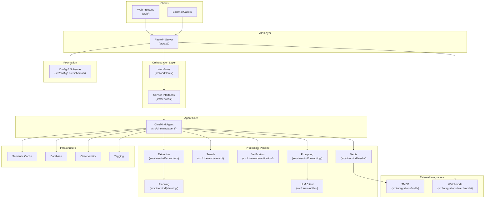
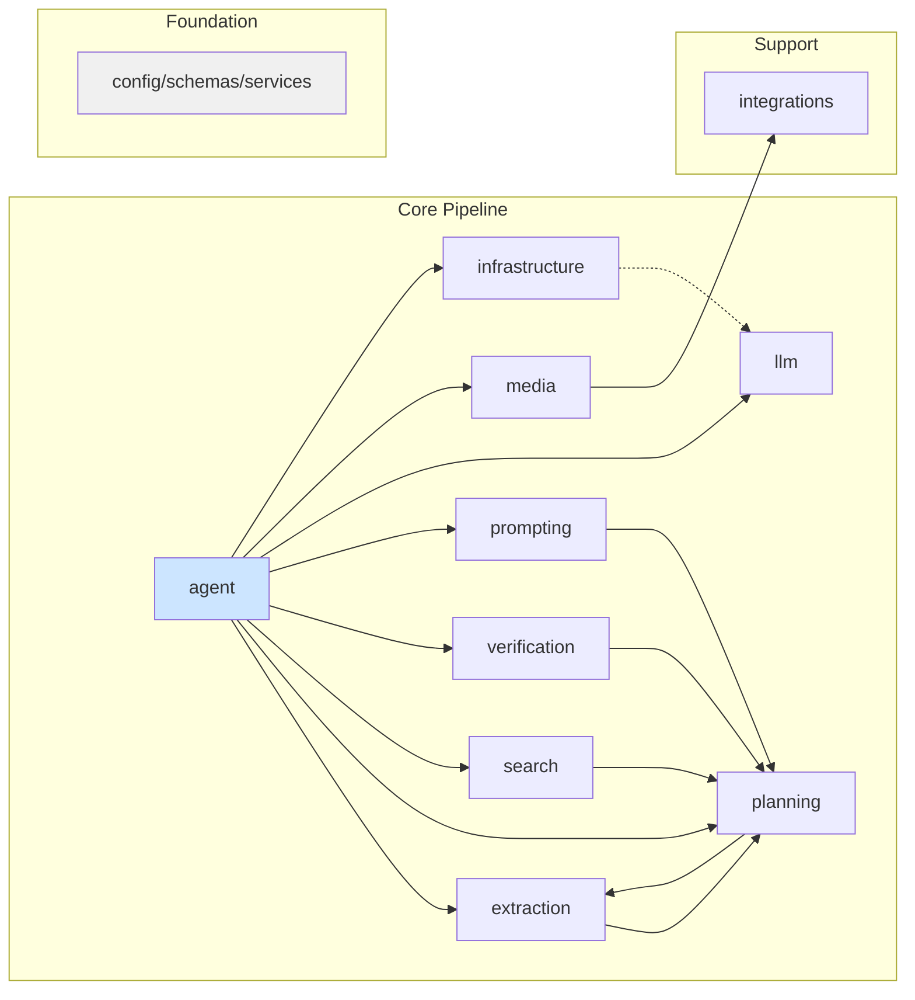

# CineMind Feature Documentation

> Post-refactor feature documentation organized by domain area. Each document is a self-contained reference describing capabilities, code structure, dependencies, and change impact — designed to be used as context for understanding and modifying the codebase.

<strong>Quick AI Context</strong> — Jump to what you need

| I need to... | Jump to |
|-------------|---------|
| See the full system diagram | [System Architecture](#system-architecture) |
| Find the doc for a specific feature | [Documentation Index](#documentation-index) |
| Understand cross-cutting dependencies | [Cross-Cutting Dependency Map](#cross-cutting-dependency-map) |
| Map source code to docs | [Source ↔ Documentation Mapping](#source--documentation-mapping) |
| Know how to use these docs | [How to Use These Documents](#how-to-use-these-documents) |

**Quick lookup by source directory:**

| Path | Doc |
|------|-----|
| `src/api/` | [API Server](api/API_SERVER.md) |
| `src/config/`, `src/schemas/` | [Configuration](config/CONFIGURATION.md) |
| `src/cinemind/agent/` | [Agent Core](agent/AGENT_CORE.md) |
| `src/cinemind/extraction/` | [Extraction](extraction/EXTRACTION_PIPELINE.md) |
| `src/cinemind/infrastructure/` | [Infrastructure](infrastructure/INFRASTRUCTURE.md) |
| `src/cinemind/llm/` | [LLM Client](llm/LLM_CLIENT.md) |
| `src/cinemind/media/` | [Media](media/MEDIA_ENRICHMENT.md) |
| `src/cinemind/planning/` | [Planning](planning/REQUEST_PLANNING.md) |
| `src/cinemind/prompting/` | [Prompt Pipeline](prompting/PROMPT_PIPELINE.md) |
| `src/cinemind/search/` | [Search](search/SEARCH_ENGINE.md) |
| `src/cinemind/verification/` | [Fact Verification](verification/FACT_VERIFICATION.md) |
| `src/integrations/` | [Integrations](integrations/EXTERNAL_INTEGRATIONS.md) |
| `src/workflows/` | [Workflows](workflows/WORKFLOWS.md) |
| `web/` | [Frontend](web/WEB_FRONTEND.md) · [Web index](web/README.md) |

**Best path for an AI to refine behavior:** [AI_CONTEXT.md](../AI_CONTEXT.md) → **Navigate from `src/`** table → this index for deep links → feature doc’s *Change Impact* + *Test Coverage* → [errors/README.md](../errors/README.md) if hub/WTW/details.

---

## System Architecture

---

## Documentation Index

### Batch 1: Entry Points & Orchestration

| Document | Covers | When to Read |
|----------|--------|-------------|
| [Agent Core](agent/AGENT_CORE.md) | `CineMind` class, agent modes, main pipeline | Changing agent behavior, adding pipeline stages |
| [Workflows](workflows/WORKFLOWS.md) | Playground & real agent workflows, `IAgentRunner` | Changing how API calls the agent, timeout/fallback logic |
| [API Server](api/API_SERVER.md) | FastAPI endpoints, response schemas, static serving | Adding endpoints, changing response shapes |

### Batch 2: NLP & Extraction

| Document | Covers | When to Read |
|----------|--------|-------------|
| [Extraction Pipeline](extraction/EXTRACTION_PIPELINE.md) | Title, intent, candidate, response extraction; fuzzy matching | Changing how queries are understood, adding new intents |

### Batch 3: Decision Making

| Document | Covers | When to Read |
|----------|--------|-------------|
| [Request Planning](planning/REQUEST_PLANNING.md) | Request classification, tool selection, source policy | Changing routing logic, adding request types, modifying source trust |
| [Fact Verification](verification/FACT_VERIFICATION.md) | Candidate → verify → answer pattern, conflict resolution | Changing verification logic, adding fact types |

### Batch 4: Media & External Services

| Document | Covers | When to Read |
|----------|--------|-------------|
| [Media Enrichment](media/MEDIA_ENRICHMENT.md) | TMDB enrichment, media cache, attachment classification | Changing poster/scene behavior, attachment logic |
| [External Integrations](integrations/EXTERNAL_INTEGRATIONS.md) | TMDB (resolver, images, scenes), Watchmode (streaming availability) | Changing external API usage, adding new integrations |

### Batch 5: Search

| Document | Covers | When to Read |
|----------|--------|-------------|
| [Search Engine](search/SEARCH_ENGINE.md) | Tavily, Kaggle, DuckDuckGo; search decisions | Changing search sources, Tavily skip logic, Kaggle dataset |

### Batch 6: LLM Interaction

| Document | Covers | When to Read |
|----------|--------|-------------|
| [Prompt Pipeline](prompting/PROMPT_PIPELINE.md) | Prompt building, evidence formatting, templates, validation, versioning | Changing prompts, response quality, A/B testing |
| [LLM Client](llm/LLM_CLIENT.md) | LLM abstraction, OpenAI-compatible HTTP client, fake client | Changing LLM servers, model selection |

### Batch 7: Infrastructure

| Document | Covers | When to Read |
|----------|--------|-------------|
| [Infrastructure](infrastructure/INFRASTRUCTURE.md) | Semantic cache, database, observability, tagging | Changing caching, persistence, metrics, classification |
| [Configuration](config/CONFIGURATION.md) | Env resolution, API schemas, service interfaces, full env var registry | Adding env vars, changing API contracts |

---

## Cross-Cutting Dependency Map

---

## How to Use These Documents

1. **As context for AI assistants** — Include the relevant document(s) when asking for changes in a specific area. Each file is designed to be self-contained. Start from [`AI_CONTEXT.md`](../AI_CONTEXT.md) for routing; use the **[Source ↔ Documentation mapping](#source--documentation-mapping)** below to jump from a folder under `src/` to the right file.

2. **For understanding dependencies** — Every document includes a dependency graph and a "Change Impact Guide" showing what else might break.

3. **For onboarding** — Read in batch order (1→7) to understand the system from entry points down to infrastructure.

4. **For code review** — Check the relevant feature document to understand what a module is supposed to do and what it depends on.

5. **After you change code** — Update the feature doc if contracts, env vars, or observable behavior changed; add a line to [planning/SUMMARY.md](../planning/SUMMARY.md) only if product scope or risks shifted materially.

---

## Code Review Playbook (Coding + Tests + Errors)

### Coding methods (what to check before merge)
- Keep orchestration thin: API/workflows should coordinate; feature modules should contain the behavior.
- Contracts first: if you change an input/output contract (schemas, prompt templates, validator rules, tool plan shape), ensure tests assert that contract.
- Deterministic before AI: rule-based logic should exist and be testable; LLM behavior must be covered via fakes and scenario tests.
- Prefer `FakeLLMClient` (and other repo-provided fakes) in unit/integration tests to avoid external calls.
- When output formatting or repair behavior changes (prompt templates, `OutputValidator` logic), update the validator and then add/adjust scenario tests for the affected template(s).
- When API endpoints or response shapes change, update the relevant endpoint tests and keep smoke tests passing.

### Test directory map (what is included so far)
This repo currently uses a “mirror src → unit tests” rule plus a few higher-level harnesses for UI and response quality.

| Path | Breaks down by | What it is testing today |
|---|---|---|
| `tests/unit/` | Feature behavior | Unit coverage mirroring `src/cinemind/*` (extraction, media, planning, prompting, search, workflows, etc.). Use this for fast contract/unit assertions. |
| `tests/unit/integrations/` | API surface + data transforms | Endpoint-level checks using FastAPI `TestClient` (example: `GET /api/watch/where-to-watch`) and API-request normalization behavior. |
| `tests/unit/media/` | API surface + media alignment | Media enrichment/alignment logic, including API-level checks where needed (example: similar-movie cluster endpoint contract). |
| `tests/integration/` | Agent returns (offline e2e) | Cross-module pipeline checks using fakes (offline agent end-to-end, routing mocked) to confirm the agent returns expected response structure and repair behavior. |
| `tests/scenarios/gold/` | Agent returns (regression) | Offline scenario regression suite: template correctness plus validator expectations for response structure/constraints. |
| `tests/scenarios/explore/` | Agent returns (new features) | Same scenario harness as `gold/`, but failures are informational while templates/constraints evolve. |
| `tests/smoke/` | UI + API wiring smoke | Playground/server boot checks that endpoints respond with the expected JSON shape (used with the frontend `web/` manually, plus `/health`/`/query` automated smoke). |
| `tests/playground/` | UI + offline API host | Offline FastAPI playground server that mounts the static frontend (`web/`) and exposes the same query contract the UI expects. |

### Error tracking directory map (where failures/violations live)
Scenario harness runs write machine-readable artifacts here so you can track regressions and inspect “what broke” without re-running locally.

| Path | Purpose | Contents |
|---|---|---|
| `tests/test_reports/latest.json` | Run summary | Overall scenario counts, pass rate, and top violation types for the latest scenario run. |
| `tests/test_reports/failures/` | Scenario failures | Detailed JSON artifacts for scenarios that failed their assertions. |
| `tests/test_reports/violations/` | Validator violations | Detailed JSON artifacts for validator violations (even when tests may pass due to auto-repair). |
| `tests/test_reports/violations_index.json` | Violation index | Cross-links/summary across all `violations/*.json` artifacts for easier review. |
| `tests/helpers/*_artifact_writer.py` | Artifact generation | Writers that produce the `failures/` and `violations/` JSON artifacts used by the harness. |

More detail (including "when to run" + "how to update") lives in `docs/practices/code-review/`:
- [`Test Coverage Map`](../practices/code-review/TEST_COVERAGE_MAP.md)
- [`When to Run Tests`](../practices/code-review/WHEN_TO_RUN_TESTS.md)
- [`Error Tracking`](../practices/code-review/ERROR_TRACKING.md)

---
## Source ↔ Documentation Mapping

| Source Directory | Documentation |
|-----------------|---------------|
| `src/api/` | [API Server](api/API_SERVER.md) |
| `src/cinemind/agent/` | [Agent Core](agent/AGENT_CORE.md) |
| `src/cinemind/extraction/` | [Extraction Pipeline](extraction/EXTRACTION_PIPELINE.md) |
| `src/cinemind/infrastructure/` | [Infrastructure](infrastructure/INFRASTRUCTURE.md) |
| `src/cinemind/llm/` | [LLM Client](llm/LLM_CLIENT.md) |
| `src/cinemind/media/` | [Media Enrichment](media/MEDIA_ENRICHMENT.md) |
| `src/cinemind/planning/` | [Request Planning](planning/REQUEST_PLANNING.md) |
| `src/cinemind/prompting/` | [Prompt Pipeline](prompting/PROMPT_PIPELINE.md) |
| `src/cinemind/search/` | [Search Engine](search/SEARCH_ENGINE.md) |
| `src/cinemind/verification/` | [Fact Verification](verification/FACT_VERIFICATION.md) |
| `src/config/`, `src/schemas/`, `src/services/`, `src/lib/` | [Configuration](config/CONFIGURATION.md) |
| `src/integrations/` | [External Integrations](integrations/EXTERNAL_INTEGRATIONS.md) |
| `src/workflows/` | [Workflows](workflows/WORKFLOWS.md) |
