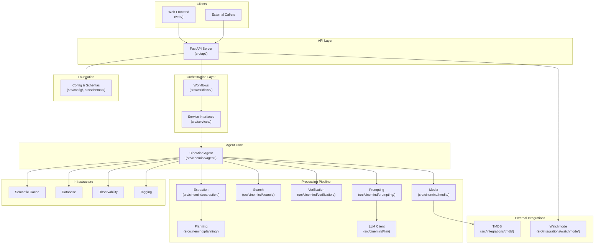
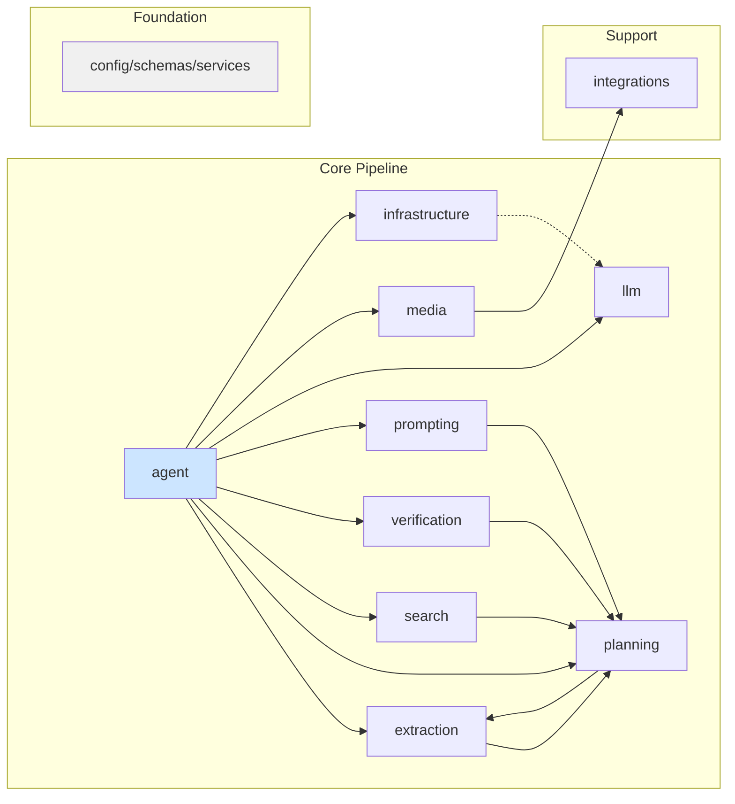

# CineMind Feature Documentation

> Post-refactor feature documentation organized by domain area. Each document is a self-contained reference describing capabilities, code structure, dependencies, and change impact — designed to be used as context for understanding and modifying the codebase.

---

## System Architecture

---

## Documentation Index

### Batch 1: Entry Points & Orchestration

| Document | Covers | When to Read |
|----------|--------|-------------|
| [Agent Core](agent/AGENT_CORE.md) | `CineMind` class, agent modes, main pipeline | Changing agent behavior, adding pipeline stages |
| [Workflows](workflows/WORKFLOWS.md) | Playground & real agent workflows, `IAgentRunner` | Changing how API calls the agent, timeout/fallback logic |
| [API Server](api/API_SERVER.md) | FastAPI endpoints, response schemas, static serving | Adding endpoints, changing response shapes |

### Batch 2: NLP & Extraction

| Document | Covers | When to Read |
|----------|--------|-------------|
| [Extraction Pipeline](extraction/EXTRACTION_PIPELINE.md) | Title, intent, candidate, response extraction; fuzzy matching | Changing how queries are understood, adding new intents |

### Batch 3: Decision Making

| Document | Covers | When to Read |
|----------|--------|-------------|
| [Request Planning](planning/REQUEST_PLANNING.md) | Request classification, tool selection, source policy | Changing routing logic, adding request types, modifying source trust |
| [Fact Verification](verification/FACT_VERIFICATION.md) | Candidate → verify → answer pattern, conflict resolution | Changing verification logic, adding fact types |

### Batch 4: Media & External Services

| Document | Covers | When to Read |
|----------|--------|-------------|
| [Media Enrichment](media/MEDIA_ENRICHMENT.md) | TMDB enrichment, media cache, attachment classification | Changing poster/scene behavior, attachment logic |
| [External Integrations](integrations/EXTERNAL_INTEGRATIONS.md) | TMDB (resolver, images, scenes), Watchmode (streaming availability) | Changing external API usage, adding new integrations |

### Batch 5: Search

| Document | Covers | When to Read |
|----------|--------|-------------|
| [Search Engine](search/SEARCH_ENGINE.md) | Tavily, Kaggle, DuckDuckGo; search decisions | Changing search sources, Tavily skip logic, Kaggle dataset |

### Batch 6: LLM Interaction

| Document | Covers | When to Read |
|----------|--------|-------------|
| [Prompt Pipeline](prompting/PROMPT_PIPELINE.md) | Prompt building, evidence formatting, templates, validation, versioning | Changing prompts, response quality, A/B testing |
| [LLM Client](llm/LLM_CLIENT.md) | LLM abstraction, OpenAI client, fake client | Changing LLM providers, model selection |

### Batch 7: Infrastructure

| Document | Covers | When to Read |
|----------|--------|-------------|
| [Infrastructure](infrastructure/INFRASTRUCTURE.md) | Semantic cache, database, observability, tagging | Changing caching, persistence, metrics, classification |
| [Configuration](config/CONFIGURATION.md) | Env resolution, API schemas, service interfaces, full env var registry | Adding env vars, changing API contracts |

---

## Cross-Cutting Dependency Map

---

## How to Use These Documents

1. **As context for AI assistants** — Include the relevant document(s) when asking for changes in a specific area. Each file is designed to be self-contained.

2. **For understanding dependencies** — Every document includes a dependency graph and a "Change Impact Guide" showing what else might break.

3. **For onboarding** — Read in batch order (1→7) to understand the system from entry points down to infrastructure.

4. **For code review** — Check the relevant feature document to understand what a module is supposed to do and what it depends on.

---

## Source ↔ Documentation Mapping

| Source Directory | Documentation |
|-----------------|---------------|
| `src/api/` | [API Server](api/API_SERVER.md) |
| `src/cinemind/agent/` | [Agent Core](agent/AGENT_CORE.md) |
| `src/cinemind/extraction/` | [Extraction Pipeline](extraction/EXTRACTION_PIPELINE.md) |
| `src/cinemind/infrastructure/` | [Infrastructure](infrastructure/INFRASTRUCTURE.md) |
| `src/cinemind/llm/` | [LLM Client](llm/LLM_CLIENT.md) |
| `src/cinemind/media/` | [Media Enrichment](media/MEDIA_ENRICHMENT.md) |
| `src/cinemind/planning/` | [Request Planning](planning/REQUEST_PLANNING.md) |
| `src/cinemind/prompting/` | [Prompt Pipeline](prompting/PROMPT_PIPELINE.md) |
| `src/cinemind/search/` | [Search Engine](search/SEARCH_ENGINE.md) |
| `src/cinemind/verification/` | [Fact Verification](verification/FACT_VERIFICATION.md) |
| `src/config/`, `src/schemas/`, `src/services/`, `src/lib/` | [Configuration](config/CONFIGURATION.md) |
| `src/integrations/` | [External Integrations](integrations/EXTERNAL_INTEGRATIONS.md) |
| `src/workflows/` | [Workflows](workflows/WORKFLOWS.md) |
