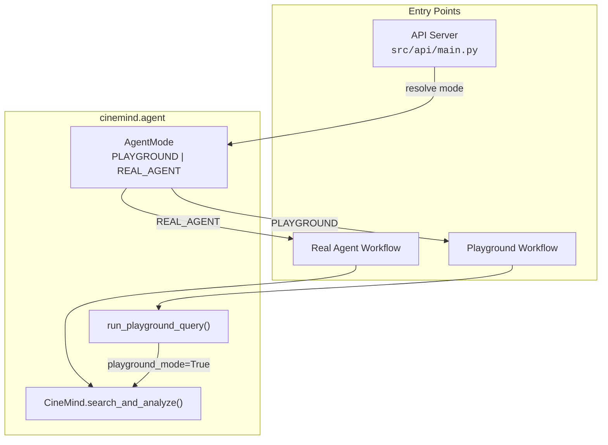
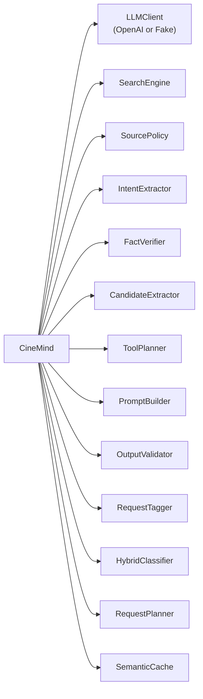
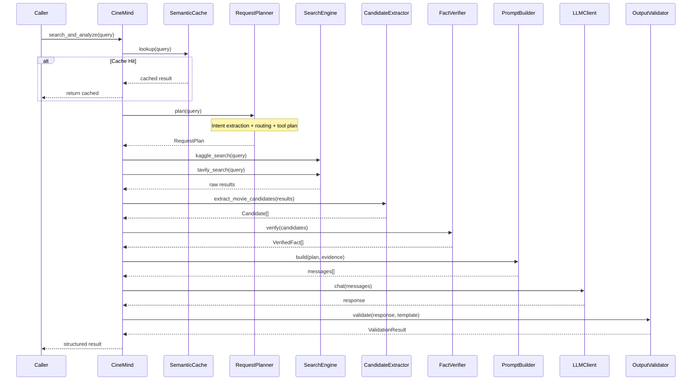
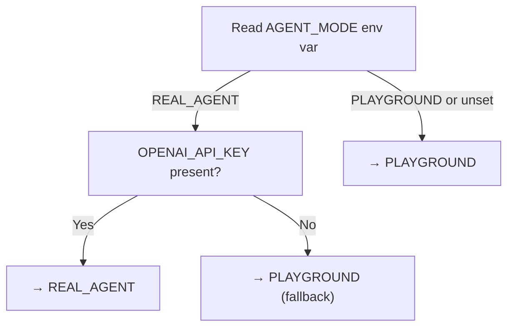
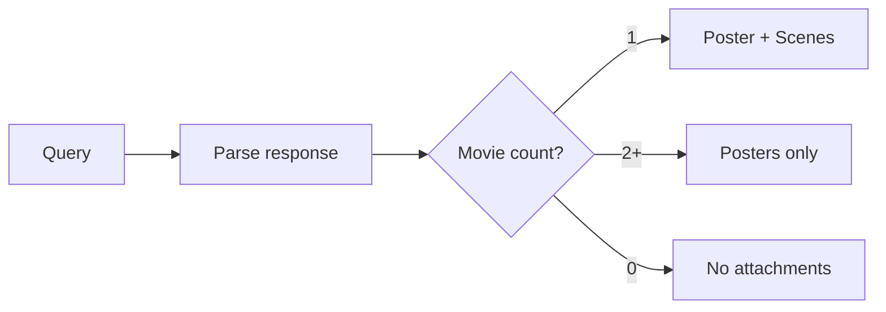
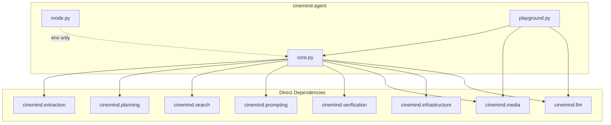

# Agent Core

> **Package:** `src/cinemind/agent/`
> **Purpose:** Central orchestration of the CineMind movie intelligence agent — the main entry point that wires together extraction, planning, search, prompting, and media enrichment into a coherent pipeline.

---

## Module Map

| Module | Role | Lines |
|--------|------|-------|
| `core.py` | `CineMind` class — full agent pipeline | ~1300 |
| `mode.py` | `AgentMode` enum + runtime mode resolution | ~50 |
| `playground.py` | Playground pipeline (no real LLM/Tavily) | ~80 |

---

## Architecture Overview

---

## CineMind Pipeline (`core.py`)

The `CineMind` class is the primary orchestrator. On instantiation it wires every subsystem; on each query it executes a multi-stage pipeline.

### Constructor Dependencies

### Pipeline Stages

### Key Methods

| Method | Description |
|--------|-------------|
| `search_and_analyze(query, ...)` | Full pipeline: cache → plan → search → extract → verify → prompt → LLM → validate |
| `stream_response(query)` | Streaming variant via async generator |
| `close()` | Cleanup resources (DB connections, etc.) |

---

## Agent Mode (`mode.py`)

Two execution modes control which pipeline runs:

| Mode | LLM | Web Search | Media Source | Use Case |
|------|-----|-----------|-------------|----------|
| `PLAYGROUND` | `FakeLLMClient` | Disabled | TMDB only | Development, demos, testing |
| `REAL_AGENT` | `OpenAILLMClient` | Tavily + DuckDuckGo | TMDB | Production |

**Resolution logic:**

- `get_configured_mode()` — reads `AGENT_MODE` env var (default: `PLAYGROUND`)
- `resolve_effective_mode()` — applies safety fallback when API key is missing

---

## Playground Pipeline (`playground.py`)

A lightweight pipeline for offline/demo use that bypasses real LLM and web search.

| Feature | Behavior |
|---------|----------|
| LLM | `FakeLLMClient` (deterministic canned responses) |
| Search | Kaggle dataset only, no Tavily |
| Media | TMDB posters and scenes |
| Attachments | Rule-based: single movie → poster + scenes; multiple → posters only |

**Key function:** `run_playground_query(user_query, request_type=None)`

**Attachment rule** (toggled by `PLAYGROUND_ATTACHMENT_RULE_ENABLED`):

---

## Internal Dependencies

### External Packages

| Package | Used In | Purpose |
|---------|---------|---------|
| `openai` | `core.py` (via `llm.client`) | LLM API calls |
| `tavily` | `core.py` (via `search.search_engine`) | Web search |
| `logging` | All modules | Structured logging |
| `asyncio` | `core.py` | Async pipeline execution |

---

## Environment Variables

| Variable | Default | Used By |
|----------|---------|---------|
| `AGENT_MODE` | `PLAYGROUND` | `mode.py` — selects pipeline |
| `OPENAI_API_KEY` | — | `mode.py` — fallback check; `llm/client.py` — API auth |
| `OPENAI_MODEL` | `gpt-4o` | `core.py` — model selection |

---

## Design Patterns & Practices

1. **Strategy Pattern** — `AgentMode` selects between `FakeLLMClient` and `OpenAILLMClient` at runtime
2. **Pipeline Pattern** — `search_and_analyze` chains stages with early exits (cache hit)
3. **Graceful Degradation** — missing API key auto-downgrades to playground mode
4. **Dependency Injection** — `CineMind` accepts an optional `llm_client` parameter; tests inject fakes
5. **Single Responsibility** — `core.py` orchestrates only; domain logic lives in dedicated packages

---

## Change Impact Guide

| If you change... | Also check... |
|-----------------|---------------|
| `CineMind.__init__` signature | `api/main.py`, `playground.py`, all tests creating `CineMind` |
| Pipeline stage order | Integration tests, `search_and_analyze` callers |
| `AgentMode` values | `mode.py`, `api/main.py`, workflow files |
| `run_playground_query` | `workflows/playground_workflow.py`, playground tests |
