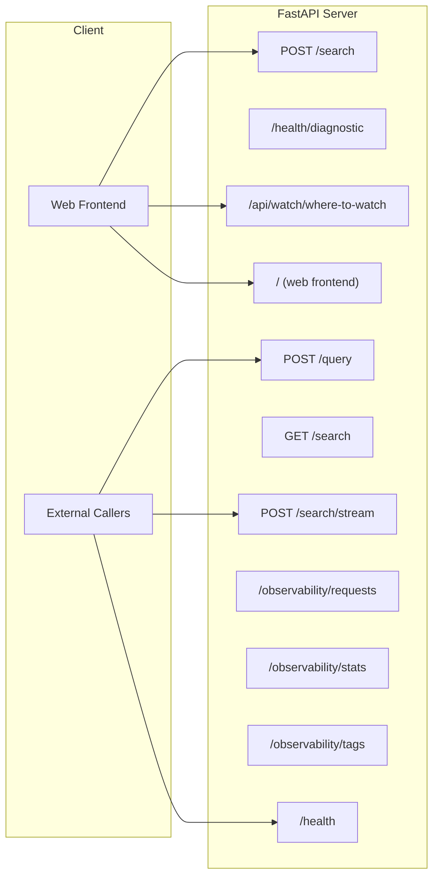
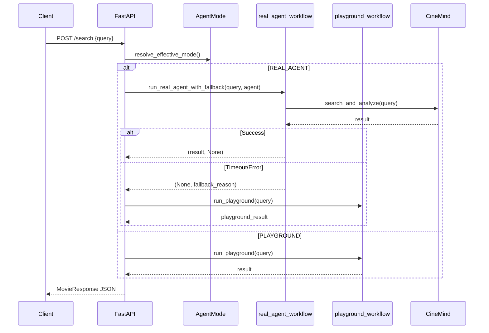
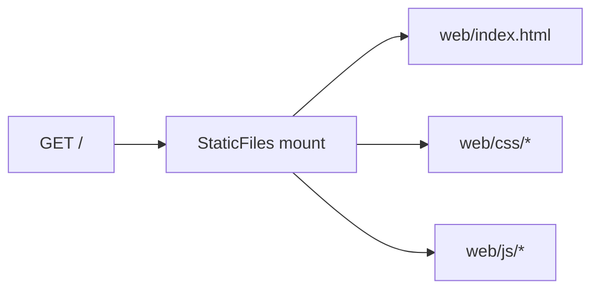
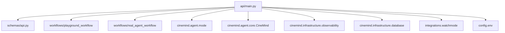

# API Server

> **Package:** `src/api/`
> **Purpose:** FastAPI REST server that exposes CineMind's capabilities as HTTP endpoints, serves the web frontend, and provides observability dashboards.

---

## Module Map

| Module | Role | Lines |
|--------|------|-------|
| `main.py` | FastAPI application with all routes | ~455 |

---

## Endpoint Overview

---

## Endpoint Details

### Health & Diagnostics

| Endpoint | Method | Description |
|----------|--------|-------------|
| `/health` | GET | Liveness check — returns status and agent mode |
| `/health/diagnostic` | GET | Dependency health (API keys present, DB reachable, cache status) |

### Query Endpoints

| Endpoint | Method | Description | Mode |
|----------|--------|-------------|------|
| `/search` | POST | Primary query endpoint — routes to real agent or playground | Both |
| `/query` | POST | Alias for `/search` | Both |
| `/search/stream` | POST | Server-Sent Events streaming response | REAL_AGENT |
| `/search` | GET | Simple query via URL param `?q=...` | Both |

### Where to Watch

| Endpoint | Method | Description |
|----------|--------|-------------|
| `/api/watch/where-to-watch` | GET | Streaming availability via Watchmode API |
| `/api/where-to-watch` | GET | Legacy endpoint (returns 501) |

### Observability

| Endpoint | Method | Description |
|----------|--------|-------------|
| `/observability/requests/{id}` | GET | Single request details |
| `/observability/requests` | GET | Paginated request history |
| `/observability/stats` | GET | Aggregated statistics |
| `/observability/tags` | GET | Tag distribution |
| `/observability/requests/{id}/outcome` | PUT | Update request outcome |

---

## Request Flow

---

## Response Schema

**File:** `src/schemas/api.py`

| Model | Fields | Purpose |
|-------|--------|---------|
| `MovieQuery` | `query: str` | Inbound request |
| `QueryRequest` | `query: str`, `request_type: Optional[str]` | Extended request |
| `MovieResponse` | `response`, `sources`, `request_type`, `search_metadata`, `media_strip`, `attachments` | Full response |
| `HealthResponse` | `status`, `agent_mode` | Health check |
| `DiagnosticResponse` | `status`, `checks: Dict` | Diagnostic info |

---

## Static File Serving

The API serves the web frontend from the `/web` directory:

---

## Internal Dependencies

### External Packages

| Package | Purpose |
|---------|---------|
| `fastapi` | Web framework |
| `uvicorn` | ASGI server |
| `pydantic` | Request/response validation (via schemas) |
| `starlette` | Static files, CORS middleware |

---

## Environment Variables

| Variable | Default | Purpose |
|----------|---------|---------|
| `AGENT_MODE` | `PLAYGROUND` | Pipeline selection |
| `AGENT_TIMEOUT_SECONDS` | `30` | Real agent timeout |
| `HOST` | `0.0.0.0` | Bind address |
| `PORT` | `8000` | Listen port |
| `CORS_ORIGINS` | `*` | Allowed origins |
| `WATCHMODE_API_KEY` | — | Where-to-Watch feature |

---

## Design Patterns & Practices

1. **Thin Controller** — endpoints contain routing logic only; business logic lives in workflows/domain
2. **Mode-Aware Routing** — `resolve_effective_mode()` determines pipeline before any domain call
3. **Fallback Chain** — real agent timeout → automatic playground fallback → client gets a response
4. **Contract-First** — Pydantic models in `schemas/api.py` define the API contract
5. **Observability Built-In** — every request is tracked, tagged, and queryable

---

## Change Impact Guide

| If you change... | Also check... |
|-----------------|---------------|
| Response schema (`MovieResponse`) | `schemas/api.py`, web frontend `js/modules/api.js`, `messages.js` |
| Endpoint paths | Frontend `js/modules/api.js`, any external integrations |
| CORS configuration | Deployment configs, Docker compose |
| Observability endpoints | `docs/architecture/VIEW_OBSERVABILITY_GUIDE.md` |
| Where-to-Watch response shape | `integrations/watchmode/normalizer.py`, frontend `where-to-watch.js` |
