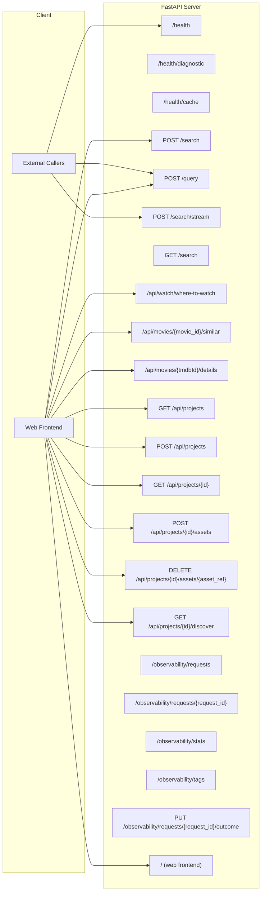
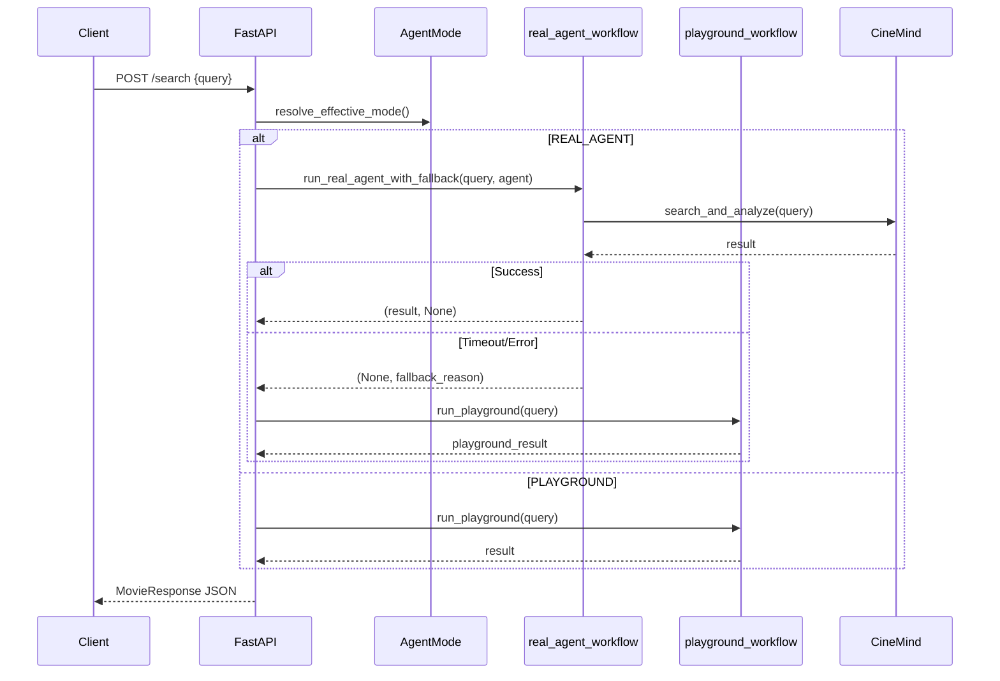
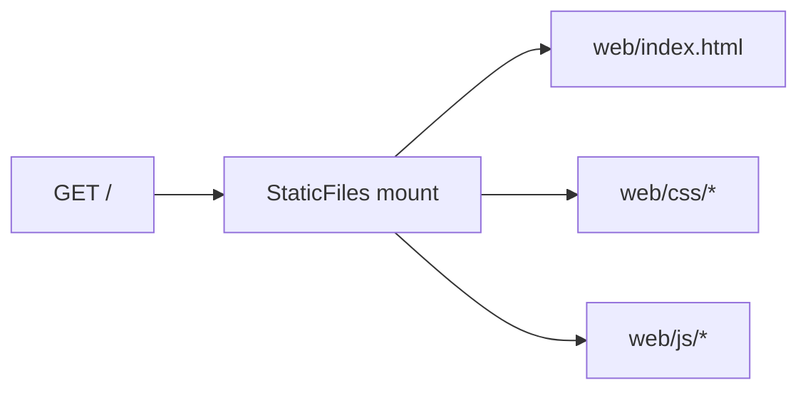

# API Server

> **Package:** `src/api/`
> **Purpose:** FastAPI REST server that exposes CineMind's capabilities as HTTP endpoints, serves the web frontend, and provides observability dashboards.

<details>
<summary><strong>Quick AI Context</strong> — Jump to what you need</summary>

| I need to understand... | Jump to |
|------------------------|---------|
| All available endpoints | [Endpoint Overview](#endpoint-overview) |
| Query endpoint details | [Query Endpoints](#query-endpoints) |
| Where-to-Watch endpoint | [Where to Watch](#where-to-watch) |
| How a request flows | [Request Flow](#request-flow) |
| Response Pydantic models | [Response Schema](#response-schema) |
| What this imports | [Internal Dependencies](#internal-dependencies) |
| Which tests to run | [Test Coverage](#test-coverage) |
| What else breaks if I change this | [Change Impact Guide](#change-impact-guide) |

**Example changes and where to look:**
- "Add a new endpoint" → [Endpoint Overview](#endpoint-overview) + [Response Schema](#response-schema)
- "Change the response shape" → [Response Schema](#response-schema) + [Change Impact Guide](#change-impact-guide)
- "Understand request routing" → [Request Flow](#request-flow)

</details>

---

## Module Map

| Module | Role | Lines |
|--------|------|-------|
| `main.py` | FastAPI application with all routes | ~1490 |
| `__init__.py` | Package marker | minimal |

---

## Endpoint Overview



---

## Endpoint Details

### Health & Diagnostics

| Endpoint | Method | Description |
|----------|--------|-------------|
| `/health` | GET | Liveness check — returns status + effective `agent_mode` |
| `/health/diagnostic` | GET | Config + TMDB diagnostic (`config_loaded`, `tmdb_enabled`, `tmdb_token_present`, `tmdb_config_reachable`) |
| `/health/cache` | GET | In-process cache hit/miss metrics — `resolve_cache`, `metadata_bundle`, `media_cache` stats (`size`, `hits`, `misses`, `expired`, `evictions`). Zero-cost observability for TMDB cache performance. |

### Query Endpoints

| Endpoint | Method | Description | Mode |
|----------|--------|-------------|------|
| `/search` | POST | External query endpoint (routes to real agent or playground). Body is `MovieQuery`. | Both |
| `/query` | POST | UI contract for movie hub + mode selection. Body is `QueryRequest`. | Both |
| `/search/stream` | POST | Server-Sent Events streaming response (token-by-token; may fall back). Body is `MovieQuery`. | Both |
| `/search` | GET | Simple query via URL param `?query=...` (and optional `use_live_data`). | Both |

### Sub-context Movie Hub marker (`[[CINEMIND_HUB_CONTEXT]]...`)

The `POST /query` endpoint (primary UI contract; same agent pipeline as `/search`) optionally detects a marker block inside `user_query`:

- Marker format: `[[CINEMIND_HUB_CONTEXT]]{...}[[/CINEMIND_HUB_CONTEXT]]`
- The marker payload is JSON with keys like:
  - `title` (string), `year` (number), `tmdbId` (optional number)
  - optional `candidateTitles` (array of `"Title (Year)"` strings; also accepted as `candidate_titles`; server keeps at most **30** entries for prompt size)
- Optional JSON body field `hubConversationHistory` (alias `hub_conversation_history`): array of `HubHistoryMessage`-shaped objects `{ "role": "user"|"assistant", "content": "..." }` for **prior** sub-context turns. When `candidateTitles` are also present, the server prepends a bounded “prior conversation” block into the agent prompt so follow-up questions stay grounded in earlier hub Q&A.
  - **Bounds** (see `_format_hub_conversation_history_block` in `main.py`): each message body truncated to **2000** characters; total prior-conversation block capped at **12000** characters; messages with invalid roles or empty content are skipped.
  - When history is present together with candidates, the natural-language question is prefixed with `Current user question:` so it stays distinct from the history block.
- When the marker is present, the API strips the marker before sending the remaining natural-language text to the agent (history is **not** embedded in the marker).
- After the agent responds, the API attempts to parse the assistant output into genre buckets via `parse_movie_hub_genre_buckets(...)`:
  - expected assistant format is `Genre: <GenreName>` blocks followed by numbered `Title (Year)` lines
- Parsed titles are enriched into poster-ready movie cards via TMDB resolution (`enrich_batch`) and returned as `MovieResponse.movieHubClusters`.
- If `candidateTitles` is present, the backend also uses deterministic hub filtering to keep the UI aligned with the currently shown poster universe:
  - it injects candidate titles into the agent prompt with a strict contract (4 genre blocks × 5 numbered titles = 20 titles)
  - it then enriches + filters clusters deterministically using `filter_movie_hub_clusters_by_question(...)`
- `movieHubClusters` may be omitted/empty if parsing/enrichment fails or yields low signal.

### Where to Watch

| Endpoint | Method | Description |
|----------|--------|-------------|
| `/api/watch/where-to-watch` | GET | Watchmode availability normalized for the UI. Provide `tmdbId` or (`title` + optional `year`). Params: `mediaType` (`movie`|`tv`), `country` (default `US`). |
| `/api/where-to-watch` | GET | Legacy endpoint (returns 501) |

Error behavior (typical):
- missing API key (`WATCHMODE_API_KEY`) -> `500` with `{error:"missing_key", message:"..."}`.
- missing params (neither `tmdbId` nor `title`) -> `400` with `{error:"missing_params", message:"..."}`.
- title not found -> `404` with `{error:"not_found", message:"..."}`.
- rate limit -> `429` with `{error:"rate_limit_exceeded", message:"..."}`.

### Similar Movies (Sub-context Movie Hub)

| Endpoint | Method | Description |
|----------|--------|-------------|
| `/api/movies/{movie_id}/similar` | GET | Returns `{ clusters: [...] }` (`SimilarMoviesResponse`). **Path:** `movie_id` is usually a TMDB id; if it is not numeric, the backend treats TMDB id as absent and `build_similar_movie_clusters` resolves from **query** params. **Query:** `title`, `year`, `mediaType` (`movie` / `tv`) — pass whenever the path is non-numeric or for consistent labeling; `by` (default `genre,tone,cast`) is accepted for API stability (reserved for future cluster-kind filtering). |

Dependency note:
- Intended to call `cinemind.media.media_enrichment.build_similar_movie_clusters(...)`.
- Ensure this function is imported/wired in `src/api/main.py` when evolving this endpoint (otherwise the server will error at runtime).

The UI calls it via `web/js/modules/api.js` (`fetchSimilarMovies(...)`).

### Projects (Persistent collections)

| Endpoint | Method | Description |
|----------|--------|-------------|
| `/api/projects` | GET | List project summaries (`id`, `name`, `description`, `contextFocus`, `assetCount`) |
| `/api/projects` | POST | Create a project |
| `/api/projects/{project_id}` | GET | Get one project with `assets` |
| `/api/projects/{project_id}/assets` | POST | Add project assets in batch with de-duplication |
| `/api/projects/{project_id}/assets/{asset_ref}` | DELETE | Delete an asset by id or legacy list index |
| `/api/projects/{project_id}/discover` | GET | Returns discovery clusters + context summary |

### Movie Details (Full-screen Modal)

| Endpoint | Method | Description |
|----------|--------|-------------|
| `/api/movies/{tmdbId}/details` | GET | On-demand TMDB-backed details for the full-screen Movie Details modal. If TMDB is disabled/unavailable, the response falls back to a minimal `tmdbId`-only contract. |

### Observability

| Endpoint | Method | Description |
|----------|--------|-------------|
| `/observability/requests/{request_id}` | GET | Single request trace (details + response + metrics). |
| `/observability/requests` | GET | Recent requests; query param `limit` (default `100`, range `1-1000`). |
| `/observability/stats` | GET | Aggregated stats for last `days` (default `7`), optionally filtered by `request_type` and `outcome`. |
| `/observability/tags` | GET | Distribution of request types/outcomes for last `days` (default `7`). |
| `/observability/requests/{request_id}/outcome` | PUT | Update request outcome query param `outcome` (valid: `success`, `unclear`, `hallucination`, `user-corrected`). |

---

## Request Flow



---

## Response Schema

**File:** `src/schemas/api.py`

| Model | Fields | Purpose |
|-------|--------|---------|
| `MovieQuery` | `query`, `use_live_data`, `stream`, `request_type?`, `outcome?`, `requestedAgentMode?` | Input for `POST /search` and `POST /search/stream` |
| `HubHistoryMessage` | `role` (`user` \| `assistant`), `content` | One turn in `QueryRequest.hubConversationHistory` |
| `QueryRequest` | `user_query`, `request_type?`, `requestedAgentMode?`, `hubConversationHistory?` (alias `hub_conversation_history`), `threadId?` (string), `messageId?` (string) | Input for `POST /query` |
| `MovieResponse` | `agent`, `version`, `query`, `response`, `sources`, `timestamp`, `live_data_used`, `request_id?`, `token_usage?`, `cost_usd?`, `request_type?`, `outcome?`, `agent_mode?`, `actualAgentMode?`, `requestedAgentMode?`, `modeFallback?`, `toolsUsed?`, `fallback_reason?`, `movieHubClusters?`, `responseEnvelopeVersion` (string), `message_id` (string), `thread_id` (string) | Declared response for `POST /search`. `/query` returns the same JSON shape; the server may also inject extra keys at runtime (e.g. `modeOverrideReason`) from `_inject_mode_metadata`. |
| `SimilarMovie` | `title`, `year?`, `primary_image_url?`, `page_url?`, `tmdbId?`, `mediaType?` | Similar-movie card compatible with hub UI |
| `SimilarCluster` | `kind`, `label`, `movies` | Cluster of similar movies by kind (genre/tone/cast) |
| `SimilarMoviesResponse` | `clusters` | Response payload for `/api/movies/{movie_id}/similar` |
| `RelatedMovie` | `movie_title?`, `title?`, `year?`, `tmdbId?`, `primary_image_url?` | Minimal related-title shape used inside `MovieDetailsResponse.relatedMovies` |
| `MovieDetailsResponse` | `tmdbId` (required) + optional title/meta/credits/media/`relatedMovies` | Response payload for `/api/movies/{tmdbId}/details` |
| `ProjectSummary` | `id`, `name`, `description?`, `contextFocus?`, `createdAt`, `updatedAt`, `assetCount` | Project list/create response |
| `ProjectDetail` | `ProjectSummary` + `assets: ProjectAsset[]` | Project detail response |
| `ProjectAsset` | `id`, `title`, `posterImageUrl?`, `pageUrl?`, `pageId?`, `conversationId?`, `subConversationId?`, `capturedAt`, `storedRef?`, `tmdbId?` (int), `year?` (int), `genres?` (list[str]), `cast?` (list[str]), `keywords?` (list[str]) | Stored project asset |
| `ProjectCreateRequest` | `name`, `description?`, `contextFocus?` | Create project request |
| `ProjectAssetsAddRequest` | `assets: ProjectAssetInput[]` | Add assets request |
| `ProjectAssetsAddResponse` | `added`, `skipped`, `total` | Add assets result |
| `HealthResponse` | `status`, `agent`, `version`, `agent_mode?` | `/health` response |
| `DiagnosticResponse` | `status`, `config_loaded`, `tmdb_enabled`, `tmdb_token_present`, `tmdb_config_reachable?` | `/health/diagnostic` response |
| `CacheStatsResponse` | `resolve_cache`, `metadata_bundle`, `media_cache` (each a `dict[str, int]`) | `/health/cache` response |

---

## Static File Serving

The API serves the web frontend from the `/web` directory:



---

## Internal Dependencies

```mermaid
graph TD
    API["api/main.py"]

    API --> SCHEMAS["schemas/api.py"]
    API --> WORKFLOWS_PG["workflows/playground_workflow"]
    API --> WORKFLOWS_RA["workflows/real_agent_workflow"]
    API --> MODE["cinemind.agent.mode"]
    API --> AGENT["cinemind.agent.core.CineMind"]
    API --> OBS["cinemind.infrastructure.observability"]
    API --> DB["cinemind.infrastructure.database"]
    API --> TAGGING["cinemind.infrastructure.tagging"]
    API --> WATCHMODE["integrations.watchmode + normalizer"]
    API --> TMDB_DIAGNOSTIC["integrations.tmdb.image_config (diagnostic fetch)"]
    API --> TMDB_DETAILS["integrations.tmdb.movie_details (details payload)"]
    API --> MEDIA_ENRICH["cinemind.media.media_enrichment (TMDB poster/id enrichment)"]
    API --> HUB_PARSE["cinemind.media.movie_hub_genre_parsing (parse genre buckets)"]
    API --> HUB_FILTER["cinemind.media.movie_hub_filtering (deterministic hub filtering)"]
    API --> CONFIG["src/config/__init__.py"]
```



### External Packages

| Package | Purpose |
|---------|---------|
| `fastapi` | Web framework |
| `uvicorn` | ASGI server |
| `pydantic` | Request/response validation (via schemas) |
| `starlette` | Static files, CORS middleware (via FastAPI) |

---

## Environment Variables

| Variable | Default | Purpose |
|----------|---------|---------|
| `AGENT_MODE` | `PLAYGROUND` | Pipeline selection |
| `PORT` | `8000` | Listen port |
| `CINEMIND_LLM_BASE_URL` | — | With `CINEMIND_LLM_MODEL`, enables `REAL_AGENT` LLM path |
| `CINEMIND_LLM_MODEL` | — | Chat model id on the OpenAI-compatible server |
| `CINEMIND_LLM_API_KEY` | — | Optional bearer token for the LLM server |
| `CINEMIND_REAL_AGENT_TIMEOUT` | `90` | Real agent timeout (used as `REAL_AGENT_TIMEOUT_SECONDS`) |
| `WATCHMODE_API_KEY` | — | Where-to-Watch feature |
| `ENABLE_TMDB_SCENES` | `false` | Enables TMDB-backed enrichment/details |
| `TMDB_READ_ACCESS_TOKEN` | — | Bearer token for TMDB API access |
| `HUB_ENRICH_MAX_CONCURRENT` | `4` | Max concurrent TMDB enrichment calls for hub poster/id resolution |
| `HUB_ENRICH_POSTERS_LIMIT` | `20` | Limit of titles enriched for hub poster/id resolution |
| `DATABASE_URL` | `cinemind.db` | Observability storage (SQLite path or Postgres DSN) |
| `PROJECTS_STORE_PATH` | `data/projects_store.json` | File path for persistent projects/assets JSON store |

---

## Design Patterns & Practices

1. **Thin Controller** — endpoints contain routing logic only; business logic lives in workflows/domain
2. **Mode-Aware Routing** — `resolve_effective_mode()` determines pipeline before any domain call
3. **Fallback Chain** — real agent timeout → automatic playground fallback → client gets a response
4. **Contract-First** — Pydantic models in `schemas/api.py` define the API contract
5. **Observability Built-In** — every request is tracked, tagged, and queryable

---

## Test Coverage

### Tests to Run When Changing This Package

```bash
# API endpoint tests
python -m pytest tests/unit/integrations/test_where_to_watch_api.py -v
python -m pytest tests/unit/integrations/test_projects_api.py -v
python -m pytest tests/unit/infrastructure/test_projects_store.py -v
python -m pytest tests/smoke/test_playground_smoke.py -v

# Movie Hub + similar-movies behavior (prompt construction / alignment)
python -m pytest tests/unit/media/test_movie_hub_filtering.py -v
python -m pytest tests/unit/media/test_media_alignment.py -v

# Full pipeline (exercises API → workflow → agent)
python -m pytest tests/integration/test_agent_offline_e2e.py -v
```

| Test File | What It Covers |
|-----------|---------------|
| `tests/unit/integrations/test_where_to_watch_api.py` | `/api/watch/where-to-watch` endpoint: happy path, not found, rate limit, missing key |
| `tests/unit/integrations/test_projects_api.py` | `/api/projects*` endpoint flows: create/list/detail/add-assets/delete-asset |
| `tests/unit/infrastructure/test_projects_store.py` | Persistent project store behavior: CRUD, dedupe, id/index delete |
| `tests/smoke/test_playground_smoke.py` | FastAPI app imports, basic `/query` request via TestClient |
| `tests/unit/media/test_movie_hub_filtering.py` | Hub marker + `hubConversationHistory` folded into the agent prompt for candidate-title hub flows |
| `tests/unit/media/test_media_alignment.py` | Non-numeric `/api/movies/.../similar` path + `title`/`year` alignment with `build_similar_movie_clusters` |
| `tests/integration/test_agent_offline_e2e.py` | Full pipeline through API layer with FakeLLM |

---

## Change Impact Guide

| If you change... | Also check... |
|-----------------|---------------|
| Response schema (`MovieResponse`, `MovieDetailsResponse`, `QueryRequest`, `HubHistoryMessage`) | `src/schemas/api.py`, web frontend `web/js/modules/api.js`, `web/js/modules/messages.js`, `web/js/modules/movie-details.js`, `web/js/modules/layout.js` (hub history + snapshots) |
| Hub marker, history bounds, or candidate-title prompt contract | `src/api/main.py` (`_format_hub_conversation_history_block`, `maybe_add_movie_hub_clusters`), `cinemind.media.movie_hub_*`, `tests/unit/media/test_movie_hub_filtering.py` |
| Similar-movies endpoint or `build_similar_movie_clusters` | `src/api/main.py`, `cinemind.media.media_enrichment`, `tests/unit/media/test_media_alignment.py` |
| Endpoint paths | Frontend `js/modules/api.js`, any external integrations |
| CORS configuration | `src/api/main.py` CORS middleware — environment-conditional: in development `allow_origins=["*"]`; in production restricts to `[CINEMIND_DEPLOY_URL]` or `[]` if the variable is unset |
| Observability endpoints | `src/cinemind/infrastructure/observability`, `src/cinemind/infrastructure/database`, `src/cinemind/infrastructure/tagging` |
| Where-to-Watch response shape | `integrations/watchmode/normalizer.py`, frontend `where-to-watch.js` |
