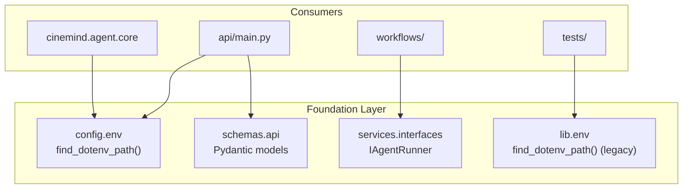
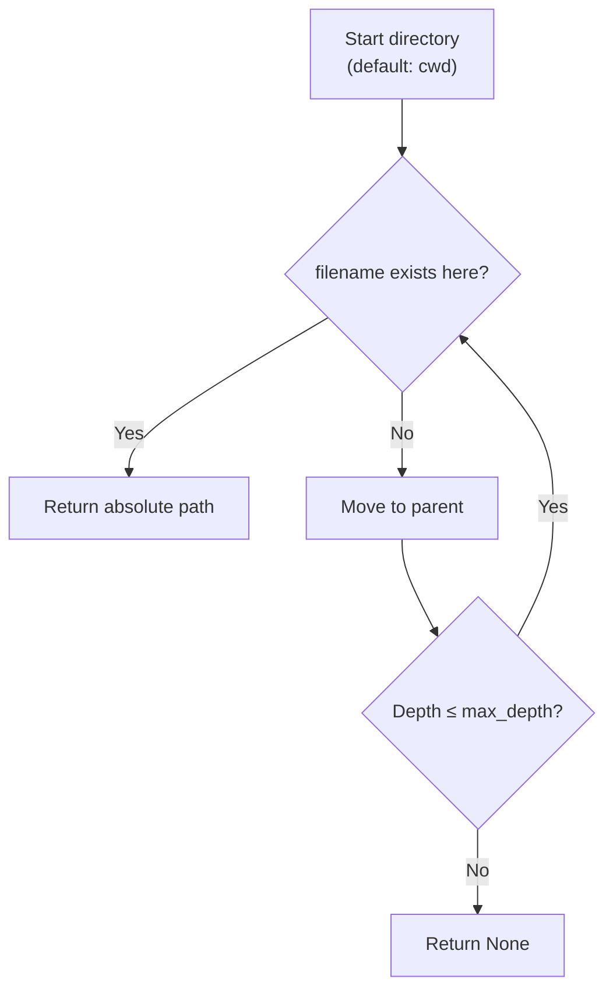
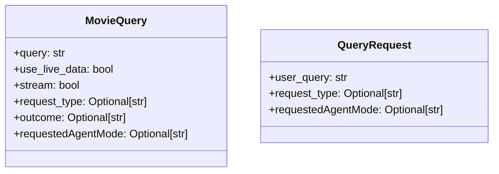
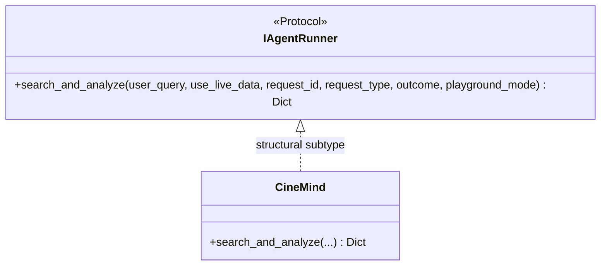
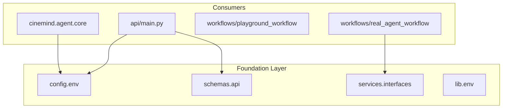

# Configuration, Schemas & Services

> **Packages:** `src/config/`, `src/schemas/`, `src/services/`, `src/lib/`
> **Purpose:** Foundation layer — environment resolution, API contracts, service interfaces, and shared utilities that every other package depends on.

<details>
<summary><strong>Quick AI Context</strong> — Jump to what you need</summary>

| I need to understand... | Jump to |
|------------------------|---------|
| How .env is located | [Environment Configuration](#environment-configuration-configenvpy) |
| API request/response models | [API Schemas](#api-schemas-schemasapipy) |
| The IAgentRunner protocol | [Service Interfaces](#service-interfaces-servicesinterfacespy) |
| Full list of all env vars | [Environment Variables (Full Registry)](#environment-variables-full-registry) |
| Which tests to run | [Test Coverage](#test-coverage) |
| What else breaks if I change this | [Change Impact Guide](#change-impact-guide) |

**Example changes and where to look:**
- "Add a new env var" → [Environment Variables (Full Registry)](#environment-variables-full-registry)
- "Change API response model" → [API Schemas](#api-schemas-schemasapipy) + [Change Impact Guide](#change-impact-guide)
- "Change IAgentRunner" → [Service Interfaces](#service-interfaces-servicesinterfacespy)

</details>

---

## Module Map

| Package | Module | Role | Lines |
|---------|--------|------|-------|
| `config/` | `env.py` | Locate `.env` file by walking up from cwd | ~33 |
| `schemas/` | `api.py` | Pydantic models for API request/response | ~57 |
| `services/` | `interfaces.py` | Protocol interfaces for domain services | ~19 |
| `lib/` | `env.py` | Simpler `.env` finder (legacy) | ~15 |

---

## Architecture



---

## Environment Configuration (`config/env.py`)

Locates the `.env` file by walking up the directory tree from a starting point.

### Resolution Logic



### Function Signature

```python
def find_dotenv_path(
    filename: str = ".env",
    start: Optional[Path] = None,
    max_depth: int = 5,
) -> Optional[str]:
```

### Note on Dual Implementation

There are two `.env` finders:

| Module | Signature | Origin |
|--------|----------|--------|
| `config.env` | `find_dotenv_path(filename, start, max_depth)` | Post-refactor canonical |
| `lib.env` | `find_dotenv_path()` | Legacy (no parameters) |

Both exist for backward compatibility. New code should use `config.env`.

---

## API Schemas (`schemas/api.py`)

Pydantic models defining the API contract between server and clients.

### Request Models



### Response Models

```mermaid
classDiagram
    class MovieQuery {
        +query: str
        +use_live_data: bool
        +stream: bool
        +request_type: Optional[str]
        +outcome: Optional[str]
        +requestedAgentMode: Optional[str]
    }

    class QueryRequest {
        +user_query: str
        +request_type: Optional[str]
        +requestedAgentMode: Optional[str]
    }

    class MovieResponse {
        +agent: str
        +version: str
        +query: str
        +response: str
        +sources: list
        +timestamp: str
        +live_data_used: bool
        +request_id: Optional[str]
        +token_usage: Optional[dict]
        +cost_usd: Optional[float]
        +request_type: Optional[str]
        +outcome: Optional[str]
        +agent_mode: Optional[str]
        +actualAgentMode: Optional[str]
        +requestedAgentMode: Optional[str]
        +modeFallback: Optional[bool]
        +toolsUsed: Optional[list]
        +fallback_reason: Optional[str]
        +movieHubClusters: Optional[SimilarCluster][]
    }

    class SimilarMovie {
        +title: str
        +year: Optional[int]
        +primary_image_url: Optional[str]
        +page_url: Optional[str]
        +tmdbId: Optional[int]
        +mediaType: Optional[str]
    }

    class SimilarCluster {
        +kind: str
        +label: str
        +movies: SimilarMovie[]
    }

    class SimilarMoviesResponse {
        +clusters: SimilarCluster[]
    }

    class RelatedMovie {
        +movie_title: Optional[str]
        +title: Optional[str]
        +year: Optional[int]
        +tmdbId: Optional[int]
        +primary_image_url: Optional[str]
    }

    class MovieDetailsResponse {
        +tmdbId: int
        +movie_title: Optional[str]
        +year: Optional[int]
        +tagline: Optional[str]
        +overview: Optional[str]
        +runtime_minutes: Optional[int]
        +genres: Optional[str][]
        +release_date: Optional[str]
        +language: Optional[str]
        +country: Optional[str]
        +rating: Optional[float]
        +vote_count: Optional[int]
        +primary_image_url: Optional[str]
        +backdrop_url: Optional[str]
        +directors: Optional[str][]
        +cast: Optional[str][]
        +relatedMovies: Optional[RelatedMovie][]
    }

    class HealthResponse {
        +status: str
        +agent: str
        +version: str
        +agent_mode: Optional[str]
    }

    class DiagnosticResponse {
        +status: str
        +config_loaded: bool
        +tmdb_enabled: bool
        +tmdb_token_present: bool
        +tmdb_config_reachable: Optional[bool]
    }
```



### Model Summary

| Model | Direction | Purpose |
|-------|-----------|---------|
| `MovieQuery` | Request | Input for `POST /search` and `POST /search/stream` |
| `QueryRequest` | Request | Input for `POST /query` |
| `MovieResponse` | Response | Contract for query endpoints (includes optional `movieHubClusters`) |
| `SimilarMovie` | Response | Similar-movie card shape for hub UI |
| `SimilarCluster` | Response | Cluster container (`kind`/`label` + `movies`) |
| `SimilarMoviesResponse` | Response | Payload for `/api/movies/{movie_id}/similar` |
| `RelatedMovie` | Response | Minimal related-title shape for details modal |
| `MovieDetailsResponse` | Response | Payload for `/api/movies/{tmdbId}/details` (tolerant fallback) |
| `HealthResponse` | Response | `/health` response |
| `DiagnosticResponse` | Response | `/health/diagnostic` response |

---

## Service Interfaces (`services/interfaces.py`)

Protocol-based interfaces that decouple workflows from domain implementations.



**Why it exists:** The `real_agent_workflow` depends on `IAgentRunner`, not on `CineMind` directly. This allows:
- Tests to inject stub agents
- Workflows to remain ignorant of domain internals
- Future agent implementations to be swapped in

---

## Dependency Relationships



### External Packages

| Package | Used In | Purpose |
|---------|---------|---------|
| `pydantic` | `schemas/api.py` | Model validation and serialization |
| `pathlib` | `config/env.py`, `lib/env.py` | Path operations |
| `typing` | All modules | Type annotations and Protocol |

---

## Environment Variables (Full Registry)

This is the consolidated list of all environment variables used across the system:

### Core Agent

| Variable | Default | Used By |
|----------|---------|---------|
| `AGENT_MODE` | `PLAYGROUND` | `agent/mode.py` |
| `CINEMIND_LLM_BASE_URL` | — | `config/__init__.py`, `agent/core.py` — OpenAI-compatible API root |
| `CINEMIND_LLM_MODEL` | — | Chat model id on that server |
| `CINEMIND_LLM_API_KEY` | — | Optional `Authorization: Bearer` for the LLM server |
| `CINEMIND_LLM_TIMEOUT_SECONDS` | `120` | httpx timeout for chat/stream |
| `CINEMIND_LLM_SUPPORTS_JSON_MODE` | `false` | If true, intent/tagging may pass `response_format` |
| `CINEMIND_LLM_EMBEDDING_MODEL` | — | Optional; enables `POST /v1/embeddings` for semantic cache |
| `AGENT_TIMEOUT_SECONDS` | `30` | `api/main.py` |

### Search

| Variable | Default | Used By |
|----------|---------|---------|
| `TAVILY_API_KEY` | — | `search/search_engine.py` |
| `KAGGLE_ENABLED` | `true` | `search/kaggle_retrieval_adapter.py` |
| `KAGGLE_DATASET_PATH` | `data/imdb.csv` | `search/kaggle_search.py` |
| `KAGGLE_CORRELATION_THRESHOLD` | `0.8` | `search/kaggle_search.py` |
| `KAGGLE_SEARCH_TIMEOUT_SECONDS` | `5` | `search/kaggle_retrieval_adapter.py` |

### Media

| Variable | Default | Used By |
|----------|---------|---------|
| `ENABLE_TMDB_SCENES` | `false` | Enables TMDB-backed enrichment/details (requires token) |
| `TMDB_READ_ACCESS_TOKEN` | — | `integrations/tmdb/*` |
| `WATCHMODE_API_KEY` | — | `integrations/watchmode/client.py` |
| `MEDIA_CACHE_TTL_SECONDS` | `3600` | `media/media_cache.py` |
| `MEDIA_CACHE_MAX_ENTRIES` | `1000` | `media/media_cache.py` |

### Infrastructure

| Variable | Default | Used By |
|----------|---------|---------|
| `DATABASE_URL` | — | `infrastructure/database.py` |
| `SQLITE_PATH` | `cinemind.db` | `infrastructure/database.py` |
| `CACHE_DEFAULT_TTL_HOURS` | `24` | `infrastructure/cache.py` |
| `CACHE_EMBEDDING_THRESHOLD` | `0.92` | `infrastructure/cache.py` |
| `CACHE_MAX_ENTRIES` | `10000` | `infrastructure/cache.py` |

### Server

| Variable | Default | Used By |
|----------|---------|---------|
| `HOST` | `0.0.0.0` | `api/main.py` |
| `PORT` | `8000` | `api/main.py` |
| `CORS_ORIGINS` | `*` | `api/main.py` |

---

## Design Patterns & Practices

1. **Protocol-Based Interfaces** — `IAgentRunner` uses Python's `Protocol` for structural subtyping (no explicit inheritance required)
2. **Contract-First API** — Pydantic models define the shape of requests and responses before implementation
3. **Configuration as Discovery** — `.env` is found by walking the filesystem, not hardcoded to a path
4. **Minimal Foundation** — foundation modules have zero business logic; they're pure plumbing
5. **Single Source of Truth** — env var names and defaults documented alongside usage

---

## Test Coverage

### Tests to Run When Changing This Package

```bash
# Import/smoke test
python -m pytest tests/unit/test_smoke.py -v

# Config changes affect everything — run full suite
python -m pytest tests/ -v

# Schema changes affect API tests
python -m pytest tests/smoke/ tests/unit/integrations/test_where_to_watch_api.py -v
```

| Test File | What It Covers |
|-----------|---------------|
| `tests/unit/test_smoke.py` | Import checks, fixture loading, scenario listing |
| `tests/smoke/test_playground_smoke.py` | FastAPI app with Pydantic models |
| `tests/unit/workflows/test_workflows.py` | `IAgentRunner` protocol usage |

> **Warning:** Foundation changes (schemas, protocols, env vars) have the widest blast radius. Run the full test suite after any change.

---

## Change Impact Guide

| If you change... | Also check... |
|-----------------|---------------|
| `MovieResponse` fields | API endpoints, frontend `api.js`, integration tests |
| `IAgentRunner` protocol | `CineMind`, `real_agent_workflow`, all test stubs |
| `.env` variable names | `.env.example`, Docker configs, CI secrets, all modules referencing them |
| `find_dotenv_path` behavior | Any module that loads environment variables at import time |
| Pydantic model validation | API error responses, frontend error handling |
