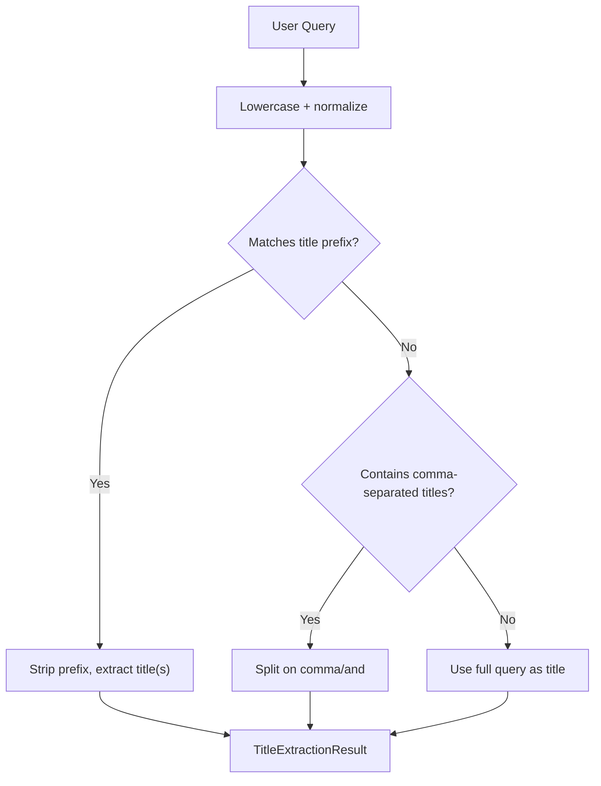
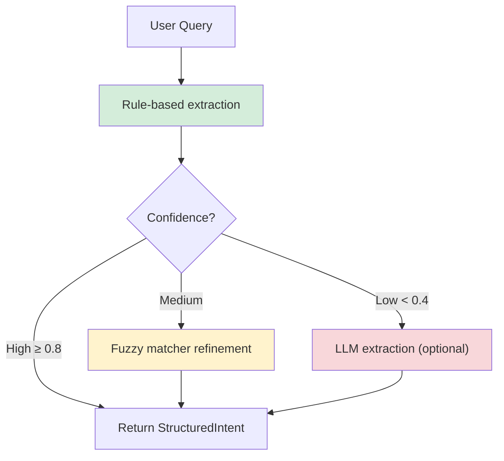
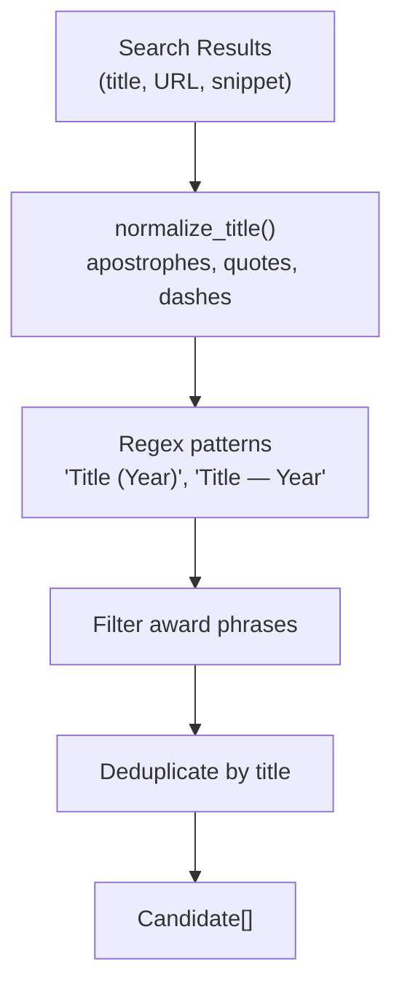
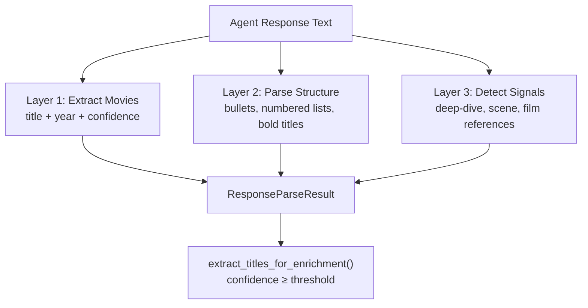
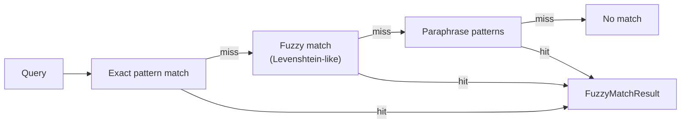
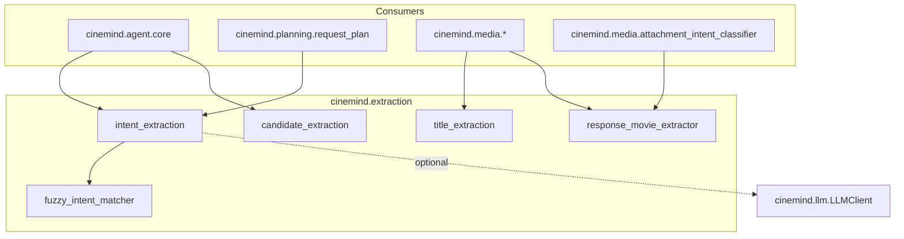

# Extraction Pipeline

> **Package:** `src/cinemind/extraction/`
> **Purpose:** Deterministic NLP pipeline that extracts structured information from user queries and agent responses — movie titles, intents, candidates, and response structure — without requiring LLM calls for most operations.

---

## Module Map

| Module | Role | Lines |
|--------|------|-------|
| `title_extraction.py` | Extract movie titles from user queries for media enrichment | ~120 |
| `intent_extraction.py` | Structured intent extraction (rule-based + optional LLM) | ~800 |
| `candidate_extraction.py` | Extract movie candidates from search results | ~250 |
| `response_movie_extractor.py` | Parse agent response text for movie titles and structure | ~300 |
| `fuzzy_intent_matcher.py` | Typo-tolerant and paraphrase intent matching | ~200 |

---

## Pipeline Overview

The extraction modules operate at different stages of the agent pipeline:

```mermaid
flowchart TD
    subgraph Input["User Input"]
        QUERY["User Query"]
    end

    subgraph Stage1["Stage 1: Query Understanding"]
        TITLE["title_extraction<br/>Extract movie titles"]
        INTENT["intent_extraction<br/>Structured intent"]
        FUZZY["fuzzy_intent_matcher<br/>Typo correction"]
    end

    subgraph Stage2["Stage 2: Search Result Processing"]
        CANDIDATE["candidate_extraction<br/>Movie candidates from results"]
    end

    subgraph Stage3["Stage 3: Response Parsing"]
        RESPONSE["response_movie_extractor<br/>Parse agent output"]
    end

    QUERY --> TITLE
    QUERY --> INTENT
    INTENT -->|low confidence| FUZZY
    TITLE -->|titles| MEDIA["Media Enrichment"]
    INTENT -->|StructuredIntent| PLANNER["RequestPlanner"]

    SEARCH_RESULTS["Search Results"] --> CANDIDATE
    CANDIDATE -->|Candidate[]| VERIFIER["FactVerifier"]

    AGENT_RESPONSE["Agent Response"] --> RESPONSE
    RESPONSE -->|ExtractedMovie[]| ENRICHMENT["TMDB Enrichment"]
```

---

## Title Extraction (`title_extraction.py`)

Deterministic prefix-matching extraction optimized for the media enrichment path.

### How It Works



**Title prefixes** include patterns like:
- `"show me images for"`, `"who directed"`, `"movies like"`
- `"compare"`, `"cast of"`, `"scenes from"`

### Key Types

| Type | Fields | Purpose |
|------|--------|---------|
| `TitleExtractionResult` | `titles: List[str]`, `reason: str`, `intent: str` | Extracted titles with rationale |

### Public API

| Function | Input | Output |
|----------|-------|--------|
| `extract_movie_titles(query)` | Raw user query | `TitleExtractionResult` |
| `get_search_phrases(query)` | Raw user query | `List[str]` — just the titles |

---

## Intent Extraction (`intent_extraction.py`)

The richest extraction module — produces a fully structured intent from the user query using a three-tier strategy.

### Extraction Strategy



### StructuredIntent Fields

| Field | Type | Description |
|-------|------|-------------|
| `intent` | `str` | Classified intent (e.g., `"director_info"`, `"recommendation"`, `"cast_info"`) |
| `entities` | `Dict` | Extracted entities (movie titles, person names, genres) |
| `constraints` | `Dict` | Filters (year range, genre, era) |
| `confidence` | `float` | 0.0–1.0 confidence score |
| `candidate_year` | `Optional[int]` | Explicit year mentioned |
| `need_freshness` | `bool` | Whether result requires fresh data |
| `freshness_reason` | `Optional[str]` | Why freshness is needed |
| `freshness_ttl_hours` | `Optional[int]` | Cache TTL override |
| `needs_clarification` | `bool` | Ambiguous query flag |
| `requires_disambiguation` | `bool` | Multiple possible interpretations |
| `slots` | `Dict` | Award-specific slots (ceremony, category, year) |

### Extraction Methods

| Method | Strategy | When Used |
|--------|----------|-----------|
| `extract(query)` | Rule-based only | Fast path, most queries |
| `extract_with_llm(query)` | LLM-powered | Complex/ambiguous queries |
| `extract_smart(query)` | Rule → LLM fallback | Production default |

---

## Candidate Extraction (`candidate_extraction.py`)

Extracts structured movie candidates from raw search results (Tavily, Kaggle, etc.).

### Processing Pipeline



### Key Types

| Type | Fields | Purpose |
|------|--------|---------|
| `Candidate` | `value`, `source_url`, `source_tier`, `confidence`, `context` | A movie candidate with provenance |

### Extraction Variants

| Method | Specialization |
|--------|---------------|
| `extract_movie_candidates(results)` | General movie extraction |
| `extract_collaboration_candidates(results)` | Movies where two people worked together |
| `extract_release_year_candidates(results)` | Release year for a specific movie |

### Title Normalization

`normalize_title()` handles:
- Curly/smart apostrophes → straight
- Curly/smart quotes → straight
- En-dash / em-dash → hyphen
- Collapse whitespace
- Strip leading/trailing whitespace

---

## Response Movie Extractor (`response_movie_extractor.py`)

Deterministic parser for the agent's response text — identifies mentioned movies, structural patterns, and content signals used for attachment decisions.

### Three-Layer Parse



### Key Types

| Type | Fields | Purpose |
|------|--------|---------|
| `ExtractedMovie` | `title`, `year`, `confidence` | A movie found in the response |
| `ParseStructure` | `has_bullets`, `has_numbered_list`, `has_bold_titles`, `has_title_year_pattern`, `has_dash_blurb_pattern` | Response formatting signals |
| `ParseSignals` | `deep_dive_indicators`, `scene_indicators`, `scene_like_enumeration`, `the_film_movie_references` | Content intent signals |
| `ResponseParseResult` | `movies`, `structure`, `signals` | Combined parse output |

---

## Fuzzy Intent Matcher (`fuzzy_intent_matcher.py`)

Handles typos and paraphrases that the rule-based intent extractor misses.

### Matching Tiers



### Key Types

| Type | Fields | Purpose |
|------|--------|---------|
| `FuzzyMatchResult` | `intent`, `match_strength`, `match_type`, `matched_pattern` | Match outcome with diagnostics |

### Usage Pattern

```python
matcher = get_fuzzy_matcher()  # singleton
result = matcher.match("who directd inception")  # typo-tolerant
# → FuzzyMatchResult(intent="director_info", match_type="fuzzy", ...)
```

---

## Cross-Module Dependencies



### External Packages

| Package | Used In | Purpose |
|---------|---------|---------|
| `re` | All modules | Regex pattern matching |
| `logging` | All modules | Structured logging |
| `dataclasses` | All modules | Data structures |

---

## Design Patterns & Practices

1. **Deterministic First** — rule-based extraction handles >90% of queries; LLM is the fallback, not the default
2. **Progressive Enrichment** — each stage adds structure (raw query → intent → candidates → verified facts)
3. **Confidence Scoring** — every extraction carries a confidence score enabling downstream filtering
4. **Normalization at Boundaries** — `normalize_title()` is called at extraction time, not downstream
5. **Singleton for Stateful Matchers** — `get_fuzzy_matcher()` avoids recompiling pattern tables
6. **No Side Effects** — all extraction functions are pure transforms (input → output)

---

## Change Impact Guide

| If you change... | Also check... |
|-----------------|---------------|
| `StructuredIntent` fields | `RequestPlanner`, `ToolPlanner`, `SemanticCache` (uses intent for key) |
| Title prefix patterns | Media enrichment results, test assertions on known queries |
| `normalize_title()` | `CandidateExtractor`, `FactVerifier`, deduplication logic |
| `ResponseParseResult` structure | `attachment_intent_classifier`, `playground_attachments` |
| Intent taxonomy (adding new intents) | `RequestTypeRouter`, `ResponseTemplate`, `HybridClassifier` |
| Confidence thresholds | `extract_smart()` LLM fallback trigger, `extract_titles_for_enrichment()` |
