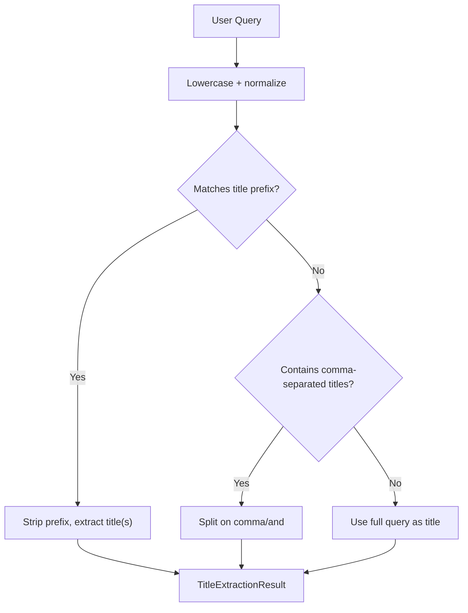
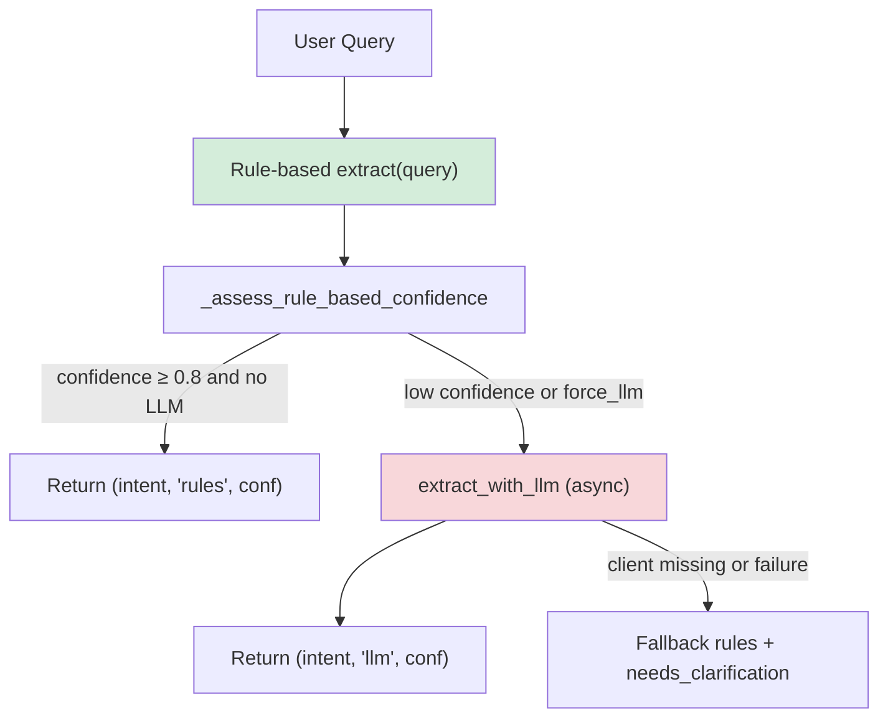
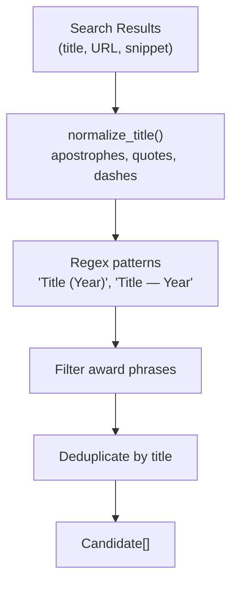
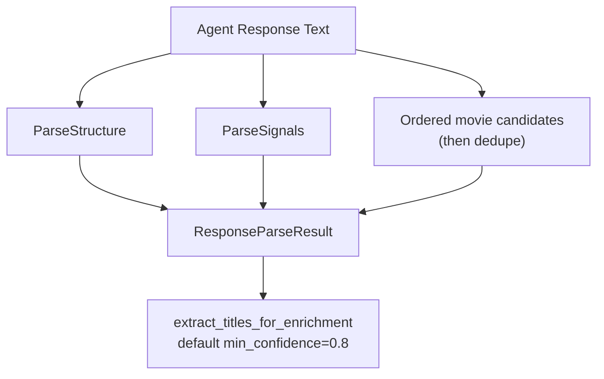
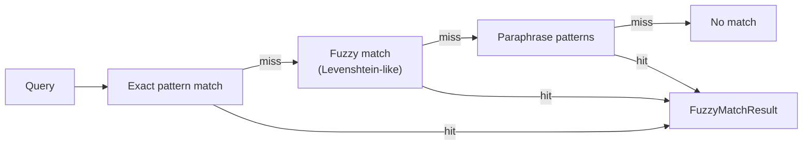
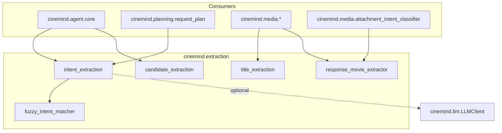

# Extraction Pipeline

> **Package:** `src/cinemind/extraction/`
> **Purpose:** Deterministic NLP pipeline that extracts structured information from user queries and agent responses — movie titles, intents, candidates, and response structure — without requiring LLM calls for most operations.

<details>
<summary><strong>Quick AI Context</strong> — Jump to what you need</summary>

| I need to understand... | Jump to |
|------------------------|---------|
| What stage does what | [Pipeline Overview](#pipeline-overview) |
| How titles are extracted from queries | [Title Extraction](#title-extraction-title_extractionpy) |
| How intents are classified | [Intent Extraction](#intent-extraction-intent_extractionpy) |
| How candidates come from search results | [Candidate Extraction](#candidate-extraction-candidate_extractionpy) |
| How agent responses are parsed | [Response Movie Extractor](#response-movie-extractor-response_movie_extractorpy) |
| Typo tolerance | [Fuzzy Intent Matcher](#fuzzy-intent-matcher-fuzzy_intent_matcherpy) |
| Which tests to run | [Test Coverage](#test-coverage) |
| What else breaks if I change this | [Change Impact Guide](#change-impact-guide) |

**Example changes and where to look:**
- "Add a new intent type" → [Intent Extraction](#intent-extraction-intent_extractionpy) + [Change Impact Guide](#change-impact-guide)
- "Fix title parsing bug" → [Title Extraction](#title-extraction-title_extractionpy) or [Response Movie Extractor](#response-movie-extractor-response_movie_extractorpy)
- "Add new query prefix pattern" → [Title Extraction](#title-extraction-title_extractionpy)

</details>

---

## Module Map

| Module | Role | Lines (approx.) |
|--------|------|-----------------|
| `__init__.py` | Re-exports public API (`extract_movie_titles`, `IntentExtractor`, `parse_response`, `normalize_title` from `candidate_extraction`, …) | ~10 |
| `title_extraction.py` | Extract movie titles from user queries for media enrichment | ~180 |
| `intent_extraction.py` | Structured intent extraction (rule-based + optional LLM) | ~1115 |
| `candidate_extraction.py` | Extract movie candidates from search results | ~400 |
| `response_movie_extractor.py` | Parse agent response text for movie titles, structure, and classifier signals | ~460 |
| `fuzzy_intent_matcher.py` | Typo-tolerant and paraphrase intent matching | ~240 |

---

## Pipeline Overview

The extraction modules operate at different stages of the agent pipeline:

```mermaid
flowchart TD
    subgraph Input["User Input"]
        QUERY["User Query"]
    end

    subgraph Stage1["Stage 1: Query Understanding"]
        TITLE["title_extraction<br/>Extract movie titles"]
        INTENT["intent_extraction<br/>Structured intent"]
        FUZZY["fuzzy_intent_matcher<br/>Typo correction"]
    end

    subgraph Stage2["Stage 2: Search Result Processing"]
        CANDIDATE["candidate_extraction<br/>Movie candidates from results"]
    end

    subgraph Stage3["Stage 3: Response Parsing"]
        RESPONSE["response_movie_extractor<br/>Parse agent output"]
    end

    QUERY --> TITLE
    QUERY --> INTENT
    INTENT -->|low confidence| FUZZY
    TITLE -->|titles| MEDIA["Media Enrichment"]
    INTENT -->|StructuredIntent| PLANNER["RequestPlanner"]

    SEARCH_RESULTS["Search Results"] --> CANDIDATE
    CANDIDATE -->|Candidate[]| VERIFIER["FactVerifier"]

    AGENT_RESPONSE["Agent Response"] --> RESPONSE
    RESPONSE -->|ExtractedMovie[]| ENRICHMENT["TMDB Enrichment"]
```

---

## Title Extraction (`title_extraction.py`)

Deterministic prefix-matching extraction optimized for the media enrichment path.

### How It Works



**Title prefixes** are defined in `_TITLE_PREFIXES` (longest match wins), e.g.:
- Image/poster: `"show me images for"`, `"images for"`, `"poster for"`, …
- Question forms: `"who directed"`, `"when was"`, `"what is"`, `"tell me about"`, …
- Similar / compare: `"movies like"`, `"similar to"`, `"compare"`, `"difference between"`, …

Comma-separated lists (e.g. `"Avatar, Inception"`) and `"X and Y"` splits produce multiple titles with `intent="compare"` where applicable.

### Key Types

| Type | Fields | Purpose |
|------|--------|---------|
| `TitleExtractionResult` | `titles: tuple[str, …]`, `reason: str`, `intent: str` (`single_title` \| `seed_for_similar` \| `compare`) | Extracted titles with rationale and routing hint |

### Public API

| Function | Input | Output |
|----------|-------|--------|
| `extract_movie_titles(query)` | Raw user query | `TitleExtractionResult` |
| `get_search_phrases(query)` | Raw user query | `List[str]` — just the titles |

---

## Intent Extraction (`intent_extraction.py`)

The richest extraction module — produces a fully structured intent from the user query using **rule-based extraction first**, optional **fuzzy refinement** inside `_detect_intent`, and **async LLM fallback** via `extract_smart`.

### Extraction Strategy

`IntentExtractor.extract_smart(...)` (async) implements the production path:



Rule-based intent detection also consults `fuzzy_intent_matcher` inside `_detect_intent` (exact → typo → paraphrase) before falling back.

### StructuredIntent Fields

| Field | Type | Description |
|-------|------|-------------|
| `intent` | `str` | Classified intent (e.g. `director_info`, `recommendation`, `cast_info`, `general_info`, …) |
| `entities` | `Dict[str, List[str]]` | Typed buckets: `"movies"` and `"people"` lists (normalized in `__post_init__`) |
| `constraints` | `Dict[str, Any]` | Filters (counts, ordering, format hints) |
| `original_query` | `str` | Original user text |
| `confidence` | `float` | 0.0–1.0 |
| `requires_disambiguation` | `bool` | Ambiguous title (e.g. remake names) |
| `candidate_year` | `Optional[int]` | Disambiguation year (only when `requires_disambiguation`) |
| `mentioned_year` | `Optional[int]` | Any year mentioned (e.g. awards), even when not disambiguating |
| `need_freshness` | `bool` | Needs up-to-date data |
| `freshness_reason` | `Optional[str]` | Why freshness is needed |
| `freshness_ttl_hours` | `Optional[float]` | Suggested cache TTL (hours) |
| `needs_clarification` | `bool` | Query too vague / extractor uncertain |
| `slots` | `Optional[Dict[str, Optional[str]]]` | Award slots: `award_body`, `award_category`, `award_year_basis` |

### Extraction Methods

| Method | Strategy | When Used |
|--------|----------|-----------|
| `extract(query, request_type="info")` | Rule-based only | Fast path; synchronous |
| `async extract_with_llm(query, client, request_type="info")` | LLM + validation | Called from `extract_smart` when rules are weak |
| `async extract_smart(query, client=None, request_type="info", force_llm=False)` | Rules first; LLM if confidence &lt; 0.8 or forced | Production default; returns `(StructuredIntent, extraction_mode, confidence)` where `extraction_mode` is `"rules"` or `"llm"` |

---

## Candidate Extraction (`candidate_extraction.py`)

Extracts structured movie candidates from raw search results (Tavily, Kaggle, etc.).

### Processing Pipeline



### Key Types

| Type | Fields | Purpose |
|------|--------|---------|
| `Candidate` | `value`, `source_url`, `source_tier`, `confidence`, `context` | A movie candidate with provenance |

### Extraction Variants

| Method | Specialization |
|--------|---------------|
| `extract_movie_candidates(results)` | General movie extraction |
| `extract_collaboration_candidates(results)` | Movies where two people worked together |
| `extract_release_year_candidates(results)` | Release year for a specific movie |

### Title normalization (`candidate_extraction.normalize_title`)

Used for **search-result / candidate** strings (matching and dedup). It:
- Unifies apostrophe/quote variants and common dash characters
- Collapses whitespace
- Preserves meaningful punctuation where appropriate

**Note:** `response_movie_extractor` defines a **separate** `normalize_title()` for **response parsing** (outer-quote stripping, zero-width removal, **numbered list marker stripping** so lines like `1. Interstellar` don’t become poster titles). The package `from cinemind.extraction import normalize_title` refers to **`candidate_extraction.normalize_title`** only. Import `response_movie_extractor.normalize_title` explicitly if you need the response-parser variant.

---

## Response Movie Extractor (`response_movie_extractor.py`)

Deterministic parser for the agent's response text — identifies mentioned movies (with per-hit confidence), structural patterns, and keyword/structural signals for the attachment intent classifier.

### Parse flow

1. **Structure** — `_compute_structure`: bullets (`- * • – ◦`), numbered lists (`1.` / `1)` / `(1)`), Markdown bold, `Title (Year)` presence, dash-blurb after `(Year)`.
2. **Signals** — `_compute_signals`: phrase lists `_DEEP_DIVE_PHRASES` and `_SCENE_PHRASES`; plus `_compute_scene_structure` for `scene_like_enumeration` (short bullet/numbered lines without `(YYYY)`) and `the_film_movie_references` (counts of “the film” / “the movie”).
3. **Movies** — candidates collected in order, then **deduped** by normalized title (first-seen wins):
   - `_extract_from_title_year_patterns`: `Title (Year) – blurb`, `Title (Year):`, standalone `Title (Year)`
   - `_extract_from_bold`: `**Title**` / `*Title*` with optional `(Year)` after markers
   - `_extract_from_bullets_and_numbered`: bold-first line, quoted title, `Title (Year)`, then separator/colon splits and short bare list lines (lower confidence)



### Key Types

| Type | Fields | Purpose |
|------|--------|---------|
| `ExtractedMovie` | `title`, `year`, `confidence` (0–1) | One extracted title; confidence reflects pattern strength |
| `ParseStructure` | `has_bullets`, `has_numbered_list`, `has_bold_titles`, `has_title_year_pattern`, `has_dash_blurb_pattern` | List vs paragraph / formatting cues |
| `ParseSignals` | `deep_dive_indicators`, `scene_indicators`, `scene_like_enumeration`, `the_film_movie_references` | Keyword hits + structural scene/deep-dive heuristics |
| `ResponseParseResult` | `movies`, `structure`, `signals` | Combined parse; `to_dict()` serializes with **camelCase** keys (`hasBullets`, `deepDiveIndicators`, `sceneLikeEnumeration`, …) for logging/API consumers |

### Public API

| Function | Behavior |
|----------|----------|
| `parse_response(text)` | Full `ResponseParseResult` |
| `extract_titles_for_enrichment(text, min_confidence=0.8)` | Ordered title strings for TMDB `enrich` / `enrich_batch` (filters out low-confidence noise) |
| `normalize_title` (this module) | Response-line normalization (differs from `candidate_extraction.normalize_title`; see **Title normalization** under Candidate extraction) |

---

## Fuzzy Intent Matcher (`fuzzy_intent_matcher.py`)

Handles typos and paraphrases that the rule-based intent extractor misses.

### Matching Tiers



### Key Types

| Type | Fields | Purpose |
|------|--------|---------|
| `FuzzyMatchResult` | `intent`, `match_strength`, `match_type` (`exact` \| `fuzzy_typo` \| `fuzzy_paraphrase`), `matched_pattern` | Match outcome with diagnostics |

### Usage Pattern

```python
matcher = get_fuzzy_matcher()  # singleton
result = matcher.match("who directd inception")  # typo-tolerant
# → FuzzyMatchResult(intent="director_info", match_type="fuzzy", ...)
```

---

## Cross-Module Dependencies



### External Packages

| Package | Used In | Purpose |
|---------|---------|---------|
| `re` | All modules | Regex pattern matching |
| `logging` | All modules | Structured logging |
| `dataclasses` | All modules | Data structures |

---

## Design Patterns & Practices

1. **Deterministic First** — rule-based extraction handles most queries; LLM is the fallback inside `extract_smart`, not the default entrypoint
2. **Progressive Enrichment** — each stage adds structure (raw query → intent → candidates → verified facts)
3. **Confidence Scoring** — intents and extracted movies carry scores for downstream filtering (`extract_titles_for_enrichment` threshold)
4. **Normalization at Boundaries** — use the appropriate `normalize_title` for candidates vs response lines (two implementations; see above)
5. **Singleton for Stateful Matchers** — `get_fuzzy_matcher()` avoids recompiling pattern tables
6. **Pure transforms** — synchronous extractors are side-effect free; `extract_smart` / `extract_with_llm` perform I/O via the injected LLM client

---

## Test Coverage

### Tests to Run When Changing This Package

```bash
# All extraction unit tests
python -m pytest tests/unit/extraction/ -v

# Individual module tests
python -m pytest tests/unit/extraction/test_title_extraction.py -v
python -m pytest tests/unit/extraction/test_entity_extraction.py -v
python -m pytest tests/unit/extraction/test_fuzzy_intent_matcher.py -v
python -m pytest tests/unit/extraction/test_response_movie_extractor.py -v

# Downstream consumers (planning uses extraction output)
python -m pytest tests/unit/planning/ -v

# Full pipeline (extraction feeds into everything)
python -m pytest tests/test_scenarios_offline.py -v
```

| Test File | What It Covers |
|-----------|---------------|
| `tests/unit/extraction/test_title_extraction.py` | `extract_movie_titles`, `get_search_phrases`, prefixes, comma/`and` splits |
| `tests/unit/extraction/test_entity_extraction.py` | `IntentExtractor` / `StructuredIntent`: rules, entities, edge cases |
| `tests/unit/extraction/test_fuzzy_intent_matcher.py` | Fuzzy matching: exact, typo tolerance, paraphrases, false positives |
| `tests/unit/extraction/test_response_movie_extractor.py` | `parse_response`, `extract_titles_for_enrichment`, response `normalize_title`, structure/signals |
| `tests/unit/planning/test_request_type_router.py` | Downstream: router uses extraction output |
| `tests/unit/media/test_attachment_intent_classifier.py` | Downstream: classifier uses `ResponseParseResult` |

---

## Change Impact Guide

| If you change... | Also check... |
|-----------------|---------------|
| `StructuredIntent` fields | `RequestPlanner`, `ToolPlanner`, `SemanticCache` (uses intent for key), `IntentExtractor._validate_and_correct_intent` |
| Title prefix patterns (`_TITLE_PREFIXES`) | `media_enrichment`, `test_title_extraction.py` |
| `candidate_extraction.normalize_title` | `CandidateExtractor`, `FactVerifier`, package re-export in `extraction/__init__.py` |
| `response_movie_extractor.normalize_title` | List-marker stripping behavior, `test_response_movie_extractor.py`, dedupe keys in `parse_response` |
| `ResponseParseResult` / `to_dict()` camelCase | `attachment_intent_classifier`, any JSON consumers of parse blobs |
| Intent taxonomy (adding new intents) | `RequestTypeRouter`, `ResponseTemplate`, `HybridClassifier`, `valid_intents` in `intent_extraction` |
| Confidence thresholds | `extract_smart` (0.8 rule cutoff), `extract_titles_for_enrichment` (default 0.8) |
