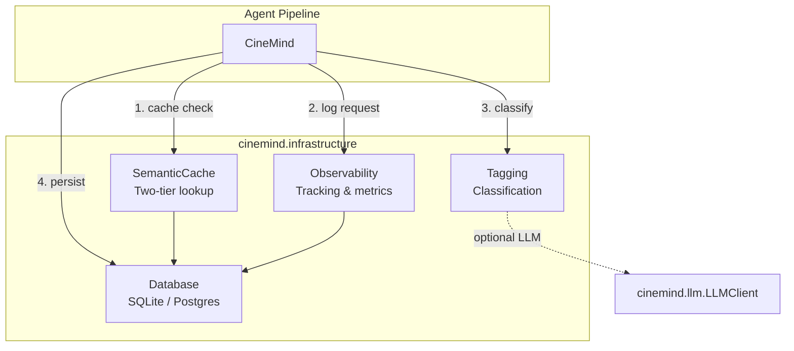
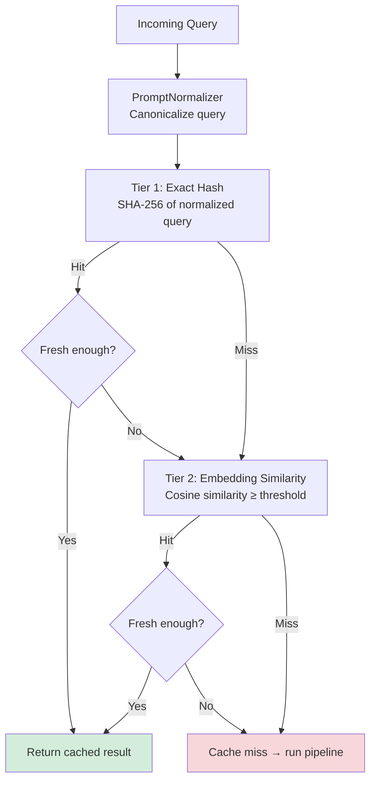
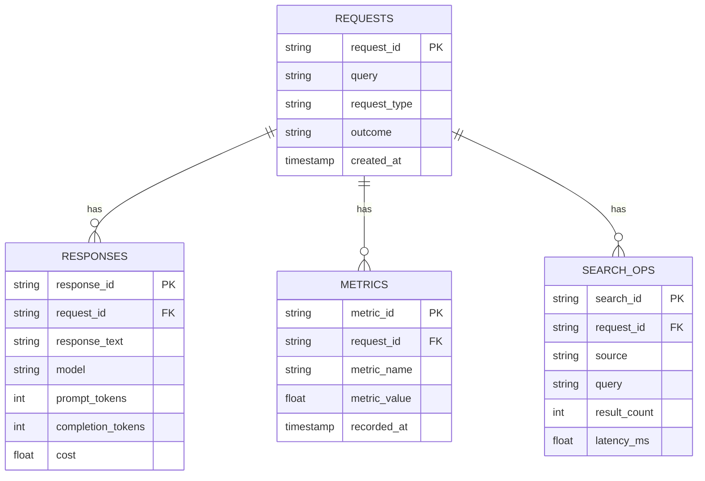
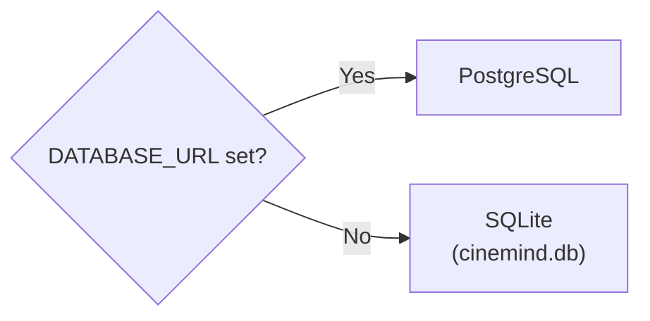
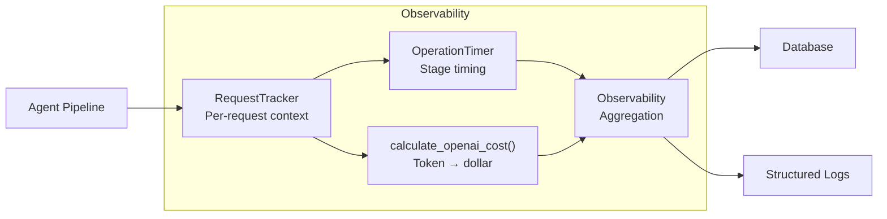
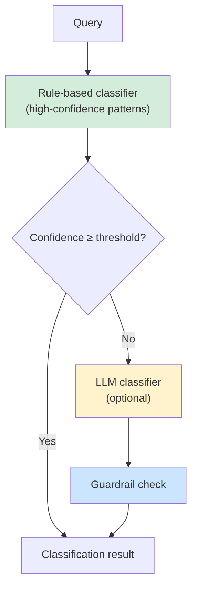
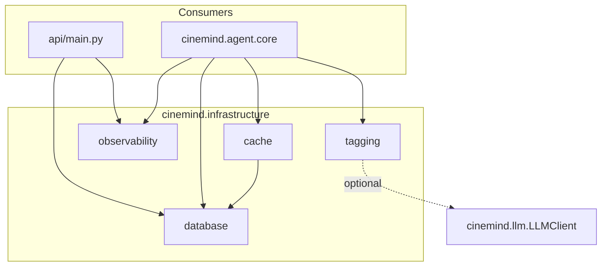

# Infrastructure

> **Package:** `src/cinemind/infrastructure/`
> **Purpose:** Cross-cutting concerns that support the entire agent pipeline — semantic caching, database persistence, observability/metrics, and request classification/tagging.

---

## Module Map

| Module | Role | Lines |
|--------|------|-------|
| `cache.py` | Two-tier semantic cache (hash + embedding) | ~857 |
| `database.py` | SQLite/PostgreSQL persistence layer | ~413 |
| `observability.py` | Request tracking, timing, and cost calculation | ~339 |
| `tagging.py` | Hybrid request classifier (rules → LLM → guardrails) | ~382 |

---

## System Overview



---

## Semantic Cache (`cache.py`)

A two-tier cache that avoids redundant LLM calls for similar queries.

### Two-Tier Architecture



### Freshness Rules

| Intent Type | TTL | Reason |
|------------|-----|--------|
| Award queries | Short (hours) | Awards change during season |
| Release/streaming info | Medium (days) | Availability changes |
| Historical facts | Long (weeks) | Director of a 1994 film won't change |
| Default | Configurable | `CACHE_DEFAULT_TTL_HOURS` env var |

### PromptNormalizer

Canonicalizes queries before hashing to improve cache hit rates:

| Normalization | Example |
|--------------|---------|
| Lowercase | "Who Directed INCEPTION" → "who directed inception" |
| Whitespace collapse | "who  directed  inception" → "who directed inception" |
| Intent signature | Groups similar phrasings into same key |

### Key Types

| Type | Fields |
|------|--------|
| `CacheEntry` | `key`, `result`, `timestamp`, `ttl_hours`, `intent`, `hit_count` |
| `SemanticCache` | Two-tier lookup with freshness gating |

### Key Methods

| Method | Purpose |
|--------|---------|
| `lookup(query, intent)` | Two-tier cache check with freshness |
| `store(query, intent, result, ttl)` | Cache a new result |
| `invalidate(query)` | Remove a specific entry |
| `stats()` | Hit/miss ratios, entry counts |

---

## Database (`database.py`)

Persistence layer supporting both SQLite (development) and PostgreSQL (production).

### Schema



### Key Methods

| Method | Purpose |
|--------|---------|
| `log_request(...)` | Record a new request |
| `log_response(...)` | Record the agent's response |
| `log_metric(...)` | Record a performance metric |
| `log_search(...)` | Record a search operation |
| `get_request(id)` | Retrieve request details |
| `get_requests(limit, offset)` | Paginated request history |
| `get_stats()` | Aggregated statistics |
| `update_outcome(id, outcome)` | Set request outcome |

### Database Selection



---

## Observability (`observability.py`)

Structured tracking for every request through the pipeline.

### Components



### RequestTracker

Tracks a single request through all pipeline stages:

| Tracked Data | Source |
|-------------|--------|
| Request ID | Generated or provided |
| Stage timings | `OperationTimer` context manager |
| Token usage | LLM response |
| Cost | `calculate_openai_cost()` |
| Search operations | Search engine callbacks |
| Cache hits/misses | Semantic cache |

### OperationTimer

Context manager for timing individual pipeline stages:

```python
with OperationTimer("tavily_search") as timer:
    results = await search_engine.search(query)
# timer.elapsed_ms now available
```

### Cost Calculation

| Model | Input (per 1K tokens) | Output (per 1K tokens) |
|-------|----------------------|----------------------|
| `gpt-4o` | Configured rate | Configured rate |
| `gpt-4o-mini` | Configured rate | Configured rate |

---

## Request Tagging (`tagging.py`)

Classifies requests for analytics, routing, and quality tracking.

### Hybrid Classification



### Classification Types

**Request Types** (`REQUEST_TYPES`):

| Type | Example |
|------|---------|
| `director_info` | "Who directed Inception?" |
| `cast_info` | "Cast of The Matrix" |
| `recommendation` | "Movies like Interstellar" |
| `comparison` | "Compare Alien vs Aliens" |
| `award_info` | "Best Picture 2024" |
| `off_topic` | "What's the weather?" |
| *(more)* | See `request_type_router.py` |

**Outcomes** (`OUTCOMES`):

| Outcome | Meaning |
|---------|---------|
| `success` | User satisfied |
| `partial` | Partially answered |
| `failure` | Could not answer |
| `off_topic` | Non-movie query |

### Key Types

| Type | Fields |
|------|--------|
| `ClassificationResult` | `request_type`, `confidence`, `method` (`"rule"` or `"llm"`) |
| `RequestTagger` | Tags requests with type + metadata |
| `HybridClassifier` | Rules → LLM → guardrails pipeline |

---

## Cross-Module Dependencies



### External Packages

| Package | Used In | Purpose |
|---------|---------|---------|
| `sqlite3` | `database.py` | SQLite backend |
| `psycopg2` | `database.py` | PostgreSQL backend (optional) |
| `hashlib` | `cache.py` | SHA-256 hashing |
| `numpy` | `cache.py` | Embedding similarity (optional) |
| `logging` | All modules | Structured logging |
| `time` | `observability.py` | Timing operations |
| `threading` | `cache.py` | Thread-safe cache |
| `uuid` | `observability.py` | Request ID generation |

### Environment Variables

| Variable | Default | Used By |
|----------|---------|---------|
| `DATABASE_URL` | — | `database.py` (Postgres) |
| `SQLITE_PATH` | `cinemind.db` | `database.py` (SQLite) |
| `CACHE_DEFAULT_TTL_HOURS` | `24` | `cache.py` |
| `CACHE_EMBEDDING_THRESHOLD` | `0.92` | `cache.py` |
| `CACHE_MAX_ENTRIES` | `10000` | `cache.py` |

---

## Design Patterns & Practices

1. **Layered Cache** — exact hash (fast, precise) before embedding similarity (slower, fuzzy)
2. **Freshness-Aware Caching** — TTL varies by intent type, preventing stale answers for time-sensitive queries
3. **Database Abstraction** — same interface for SQLite and PostgreSQL; selected by env var
4. **Context Manager Timing** — `OperationTimer` makes stage timing natural and exception-safe
5. **Hybrid Classification** — deterministic rules handle common cases; LLM handles edge cases; guardrails catch misclassification
6. **Cost Tracking** — every LLM call is costed and persisted for budget monitoring
7. **Structured Logging** — all operations include request IDs for distributed tracing

---

## Change Impact Guide

| If you change... | Also check... |
|-----------------|---------------|
| Cache TTL logic | Response freshness, test fixtures with time mocking |
| Database schema | Migration scripts, all `Database` methods, observability endpoints |
| `ClassificationResult` fields | `RequestPlanner`, observability analytics |
| Cost calculation rates | Budget alerts, dashboard reports |
| Cache key normalization | Cache hit rates, deduplication behavior |
| `REQUEST_TYPES` or `OUTCOMES` | `RequestTypeRouter`, `ResponseTemplate`, frontend analytics |
