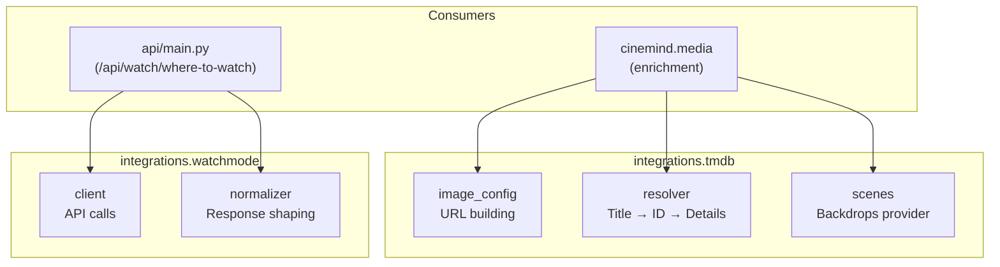
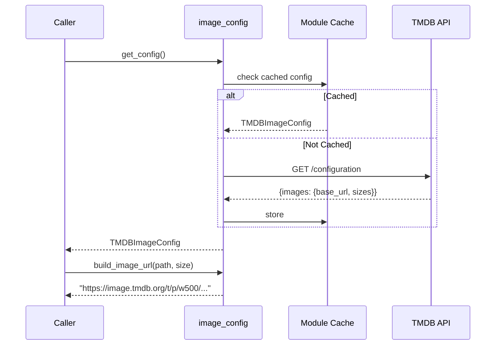
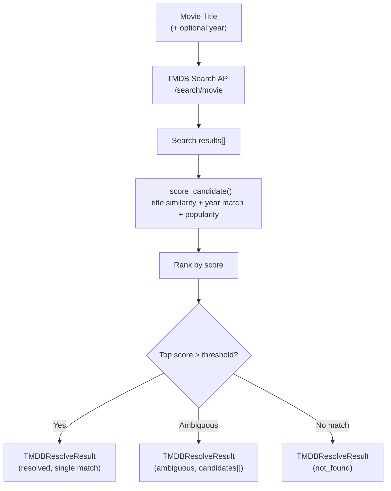
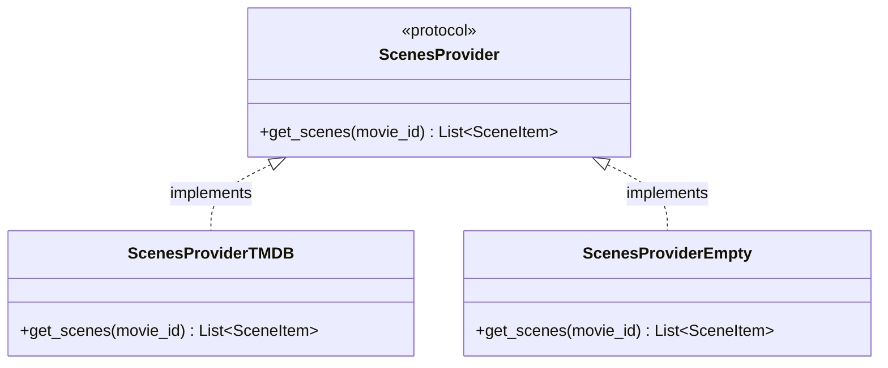
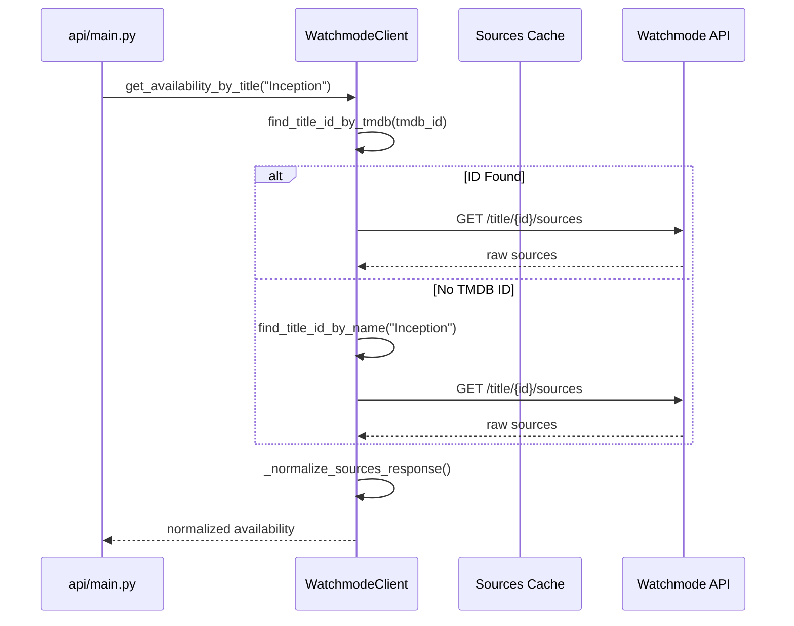
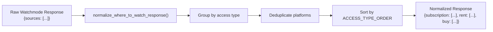
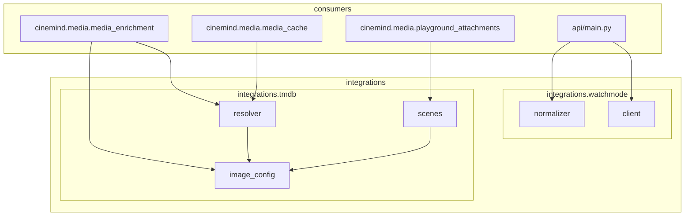

# External Integrations

> **Package:** `src/integrations/`
> **Purpose:** Server-side clients for external APIs — TMDB (movie metadata, posters, scenes) and Watchmode (streaming availability). Isolated from business logic; consumed by media enrichment and API endpoints.

---

## Module Map

### TMDB Integration (`integrations/tmdb/`)

| Module | Role | Lines |
|--------|------|-------|
| `image_config.py` | Fetch and cache TMDB image configuration | ~194 |
| `resolver.py` | Search → score → resolve movie titles | ~246 |
| `scenes.py` | Pluggable scenes/backdrops provider | ~215 |

### Watchmode Integration (`integrations/watchmode/`)

| Module | Role | Lines |
|--------|------|-------|
| `client.py` | Watchmode API client for streaming availability | ~322 |
| `normalizer.py` | Normalize API response for frontend | ~143 |

---

## Architecture

---

## TMDB Integration

### Image Configuration (`image_config.py`)

Fetches and caches the TMDB `/configuration` endpoint to build correct image URLs without hardcoding base URLs.

### Key Types & Constants

| Type / Constant | Purpose |
|----------------|---------|
| `TMDBImageConfig` | Cached config: `base_url`, `poster_sizes`, `backdrop_sizes` |
| `SIZE_POSTER_GALLERY` | Poster size for gallery views |
| `SIZE_BACKDROP_GALLERY` | Backdrop size for scene displays |

### Key Functions

| Function | Purpose |
|----------|---------|
| `fetch_config()` | HTTP call to TMDB configuration endpoint |
| `get_config()` | Cached wrapper (fetches once) |
| `build_image_url(path, size)` | Assemble full URL from config + path + size |
| `clear_config_cache()` | Reset (for tests or config changes) |

---

### Movie Resolver (`resolver.py`)

Resolves a movie title string into structured TMDB data using search, scoring, and disambiguation.

### Scoring Factors

| Factor | Weight | Description |
|--------|--------|-------------|
| Title similarity | High | Normalized Levenshtein-like comparison |
| Year match | Medium | Exact year match bonus |
| Popularity | Low | TMDB popularity tiebreaker |

### Key Types

| Type | Fields |
|------|--------|
| `TMDBCandidate` | `id`, `title`, `year`, `poster_path`, `popularity`, `score` |
| `TMDBResolveResult` | `status` (`resolved`/`ambiguous`/`not_found`), `movie`, `candidates` |

---

### Scenes Provider (`scenes.py`)

Pluggable provider for scene/backdrop images, following the Protocol pattern.

| Provider | When Used | Behavior |
|----------|-----------|----------|
| `ScenesProviderTMDB` | TMDB API key present | Fetches backdrop images from TMDB |
| `ScenesProviderEmpty` | No API key / disabled | Returns empty list (graceful fallback) |

**Factory:** `get_scenes_provider()` selects the appropriate implementation based on config.

### Key Types

| Type | Fields |
|------|--------|
| `SceneItem` | `image_url`, `caption`, `aspect_ratio` |

---

## Watchmode Integration

### Client (`client.py`)

HTTP client for the Watchmode API — looks up streaming availability by title.

### Key Methods

| Method | Purpose |
|--------|---------|
| `get_sources_catalog()` | Cached (~30 day TTL) platform list |
| `find_title_id_by_tmdb(tmdb_id)` | Look up Watchmode title by TMDB ID |
| `find_title_id_by_name(name)` | Search by title name |
| `get_availability(title_id)` | Raw availability for a Watchmode ID |
| `get_availability_by_title(title, tmdb_id)` | End-to-end lookup |

**Factory:** `get_watchmode_client()` returns a configured client instance.

---

### Normalizer (`normalizer.py`)

Transforms raw Watchmode API responses into a frontend-friendly format.

### Access Type Ordering

| Priority | Access Type | Example |
|----------|------------|---------|
| 1 | Subscription | Netflix, Disney+ |
| 2 | Free | Tubi, Pluto TV |
| 3 | Rent | Apple TV, Google Play |
| 4 | Buy | iTunes, Vudu |

---

## Cross-Module Dependencies

### External Packages

| Package | Used In | Purpose |
|---------|---------|---------|
| `httpx` or `requests` | `image_config.py`, `resolver.py`, `scenes.py`, `client.py` | HTTP calls |
| `logging` | All modules | Structured logging |
| `dataclasses` | All modules | Data structures |
| `urllib.parse` | `resolver.py` | URL construction |

### Environment Variables

| Variable | Default | Used By |
|----------|---------|---------|
| `TMDB_API_KEY` | — | All TMDB modules |
| `TMDB_READ_ACCESS_TOKEN` | — | TMDB modules (alternative auth) |
| `WATCHMODE_API_KEY` | — | `client.py` |

---

## Design Patterns & Practices

1. **Integration Isolation** — external API clients are fully contained in `integrations/`; domain code never calls APIs directly
2. **Protocol Pattern** — `ScenesProvider` allows swapping TMDB for empty/mock implementations
3. **Factory Functions** — `get_watchmode_client()`, `get_scenes_provider()` centralize construction
4. **Response Normalization** — raw API responses are shaped at the integration boundary, not in domain code
5. **Cached Configuration** — TMDB image config and Watchmode source catalogs are fetched once and cached
6. **Graceful Degradation** — missing API keys produce empty providers, not crashes

---

## Change Impact Guide

| If you change... | Also check... |
|-----------------|---------------|
| `TMDBResolveResult` structure | `media_enrichment.py`, `media_cache.py` |
| TMDB API version/endpoints | `resolver.py`, `scenes.py`, `image_config.py` |
| `SceneItem` fields | Frontend `js/modules/messages.js` |
| Watchmode response shape | `normalizer.py`, frontend `where-to-watch.js` |
| Image size constants | Frontend CSS for poster/backdrop display |
| API key env var names | `.env.example`, Docker configs, CI secrets |
