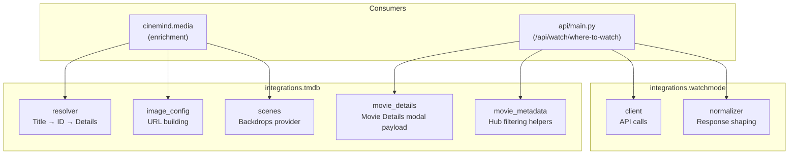
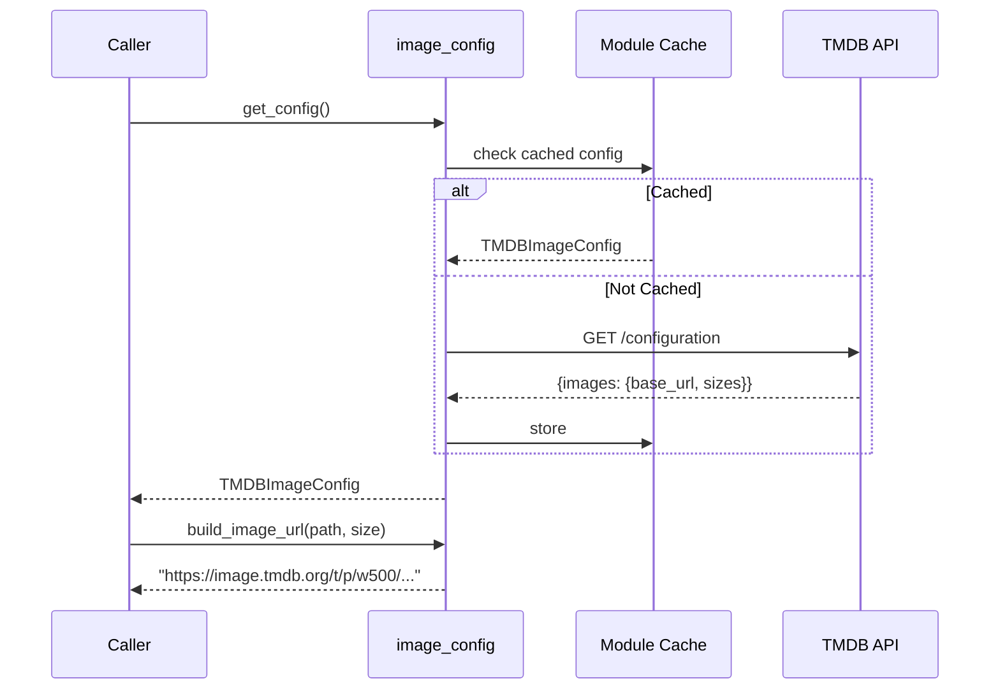
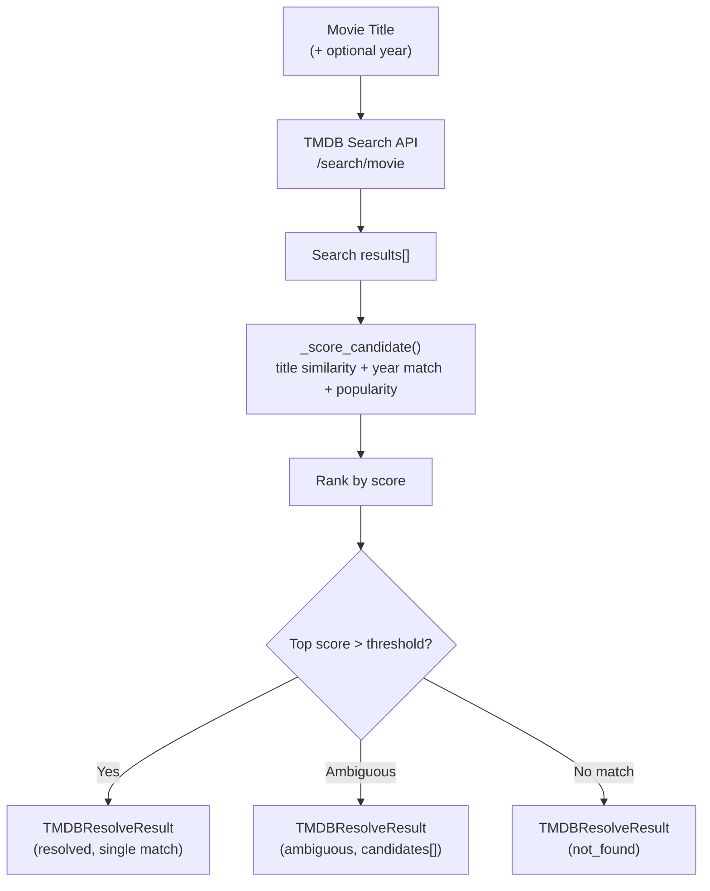
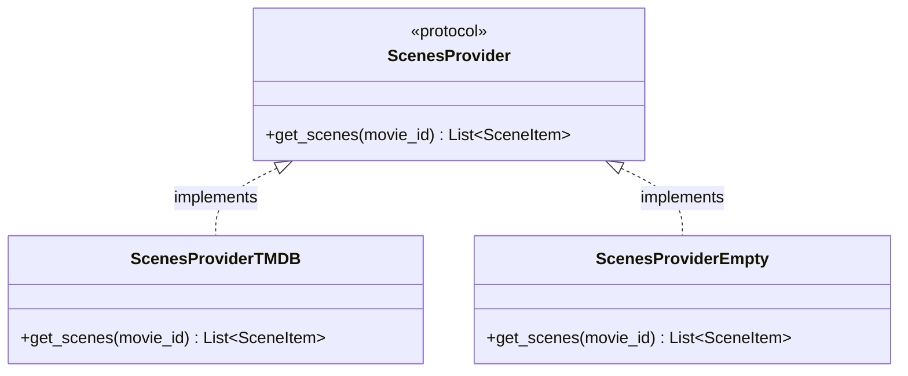
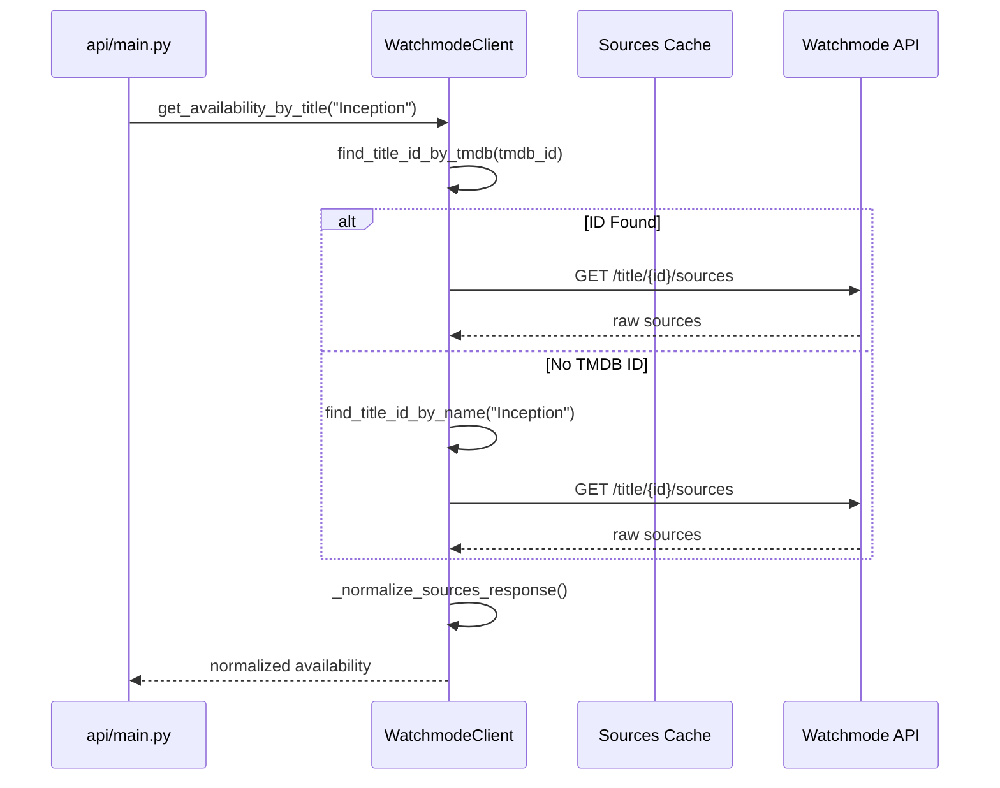
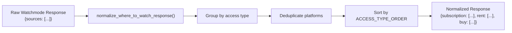
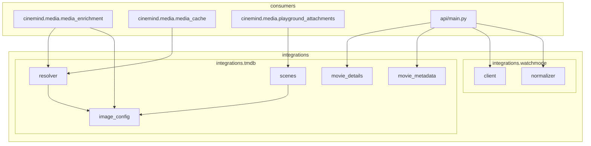

# External Integrations

> **Package:** `src/integrations/`
> **Purpose:** Server-side clients for external APIs — TMDB (movie metadata, posters, scenes) and Watchmode (streaming availability). Isolated from business logic; consumed by media enrichment and API endpoints.

<details>
<summary><strong>Quick AI Context</strong> — Jump to what you need</summary>

| I need to understand... | Jump to |
|------------------------|---------|
| TMDB image URL building | [Image Configuration](#image-configuration-image_configpy) |
| How movie titles resolve to TMDB data | [Movie Resolver](#movie-resolver-resolverpy) |
| How scenes/backdrops work | [Scenes Provider](#scenes-provider-scenespy) |
| Movie Details modal payload | [Movie Details](#movie-details-movie_detailspy) |
| Hub filtering metadata helpers | [Movie Hub Metadata](#movie-hub-metadata-movie_metadatapy) |
| Streaming availability lookup | [Client](#client-clientpy) |
| How raw API responses are shaped | [Normalizer](#normalizer-normalizerpy) |
| Which tests to run | [Test Coverage](#test-coverage) |
| What else breaks if I change this | [Change Impact Guide](#change-impact-guide) |

**Example changes and where to look:**
- "Fix TMDB resolver scoring" → [Movie Resolver](#movie-resolver-resolverpy) + [Scoring Factors](#scoring-factors)
- "Change Watchmode response format" → [Normalizer](#normalizer-normalizerpy)
- "Add a new external API" → [Architecture](#architecture) + see `ADD_FEATURE_CONTEXT.md`

</details>

---

## Module Map

### TMDB Integration (`integrations/tmdb/`)

| Module | Role | Lines |
|--------|------|-------|
| `http_client.py` | Shared **`httpx.Client`** (connection pooling) for TMDB GET JSON | ~90 |
| `resolve_cache.py` | TTL + LRU cache for **`resolve_movie`** outputs | ~95 |
| `image_config.py` | Fetch and cache TMDB image configuration | ~194 |
| `resolver.py` | Search → score → resolve movie titles | ~246 |
| `scenes.py` | Pluggable scenes/backdrops provider | ~215 |
| `movie_details.py` | Deterministic Movie Details payload (+ relatedMovies) | ~200 |
| `movie_metadata.py` | Hub filtering metadata (`append_to_response` bundle + thin list helpers) | ~200 |

### Watchmode Integration (`integrations/watchmode/`)

| Module | Role | Lines |
|--------|------|-------|
| `client.py` | Watchmode API client for streaming availability | ~322 |
| `normalizer.py` | Normalize API response for frontend | ~143 |

---

## Architecture



---

## TMDB Integration

### Image Configuration (`image_config.py`)

Fetches and caches the TMDB `/configuration` endpoint to build correct image URLs without hardcoding base URLs.



### Key Types & Constants

| Type / Constant | Purpose |
|----------------|---------|
| `TMDBImageConfig` | Cached config: `base_url`, `poster_sizes`, `backdrop_sizes` |
| `SIZE_POSTER_GALLERY` | Poster size for gallery views |
| `SIZE_BACKDROP_GALLERY` | Backdrop size for scene displays |

### Key Functions

| Function | Purpose |
|----------|---------|
| `fetch_config()` | HTTP call to TMDB configuration endpoint |
| `get_config()` | Cached wrapper (fetches once) |
| `build_image_url(path, size)` | Assemble full URL from config + path + size |
| `clear_config_cache()` | Reset (for tests or config changes) |

---

### Movie Resolver (`resolver.py`)

Resolves a movie title string into structured TMDB data using search, scoring, and disambiguation. HTTP uses the shared **`http_client.tmdb_request_json`** pool (not one-off `urllib` calls). Results are cached in **`resolve_cache`** (see `CINEMIND_TMDB_RESOLVE_CACHE_*` in [Media Enrichment](../media/MEDIA_ENRICHMENT.md#tmdb-resolve-cache-integrationstmdbresolve_cachepy)).



### Scoring Factors

| Factor | Weight | Description |
|--------|--------|-------------|
| Title similarity | High | Normalized Levenshtein-like comparison |
| Year match | Medium | Exact year match bonus |
| Popularity | Low | TMDB popularity tiebreaker |

### Key Types

| Type | Fields |
|------|--------|
| `TMDBCandidate` | `id`, `title`, `year`, `poster_path`, `popularity`, `score` |
| `TMDBResolveResult` | `status` (`resolved`/`ambiguous`/`not_found`), `movie`, `candidates` |

---

### Scenes Provider (`scenes.py`)

Pluggable provider for scene/backdrop images, following the Protocol pattern.



| Provider | When Used | Behavior |
|----------|-----------|----------|
| `ScenesProviderTMDB` | TMDB enabled + token present (`ENABLE_TMDB_SCENES` + `TMDB_READ_ACCESS_TOKEN`) | Fetches backdrop images from TMDB |
| `ScenesProviderEmpty` | TMDB not enabled / token missing | Returns empty list (graceful fallback) |

**Factory:** `get_scenes_provider()` selects the appropriate implementation based on config.

### Key Types

| Type | Fields |
|------|--------|
| `SceneItem` | `image_url`, `caption`, `aspect_ratio` |

---

### Movie Details (`movie_details.py`)

Deterministic normalization helpers for the full-screen Movie Details modal.

Key properties:
- Never raise: if TMDB is disabled/misconfigured or any TMDB/network failure occurs, the helper returns a minimal payload `{"tmdbId": <int>}` so the frontend never gets stuck.
- Provides UI-friendly fields for details: title/year/tagline/overview/runtime/genres/release_date/language/country/rating/vote_count plus `primary_image_url` and `backdrop_url`.
- Credit normalization extracts `directors` and `cast` into simple string lists.
- Optionally includes related movies via TMDB `/movie/{id}/similar` as `relatedMovies`.

Primary helper:
- `build_movie_details_payload(tmdb_id, token=None, timeout=6.0, include_related=True)` → `MovieDetailsResponse`-compatible dict.

---

### Movie Hub Metadata (`movie_metadata.py`)

Deterministic TMDB metadata helpers used by `cinemind.media.movie_hub_filtering` to apply natural-language constraints to an anchored hub candidate set.

Key properties:
- Never raise: returns empty lists on any failure or missing token.
- **`fetch_movie_filter_bundle(movie_id, token)`** — single **`GET /movie/{id}?append_to_response=credits,keywords`**; returns **`genres`**, **`cast`**, and **`keywords`** name lists (one round trip per id). Hub filtering calls this directly.
- **`fetch_movie_genre_names` / `fetch_movie_cast_names` / `fetch_movie_keyword_names`** — convenience wrappers around the same bundle (with a short in-process memo so back-to-back calls for the same id reuse one fetch).

Helper functions:
- `fetch_movie_filter_bundle(movie_id, token)` → combined credits + keywords + base movie fields
- `fetch_movie_cast_names(movie_id, token)` → cast names (from bundle)
- `fetch_movie_genre_names(movie_id, token)` → genre names (from bundle)
- `fetch_movie_keyword_names(movie_id, token)` → keyword names (from bundle)

---

## Watchmode Integration

### Client (`client.py`)

HTTP client for the Watchmode API — looks up streaming availability by title.



### Key Methods

| Method | Purpose |
|--------|---------|
| `get_sources_catalog()` | Cached (~30 day TTL) platform list |
| `find_title_id_by_tmdb(tmdb_id)` | Look up Watchmode title by TMDB ID |
| `find_title_id_by_name(name)` | Search by title name |
| `get_availability(title_id)` | Raw availability for a Watchmode ID |
| `get_availability_by_title(title, tmdb_id)` | End-to-end lookup |

**Factory:** `get_watchmode_client()` returns a configured client instance.

---

### Normalizer (`normalizer.py`)

Transforms raw Watchmode API responses into a frontend-friendly format.



### Access Type Ordering

| Priority | Access Type | Example |
|----------|------------|---------|
| 1 | Subscription | Netflix, Disney+ |
| 2 | Free | Tubi, Pluto TV |
| 3 | Rent | Apple TV, Google Play |
| 4 | Buy | iTunes, Vudu |

---

## Cross-Module Dependencies



### External Packages

| Package | Used In | Purpose |
|---------|---------|---------|
| `httpx` or `requests` | `image_config.py`, `resolver.py`, `scenes.py`, `client.py` | HTTP calls |
| `logging` | All modules | Structured logging |
| `dataclasses` | All modules | Data structures |
| `urllib.parse` | `resolver.py` | URL construction |

### Environment Variables

| Variable | Default | Used By |
|----------|---------|---------|
| `ENABLE_TMDB_SCENES` | `false` | Enables TMDB-backed enrichment/details (requires `TMDB_READ_ACCESS_TOKEN`) |
| `TMDB_READ_ACCESS_TOKEN` | — | TMDB modules (alternative auth) |
| `WATCHMODE_API_KEY` | — | `client.py` |

---

## Design Patterns & Practices

1. **Integration Isolation** — external API clients are fully contained in `integrations/`; domain code never calls APIs directly
2. **Protocol Pattern** — `ScenesProvider` allows swapping TMDB for empty/mock implementations
3. **Factory Functions** — `get_watchmode_client()`, `get_scenes_provider()` centralize construction
4. **Response Normalization** — raw API responses are shaped at the integration boundary, not in domain code
5. **Cached Configuration** — TMDB image config and Watchmode source catalogs are fetched once and cached
6. **Graceful Degradation** — missing TMDB token / disabled TMDB produces empty providers, not crashes

---

## Test Coverage

### Tests to Run When Changing This Package

```bash
# All integration unit tests
python -m pytest tests/unit/integrations/ -v

# TMDB tests
python -m pytest tests/unit/integrations/test_tmdb_image_config.py -v
python -m pytest tests/unit/integrations/test_tmdb_resolver.py -v

# Watchmode tests
python -m pytest tests/unit/integrations/test_where_to_watch_api.py -v
python -m pytest tests/unit/integrations/test_where_to_watch_normalizer.py -v

# Downstream: media enrichment uses TMDB
python -m pytest tests/unit/media/ -v
```

| Test File | What It Covers |
|-----------|---------------|
| `test_tmdb_image_config.py` | `TMDBImageConfig`, `fetch_config`, `build_image_url`, size constants |
| `test_tmdb_resolver.py` | `resolve_movie`, `_normalize_title`, `_score_candidate`, confidence |
| `test_where_to_watch_api.py` | FastAPI endpoint: happy path, not found, rate limit, missing key |
| `test_where_to_watch_normalizer.py` | `normalize_where_to_watch_response`: grouping, dedup, sorting |

---

## Change Impact Guide

| If you change... | Also check... |
|-----------------|---------------|
| `TMDBResolveResult` structure | `media_enrichment.py`, `media_cache.py` |
| TMDB API version/endpoints | `resolver.py`, `scenes.py`, `image_config.py` |
| `SceneItem` fields | Frontend `js/modules/messages.js` |
| Watchmode response shape | `normalizer.py`, frontend `where-to-watch.js` |
| Image size constants | Frontend CSS for poster/backdrop display |
| TMDB env var names | `.env.example`, Docker configs, CI secrets |
