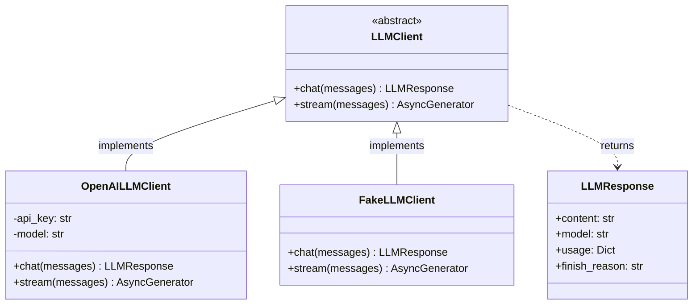
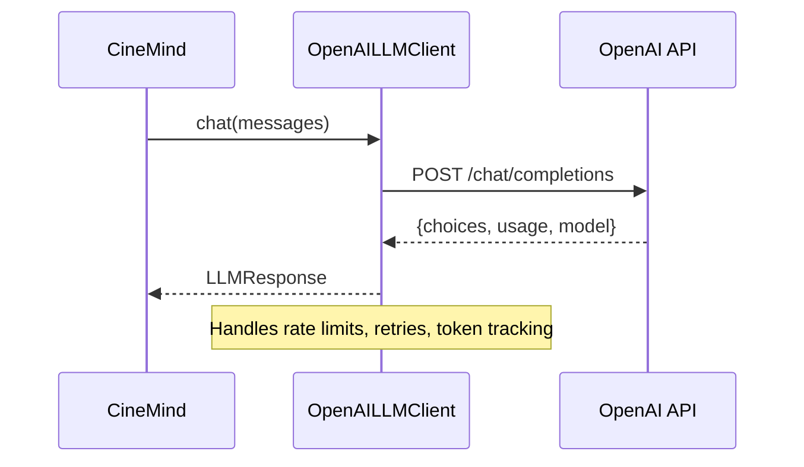
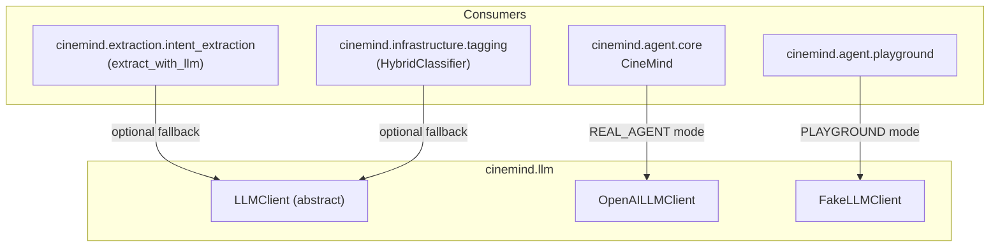
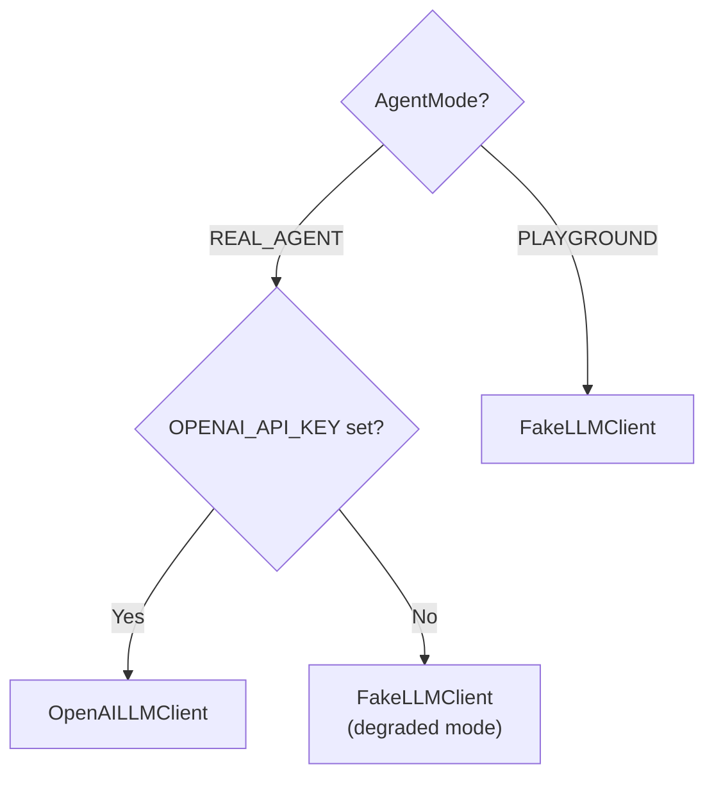

# LLM Client

> **Package:** `src/cinemind/llm/`
> **Purpose:** Abstraction layer over LLM providers — defines a common interface, a real OpenAI implementation, and a fake client for testing and playground mode.

<details>
<summary><strong>Quick AI Context</strong> — Jump to what you need</summary>

| I need to understand... | Jump to |
|------------------------|---------|
| Client class hierarchy | [Architecture](#architecture) |
| OpenAI implementation | [OpenAILLMClient](#openaillmclient) |
| Fake client for tests | [FakeLLMClient](#fakellmclient) |
| Response data structure | [LLMResponse](#llmresponse) |
| Who uses which client | [Integration Points](#integration-points) |
| How client is selected | [Selection Logic](#selection-logic) |
| Which tests to run | [Test Coverage](#test-coverage) |
| What else breaks if I change this | [Change Impact Guide](#change-impact-guide) |

**Example changes and where to look:**
- "Switch LLM provider" → [Architecture](#architecture) + [OpenAILLMClient](#openaillmclient)
- "Change FakeLLM responses" → [FakeLLMClient](#fakellmclient)
- "Add streaming support" → [Architecture](#architecture)

</details>

---

## Module Map

| Module | Role | Lines |
|--------|------|-------|
| `client.py` | `LLMClient` abstract base, `OpenAILLMClient`, `FakeLLMClient` | ~374 |

---

## Architecture



---

## Client Implementations

### OpenAILLMClient

Production client wrapping the OpenAI Chat Completions API.



| Feature | Detail |
|---------|--------|
| Model | Configurable via `OPENAI_MODEL` env var (default: `gpt-4o`) |
| Auth | `OPENAI_API_KEY` env var |
| Streaming | Async generator via `stream()` method |
| Token tracking | Usage stats in `LLMResponse.usage` |

### FakeLLMClient

Deterministic client for testing and playground mode — returns canned responses without any API calls.

| Feature | Detail |
|---------|--------|
| Cost | Zero (no API calls) |
| Latency | Near-zero |
| Determinism | Same input always produces same output |
| Use case | Playground mode, unit tests, CI |

---

## Key Types

### LLMResponse

| Field | Type | Description |
|-------|------|-------------|
| `content` | `str` | The generated text |
| `model` | `str` | Model name that produced the response |
| `usage` | `Dict` | Token usage: `prompt_tokens`, `completion_tokens`, `total_tokens` |
| `finish_reason` | `str` | `"stop"`, `"length"`, etc. |

---

## Integration Points



---

## Selection Logic



The client is selected at `CineMind` construction time and injected into all subsystems that need LLM access.

---

## Dependencies

### External Packages

| Package | Used In | Purpose |
|---------|---------|---------|
| `openai` | `OpenAILLMClient` | OpenAI Python SDK |
| `abc` | `LLMClient` | Abstract base class |
| `dataclasses` | `LLMResponse` | Response data structure |
| `logging` | `client.py` | Request/response logging |

### Environment Variables

| Variable | Default | Used By |
|----------|---------|---------|
| `OPENAI_API_KEY` | — | `OpenAILLMClient` authentication |
| `OPENAI_MODEL` | `gpt-4o` | Model selection |

---

## Design Patterns & Practices

1. **Strategy Pattern** — `LLMClient` abstract class with two implementations, selected at runtime
2. **Dependency Injection** — `CineMind` accepts `llm_client` parameter; never constructs the client internally
3. **Interface Segregation** — `LLMClient` exposes only `chat()` and `stream()`; no OpenAI-specific leaks
4. **Zero-Cost Testing** — `FakeLLMClient` enables full pipeline testing without API calls or keys
5. **Token Accounting** — every response includes usage stats for cost tracking

---

## Test Coverage

### Tests to Run When Changing This Package

```bash
# LLM is tested indirectly via integration tests
python -m pytest tests/integration/test_agent_offline_e2e.py -v

# Smoke test with real LLM (requires OPENAI_API_KEY)
python -m pytest tests/smoke/test_real_workflow_smoke.py -v

# All tests using FakeLLMClient
python -m pytest tests/unit/ tests/integration/ -v
```

| Test File | What It Covers |
|-----------|---------------|
| `tests/integration/test_agent_offline_e2e.py` | Full pipeline with `FakeLLMClient` |
| `tests/smoke/test_real_workflow_smoke.py` | Real `OpenAILLMClient` (requires API key) |
| All `tests/unit/` and `tests/integration/` | Use `FakeLLMClient` — changing its responses affects all |

> **Note:** `FakeLLMClient` is used throughout the test suite. Changing its response format or behavior affects virtually every test.

---

## Change Impact Guide

| If you change... | Also check... |
|-----------------|---------------|
| `LLMClient` interface | `OpenAILLMClient`, `FakeLLMClient`, all consumers |
| `LLMResponse` fields | `CineMind` response processing, observability cost calculation |
| OpenAI model default | Cost estimates, response quality, token limits |
| `FakeLLMClient` responses | Playground test assertions, demo behavior |
| Streaming implementation | `api/main.py` `/search/stream` endpoint |
