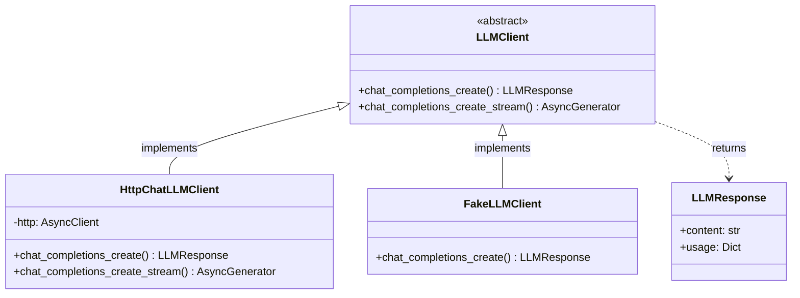
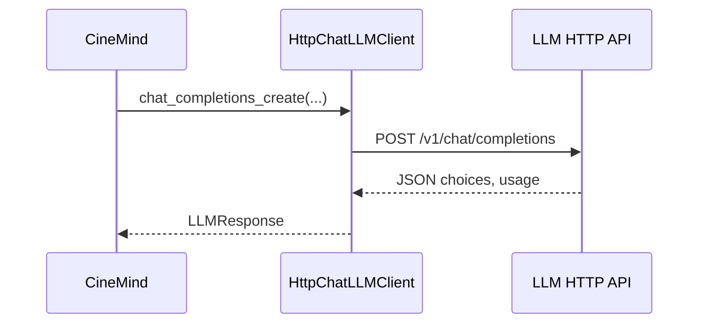
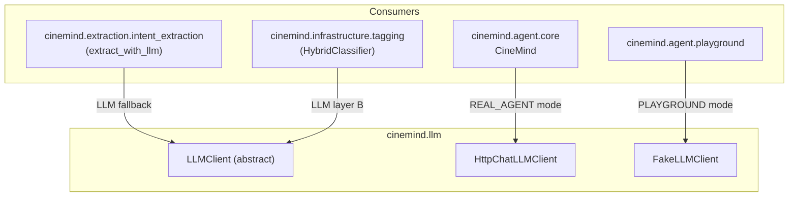
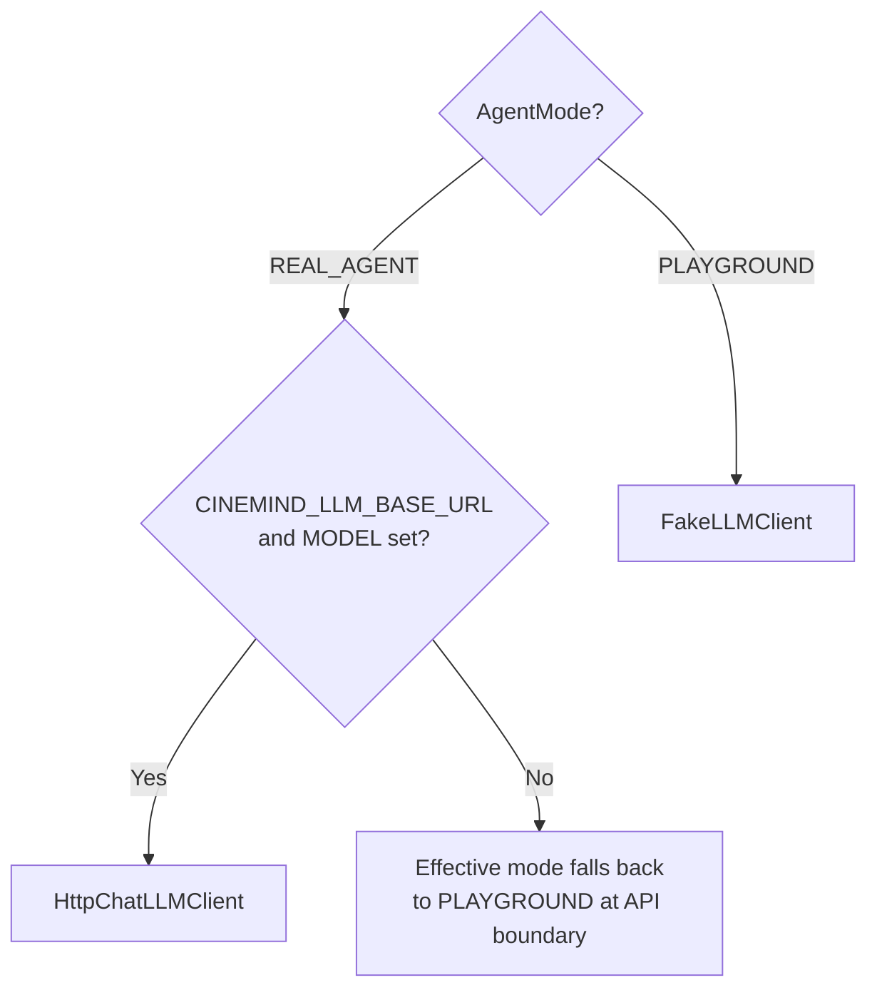

# LLM Client

> **Package:** `src/cinemind/llm/`
> **Purpose:** Abstraction layer over LLM backends — defines a common interface, an OpenAI-compatible HTTP implementation (`httpx`), and a fake client for testing and playground mode.

<details>
<summary><strong>Quick AI Context</strong> — Jump to what you need</summary>

| I need to understand... | Jump to |
|------------------------|---------|
| Client class hierarchy | [Architecture](#architecture) |
| HTTP implementation | [HttpChatLLMClient](#httpchatllmclient) |
| Fake client for tests | [FakeLLMClient](#fakellmclient) |
| Response data structure | [LLMResponse](#llmresponse) |
| Who uses which client | [Integration Points](#integration-points) |
| How client is selected | [Selection Logic](#selection-logic) |
| Which tests to run | [Test Coverage](#test-coverage) |
| What else breaks if I change this | [Change Impact Guide](#change-impact-guide) |

**Example changes and where to look:**
- "Switch LLM server / model" → [HttpChatLLMClient](#httpchatllmclient) + `CINEMIND_LLM_*` env vars
- "Change FakeLLM responses" → [FakeLLMClient](#fakellmclient)
- "Add streaming support" → `chat_completions_create_stream` on `LLMClient`

</details>

---

## Module Map

| Module | Role | Lines |
|--------|------|-------|
| `client.py` | `LLMClient` abstract base, `HttpChatLLMClient`, `FakeLLMClient` | ~600 |

---

## Architecture



---

## Client Implementations

### HttpChatLLMClient

Production client: `POST /v1/chat/completions` (and SSE streaming) against any OpenAI-compatible server (vLLM, llama.cpp server, LM Studio, TGI, etc.).



| Feature | Detail |
|---------|--------|
| Model | `CINEMIND_LLM_MODEL` |
| Base URL | `CINEMIND_LLM_BASE_URL` (`/v1` appended if omitted) |
| Auth | Optional `CINEMIND_LLM_API_KEY` (`Bearer`) |
| Streaming | `chat_completions_create_stream` (SSE `data:` lines) |
| Token tracking | `LLMResponse.usage` when the server returns it |

### FakeLLMClient

Deterministic client for testing and playground mode — returns canned responses without any API calls.

| Feature | Detail |
|---------|--------|
| Cost | Zero (no API calls) |
| Latency | Near-zero |
| Determinism | Same input always produces same output |
| Use case | Playground mode, unit tests, CI |

---

## Key Types

### LLMResponse

| Field | Type | Description |
|-------|------|-------------|
| `content` | `str` | The generated text |
| `usage` | `Dict` | Token usage: `prompt_tokens`, `completion_tokens`, `total_tokens` (when present) |
| `metadata` | `Dict` | Optional extras (e.g. batch enrichment) |

---

## Integration Points



---

## Selection Logic



At `CineMind` construction: either inject `llm_client` (tests/playground) or build `HttpChatLLMClient` with env config (real agent).

---

## Dependencies

### External Packages

| Package | Used In | Purpose |
|---------|---------|---------|
| `httpx` | `HttpChatLLMClient` | Async HTTP + SSE streaming |
| `abc` | `LLMClient` | Abstract base class |
| `dataclasses` | `LLMResponse` | Response data structure |

### Environment Variables

| Variable | Default | Used By |
|----------|---------|---------|
| `CINEMIND_LLM_BASE_URL` | — | Inference server root |
| `CINEMIND_LLM_MODEL` | — | Chat model id |
| `CINEMIND_LLM_API_KEY` | — | Optional bearer token |
| `CINEMIND_LLM_TIMEOUT_SECONDS` | `120` | Request timeout |
| `CINEMIND_LLM_SUPPORTS_JSON_MODE` | `false` | Optional `response_format` for classifiers |

---

## Design Patterns & Practices

1. **Strategy Pattern** — `LLMClient` with `HttpChatLLMClient` vs `FakeLLMClient`
2. **Dependency Injection** — `CineMind(..., llm_client=...)` for tests
3. **OpenAI-compatible wire** — no vendor Python SDK required
4. **Zero-Cost Testing** — `FakeLLMClient` for CI

---

## Test Coverage

```bash
python -m pytest tests/unit/llm/test_http_chat_llm_client.py -v
python -m pytest tests/integration/test_agent_offline_e2e.py -v

# Smoke test with real server (requires CINEMIND_LLM_* env)
python -m pytest tests/smoke/test_real_workflow_smoke.py -v
```

| Test File | What It Covers |
|-----------|---------------|
| `tests/unit/llm/test_http_chat_llm_client.py` | JSON parsing and HTTP errors |
| `tests/integration/test_agent_offline_e2e.py` | Full pipeline with `FakeLLMClient` |
| `tests/smoke/test_real_workflow_smoke.py` | Real HTTP stack (requires env) |

---

## Change Impact Guide

| If you change... | Also check... |
|-----------------|---------------|
| `LLMClient` interface | `HttpChatLLMClient`, `FakeLLMClient`, intent extraction, tagging |
| `LLMResponse` fields | `CineMind` response processing, observability cost calculation |
| Default timeout / URL normalization | `config/__init__.py`, deployment docs |
| `FakeLLMClient` responses | Playground and integration test assertions |
| Streaming | `CineMind.stream_response`, any `/stream` API routes |
