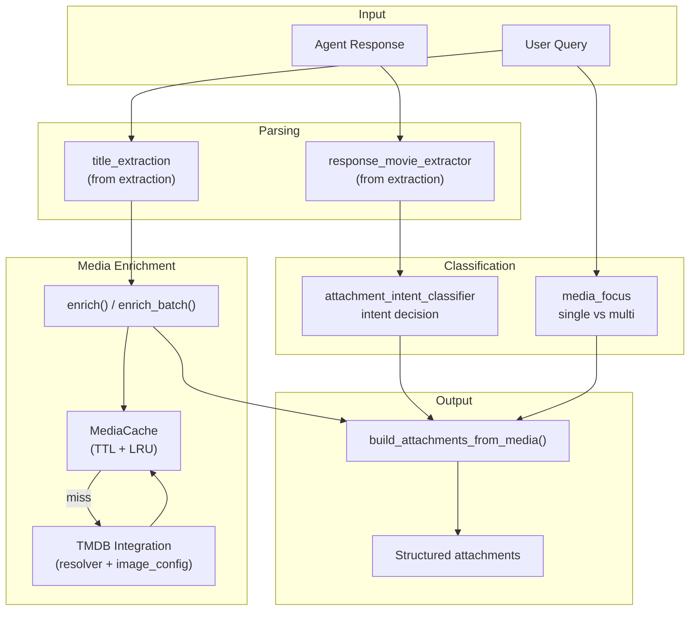
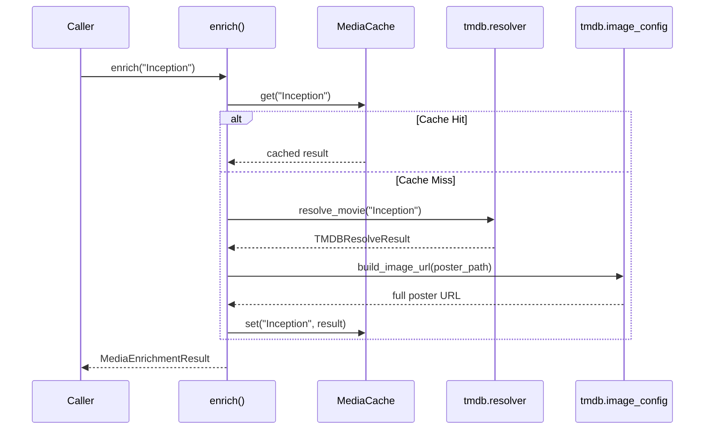
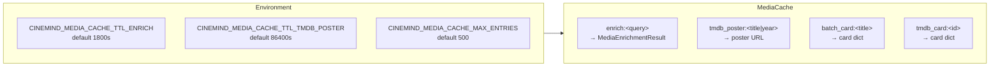
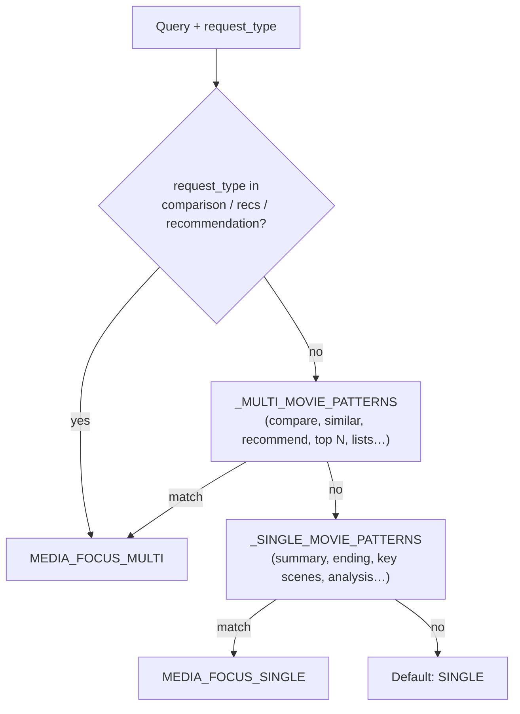
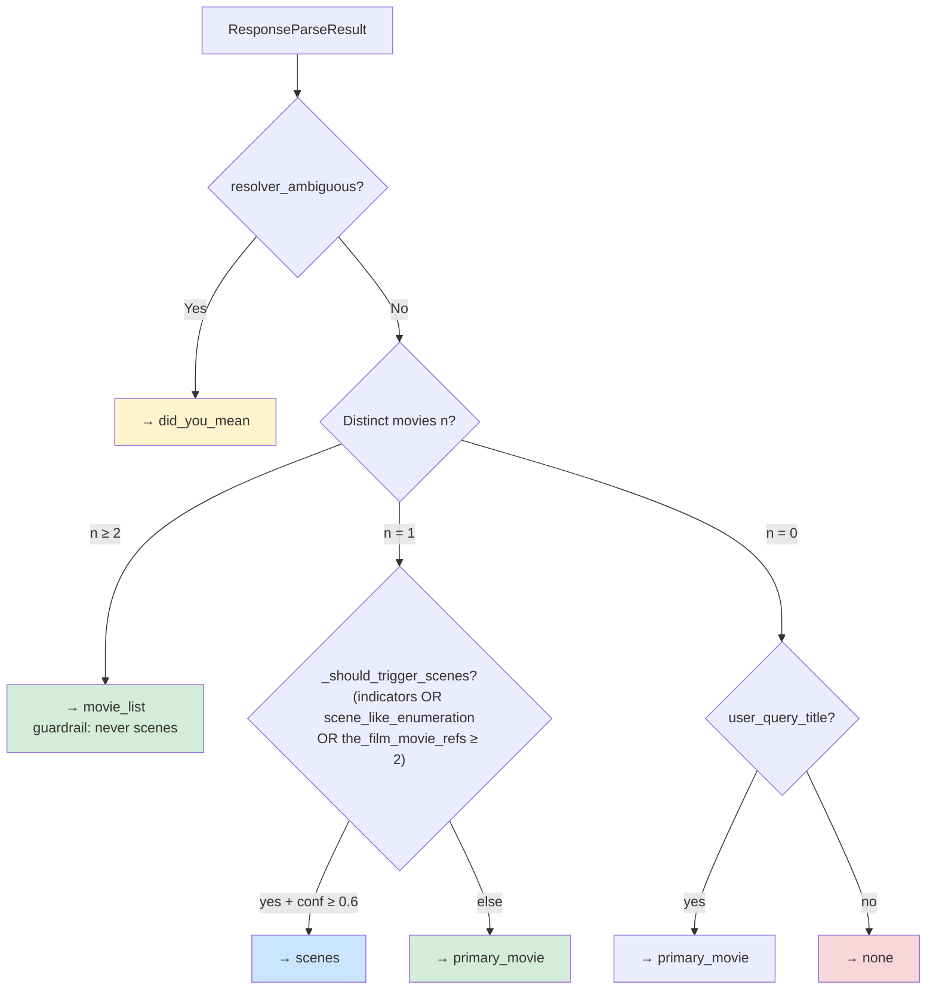
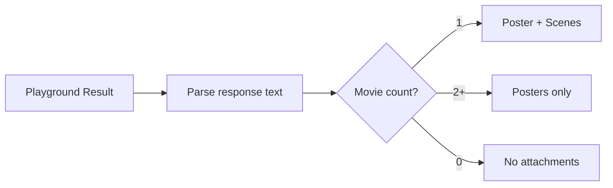
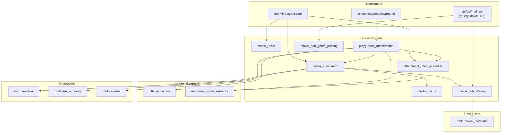

# Media Enrichment

> **Package:** `src/cinemind/media/`
> **Purpose:** Enriches agent responses with visual media — poster images, scene backdrops, and structured attachment sections — by resolving movie titles through TMDB and applying intent-based attachment logic.

<details>
<summary><strong>Quick AI Context</strong> — Jump to what you need</summary>

| I need to understand... | Jump to |
|------------------------|---------|
| Full enrichment flow | [Enrichment Pipeline](#enrichment-pipeline) |
| How titles become posters | [Media Enrichment](#media-enrichment-media_enrichmentpy) |
| How the media cache works | [Media Cache](#media-cache-media_cachepy) |
| Single vs multi movie logic | [Media Focus](#media-focus-media_focuspy) |
| What attachment sections are produced | [Attachment Intent Classifier](#attachment-intent-classifier-attachment_intent_classifierpy) |
| Playground-specific behavior | [Playground Attachments](#playground-attachments-playground_attachmentspy) |
| Which tests to run | [Test Coverage](#test-coverage) |
| What else breaks if I change this | [Change Impact Guide](#change-impact-guide) |

**Example changes and where to look:**
- "Change attachment logic" → [Attachment Intent Classifier](#attachment-intent-classifier-attachment_intent_classifierpy)
- "Adjust cache TTL" → [Media Cache](#media-cache-media_cachepy)
- "Change poster behavior for single movie" → [Media Focus](#media-focus-media_focuspy)

</details>

---

## Module Map

| Module | Role | Lines (approx.) |
|--------|------|-----------------|
| `__init__.py` | Re-exports: `enrich`, `enrich_batch`, `attach_media_to_result`, `build_attachments_from_media`, `MediaEnrichmentResult`, cache/focus helpers, `classify_attachment_intent`, `apply_playground_attachment_behavior` (**does not** re-export `build_similar_movie_clusters` or hub parsers — import submodules) | ~10 |
| `media_enrichment.py` | TMDB-only enrichment, `attach_media_to_result`, `build_attachments_from_media`, **`build_similar_movie_clusters`** | ~820 |
| `media_cache.py` | TTL + LRU: four cache namespaces — enrich results, TMDB poster URLs, batch cards (hot-path dedupe), tmdb-id cards (cross-title dedup) | ~200 |
| `media_focus.py` | Single-movie vs multi-movie from `request_type` + query regexes | ~85 |
| `attachment_intent_classifier.py` | Deterministic attachment intent + scene guardrails | ~215 |
| `playground_attachments.py` | Playground-only attachment pipeline + scenes provider | ~270 |
| `movie_hub_genre_parsing.py` | `parse_movie_hub_genre_buckets` for hub genre buckets | ~270 |
| `movie_hub_filtering.py` | `filter_movie_hub_clusters_by_question` (TMDB-backed filters) | ~265 |
| `project_enrichment.py` | TMDB metadata enrichment for project assets | — |
| `project_context.py` | Aggregate context from project movie collection | — |
| `project_discovery.py` | Build discovery clusters from aggregate project context | — |

---

## Enrichment Pipeline



---

## Media Enrichment (`media_enrichment.py`)

The core enrichment module — resolves movie titles to TMDB data and builds attachment structures.

### Key functions

| Function | Purpose |
|----------|---------|
| `enrich(user_query, fallback_title=..., fallback_from_result=..., *, cache=..., use_enrich_cache=...)` | TMDB-only resolve via `get_search_phrases(user_query)` (phrase resolutions run **in parallel**, up to 2 workers); builds `media_strip` + optional `did_you_mean` candidates; uses **`MediaCache`** for enrich-key + poster URLs; **`resolve_movie`** results are also cached in-process (see TMDB resolve cache); never raises |
| `enrich_batch(titles, *, max_concurrent=2, max_titles=8, cache=...)` | Thread pool enrichment; dedupes by normalised title; checks `batch_card:` cache before the thread pool (cache-hits skip the resolver entirely); stores each resolved card in `batch_card:` after resolution; without token returns minimal `{movie_title, page_url:"#"}` cards; logs at **debug** (`TMDB enrich_batch ... cache_hits= ... total_ms=`) |
| `build_attachments_from_media(result)` | Builds `attachments.sections` from `media_strip` / `media_candidates` / `media_gallery_label`; may set **`relatedMovies`** from the non-primary section (only when not already present on the item) |
| `attach_media_to_result(user_query, result, *, titles=..., gallery_label=..., cache=...)` | Priority: explicit `titles` → `recommended_movies` → `extract_titles_for_enrichment(response)` → `enrich(user_query)` |
| `build_similar_movie_clusters(...)` | See [Movie Hub clusters](#movie-hub-clusters-build_similar_movie_clusters) |

### `MediaEnrichmentResult`

| Field | Purpose |
|-------|---------|
| `media_strip` | Hero card: `movie_title`, `page_url`, optional `year`, `tmdb_id`, `primary_image_url` |
| `media_candidates` | Gallery for ambiguous TMDB resolution (`did_you_mean`) |
| `poster_debug` | `tmdb_attempted`, `poster_provider` (`tmdb` or null) |
| `wiki_poster_policy` | Reserved / legacy |

### Enrichment Flow



### Graceful Degradation & Placeholders

Media enrichment is designed to be robust under missing config and TMDB/network failures:

- TMDB access uses a best-effort token lookup (production via `config.is_tmdb_enabled` / `config.get_tmdb_access_token`; tests may monkeypatch the module).
- If TMDB is unavailable (no token) `enrich_batch()` returns text-only cards like `{"movie_title": "<title>", "page_url": "#"}`.
- If TMDB is unavailable `enrich()` returns either:
  - a minimal placeholder `media_strip` when a reliable fallback title exists, or
  - `media_strip={}` when we cannot infer a safe title.
- When resolving individual titles, enrichment extracts an optional trailing `(YYYY)` year from the title and passes it into the resolver; if TMDB returns `not_found`, enrichment still returns a placeholder `movie_title` (and `year` when extracted).

### Grounded Movie Identity (internal contract)

Media enrichment works with an internal **GroundedMovieIdentity** concept that describes the movie(s) we believe the agent is actually talking about. This is not (yet) a public schema, but it shapes how `media_strip` and attachments are produced.

- **Fields (conceptual):**
  - `resolved_title`: canonical title string (e.g., `Inception`), after normalization.
  - `year`: optional release year (e.g., `2010`).
  - `tmdb_id`: TMDB movie ID when available.
  - `poster_url`: primary poster/backdrop URL, when enrichment succeeds.
  - `source`: resolution source (`tmdb_resolver`, `kaggle_imdb`, etc.).
  - `confidence`: numeric/categorical confidence about the match.

- **Alignment policy:**
  - `media_strip.movie_title` is derived from a grounded title (from extraction/fallback), not from the raw user query string.
  - `attachments.sections[type=primary_movie].items[0].title` **must** be a human-readable label built from `resolved_title` (+ optional `(Year)`), not the raw query.
  - When no GroundedMovieIdentity satisfies the threshold:
    - Do **not** emit a `primary_movie` section.
    - Prefer emitting no `media_strip` at all. If a safe extracted fallback title exists, enrichment may emit a minimal text-only placeholder (`movie_title` + `page_url="#"`) so the UI can render without images.

This contract is enforced in `media_enrichment.py` and consumed by the frontend via `media_strip` and `attachments.sections` after normalization.

---

## Related Movies Surface (`result["relatedMovies"]`)

Some pipeline stages also expose a lightweight `relatedMovies` list alongside attachments.

- When the agent provides `metadata.similar_movies`, the agent core maps that into:
  - `result["recommended_movies"]` (used by the existing media flow)
  - `result["relatedMovies"]` as `[{ "title": ... }, ...]` (used by the Sub-context Movie Hub and Movie Details surfaces)
- During enrichment, `build_attachments_from_media()` also surfaces `relatedMovies` when the attachment intent is effectively “movie_list”/“did_you_mean”.
  - The hero (“This movie”) is excluded from `relatedMovies`.
  - If `result["relatedMovies"]` was already set earlier in the pipeline, enrichment preserves it rather than overwriting it.
- The frontend treats these local related movies as a fast path to render the hub without waiting for an LLM cluster load.

---

## Movie Hub clusters (`build_similar_movie_clusters`)

`media_enrichment.build_similar_movie_clusters(title, year=None, tmdb_id=None, media_type=None, max_results=18)` builds the cluster contract for the Sub-context Movie Hub and **`GET /api/movies/{id}/similar`**.

### Return contract

- `{"clusters": [ {...}, {...}, {...} ]}` — always **three** clusters: `kind` **`genre`**, **`tone`**, **`cast`** (stable UI contract).
- **`movies` lists today:** the **`genre`** cluster is populated from TMDB **`/movie/{id}/similar`** results (up to **`max_results`**). **`tone`** and **`cast`** clusters are populated using TMDB metadata overlap — placement is mutually exclusive (`elif` ordering): a movie goes into **`cast`** if shared cast members >= 2 (up to a **cap of 6 movies** per cluster), then into **`tone`** if shared keywords >= 2 (up to **6**), otherwise into **`genre`**. Cast takes priority over tone.
- Each movie card includes: `title`, `year`, `primary_image_url`, `page_url`, `tmdbId`, `mediaType`.

### Data behavior

1. No TMDB token / disabled → return three labeled clusters with **empty** `movies`.
2. If **`tmdb_id`** omitted, **`resolve_movie(title, year=...)`** obtains an id; if resolution fails → empty `movies`.
3. Fetches similar movies via **`tmdb_request_json`** (pooled HTTP, same stack as `resolver`); network/API errors → labeled clusters, empty movies.

### Year-aware resolution

Single-title enrichment and batch helpers strip a trailing **`(YYYY)`** before calling `resolve_movie` so years are not double-counted. **`build_similar_movie_clusters`** passes through optional **`year`** when resolving by title.

**Callers:** `src/api/main.py` (similar endpoint + hub filtering), `movie_hub_filtering.filter_movie_hub_clusters_by_question` (“movies like X” path uses `max_results=30` for intersection).

---

## Movie Hub genre parsing (`movie_hub_genre_parsing.py`)

`parse_movie_hub_genre_buckets(response_text, *, expected_genres=6, expected_items_per_genre=5, min_total_items=30, ...)` parses hub-formatted assistant text into buckets for `movieHubClusters`. Production **`POST /query`** hub flow passes **`expected_genres=4`**, **`min_total_items=20`** to match the 4×5 hub contract (see `src/api/main.py`).

- Genre headers accept **`Genre:`**, **`Genres:`**, **`Category:`**, **`Type:`**, **`Tone:`**, **`Theme:`**, **`Cast:`**, **`Crew:`** (see `_GENRE_LINE_RE`).
- Items: numbered lines (`1. Title (Year)`), bullets, and fallbacks that extract `Title (Year)` from structured lines.
- **Never raises.** On low signal, falls back to `extract_titles_for_enrichment`-style extraction or a single default bucket (**“Similar by genre”**).
- **`_strip_leading_list_markers`** removes leaked `1.` / bullet prefixes so titles stay clean in the UI.

---

## Deterministic Movie Hub filtering (`movie_hub_filtering.py`)

`filter_movie_hub_clusters_by_question(clusters, question)` narrows hub **candidate** clusters using TMDB metadata via **`fetch_movie_filter_bundle`** (one **`GET /movie/{id}?append_to_response=credits,keywords`** per movie id per pass — genres, cast, and keywords in a single round trip). Debug logs include **`TMDB hub_filter ... total_ms=`**.

| Constraint | Behavior |
|------------|----------|
| **No recognized constraint** | Returns **`clusters` unchanged** (also when TMDB off / no token). |
| **“movies like &lt;Title&gt;”** (`extract_like_movie_title`) | Builds a target id set via **`build_similar_movie_clusters`** (intersection with current candidates). If intersection would be **empty**, keeps original clusters. |
| **Actor** (`extract_actor_constraint`: “starring …”, “stars …”) | Keeps movies whose cast list matches (normalized substring). |
| **Horror / scary** (`extract_horror_constraint`) | Include or exclude using genre + keyword signals (`_is_horror_movie`). |
| **Tone/mood** (`extract_tone_constraint`) | Include or exclude by tone/mood keywords (lighthearted, dark, funny, romantic, thrilling, emotional, adventurous + negations). |
| **Empty after filter** | Restores **original** `clusters` so the hub never collapses to zero cards. |

---

## Media cache (`media_cache.py`)

Single `TTLCache` instance inside `MediaCache` with **four logical namespaces** (key prefixes) and different TTLs:

| Prefix | Key | Value | TTL |
|--------|-----|-------|-----|
| `enrich:` | normalised query string | `MediaEnrichmentResult` | `CINEMIND_MEDIA_CACHE_TTL_ENRICH` (1800s) |
| `tmdb_poster:` | `title\|year` | poster URL or `__NO_POSTER__` | `CINEMIND_MEDIA_CACHE_TTL_TMDB_POSTER` (86400s) |
| `batch_card:` | normalised title string | UI-ready card dict | `CINEMIND_MEDIA_CACHE_TTL_ENRICH` (1800s) |
| `tmdb_card:` | TMDB movie id (int) | UI-ready card dict | `CINEMIND_MEDIA_CACHE_TTL_ENRICH` (1800s) |

**`batch_card:`** is populated and consumed by `enrich_batch` — hub turn 2 for the same 20 titles becomes a pure cache read, no thread pool, no TMDB calls.

**`tmdb_card:`** is populated and consumed by `_enrich_one_title_tmdb` — a second resolve for the same movie via a different title string (e.g. `"Inception"` vs `"Inception (2010)"`) hits the id-keyed cache and skips the card rebuild.



| Feature | Detail |
|---------|--------|
| Eviction | LRU when max entries exceeded |
| Thread safety | `threading.RLock` on `TTLCache` |
| Scope | In-memory, per process |

### Key functions

| Function | Purpose |
|----------|---------|
| `get_default_media_cache()` | Singleton `MediaCache` |
| `set_default_media_cache(cache)` | Inject mock / test cache |
| `get_batch_card(normalized_title)` / `set_batch_card(...)` | Hot-path batch dedupe by title |
| `get_card_by_tmdb_id(tmdb_id)` / `set_card_by_tmdb_id(...)` | Cross-title dedupe by TMDB id |

### TMDB resolve cache (`integrations/tmdb/resolve_cache.py`)

Separate from **`MediaCache`**: **`resolve_movie()`** memoizes **`TMDBResolveResult`** by normalized title + year + scoring parameters (TTL + LRU, in-process). Reduces repeated **`/search/movie`** calls for the same title within a worker.

| Environment variable | Default | Purpose |
|---------------------|---------|---------|
| `CINEMIND_TMDB_RESOLVE_CACHE_TTL_SECONDS` | `3600` | TTL for cached resolve results |
| `CINEMIND_TMDB_RESOLVE_CACHE_MAX_ENTRIES` | `2000` | LRU cap |

### TMDB metadata bundle cache (`integrations/tmdb/movie_metadata.py`)

Short-lived in-process memo so that sequential `fetch_movie_genre_names` + `fetch_movie_cast_names` calls for the same movie id share one HTTP round trip (`GET /movie/{id}?append_to_response=credits,keywords`). Used by hub filtering during one narrowing pass.

| Environment variable | Default | Purpose |
|---------------------|---------|---------|
| `CINEMIND_TMDB_METADATA_BUNDLE_MEMO_TTL_SECONDS` | `3600` | TTL for memoized genre/cast/keyword bundles |

Stats for all three caches (resolve, metadata bundle, media cache) are exposed at `GET /health/cache`.

**Hub / API tuning** (see also `src/api/main.py`): `HUB_ENRICH_POSTERS_LIMIT` (max titles to enrich with posters per hub response), `HUB_ENRICH_MAX_CONCURRENT` (thread pool size for `enrich_batch`, default 4, capped at 12).

---

## Media focus (`media_focus.py`)

`get_media_focus(user_query, request_type=None)` → **`single_movie`** | **`multi_movie`**. Multi-movie means **posters only** (no scene carousel); single-movie allows **poster + scenes** downstream.



| Constant | Value | Meaning |
|----------|-------|---------|
| `MEDIA_FOCUS_SINGLE` | `"single_movie"` | Poster + scene backdrops (when scenes are attached) |
| `MEDIA_FOCUS_MULTI` | `"multi_movie"` | Posters only (gallery) |

---

## Attachment intent classifier (`attachment_intent_classifier.py`)

Deterministic classifier over **`ResponseParseResult`** from `response_movie_extractor.parse_response`. Optional **`resolver_ambiguous`** and **`user_query_title`** tune disambiguation and zero-movie fallback.

### Decision precedence



Scene triggers combine **`ParseSignals`**: `scene_indicators`, `deep_dive_indicators`, `scene_like_enumeration`, or **`the_film_movie_references >= 2`**. Single-movie **`confidence` must be ≥ 0.6** to select **`scenes`** (avoids weak extractions).

### Attachment Intents

| Intent | Sections Produced | When |
|--------|------------------|------|
| `primary_movie` | Hero poster + basic info | Single movie, no scene signals |
| `scenes` | Hero poster + scene backdrops | Single movie + scene/deep-dive signals |
| `movie_list` | Poster gallery | Multiple movies |
| `did_you_mean` | Disambiguation cards | Ambiguous title resolution |
| `none` | No attachments | No movies detected |

### Key Types

| Type | Fields |
|------|--------|
| `AttachmentIntentResult` | `intent: str`, `titles: List[str]`, `rationale: str` |

---

## Playground Attachments (`playground_attachments.py`)

Simplified attachment logic for playground mode — applies a hard rule based on movie count.



Enabled only from the **playground** path when **`PLAYGROUND_ATTACHMENT_RULE_ENABLED`** is on in **`cinemind.playground`** (see module docstring). Parses **`user_query`** as the mimicked response text for attachment tests.

---

## Cross-Module Dependencies



**Note:** Sub-context **Movie Hub** parsing/filtering (`parse_movie_hub_genre_buckets`, `filter_movie_hub_clusters_by_question`, `enrich_batch` for posters) is wired from **`src/api/main.py`**, not from `cinemind.agent.core`.

### External Packages

| Package | Used In | Purpose |
|---------|---------|---------|
| `threading` | `media_cache.py` | Thread-safe cache |
| `time` | `media_cache.py` | TTL expiry |
| `logging` | All modules | Structured logging |
| `os` | `media_cache.py` | Env var config for cache TTLs / size |

### Environment variables

| Variable | Default | Used by |
|----------|---------|---------|
| `CINEMIND_MEDIA_CACHE_TTL_ENRICH` | `1800` | TTL for cached **`enrich:`** results (seconds) |
| `CINEMIND_MEDIA_CACHE_TTL_TMDB_POSTER` | `86400` | TTL for **`tmdb_poster:`** entries (seconds) |
| `CINEMIND_MEDIA_CACHE_MAX_ENTRIES` | `500` | LRU cap for the shared `TTLCache` |
| `ENABLE_TMDB_SCENES` | `false` | Scene/backdrop providers (`integrations.tmdb.scenes`) |
| `TMDB_READ_ACCESS_TOKEN` | — | TMDB API (enrichment, similar movies, metadata) |

Hub poster batch limits in the API (`HUB_ENRICH_MAX_CONCURRENT`, `HUB_ENRICH_POSTERS_LIMIT`) are documented in **`docs/features/api/API_SERVER.md`** — they are not read inside `media_enrichment` by default.

---

## Design Patterns & Practices

1. **Cache-Through** — enrichment always checks cache before hitting TMDB API
2. **Deterministic Classification** — attachment intent uses no LLM; fully testable with known inputs
3. **Precedence Chain** — classifier follows strict priority order (ambiguity > multi > single > none)
4. **Graceful Degradation** — `enrich_batch()` continues if individual enrichments fail
5. **Singleton Cache** — `get_default_media_cache()` ensures one cache per process; tests swap via `set_default_media_cache()`
6. **Separation of Concerns** — enrichment (TMDB calls) and classification (intent logic) are separate modules
7. **Year-Aware Resolution** — if a title string ends with `"(YYYY)"`, enrichment extracts that year and passes it into the TMDB resolver to improve determinism (helps avoid “same poster repeated” when distinct years are provided).

---

## Test Coverage

### Tests to Run When Changing This Package

```bash
# All media unit tests
python -m pytest tests/unit/media/ -v

# Individual module tests
python -m pytest tests/unit/media/test_attachment_intent_classifier.py -v
python -m pytest tests/unit/media/test_media_cache.py -v
python -m pytest tests/unit/media/test_media_enrichment.py -v
python -m pytest tests/unit/media/test_media_enrichment_dedup.py -v
python -m pytest tests/unit/media/test_media_focus.py -v
python -m pytest tests/unit/media/test_movie_hub_filtering.py -v
python -m pytest tests/unit/media/test_movie_hub_genre_parsing.py -v
python -m pytest tests/unit/media/test_movie_hub_deduping.py -v
python -m pytest tests/unit/media/test_media_alignment.py -v
python -m pytest tests/unit/media/test_playground_attachments.py -v
python -m pytest tests/unit/media/test_playground_attachments_invariants.py -v
python -m pytest tests/unit/media/test_scenes_provider.py -v
```

| Test File | What It Covers |
|-----------|---------------|
| `test_attachment_intent_classifier.py` | `classify_attachment_intent`, scenes guardrails, query fallback |
| `test_media_cache.py` | `MediaCache` / `TTLCache`, dual TTL behavior |
| `test_media_enrichment.py` | `enrich`, `enrich_batch`, `attach_media_to_result`, `build_similar_movie_clusters` |
| `test_media_enrichment_dedup.py` | Hero vs `did_you_mean` deduplication |
| `test_media_focus.py` | `get_media_focus` patterns |
| `test_movie_hub_filtering.py` | `filter_movie_hub_clusters_by_question` |
| `test_movie_hub_genre_parsing.py` | `parse_movie_hub_genre_buckets` |
| `test_movie_hub_deduping.py` | Hub title dedupe invariants |
| `test_media_alignment.py` | Similar-movies / non-numeric id alignment with API |
| `test_playground_attachments.py` | Playground attachment rules |
| `test_playground_attachments_invariants.py` | Hero / did_you_mean invariants |
| `test_scenes_provider.py` | TMDB scenes provider plumbing |

---

## Change Impact Guide

| If you change... | Also check... |
|-----------------|---------------|
| `MediaEnrichmentResult` / `build_attachments_from_media` | `relatedMovies`, API `MovieResponse`, web `messages.js` / `posters.js` |
| `build_similar_movie_clusters` | `src/api/main.py` similar endpoint, `movie_hub_filtering` |
| Cache env vars (`CINEMIND_MEDIA_CACHE_*`) | Hot-path latency, test doubles via `set_default_media_cache` |
| Attachment intent / scenes thresholds | `test_attachment_intent_classifier.py`, `response_movie_extractor.ParseSignals` |
| `media_focus` regexes | Scene carousel eligibility vs list-like queries |
| Hub parsers / filters | `tests/unit/media/test_movie_hub_*.py`, `src/api/main.py` `/query` hub path |
| TMDB integration | `integrations/tmdb/` (**EXTERNAL_INTEGRATIONS.md**), `movie_metadata` for hub filtering |
