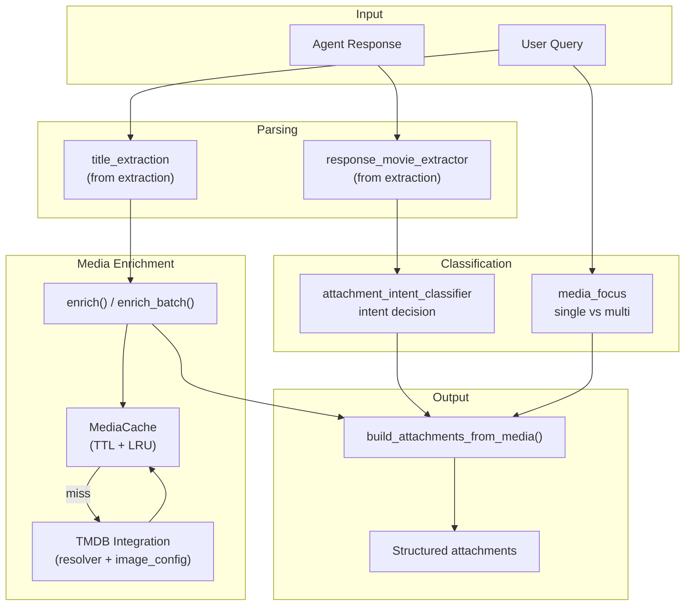
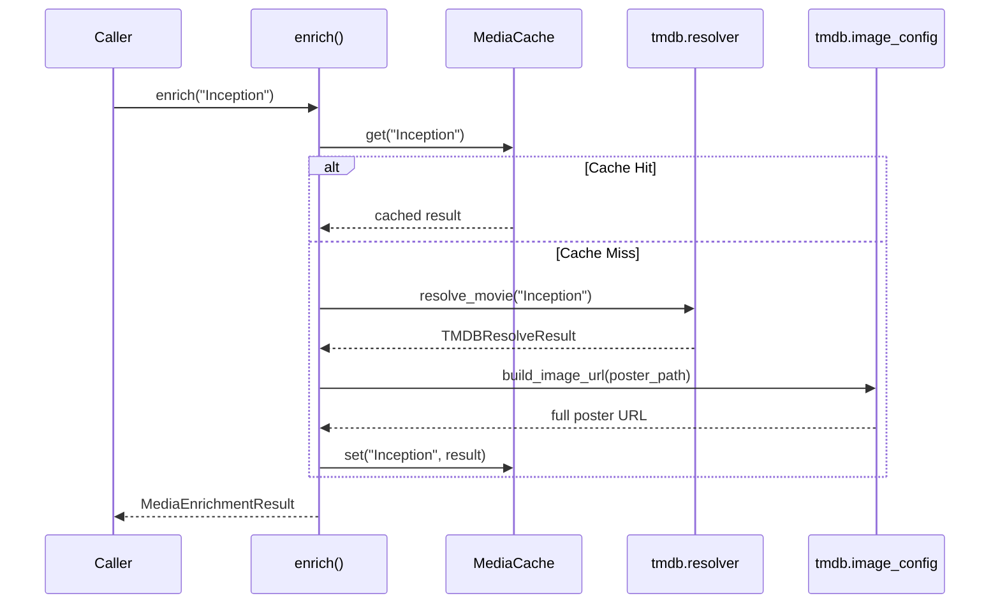
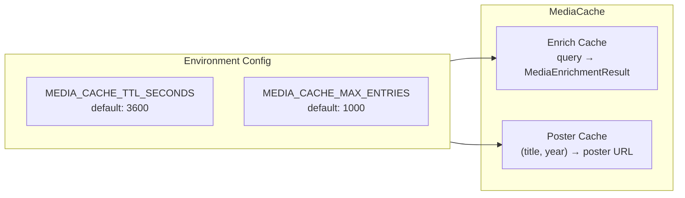
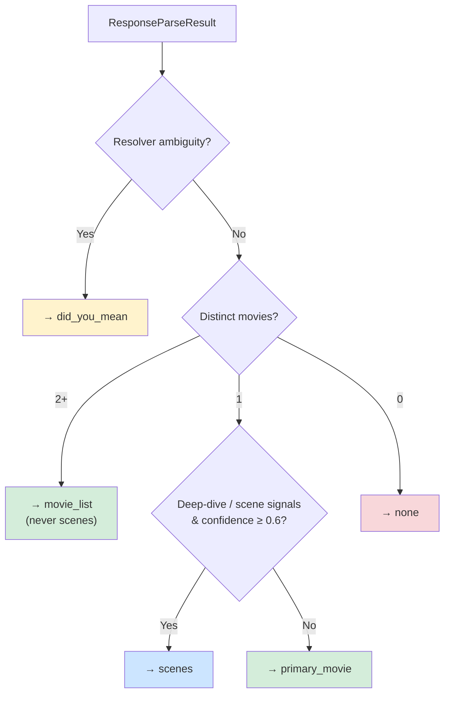
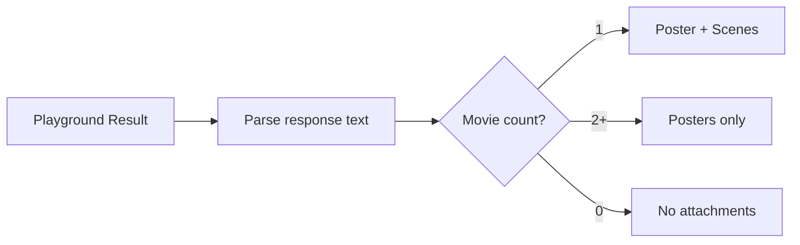
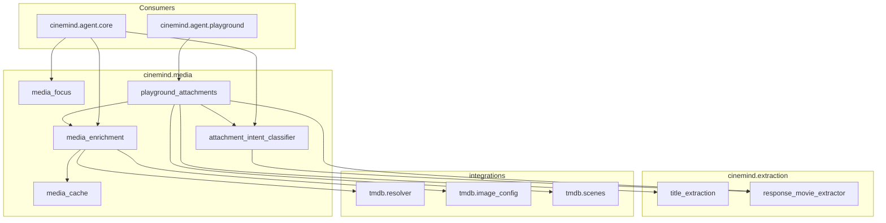

# Media Enrichment

> **Package:** `src/cinemind/media/`
> **Purpose:** Enriches agent responses with visual media — poster images, scene backdrops, and structured attachment sections — by resolving movie titles through TMDB and applying intent-based attachment logic.

<details>
<summary><strong>Quick AI Context</strong> — Jump to what you need</summary>

| I need to understand... | Jump to |
|------------------------|---------|
| Full enrichment flow | [Enrichment Pipeline](#enrichment-pipeline) |
| How titles become posters | [Media Enrichment](#media-enrichment-media_enrichmentpy) |
| How the media cache works | [Media Cache](#media-cache-media_cachepy) |
| Single vs multi movie logic | [Media Focus](#media-focus-media_focuspy) |
| What attachment sections are produced | [Attachment Intent Classifier](#attachment-intent-classifier-attachment_intent_classifierpy) |
| Playground-specific behavior | [Playground Attachments](#playground-attachments-playground_attachmentspy) |
| Which tests to run | [Test Coverage](#test-coverage) |
| What else breaks if I change this | [Change Impact Guide](#change-impact-guide) |

**Example changes and where to look:**
- "Change attachment logic" → [Attachment Intent Classifier](#attachment-intent-classifier-attachment_intent_classifierpy)
- "Adjust cache TTL" → [Media Cache](#media-cache-media_cachepy)
- "Change poster behavior for single movie" → [Media Focus](#media-focus-media_focuspy)

</details>

---

## Module Map

| Module | Role | Lines |
|--------|------|-------|
| `media_enrichment.py` | TMDB enrichment: resolve, poster, attach | ~300 |
| `media_cache.py` | In-memory TTL cache for enrichment results | ~200 |
| `media_focus.py` | Single-movie vs multi-movie intent routing | ~80 |
| `attachment_intent_classifier.py` | Deterministic attachment intent classification | ~200 |
| `playground_attachments.py` | Playground-specific attachment rules | ~150 |

---

## Enrichment Pipeline



---

## Media Enrichment (`media_enrichment.py`)

The core enrichment module — resolves movie titles to TMDB data and builds attachment structures.

### Key Functions

| Function | Purpose |
|----------|---------|
| `enrich(query)` | Single-movie enrichment: title → TMDB resolve → poster URL |
| `enrich_batch(queries)` | Batch enrichment with throttling and graceful degradation |
| `build_attachments_from_media(media_results, intent)` | Assembles attachment sections from enrichment results |
| `attach_media_to_result(result, query)` | End-to-end: enrich + classify intent + build attachments |

### Enrichment Flow



---

## Media Cache (`media_cache.py`)

Thread-safe, in-memory TTL cache with LRU eviction for two data types:



### TTLCache Implementation

| Feature | Detail |
|---------|--------|
| Eviction | LRU when max entries exceeded |
| Expiry | TTL-based (configurable per env var) |
| Thread Safety | Thread-safe via locks |
| Scope | In-memory, per-process (not shared across workers) |

### Key Functions

| Function | Purpose |
|----------|---------|
| `get_default_media_cache()` | Returns the singleton `MediaCache` |
| `set_default_media_cache(cache)` | Replace the default (for testing) |

---

## Media Focus (`media_focus.py`)

Determines whether the response should focus on a single movie (poster + scenes) or multiple movies (posters only).

```mermaid
flowchart TD
    QUERY["Query + request_type"] --> CHECK{"Request type?"}
    CHECK -->|scene_info, trivia| SINGLE["MEDIA_FOCUS_SINGLE"]
    CHECK -->|recommendation, comparison| MULTI["MEDIA_FOCUS_MULTI"]
    CHECK -->|other| PATTERN{"Query pattern analysis"}
    PATTERN -->|"movies like", "top 10"| MULTI
    PATTERN -->|specific title focus| SINGLE
```

| Constant | Value | Meaning |
|----------|-------|---------|
| `MEDIA_FOCUS_SINGLE` | `"single_movie"` | Poster + scene backdrops |
| `MEDIA_FOCUS_MULTI` | `"multi_movie"` | Posters only (gallery) |

---

## Attachment Intent Classifier (`attachment_intent_classifier.py`)

Deterministic (no AI) classifier that decides what attachment sections to include based on parsed response content.

### Decision Precedence



### Attachment Intents

| Intent | Sections Produced | When |
|--------|------------------|------|
| `primary_movie` | Hero poster + basic info | Single movie, no scene signals |
| `scenes` | Hero poster + scene backdrops | Single movie + scene/deep-dive signals |
| `movie_list` | Poster gallery | Multiple movies |
| `did_you_mean` | Disambiguation cards | Ambiguous title resolution |
| `none` | No attachments | No movies detected |

### Key Types

| Type | Fields |
|------|--------|
| `AttachmentIntentResult` | `intent: str`, `titles: List[str]`, `rationale: str` |

---

## Playground Attachments (`playground_attachments.py`)

Simplified attachment logic for playground mode — applies a hard rule based on movie count.



Controlled by `PLAYGROUND_ATTACHMENT_RULE_ENABLED` flag.

---

## Cross-Module Dependencies



### External Packages

| Package | Used In | Purpose |
|---------|---------|---------|
| `threading` | `media_cache.py` | Thread-safe cache |
| `time` | `media_cache.py` | TTL expiry |
| `logging` | All modules | Structured logging |
| `os` | `media_cache.py` | Env var config |

### Environment Variables

| Variable | Default | Used By |
|----------|---------|---------|
| `MEDIA_CACHE_TTL_SECONDS` | `3600` | `media_cache.py` |
| `MEDIA_CACHE_MAX_ENTRIES` | `1000` | `media_cache.py` |
| `TMDB_API_KEY` | — | `media_enrichment.py` (via TMDB integration) |

---

## Design Patterns & Practices

1. **Cache-Through** — enrichment always checks cache before hitting TMDB API
2. **Deterministic Classification** — attachment intent uses no LLM; fully testable with known inputs
3. **Precedence Chain** — classifier follows strict priority order (ambiguity > multi > single > none)
4. **Graceful Degradation** — `enrich_batch()` continues if individual enrichments fail
5. **Singleton Cache** — `get_default_media_cache()` ensures one cache per process; tests swap via `set_default_media_cache()`
6. **Separation of Concerns** — enrichment (TMDB calls) and classification (intent logic) are separate modules

---

## Test Coverage

### Tests to Run When Changing This Package

```bash
# All media unit tests
python -m pytest tests/unit/media/ -v

# Individual module tests
python -m pytest tests/unit/media/test_attachment_intent_classifier.py -v
python -m pytest tests/unit/media/test_media_cache.py -v
python -m pytest tests/unit/media/test_media_enrichment.py -v
python -m pytest tests/unit/media/test_media_enrichment_dedup.py -v
python -m pytest tests/unit/media/test_media_focus.py -v
python -m pytest tests/unit/media/test_playground_attachments.py -v
python -m pytest tests/unit/media/test_playground_attachments_invariants.py -v
python -m pytest tests/unit/media/test_scenes_provider.py -v
```

| Test File | What It Covers |
|-----------|---------------|
| `test_attachment_intent_classifier.py` | `classify_attachment_intent`: precedence rules, intent selection |
| `test_media_cache.py` | `MediaCache`, `TTLCache`: enrich cache, poster TTL, eviction |
| `test_media_enrichment.py` | `enrich`, `enrich_batch`, `attach_media_to_result` |
| `test_media_enrichment_dedup.py` | Hero vs did_you_mean deduplication invariants |
| `test_media_focus.py` | `get_media_focus`: single vs multi-movie intent |
| `test_playground_attachments.py` | Playground rules: single → poster+scenes, multi → posters |
| `test_playground_attachments_invariants.py` | Invariants: hero not in did_you_mean, query-only seed |
| `test_scenes_provider.py` | `SceneItem`, `ScenesProviderEmpty`, `ScenesProviderTMDB` |

---

## Change Impact Guide

| If you change... | Also check... |
|-----------------|---------------|
| `MediaEnrichmentResult` fields | `build_attachments_from_media()`, API response schema |
| Attachment intent values | Frontend `js/modules/messages.js`, `posters.js` |
| Cache TTL / eviction | Performance under load, memory usage |
| Classifier precedence | Integration tests, playground attachment tests |
| `media_focus` rules | Response quality for single vs multi queries |
| TMDB integration | `integrations/tmdb/` (see EXTERNAL_INTEGRATIONS.md) |
