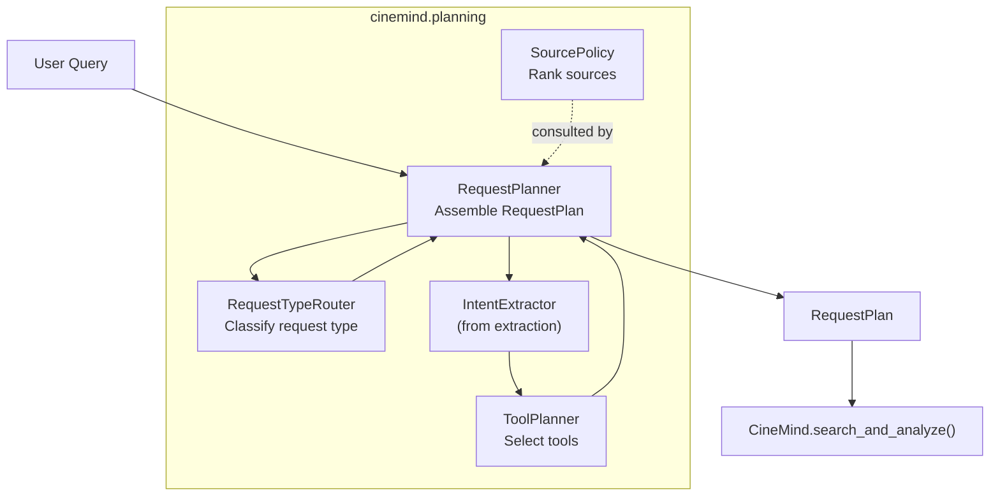
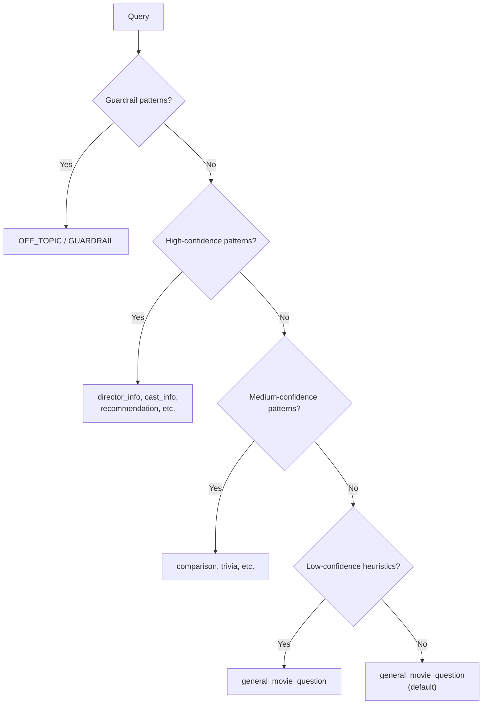
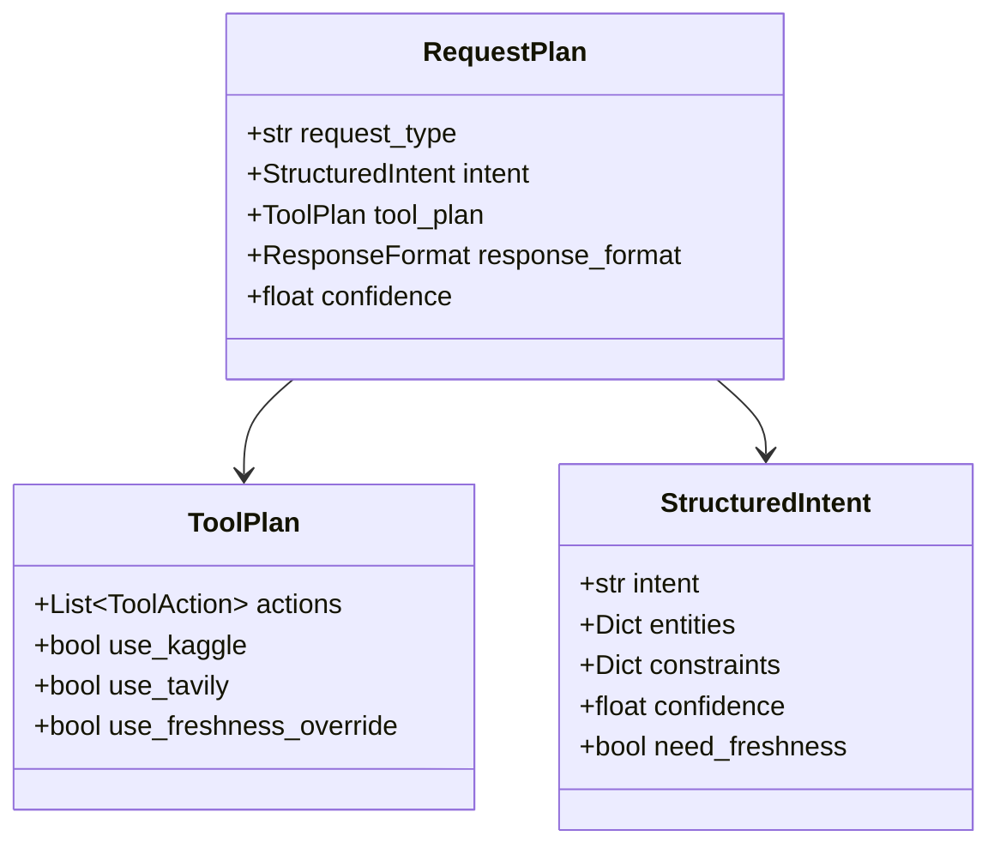
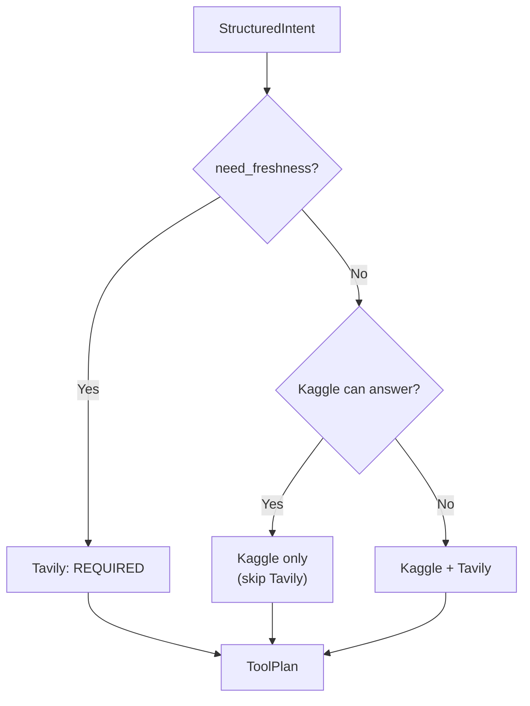
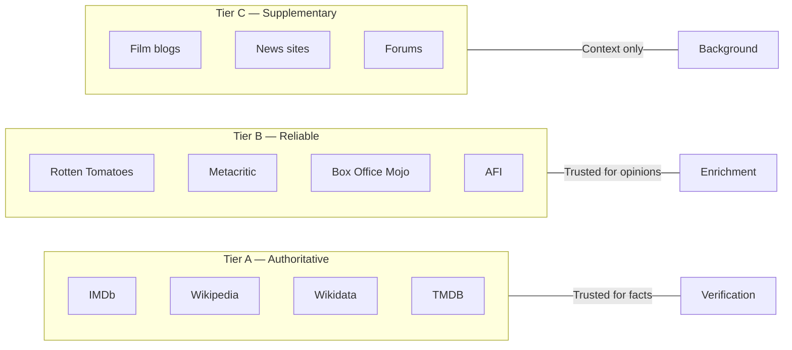
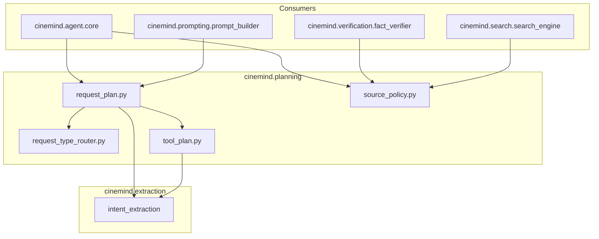

# Request Planning

> **Package:** `src/cinemind/planning/`
> **Purpose:** Decides *how* to answer a query before any search or LLM call — classifying request type, selecting tools, applying source policies, and producing a structured execution plan.

---

## Module Map

| Module | Role | Lines |
|--------|------|-------|
| `request_plan.py` | `RequestPlanner` — orchestrates plan creation | ~324 |
| `request_type_router.py` | Deterministic request classification | ~239 |
| `source_policy.py` | Source tier ranking and domain filtering | ~354 |
| `tool_plan.py` | Tool selection (Kaggle, Tavily, freshness) | ~244 |

---

## Planning Pipeline

---

## Request Type Router (`request_type_router.py`)

Classifies the user query into a known `request_type` using layered deterministic rules — no LLM required.

### Classification Tiers

### Request Types

| Type | Example Query |
|------|--------------|
| `director_info` | "Who directed Inception?" |
| `cast_info` | "Who stars in The Matrix?" |
| `recommendation` | "Movies like Interstellar" |
| `comparison` | "Compare The Godfather and Goodfellas" |
| `award_info` | "Best Picture 2024" |
| `release_info` | "When did Oppenheimer come out?" |
| `scene_info` | "Famous scenes in Pulp Fiction" |
| `streaming_info` | "Where can I watch Dune?" |
| `trivia` | "Fun facts about Jaws" |
| `general_movie_question` | Fallback for anything movie-related |
| `off_topic` | Non-movie queries |

### Key Types

| Type | Fields |
|------|--------|
| `RequestTypeResult` | `request_type`, `confidence`, `matched_pattern` |

---

## Request Planner (`request_plan.py`)

Orchestrates the full planning stage — combines router, intent extractor, and tool planner into a single `RequestPlan`.

### RequestPlan Structure

### ResponseFormat & ToolType Enums

| Enum | Values |
|------|--------|
| `ResponseFormat` | `PARAGRAPH`, `LIST`, `TABLE`, `COMPARISON` |
| `ToolType` | `KAGGLE`, `TAVILY`, `CACHE`, `NONE` |

---

## Tool Planner (`tool_plan.py`)

Decides which search tools to invoke based on intent, freshness requirements, and available data.

### Decision Logic

### Tavily Skip Logic

Tavily (web search) is skipped when:
1. The tool plan explicitly says `use_tavily = False`
2. Kaggle data is highly correlated (confidence ≥ threshold)
3. The query is about historical/static facts (no freshness needed)

### Key Types

| Type | Fields |
|------|--------|
| `ToolPlan` | `actions`, `use_kaggle`, `use_tavily`, `use_freshness_override` |
| `ToolAction` | `tool_type`, `priority`, `reason` |

---

## Source Policy (`source_policy.py`)

Governs which sources are trusted for which types of information. Implements a tiered trust model.

### Source Tiers

### Source Policy Capabilities

| Method | Purpose |
|--------|---------|
| `get_tier(url)` | Classify a URL into Tier A/B/C |
| `rank_sources(results)` | Sort search results by tier |
| `filter_by_tier(results, min_tier)` | Keep only sources above a threshold |
| `get_domain_metadata(url)` | Retrieve source metadata |

### Key Types

| Type | Fields |
|------|--------|
| `SourceTier` | Enum: `A`, `B`, `C`, `UNKNOWN` |
| `SourceMetadata` | `domain`, `tier`, `name`, `specialization` |
| `SourceConstraints` | `min_tier`, `required_domains`, `blocked_domains` |

---

## Cross-Module Dependencies

### External Packages

| Package | Used In | Purpose |
|---------|---------|---------|
| `re` | `request_type_router.py` | Pattern matching |
| `urllib.parse` | `source_policy.py` | Domain extraction from URLs |
| `dataclasses` | All modules | Data structures |
| `enum` | `request_plan.py`, `source_policy.py` | Enums |

---

## Design Patterns & Practices

1. **Separation of Concerns** — routing, tool selection, and source trust are independent modules composed by `RequestPlanner`
2. **Deterministic by Default** — no LLM calls in the planning stage; all decisions are rule-based
3. **Layered Classification** — guardrails → high confidence → medium → low → default prevents misclassification
4. **Policy Object** — `SourcePolicy` encapsulates trust decisions, easily testable in isolation
5. **Plan as Data** — `RequestPlan` is a plain dataclass, serializable and inspectable

---

## Change Impact Guide

| If you change... | Also check... |
|-----------------|---------------|
| Request type taxonomy | `RequestTypeRouter` patterns, `ResponseTemplate` mappings, `HybridClassifier` |
| `RequestPlan` fields | `CineMind.search_and_analyze()`, `PromptBuilder.build()` |
| Source tier domains | `FactVerifier` (relies on Tier A for verification) |
| Tavily skip logic | `SearchEngine`, integration tests with live data |
| `ToolPlan` structure | `CineMind` tool execution logic |
