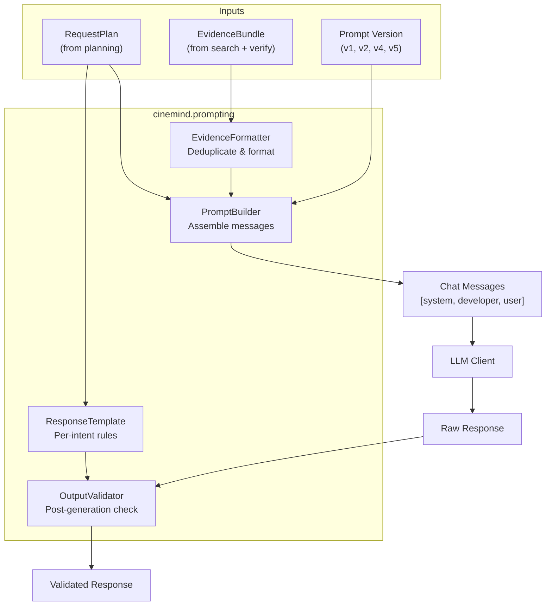
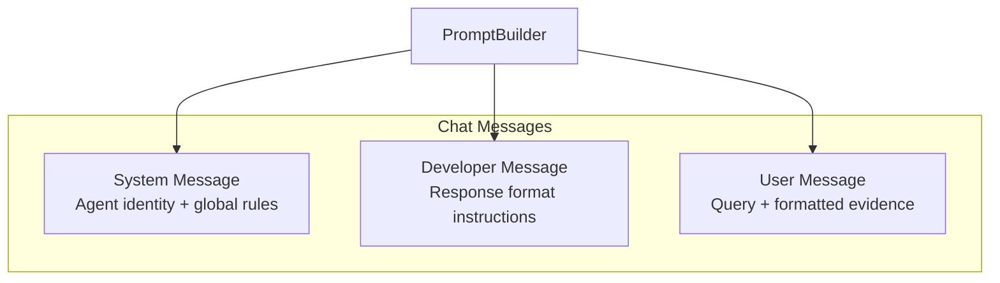
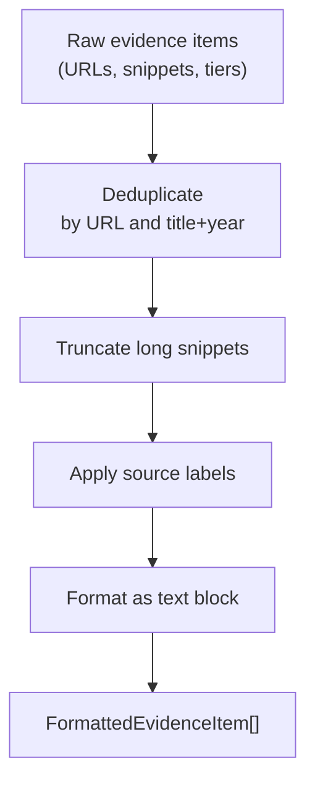
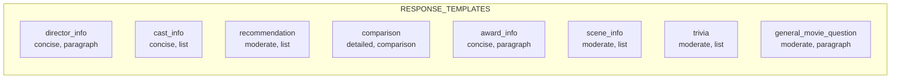
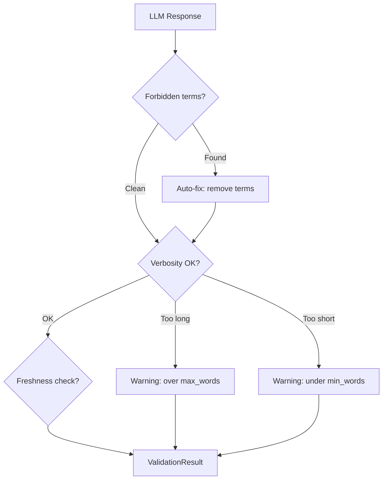
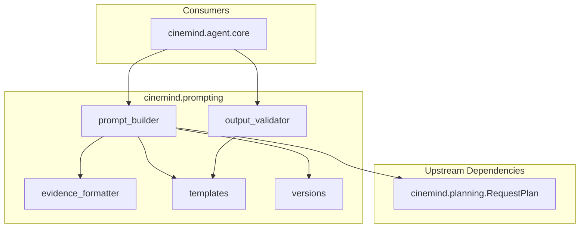

# Prompt Pipeline

> **Package:** `src/cinemind/prompting/`
> **Purpose:** Builds, formats, and validates the messages sent to the LLM — assembling system prompts, evidence, response templates, and post-generation validation into a structured pipeline.

---

## Module Map

| Module | Role | Lines |
|--------|------|-------|
| `prompt_builder.py` | Assemble chat messages from plan + evidence | ~300 |
| `evidence_formatter.py` | Deduplicate and format evidence for the model | ~200 |
| `templates.py` | Per-intent response templates (structure, verbosity) | ~250 |
| `output_validator.py` | Post-generation validation against templates | ~200 |
| `versions.py` | Prompt versioning for A/B testing | ~150 |

---

## Pipeline Overview

---

## Prompt Builder (`prompt_builder.py`)

Assembles the three-message structure expected by the OpenAI Chat API.

### Message Assembly

### System Message Contents

| Section | Source |
|---------|--------|
| Agent name and version | Config constants (`AGENT_NAME`, `AGENT_VERSION`) |
| System prompt | `SYSTEM_PROMPT` constant |
| Global behavior rules | Hardcoded in builder |

### Developer Message Contents

| Section | Source |
|---------|--------|
| Response format | `ResponseTemplate` for the request type |
| Verbosity constraints | Template `max_words`, `min_words` |
| Citation rules | Template `citation_style` |
| Forbidden terms | Template `forbidden_terms` |

### User Message Contents

| Section | Source |
|---------|--------|
| Original query | Passed through |
| Formatted evidence | `EvidenceFormatter` output |
| Source attribution | Evidence items with URLs and tiers |

### Key Types

| Type | Fields |
|------|--------|
| `EvidenceBundle` | `items`, `query`, `request_type`, `verified_facts` |
| `PromptArtifacts` | `messages`, `template`, `version`, `token_estimate` |

---

## Evidence Formatter (`evidence_formatter.py`)

Transforms raw evidence into model-friendly text with deduplication and source labeling.

### Processing Pipeline

### Source Label Mapping

| Source Key | Display Label |
|-----------|--------------|
| `kaggle_imdb` | Structured IMDb dataset |
| `tavily` | Web search result |
| `imdb.com` | IMDb |
| `wikipedia.org` | Wikipedia |
| `rottentomatoes.com` | Rotten Tomatoes |

### Key Types

| Type | Fields |
|------|--------|
| `FormattedEvidenceItem` | `text`, `source_label`, `url`, `tier` |
| `EvidenceFormatResult` | `formatted_items`, `total_chars`, `dedup_count` |

---

## Response Templates (`templates.py`)

Per-request-type templates that control how the LLM structures its response.

### Template Fields

| Field | Type | Description |
|-------|------|-------------|
| `verbosity` | `str` | `"concise"`, `"moderate"`, `"detailed"` |
| `structure` | `str` | Expected format: `"paragraph"`, `"list"`, `"comparison"` |
| `citation_style` | `str` | How to cite sources in the response |
| `forbidden_terms` | `List[str]` | Words/phrases the LLM must avoid |
| `max_words` | `int` | Upper word limit |
| `min_words` | `int` | Lower word limit |

### Template Map

### Key Functions

| Function | Purpose |
|----------|---------|
| `get_template(request_type)` | Look up template by request type |
| `list_all_templates()` | All registered templates |

---

## Output Validator (`output_validator.py`)

Post-generation validation that checks the LLM response against the template rules.

### Validation Checks

### Key Types

| Type | Fields |
|------|--------|
| `ValidationResult` | `valid: bool`, `warnings: List[str]`, `auto_fixes: List[str]`, `original`, `fixed` |

### Auto-Fix Capability

The validator can optionally remove forbidden terms from the response (e.g., removing "As an AI..." phrasing) rather than rejecting the entire response.

---

## Prompt Versioning (`versions.py`)

Supports A/B testing of prompt strategies across versions.

### Version Registry

| Version | Description |
|---------|-------------|
| `v1` | Original prompt |
| `v2_optimized` | Reduced token usage |
| `v4` | Improved citation handling |
| `v5` | Latest iteration |

### Key Functions

| Function | Purpose |
|----------|---------|
| `get_prompt_version(name)` | Retrieve version config |
| `list_versions()` | All available versions |
| `compare_versions(v1, v2)` | Diff two version configs |

---

## Cross-Module Dependencies

### External Packages

| Package | Used In | Purpose |
|---------|---------|---------|
| `re` | `output_validator.py` | Pattern matching for forbidden terms |
| `dataclasses` | All modules | Data structures |
| `logging` | All modules | Structured logging |

---

## Design Patterns & Practices

1. **Builder Pattern** — `PromptBuilder` constructs complex message arrays from simple inputs
2. **Template Method** — response rules are data-driven (templates), not hardcoded in the builder
3. **Validation Pipeline** — output validation is a separate stage, not mixed into generation
4. **Auto-Fix over Reject** — forbidden terms are removed rather than causing a full retry
5. **Version Registry** — prompt versions are named configs, enabling safe rollback and comparison
6. **Evidence Deduplication** — duplicates are removed before they consume LLM context window tokens

---

## Change Impact Guide

| If you change... | Also check... |
|-----------------|---------------|
| System prompt text | Agent behavior, test assertions on response style |
| `ResponseTemplate` for an intent | `OutputValidator` checks, response quality for that request type |
| Evidence format | LLM comprehension, token usage, response accuracy |
| Forbidden terms list | `OutputValidator` auto-fix, response compliance |
| Prompt version config | A/B test infrastructure, version comparison |
| `EvidenceBundle` fields | `PromptBuilder.build()`, `CineMind` evidence assembly |
