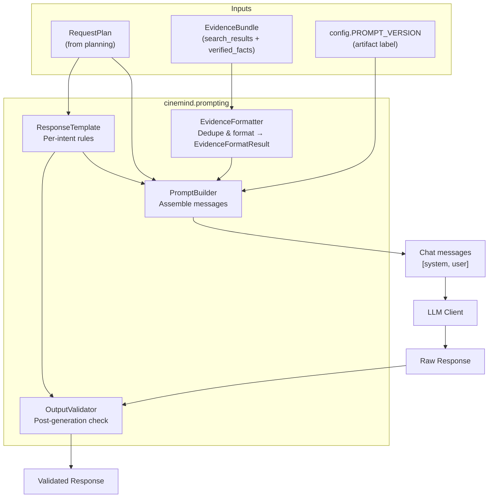
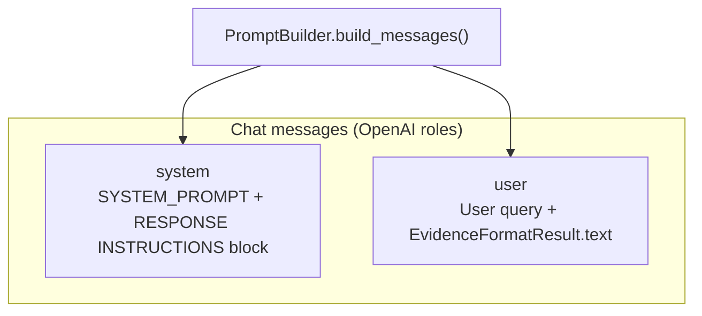
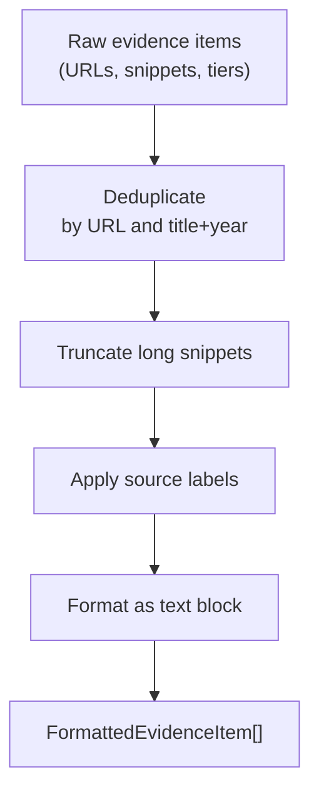
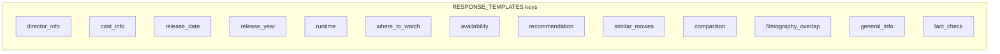
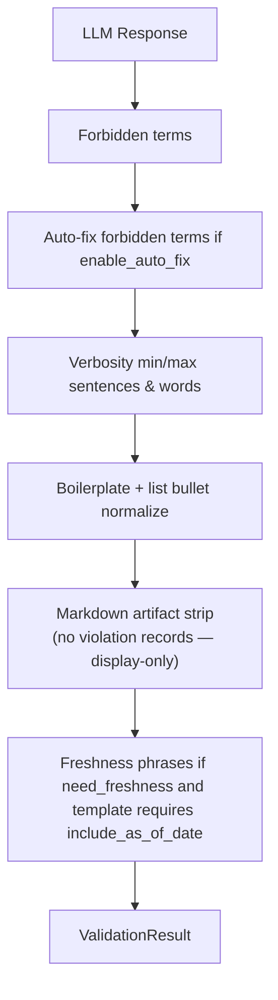
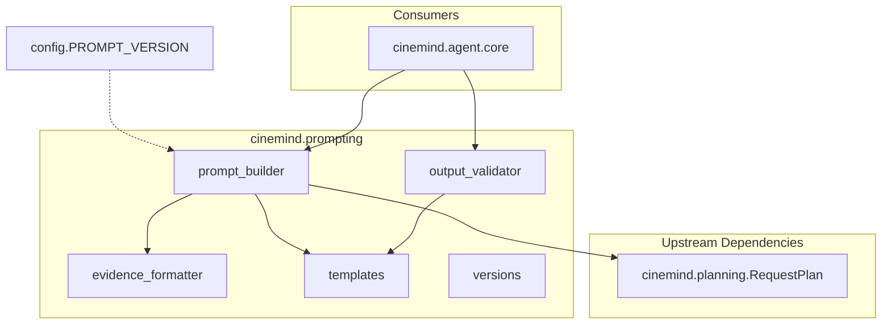

# Prompt Pipeline

> **Package:** `src/cinemind/prompting/`
> **Purpose:** Builds, formats, and validates the messages sent to the LLM — assembling system prompts, evidence, response templates, and post-generation validation into a structured pipeline.

<details>
<summary><strong>Quick AI Context</strong> — Jump to what you need</summary>

| I need to understand... | Jump to |
|------------------------|---------|
| Full prompting flow | [Pipeline Overview](#pipeline-overview) |
| How messages are assembled | [Prompt Builder](#prompt-builder-prompt_builderpy) |
| How evidence is formatted | [Evidence Formatter](#evidence-formatter-evidence_formatterpy) |
| Per-intent response rules | [Response Templates](#response-templates-templatespy) |
| Post-generation validation | [Output Validator](#output-validator-output_validatorpy) |
| Long-form system prompt strings vs `PromptBuilder` | [Prompt versioning](#prompt-versioning-versionspy) |
| Which tests to run | [Test Coverage](#test-coverage) |
| What else breaks if I change this | [Change Impact Guide](#change-impact-guide) |

**Example changes and where to look:**
- "Change system prompt" → [Prompt Builder](#prompt-builder-prompt_builderpy)
- "Add/change a response template" → [Response Templates](#response-templates-templatespy)
- "Fix forbidden terms" → [Output Validator](#output-validator-output_validatorpy)

</details>

---

## Module Map

| Module | Role | Lines (approx.) |
|--------|------|-----------------|
| `__init__.py` | Public exports (`PromptBuilder`, `EvidenceBundle`, `EvidenceFormatter`, templates, `OutputValidator`, `versions`) | ~30 |
| `prompt_builder.py` | Build **`[system, user]`** messages from `RequestPlan` + `EvidenceBundle` (thin `SYSTEM_PROMPT` + dynamic instructions) | ~410 |
| `evidence_formatter.py` | Dedupe, truncate, label evidence; returns `EvidenceFormatResult` | ~420 |
| `templates.py` | `ResponseTemplate` registry + `get_template(request_type, intent)` | ~290 |
| `output_validator.py` | Validate / auto-fix responses vs template; boilerplate + markdown cleanup | ~330 |
| `versions.py` | **`PROMPT_VERSIONS`** long-form system prompts + `list_versions` / `compare_versions` (see [Versioning note](#prompt-versioning-versionspy)) | ~125 |

---

## Pipeline Overview



**Important:** The runtime path uses **two** chat roles. Dynamic “developer-style” instructions (`RESPONSE INSTRUCTIONS`, templates, freshness, constraints, …) are **concatenated into the system message** with `PromptBuilder.SYSTEM_PROMPT` (the Chat API has no separate `developer` role in this build).

---

## Prompt Builder (`prompt_builder.py`)

Assembles a **two-message** chat payload: **system** (identity + all response instructions) and **user** (query + formatted evidence). `EvidenceFormatter` is constructed with `max_snippet_length=400` and `max_items=10` by default.

### Message Assembly



### Combined system message contents

| Section | Source |
|---------|--------|
| Identity + hard rules | `PromptBuilder.SYSTEM_PROMPT` (CineMind domain, no spoilers, no internal tier/tool names in user text, plain-text lists) |
| Opening style line | Builder: short paragraphs; bullets/numbers only for real lists |
| Request metadata | `Request Type: …`; optional `Intent: …` if intent ≠ request_type |
| Multi-intent keyword hints | Deterministic line `Required intent keywords: cast, director, …` when query regexes match (e.g. “who starred” → `cast`, “who directed” → `director`, “runtime” / “how long” → `runtime`) for offline contract tests |
| Template contract | `get_template(request_plan.request_type, request_plan.intent).to_instructions()` — verbosity, `required_elements`, `structure_hints`, citations, **forbidden_terms**, plain-text reminder |
| Format / spoiler / freshness / constraints / source quality | `_get_format_instructions`, `_get_spoiler_policy`, `_get_freshness_instructions`, `_get_constraints_instructions` (from `structured_intent.constraints` when present), `_get_source_instructions` (maps `require_tier_a` / `reject_tier_c` / `allowed_source_tiers` to user-safe wording — **no “Tier A/B/C” in output**) |

### User message contents

| Section | Source |
|---------|--------|
| User query | Passed through as the first block |
| Evidence | `EvidenceFormatter.format(evidence).text` appended when non-empty (not the legacy `EvidenceBundle.format_for_user_message()` path used by `PromptBuilder`) |

### Key Types

| Type | Fields |
|------|--------|
| `EvidenceBundle` | `search_results: List[Dict]`, `verified_facts: Optional[List]`; optional `format_for_user_message()` for ad-hoc formatting ( **`PromptBuilder` uses `EvidenceFormatter` instead** ) |
| `PromptArtifacts` | `prompt_version`, `instruction_template_id` (e.g. `director_info_v1`), `verbosity_budget` (template-based max/min sentences/words), `messages_count`, `system_tokens` / `developer_tokens` / `user_tokens` (reserved; not populated in `build_messages` today) |

---

## Evidence Formatter (`evidence_formatter.py`)

Transforms raw evidence into model-friendly text with deduplication and source labeling.

### Processing Pipeline



### Source label mapping

`_format_source_label` maps technical `source` keys (and Tavily URLs) to user-facing labels — e.g. `kaggle_imdb` → **“Structured IMDb dataset”**, `tavily` → inferred from URL (the string “Tavily” is not shown). See `evidence_formatter.py` for the full map and URL inference.

### Key Types

| Type | Fields |
|------|--------|
| `FormattedEvidenceItem` | `url`, `title`, `source_label`, `year`, `snippet_len`, `index` (1-based) |
| `EvidenceFormatResult` | `text` (full `EVIDENCE:` block + optional `VERIFIED INFORMATION`), `items` (`List[FormattedEvidenceItem]`), `counts` (`before` / `after` dedupe), `max_snippet_len`, `dedupe_removed` |

---

## Response Templates (`templates.py`)

Per-request-type templates that control how the LLM structures its response, including how to break content into paragraphs and lists for frontend rendering.

### Template Fields

| Field | Type | Description |
|-------|------|-------------|
| `template_id` | `str` | Stable id (matches registry key for intent-style templates) |
| `max_sentences` | `Optional[int]` | Upper bound on sentences (soft; enforced in `OutputValidator`) |
| `max_words` | `Optional[int]` | Upper word limit (soft) |
| `min_sentences` | `Optional[int]` | Lower bound on sentences (soft) |
| `required_elements` | `List[str]` | e.g. `answer_first`, `numbered_list`, `bullet_list`, `include_year`, `include_as_of_date` (freshness-aware templates) |
| `forbidden_terms` | `List[str]` | Substrings blocked in user-facing text (validator can auto-fix) |
| `citation_style` | `str` | `natural` \| `minimal` \| `none` |
| `citation_examples` | `List[str]` | Example phrasing for natural citations |
| `structure_hints` | `List[str]` | e.g. `direct_answer`, `list_format`, `comparison_table` |

`ResponseTemplate.to_instructions()` turns these into plain-text lines appended to the system-side **RESPONSE INSTRUCTIONS** block (including a **plain text only** / no-markdown reminder).

### Template registry (`RESPONSE_TEMPLATES`)

Keys registered today (intent-level keys win in `get_template`; see below):



### `get_template(request_type, intent)`

1. If `intent` is non-empty and present in `RESPONSE_TEMPLATES`, use that template.  
2. Else map `request_type` → template key (`info` → `general_info`, `recs` → `recommendation`, `comparison` → `comparison`, `fact-check` → `fact_check`, `release-date` → `release_date`, `spoiler` → `general_info`, …).  
3. Else fall back to `general_info`.

### Key Functions

| Function | Purpose |
|----------|---------|
| `get_template(request_type)` | Look up template by request type |
| `list_all_templates()` | All registered templates |

### Response Structure Expectations

Templates are tuned so that, after generation, the frontend can render assistant answers as **paragraphs and simple lists**:

- Sections are separated with **blank lines** (double newlines), which become paragraphs in the chat bubble.
- Multi-item outputs (recommendations, casts, comparisons) are expressed as:
  - Numbered lists (`1.`, `2.`, `3.`) when order matters or a ranking is implied.
  - Bulleted lists (`- `) when order does not matter.
- Introductory and summary text is kept to **short paragraphs** so users can skim.
- **Plain text only**: templates instruct the model to avoid Markdown emphasis/divider artifacts so `messages.js` can render safely using lightweight paragraph/list parsing.

These conventions align with the web frontend’s assistant rendering contract described in `docs/features/web/WEB_FRONTEND.md`.

---

## Output Validator (`output_validator.py`)

Post-generation validation that checks the LLM response against the template rules and cleans up minor style/structure issues.

### Validation checks

Order of operations in `validate()`:



**Re-prompt (`requires_reprompt`):** `True` if there are **verbosity** violations, **freshness** violations, or **forbidden** violations when `enable_auto_fix` is off. Markdown normalization does **not** add violations and does **not** force reprompt.

### Key Types

| Type | Fields |
|------|--------|
| `ValidationResult` | `is_valid: bool`, `violations: List[str]`, `corrected_text: Optional[str]`, `requires_reprompt: bool` |

### Auto-Fix Capability

The validator can optionally:

- Remove or soften **forbidden terms** (e.g., \"Tier\", \"dataset\", backend/tooling names).
- Strip common AI boilerplate at the very start of the answer (e.g., \"As an AI language model...\").
- Normalize list bullets (`*`, `•`) to `-` and collapse excessive blank lines so paragraphs/lists render cleanly in the frontend.
- Strip markdown the model often echoes but the chat UI does not render: unwrap `**text**` / `***text***`, remove lines that are only `***` or `---`, and drop decorative asterisks after list markers (e.g. `1. ***`). `_normalize_markdown_artifacts` records **no** violations (display-only); `corrected_text` still reflects the cleanup when text changes.

---

## Prompt versioning (`versions.py`)

### Relationship to `PromptBuilder`

- **`PromptBuilder`** embeds a **short, static** `SYSTEM_PROMPT` string in `prompt_builder.py` and merges all **RESPONSE INSTRUCTIONS** into the same **system** message. The `prompt_version` field on `PromptArtifacts` comes from **`config.PROMPT_VERSION`** and is used for labeling (e.g. `instruction_template_id = f"{template_id}_{prompt_version}"`).
- **`PROMPT_VERSIONS` in `versions.py`** holds **long-form** legacy system prompts. **`config.get_system_prompt(version)`** returns these strings (useful for tooling or experiments). The **default real-agent path** in `cinemind.agent.core` builds prompts via **`PromptBuilder.build_messages`**, not by substituting `get_prompt_version()` for `SYSTEM_PROMPT`.

### Version registry

| Version | Role |
|---------|------|
| `v1` | Long-form “expert agent” system prompt |
| `v2_optimized` | Shorter variant |
| `v4` / `v5` | Further condensed variants |

### Key functions

| Function | Purpose |
|----------|---------|
| `get_prompt_version(version)` | Return the string body for one registry key |
| `list_versions()` | Metadata per version (length, word count, **tiktoken** token estimate — requires `tiktoken` installed) |
| `compare_versions(v1, v2)` | Length/word-count diff |

---

## Cross-Module Dependencies



`versions.py` is consumed by **`config.get_system_prompt()`** for long-form prompts, not wired directly into `PromptBuilder` message assembly.

### External Packages

| Package | Used In | Purpose |
|---------|---------|---------|
| `re` | `prompt_builder.py`, `output_validator.py` | Regex (keyword hints, validation) |
| `dataclasses` | All modules | Data structures |
| `logging` | All modules | Structured logging |
| `tiktoken` | `versions.list_versions()` | Token counts (optional) |

---

## Design Patterns & Practices

1. **Builder Pattern** — `PromptBuilder` constructs complex message arrays from simple inputs
2. **Template Method** — response rules are data-driven (templates), not hardcoded in the builder
3. **Validation Pipeline** — output validation is a separate stage, not mixed into generation
4. **Auto-Fix over Reject** — forbidden terms are removed rather than causing a full retry
5. **Two versioning concepts** — `config.PROMPT_VERSION` labels built prompts / template ids; `versions.PROMPT_VERSIONS` stores alternate long system-prompt bodies for `get_system_prompt()` / experiments
6. **Evidence Deduplication** — duplicates are removed before they consume LLM context window tokens

---

## Test Coverage

### Tests to Run When Changing This Package

```bash
# All prompting tests
python -m pytest tests/unit/prompting/ tests/contract/ -v

# Individual module tests
python -m pytest tests/unit/prompting/test_evidence_formatter.py -v
python -m pytest tests/unit/prompting/test_evidence_formatter_structured.py -v
python -m pytest tests/unit/prompting/test_output_validator.py -v
python -m pytest tests/contract/test_prompt_builder_contract.py -v

# Integration (prompt → generate → validate cycle)
python -m pytest tests/integration/test_agent_offline_e2e.py -v

# Scenario tests (validates prompt quality via output)
python -m pytest tests/test_scenarios_offline.py -v
```

| Test File | What It Covers |
|-----------|---------------|
| `test_evidence_formatter.py` | Dedup, truncation, source labels |
| `test_evidence_formatter_structured.py` | `EvidenceFormatResult`, `FormattedEvidenceItem`, metadata |
| `test_output_validator.py` | Forbidden terms, verbosity, freshness, auto-fix repair |
| `test_prompt_builder_contract.py` | Message structure, template selection, system/dev/user separation |
| `test_agent_offline_e2e.py` | Full prompt → generate → validate cycle |

---

## Change Impact Guide

| If you change... | Also check... |
|-----------------|---------------|
| `PromptBuilder.SYSTEM_PROMPT` or `_build_response_instructions` | `cinemind.agent.core` (`build_messages`), `tests/contract/test_prompt_builder_contract.py` |
| `ResponseTemplate` / `RESPONSE_TEMPLATES` / `get_template` | `OutputValidator`, per-intent verbosity and freshness |
| `EvidenceFormatter` or `EvidenceFormatResult` | Token usage, `PromptBuilder._build_user_message`, structured tests |
| Forbidden terms list | `_fix_forbidden_terms` replacements, compliance tests |
| `config.PROMPT_VERSION` vs `versions.PROMPT_VERSIONS` | Artifact IDs, `get_system_prompt` consumers, `list_versions` |
| `EvidenceBundle.search_results` / `verified_facts` | `CineMind` search pipeline, dedupe behavior in `EvidenceFormatter` |
