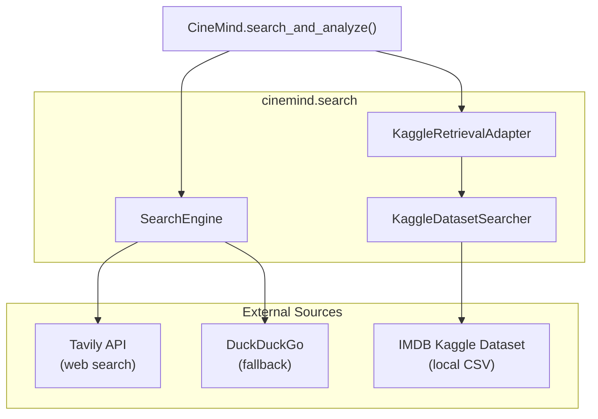
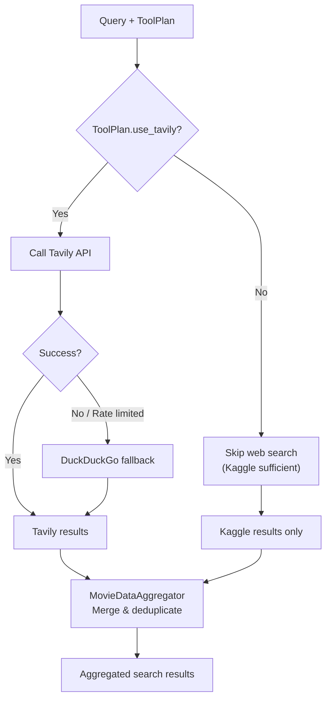
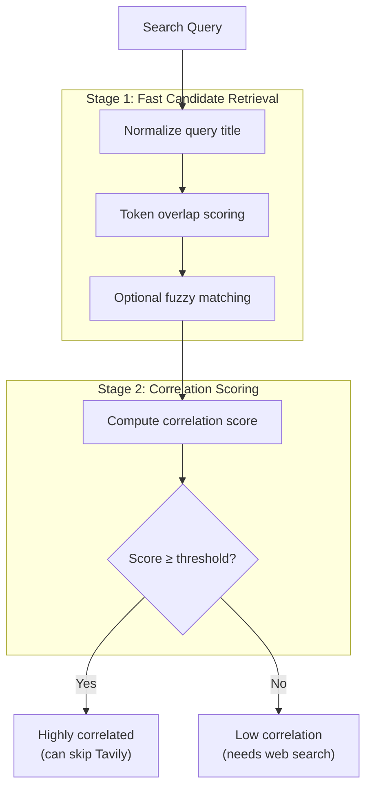
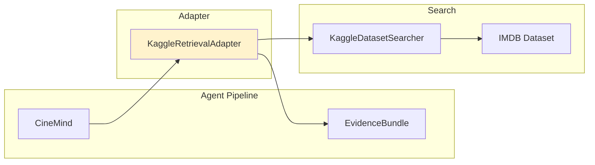
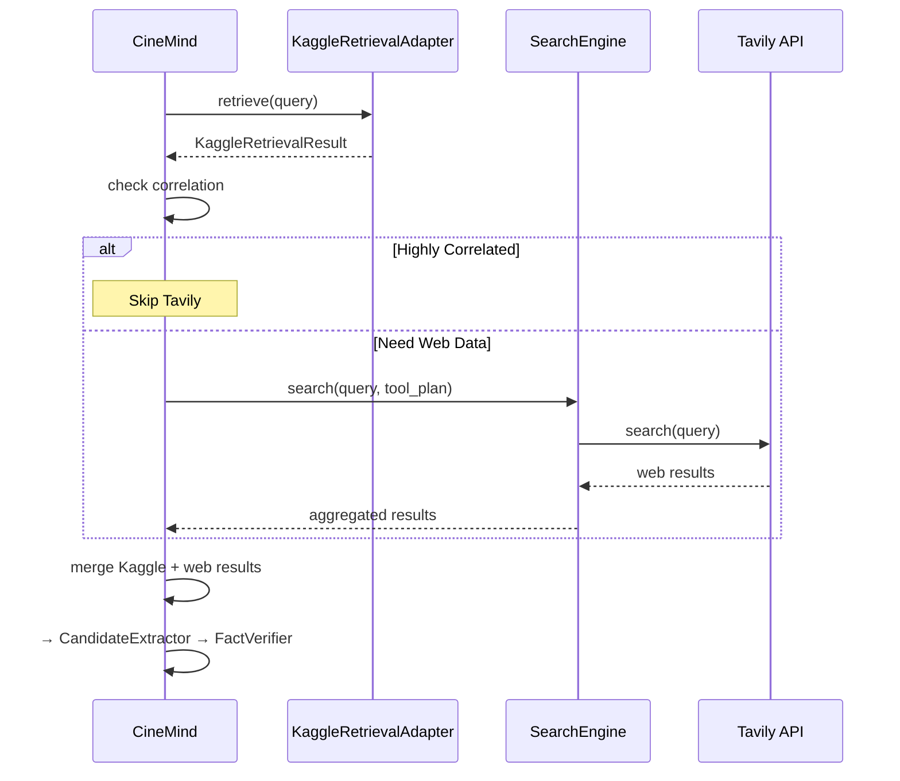
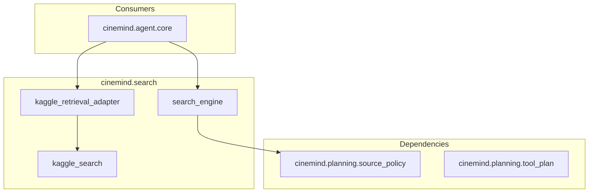

# Search & Data Retrieval

> **Package:** `src/cinemind/search/`
> **Purpose:** Multi-source search and data retrieval — orchestrates Kaggle (offline IMDB dataset), Tavily (real-time web search), and DuckDuckGo (fallback) to gather evidence for the agent pipeline.

---

## Module Map

| Module | Role | Lines |
|--------|------|-------|
| `search_engine.py` | `SearchEngine` — orchestrates search across sources | ~400 |
| `kaggle_search.py` | `KaggleDatasetSearcher` — local IMDB dataset search | ~300 |
| `kaggle_retrieval_adapter.py` | Adapter: Kaggle → normalized evidence bundles | ~250 |

---

## Architecture

---

## Search Engine (`search_engine.py`)

Central orchestrator that decides which sources to query and aggregates results.

### Search Decision Flow

### Tavily Override Reasons

The search engine tracks *why* Tavily was used or skipped:

| Reason | Meaning |
|--------|---------|
| `TOOL_PLAN` | ToolPlanner said use/skip Tavily |
| `CORRELATION` | Kaggle data was highly correlated (skip) |
| `FRESHNESS` | Query requires fresh data (force Tavily) |
| `FALLBACK` | Tavily failed, fell back to DuckDuckGo |

### Key Types

| Type | Fields |
|------|--------|
| `SearchDecision` | `use_tavily`, `reason: TavilyOverrideReason`, `rationale` |
| `MovieDataAggregator` | Merges results from multiple sources, deduplicates by URL |

### Key Methods

| Method | Purpose |
|--------|---------|
| `search(query, tool_plan)` | Full search: decide → execute → aggregate |
| `tavily_search(query)` | Direct Tavily API call |
| `duckduckgo_search(query)` | Fallback web search |

---

## Kaggle Dataset Searcher (`kaggle_search.py`)

Searches a local IMDB dataset (CSV) for movie information — fast, offline, no API costs.

### Two-Stage Search

### Candidate Retrieval Methods

| Method | Speed | Accuracy | When Used |
|--------|-------|----------|-----------|
| Normalized title match | Fastest | Exact | Title queries |
| Token overlap | Fast | Good | Partial matches |
| Fuzzy matching | Slower | Best | Typos, variations |

### Key Methods

| Method | Purpose |
|--------|---------|
| `search(query)` | Full two-stage search |
| `is_highly_correlated(query, results)` | Check if Kaggle data is sufficient |

---

## Kaggle Retrieval Adapter (`kaggle_retrieval_adapter.py`)

Wraps `KaggleDatasetSearcher` in an adapter that produces normalized evidence items compatible with the agent pipeline.

### Adapter Pattern

### Features

| Feature | Description |
|---------|-------------|
| Relevance gating | Filters results below a relevance threshold |
| Timeout | Configurable timeout for long searches |
| Enable/disable | `KAGGLE_ENABLED` env var toggle |
| Evidence normalization | Kaggle results → `KaggleEvidenceItem` format |

### Key Types

| Type | Fields |
|------|--------|
| `KaggleEvidenceItem` | `title`, `year`, `rating`, `genres`, `source`, `confidence` |
| `KaggleRetrievalResult` | `items: List[KaggleEvidenceItem]`, `query`, `search_time_ms` |

### Key Functions

| Function | Purpose |
|----------|---------|
| `get_kaggle_adapter()` | Factory (singleton) |
| `adapter.retrieve(query)` | Search + normalize + gate |

---

## Data Flow Through the Pipeline

---

## Cross-Module Dependencies

### External Packages

| Package | Used In | Purpose |
|---------|---------|---------|
| `tavily` | `search_engine.py` | Web search API |
| `duckduckgo_search` | `search_engine.py` | Fallback search |
| `pandas` | `kaggle_search.py` | CSV dataset loading/querying |
| `logging` | All modules | Structured logging |
| `time` | All modules | Performance timing |

### Environment Variables

| Variable | Default | Used By |
|----------|---------|---------|
| `TAVILY_API_KEY` | — | `search_engine.py` |
| `KAGGLE_ENABLED` | `true` | `kaggle_retrieval_adapter.py` |
| `KAGGLE_DATASET_PATH` | `data/imdb.csv` | `kaggle_search.py` |
| `KAGGLE_CORRELATION_THRESHOLD` | `0.8` | `kaggle_search.py` |
| `KAGGLE_SEARCH_TIMEOUT_SECONDS` | `5` | `kaggle_retrieval_adapter.py` |

---

## Design Patterns & Practices

1. **Adapter Pattern** — `KaggleRetrievalAdapter` normalizes Kaggle's domain-specific output into pipeline-compatible evidence
2. **Fallback Chain** — Tavily → DuckDuckGo → graceful degradation (no crash)
3. **Cost Optimization** — Kaggle (free, local) runs first; Tavily (paid API) is skipped when correlation is high
4. **Two-Stage Search** — fast candidate retrieval before expensive scoring reduces total latency
5. **Decision Tracking** — `SearchDecision` and `TavilyOverrideReason` enable observability of search choices
6. **Feature Toggles** — `KAGGLE_ENABLED` allows disabling the dataset without code changes

---

## Change Impact Guide

| If you change... | Also check... |
|-----------------|---------------|
| Tavily API usage | `TAVILY_API_KEY` env config, `ToolPlanner` skip logic |
| Kaggle dataset schema | `kaggle_search.py` column references, test fixtures |
| Correlation threshold | Search quality, Tavily cost, test expectations |
| `SearchDecision` fields | `CineMind.search_and_analyze()`, observability logging |
| DuckDuckGo fallback | Rate limiting behavior, result format differences |
| Evidence item structure | `CandidateExtractor`, `EvidenceFormatter` |
