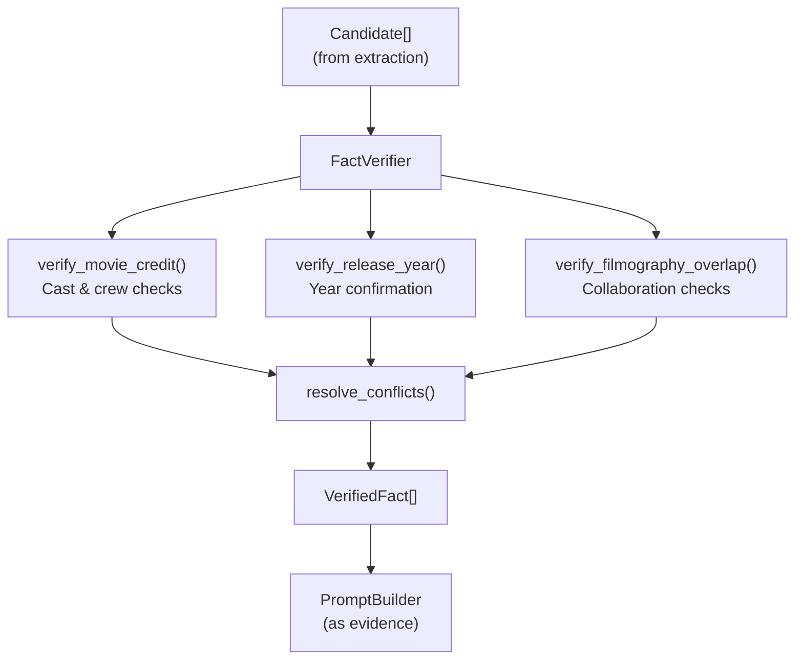
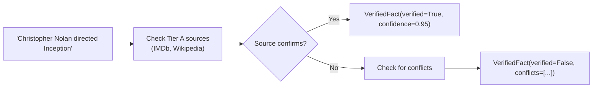
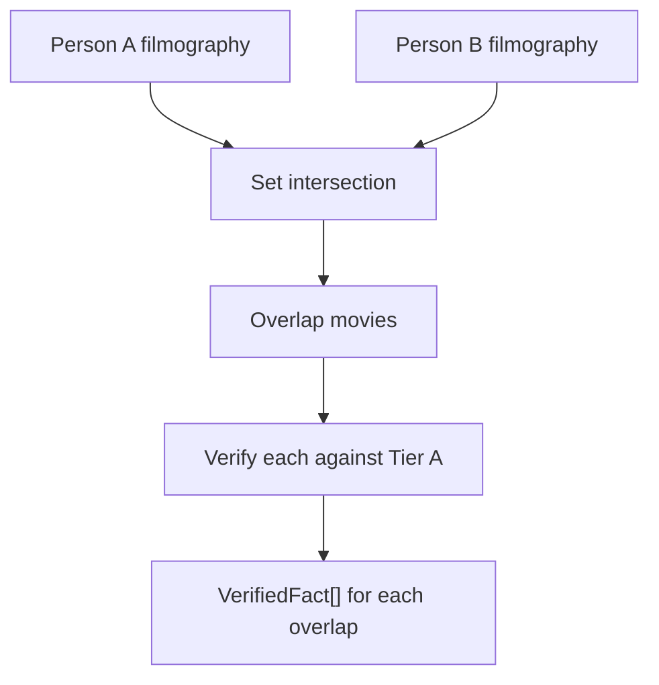
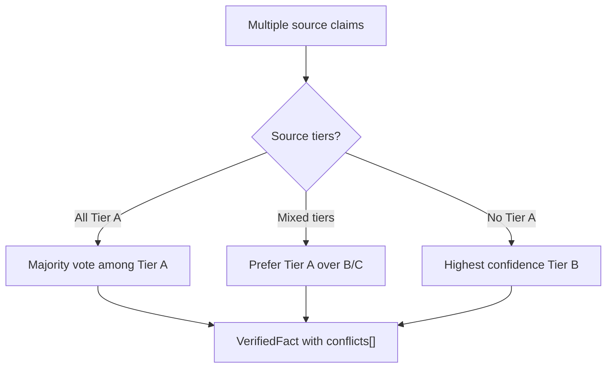
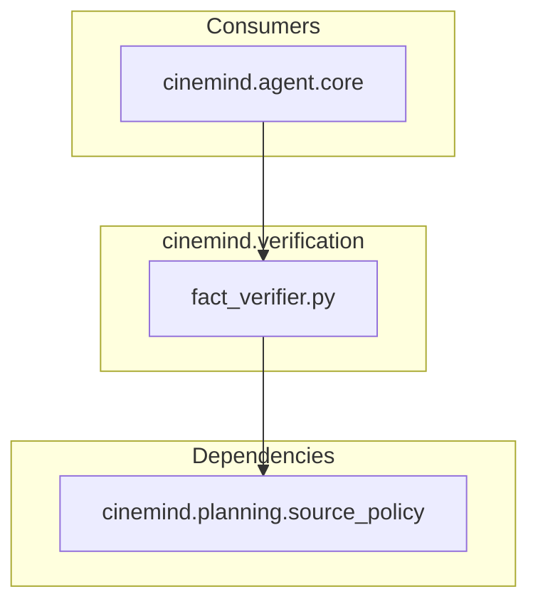
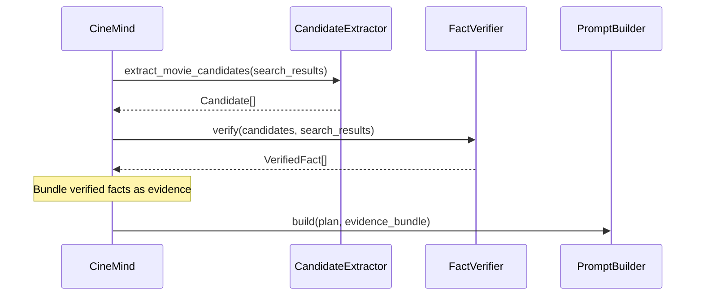

# Fact Verification

> **Package:** `src/cinemind/verification/`
> **Purpose:** Verifies extracted facts against authoritative (Tier A) sources, implementing the "candidate → verify → answer" pattern that ensures factual accuracy before responses reach the user.

<details>
<summary><strong>Quick AI Context</strong> — Jump to what you need</summary>

| I need to understand... | Jump to |
|------------------------|---------|
| How verification fits in the pipeline | [Verification Pipeline](#verification-pipeline) |
| Types of facts verified | [Verification Types](#verification-types) |
| The VerifiedFact data structure | [Key Types](#key-types) |
| How conflicts are resolved | [Conflict Resolution](#conflict-resolution) |
| Which tests to run | [Test Coverage](#test-coverage) |
| What else breaks if I change this | [Change Impact Guide](#change-impact-guide) |

**Example changes and where to look:**
- "Add a new fact type" → [Verification Types](#verification-types) + [Key Types](#key-types)
- "Change conflict resolution logic" → [Conflict Resolution](#conflict-resolution)
- "Understand how verification connects to prompting" → [Integration with Agent Pipeline](#integration-with-agent-pipeline)

</details>

---

## Module Map

| Module | Role | Lines |
|--------|------|-------|
| `fact_verifier.py` | `FactVerifier` class — multi-type fact verification | ~375 |

---

## Verification Pipeline



---

## Verification Types

### Movie Credit Verification

Confirms that a person held a specific role (director, actor, writer) on a specific film.



### Release Year Verification

Extracts and cross-references release years from multiple sources.

| Step | Action |
|------|--------|
| 1 | Extract year from candidate context |
| 2 | Cross-reference against Tier A sources |
| 3 | Flag conflicts if sources disagree |

### Filmography Overlap

Verifies that two people collaborated on the same film(s) — used for queries like "movies with both Tom Hanks and Meg Ryan."



---

## Key Types

### VerifiedFact

| Field | Type | Description |
|-------|------|-------------|
| `fact_type` | `str` | `"cast"`, `"director"`, `"release_year"`, `"collaboration"` |
| `value` | `str` | The fact value (e.g., title, year, name) |
| `verified` | `bool` | Whether the fact is confirmed |
| `source_url` | `str` | URL of the verifying source |
| `source_tier` | `str` | Tier of the source (`"A"`, `"B"`, `"C"`) |
| `confidence` | `float` | 0.0–1.0 verification confidence |
| `conflicts` | `List[str]` | Conflicting source URLs if any |

---

## Conflict Resolution

When multiple sources disagree:



The `conflicts` list always records dissenting sources, even when the fact is marked as verified — preserving full provenance.

---

## Dependencies



### Constructor

```python
class FactVerifier:
    def __init__(self, source_policy: SourcePolicy) -> None:
```

The verifier depends solely on `SourcePolicy` for tier classification — no direct API or database calls.

### External Packages

| Package | Used In | Purpose |
|---------|---------|---------|
| `re` | `fact_verifier.py` | Year extraction patterns |
| `urllib.parse` | `fact_verifier.py` | URL domain parsing |
| `dataclasses` | `fact_verifier.py` | `VerifiedFact` structure |

---

## Integration with Agent Pipeline

The verifier sits between candidate extraction and prompt building:



---

## Design Patterns & Practices

1. **Trust-But-Verify** — candidates from search are never passed to the LLM without verification
2. **Source-Tiered Confidence** — Tier A facts get higher confidence scores than Tier B/C
3. **Conflict Preservation** — disagreements are recorded, not silently discarded
4. **Single Dependency** — depends only on `SourcePolicy`, making it highly testable
5. **Candidate → Verify → Answer** — the core pattern that prevents hallucinated facts

---

## Test Coverage

### Tests to Run When Changing This Package

```bash
# No dedicated unit tests yet — verify via integration tests
python -m pytest tests/integration/test_agent_offline_e2e.py -v

# Source policy tests (verification depends on SourcePolicy)
python -m pytest tests/unit/planning/test_source_policy.py -v

# Scenario tests (verification affects answer quality)
python -m pytest tests/test_scenarios_offline.py -v
```

| Test File | What It Covers |
|-----------|---------------|
| `tests/integration/test_agent_offline_e2e.py` | Full pipeline including verification stage |
| `tests/unit/planning/test_source_policy.py` | Source tier logic that verification depends on |
| `tests/test_scenarios_offline.py` | End-to-end scenarios that validate factual accuracy |

> **Gap:** No dedicated `tests/unit/verification/` tests exist. When modifying verification logic, consider adding `tests/unit/verification/test_fact_verifier.py` with cases for each `verify_*` method.

---

## Change Impact Guide

| If you change... | Also check... |
|-----------------|---------------|
| `VerifiedFact` fields | `PromptBuilder` evidence formatting, `EvidenceBundle` |
| Verification logic | Integration tests with known movie facts |
| Conflict resolution rules | Edge cases with conflicting Tier A sources |
| `fact_type` values | `EvidenceFormatter` source labels |
| `SourcePolicy` tier assignments | All verification confidence scores |
