# Web Frontend

> **Directory:** `web/`
> **Purpose:** Vanilla JS single-page application — the CineMind chat UI. No build step, no framework. Plain HTML, ES modules, and CSS custom properties.

---

## File Map

### Entry

| File | Role | Lines |
|------|------|-------|
| `index.html` | Shell: layout skeleton, all DOM elements, script tags | ~154 |
| `js/app.js` | Module entry point: imports, callback wiring, boot | ~82 |
| `js/config.js` | API base URL configuration | ~7 |

### JavaScript Modules (`js/modules/`)

| Module | Role | Lines |
|--------|------|-------|
| `state.js` | Application state, constants, conversation helpers | ~165 |
| `dom.js` | Cached DOM element references | ~39 |
| `api.js` | HTTP client for backend calls | ~86 |
| `layout.js` | Sidebar, header, right panel, toasts, modal | ~481 |
| `messages.js` | Message rendering, append, send | ~220 |
| `posters.js` | Movie cards, carousels, collections, projects | ~857 |
| `normalize.js` | Response normalization, HTML escaping | ~94 |
| `where-to-watch.js` | Streaming availability drawer | ~227 |

### CSS (`css/`)

| File | Role | Lines |
|------|------|-------|
| `app.css` | Import aggregator (no rules, just `@import`) | ~9 |
| `base.css` | Reset, body, CSS custom properties | ~29 |
| `sidebar.css` | Left sidebar, conversation list, agent toggle | ~219 |
| `header.css` | Header bar, breadcrumb, sub-conversation view | ~218 |
| `chat.css` | Chat column, messages, composer, modal | ~330 |
| `media.css` | Hero cards, carousels, posters, scenes, attachments | ~670 |
| `right-panel.css` | Collections panel, project assets, stack | ~402 |
| `where-to-watch.css` | Streaming availability drawer | ~144 |

---

## Architecture

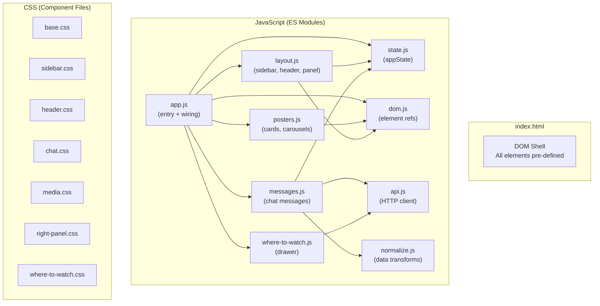

---

## Callback Wiring System

Modules avoid circular imports through a callback registration pattern:

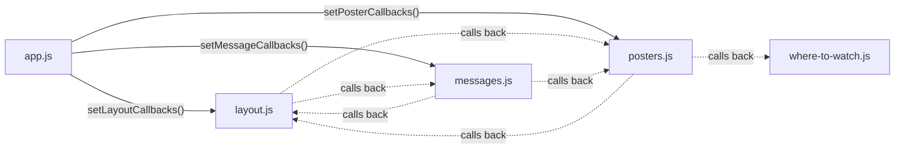

Each module exposes a `setXxxCallbacks(obj)` function. `app.js` calls all three at boot to inject cross-module references. This means:
- No module directly imports another feature module
- `app.js` is the only place where all modules meet
- Circular dependencies are impossible

---

## Application State (`state.js`)

### State Shape

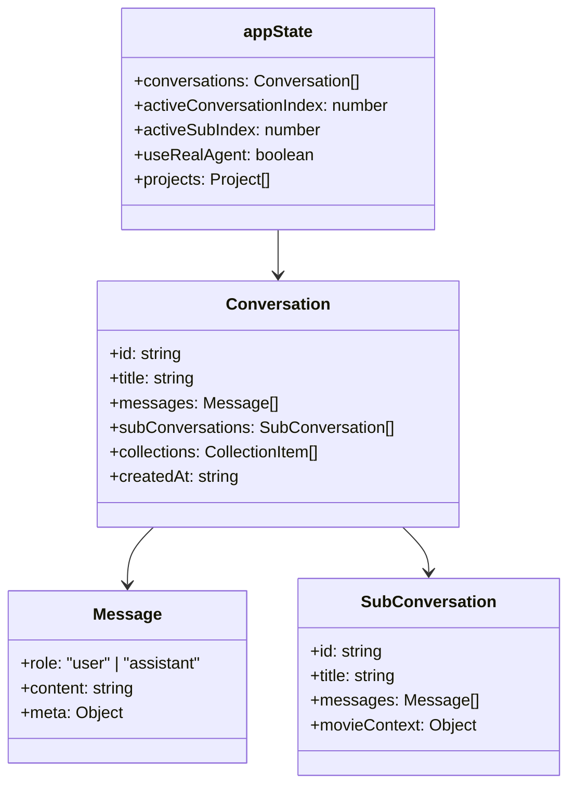

### Key Constants

| Constant | Value | Purpose |
|----------|-------|---------|
| `API_BASE` | From `window.CINEMIND_CONFIG.apiBase` | Backend URL |
| `SEND_TIMEOUT_MS` | `60000` | Request abort timeout |

### Key Helpers

| Function | Purpose |
|----------|---------|
| `getActiveConversation()` | Current conversation object |
| `getActiveThread()` | Current message thread (main or sub) |
| `getAssetKey(movie)` | Unique key for deduplicating movie assets |
| `migrateConversationsToNested()` | Upgrades legacy flat conversations |

---

## API Client (`api.js`)

Two backend calls:

### `sendQuery(text, useRealAgent)`

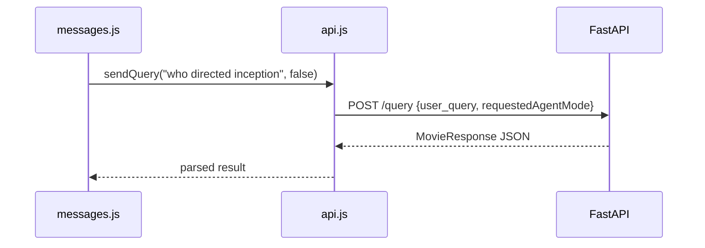

### `fetchWhereToWatch(movie, callback)`

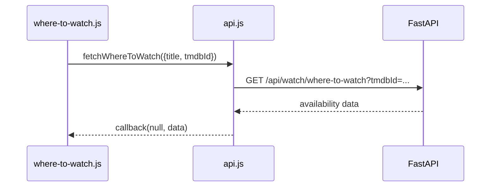

---

## UI Layout

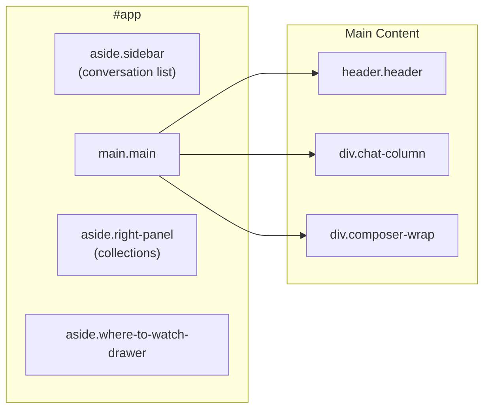

### Panel States

| Panel | States | Toggle |
|-------|--------|--------|
| Sidebar | Expanded / Collapsed | `#sidebarToggle` button |
| Right Panel | Expanded / Collapsed | `#rightPanelToggle` button |
| Where-to-Watch | Open / Closed | Triggered from poster cards |

---

## Message Rendering Flow

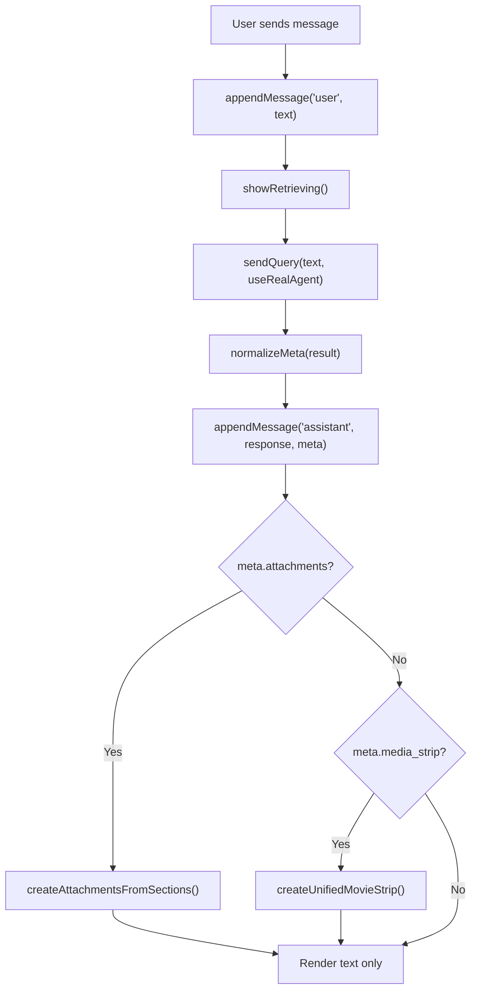

---

## Media & Poster System (`posters.js`)

The richest UI module — renders movie cards, carousels, and manages collections.

### Card Types

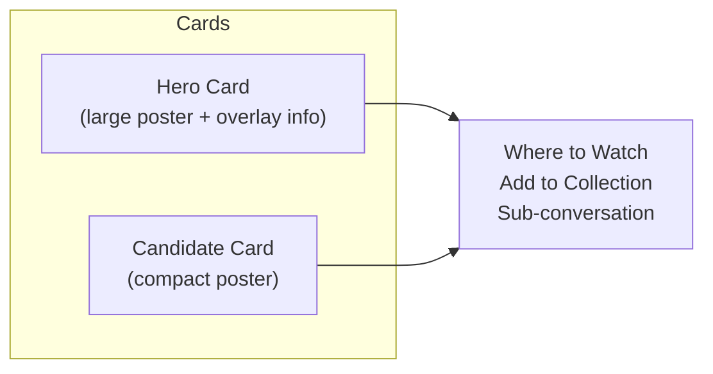

### Attachment Rendering

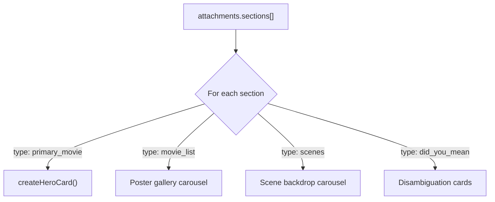

### Collections & Projects

| Feature | Storage | Scope |
|---------|---------|-------|
| Collections | In `appState.conversations[].collections` | Per-conversation |
| Projects | In `appState.projects` | Cross-conversation |

---

## Where-to-Watch Drawer (`where-to-watch.js`)

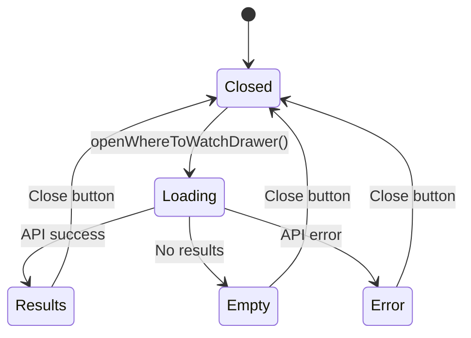

---

## CSS Architecture

### Import Chain

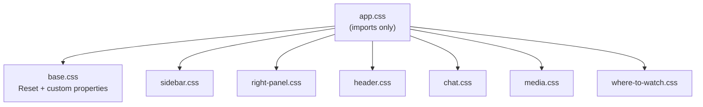

### CSS Custom Properties (Design Tokens)

Defined in `base.css`:

| Token | Value | Purpose |
|-------|-------|---------|
| `--sub-surface-bg` | `#e8e8ec` | Sub-conversation background |
| `--sub-surface-elevated` | `#e8e8ec` | Elevated surfaces |
| `--sub-surface-soft` | `#d8d8de` | Soft surfaces |
| `--sub-text-primary` | `#0d0d0d` | Primary text |
| `--sub-text-secondary` | `#4b5563` | Secondary text |
| `--sub-border` | `rgba(0,0,0,0.1)` | Border color |
| `--sub-poster-width` | `clamp(3rem,9vw,5.5rem)` | Poster size |

### Component ↔ CSS Mapping

| Component | CSS File | Key Classes |
|-----------|----------|-------------|
| Sidebar | `sidebar.css` | `.sidebar`, `.conversation-list`, `.sidebar-agent-toggle` |
| Header | `header.css` | `.header`, `.header-title`, `.header-sub-view`, `.mode-badge` |
| Chat | `chat.css` | `.chat-column`, `.message-*`, `.composer-*`, `.retrieving` |
| Posters/Media | `media.css` | `.hero-card`, `.candidate-card`, `.carousel-wheel`, `.attachments-*` |
| Right Panel | `right-panel.css` | `.right-panel`, `.collection-*`, `.project-assets-*` |
| Where-to-Watch | `where-to-watch.css` | `.where-to-watch-drawer`, `.where-to-watch-*` |

---

## Backend ↔ Frontend Contract

### Response Shape Consumed

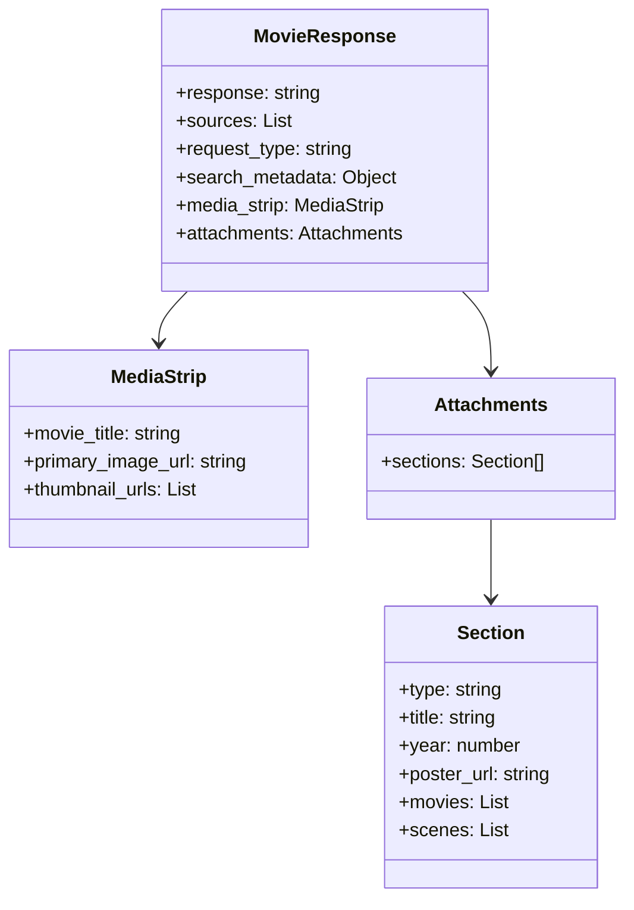

### Normalization (`normalize.js`)

`normalizeMeta()` handles backward compatibility:
- Legacy `media_strip` (object) → standardized format
- Missing `attachments` → infer from `media_strip` / `media_candidates`
- HTML escaping for user-generated content

---

## Dependencies

### Backend Endpoints Used

| Endpoint | Module | Purpose |
|----------|--------|---------|
| `POST /query` | `api.js` | Send movie query |
| `GET /api/watch/where-to-watch` | `api.js` | Streaming availability |
| `GET /health` | (config check) | Mode detection |

### External Dependencies

**None.** Zero npm packages, zero CDN imports. Vanilla JS only.

### Browser Requirements

| Feature | Minimum |
|---------|---------|
| ES Modules | Chrome 61+, Firefox 60+, Safari 11+ |
| CSS Custom Properties | Chrome 49+, Firefox 31+, Safari 9.1+ |
| `clamp()` | Chrome 79+, Firefox 75+, Safari 13.1+ |
| `fetch` | Chrome 42+, Firefox 39+, Safari 10.1+ |

---

## Design Patterns & Practices

1. **No Build Step** — plain HTML/CSS/JS served as-is; no bundler, transpiler, or framework
2. **Callback Registry** — cross-module communication via `setXxxCallbacks()` avoids circular imports
3. **DOM Pre-rendered** — all elements exist in `index.html`; JS only toggles visibility and populates content
4. **State-First** — `appState` is the single source of truth; UI renders from state
5. **Progressive Enhancement** — error overlay in `index.html` catches load failures before modules execute
6. **CSS Component Files** — one CSS file per UI region; `app.css` is the import aggregator
7. **Design Tokens** — CSS custom properties in `base.css` for theming consistency

---

## Change Impact Guide

| If you change... | Also check... |
|-----------------|---------------|
| `MovieResponse` shape (backend) | `normalize.js`, `messages.js`, `posters.js` |
| Attachment section types | `posters.js` `createAttachmentsFromSections()` |
| Where-to-Watch API | `api.js` `fetchWhereToWatch()`, `where-to-watch.js` |
| CSS custom properties | All CSS files that reference `--sub-*` tokens |
| DOM element IDs | `dom.js` (all cached refs), `index.html` |
| State shape | `state.js`, `layout.js`, `messages.js` |
| API base URL | `config.js`, deployment configs |
| Callback signatures | `app.js` wiring, all `setXxxCallbacks()` consumers |
