# Web Frontend

> **Directory:** `web/`
> **Purpose:** Vanilla JS single-page application — the CineMind chat UI. No build step, no framework. Plain HTML, ES modules, and CSS custom properties.

<details>
<summary><strong>Quick AI Context</strong> — Jump to what you need</summary>

| I need to understand... | Jump to |
|------------------------|---------|
| All files and their roles | [File Map](#file-map) |
| How modules are wired | [Callback Wiring System](#callback-wiring-system) |
| Application state shape | [Application State](#application-state-statejs) |
| How API calls work | [API Client](#api-client-apijs) |
| Page layout structure | [UI Layout](#ui-layout) |
| How messages are rendered | [Message Rendering Flow](#message-rendering-flow) |
| Sub-context Movie Hub (filters, history, no chat thread) | [Sub-context Page](WEB_SUB_CONTEXT_PAGE.md) + [UI Layout § Sub-context](#sub-context-movie-hub) |
| Poster cards and carousels | [Media & Poster System](#media--poster-system-postersjs) |
| Where-to-Watch drawer | [Where-to-Watch Drawer](#where-to-watch-drawer-where-to-watchjs) |
| Movie Details modal | [Movie Details (“More Info”) Modal](WEB_MORE_INFO_PAGE.md) |
| CSS file organization | [CSS Architecture](#css-architecture) |
| Design tokens | [CSS Custom Properties](#css-custom-properties-design-tokens) |
| Backend response contract | [Backend ↔ Frontend Contract](#backend--frontend-contract) |
| Which tests to run | [Test Coverage](#test-coverage) |
| What else breaks if I change this | [Change Impact Guide](#change-impact-guide) |

**Example changes and where to look:**
- "Change how messages look" → [Message Rendering Flow](#message-rendering-flow) + `css/chat.css`
- "Change sub-context hub filters / history UI" → [WEB_SUB_CONTEXT_PAGE.md](WEB_SUB_CONTEXT_PAGE.md) + `messages.js` (`renderSubHubFilterHistory`), `layout.js`, `hub-history.js`, `api.js`
- "Add a new card type" → [Media & Poster System](#media--poster-system-postersjs) + `css/media.css`
- "Change sidebar behavior" → [UI Layout](#ui-layout) + `css/sidebar.css`
- "Handle a new response field" → [Backend ↔ Frontend Contract](#backend--frontend-contract) + [Normalization](#normalization-normalizejs)

</details>

---

## Page Views (Home vs Sub-context)

This UI is effectively two views toggled inside the same single-page layout:

- [Home Page (Main Chat View)](WEB_HOME_PAGE.md)
- [Sub-context Page (Sub-conversation Movie Hub)](WEB_SUB_CONTEXT_PAGE.md)
- [Movie Details (“More Info”) Modal](WEB_MORE_INFO_PAGE.md)

## File Map

### Entry

| File | Role | Lines |
|------|------|-------|
| `index.html` | Chat shell: layout skeleton, all DOM elements, script tags | ~240+ |
| `projects.html` | Dedicated Projects page shell for persistent project collections | ~40+ |
| `js/app.js` | Module entry point: imports, callback wiring, boot | ~85 |
| `js/projects-app.js` | Projects page entry point: list/create/select projects + render assets | ~150 |
| `js/config.js` | API base URL configuration | ~7 |

### JavaScript Modules (`js/modules/`)

| Module | Role | Lines |
|--------|------|-------|
| `state.js` | Application state, constants, conversation helpers | ~170 |
| `dom.js` | Cached DOM element references (chat, hub, movie details, etc.) | ~80+ |
| `api.js` | HTTP: `sendQuery`, movie hub helpers, where-to-watch, and persistent project APIs (`getProjects`, `createProject`, `getProject`, `addProjectAssets`, `deleteProjectAsset`) | ~220+ |
| `layout.js` | Sidebar, header, movie hub, sub-context, retrieving, `applyMovieHubClusters`, `recomputeHubFromMessages` | ~1150+ |
| `messages.js` | Main chat messages; sub-view uses `renderSubHubFilterHistory` + hidden `#messageList` | ~520+ |
| `hub-history.js` | Pure helpers: clone hub clusters, build history for API, candidate title strings | ~70 |
| `posters.js` | Movie cards, carousels, collections, projects, attachment sections | ~1350+ |
| `normalize.js` | Response normalization, HTML escaping | ~100 |
| `where-to-watch.js` | Streaming availability drawer | ~230 |
| `movie-details.js` | Full-screen “More info” modal, TMDB details, related titles | (see [WEB_MORE_INFO_PAGE](WEB_MORE_INFO_PAGE.md)) |

### CSS (`css/`)

| File | Role | Lines |
|------|------|-------|
| `app.css` | Import aggregator (no rules, just `@import`) | ~11 |
| `base.css` | Reset, body, CSS custom properties | ~29 |
| `sidebar.css` | Left sidebar, conversation list, agent toggle | ~219 |
| `header.css` | Header bar, breadcrumb, sub-conversation view, hub filter history theming | ~230+ |
| `chat.css` | Chat column, messages, composer, sub-context hub, filter history, retrieving | ~560+ |
| `media.css` | Hero cards, carousels, posters, scenes, attachments | ~670+ |
| `movie-details.css` | Movie Details modal layout | (paired with modal in `index.html`) |
| `right-panel.css` | Collections panel, project assets, stack | ~402 |
| `projects.css` | Dedicated Projects page layout and card/list styles | ~120 |
| `where-to-watch.css` | Streaming availability drawer | ~144 |

---

## Architecture

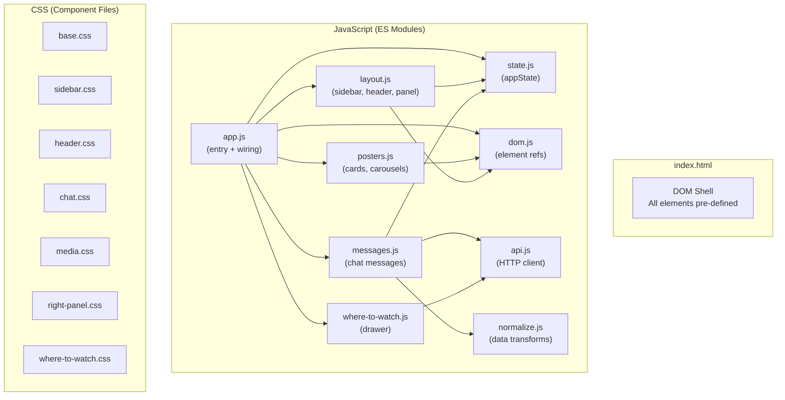

---

## Callback Wiring System

Modules avoid circular imports through a callback registration pattern:

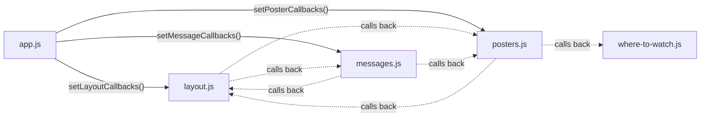

Each module exposes a `setXxxCallbacks(obj)` function. `app.js` calls all three at boot to inject cross-module references. This means:
- Feature modules avoid importing each other **except** where unavoidable: `messages.js` imports `layout.js` for hub-only actions (`applyMovieHubClusters`, `recomputeHubFromMessages`, `restoreSubHubSnapshotFromMessageMeta`). `layout.js` does **not** import `messages.js` (it uses `_renderMessages` from callbacks).
- `app.js` is the primary place where modules are wired together.
- Circular **import** cycles among feature modules are still avoided (layout ↔ messages is one-way).

---

## Application State (`state.js`)

### State Shape

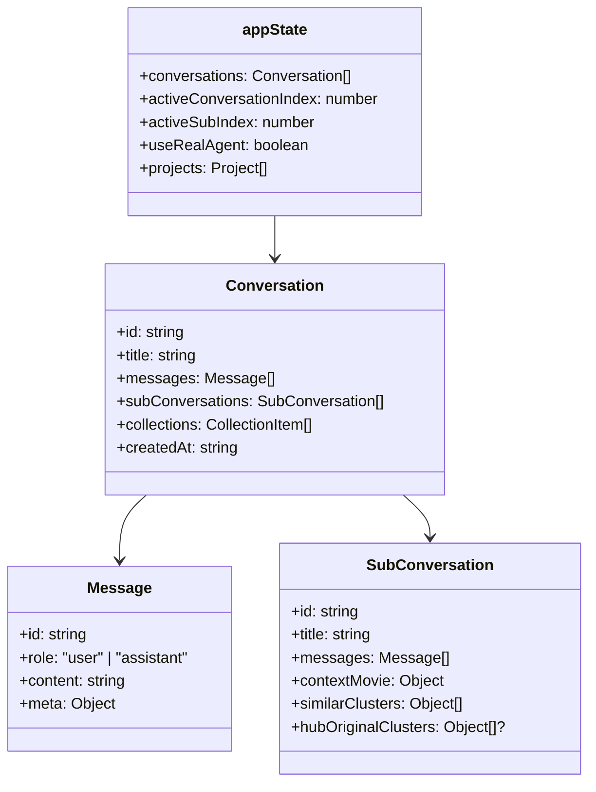

### Key Constants

| Constant | Value | Purpose |
|----------|-------|---------|
| `API_BASE` | From `window.CINEMIND_CONFIG.apiBase` | Backend URL |
| `SEND_TIMEOUT_MS` | `90000` | Request abort timeout for `POST /query` |

### Key Helpers

| Function | Purpose |
|----------|---------|
| `getActiveConversation()` | Current conversation object |
| `getActiveThread()` | Current message thread (main or sub) |
| `getAssetKey(movie)` | Unique key for deduplicating movie assets |
| `migrateConversationsToNested()` | Upgrades legacy flat conversations |

---

## API Client (`api.js`)

### `sendQuery(text, useRealAgent, options?)`

- **Main chat:** `options` omitted. Body: `{ user_query, requestedAgentMode }`.
- **Sub-context hub filters:** `options.hubConversationHistory` may be set to `{ role, content }[]` (prior turns). See [API Server](../api/API_SERVER.md) (`hubConversationHistory`). The hub marker and `candidateTitles` still live inside `user_query` via `prefixMovieHubContextQuery(...)`.

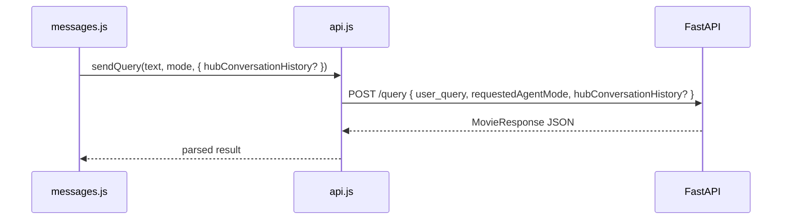

### `prefixMovieHubContextQuery(userQuery, contextMovie, candidateTitles?)`

Builds `[[CINEMIND_HUB_CONTEXT]]{ title, year, tmdbId, candidateTitles? }[[/CINEMIND_HUB_CONTEXT]]` + user text for sub-context narrowing.

### `fetchSimilarMovies(tmdbId, options?)`

`GET /api/movies/{id}/similar?by=genre&title&year&mediaType` — TMDB-backed similar clusters for hub **fallback** when LLM auto-load fails (see `layout.js` / [WEB_SUB_CONTEXT_PAGE](WEB_SUB_CONTEXT_PAGE.md)). If `tmdbId` is missing, the client uses a non-numeric path segment and passes `title` / `year` so the backend can resolve the movie.

### `fetchWhereToWatch(movie, callback)`

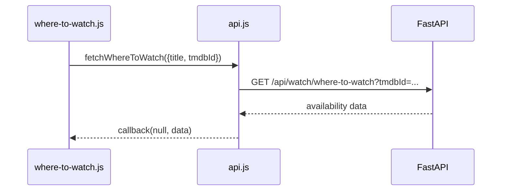

---

## UI Layout

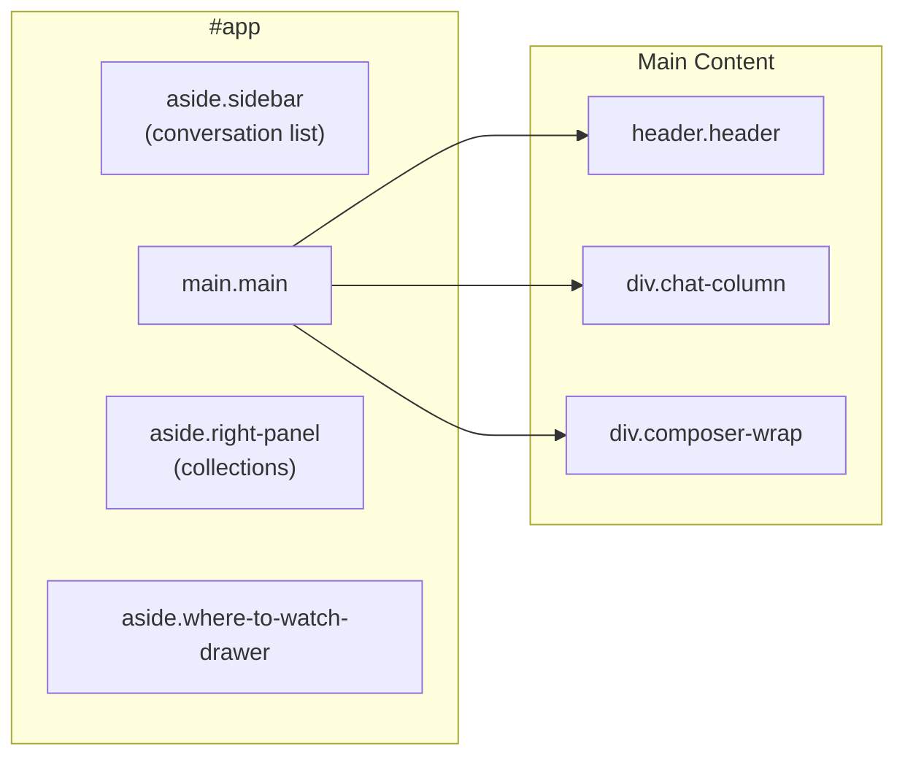

### Sub-context Movie Hub

When the user opens a sub-conversation from a poster (“Talk More About This”), the main chat column shows the **Movie Hub** at the top. **Full documentation:** [WEB_SUB_CONTEXT_PAGE.md](WEB_SUB_CONTEXT_PAGE.md) (DOM, multi-turn history, reset, replay, guardrails).

**DOM structure (`index.html`) — summary**

- `#movieHubView` — hub header with `#movieHubRetrieving` (in-flight filter), `#movieHubResetBtn`, selected movie meta, cluster sections (`#movieHubSimilarByGenre` / tone / cast).
- `#movieHubFilterHistoryWrap` — compact **filter history** (not a chat transcript); lists turns with Remove / Show this hub.
- In sub-view, `#messageList` is **hidden** (CSS + class); `sub.messages` still backs `hubConversationHistory` and replay.

**Behavior (summary)**

- Hub is visible when `appState.conversationView === 'sub'` and `thread.sub.contextMovie` exists (`addSubConversationFromPoster`).
- **Initial hub load:** `maybeAutoLoadMovieHubClusters` sends a structured `/query` with the hub marker (no parent “candidate universe” copied onto `contextMovie` — see errors doc). On failure after retries, **`fetchSimilarMovies`** (TMDB similar API) fills the hub.
- **Hub filters:** Composer sends hub-marked queries; optional **`hubConversationHistory`** in the POST body for follow-ups. Results apply via `applyMovieHubClusters` — posters stay in the **top hub row**; filter turns appear in **Filter history** only.
- **Retrieving:** In sub-view, `showRetrieving()` uses `#movieHubRetrieving`; main chat still uses `#retrievingRow`.

**Cluster rendering**

- Each cluster maps to a hub region:
  - `kind: "genre"` → `#movieHubSimilarByGenre`
  - `kind: "tone"` → `#movieHubSimilarByTone`
  - `kind: "cast"` → `#movieHubSimilarByCast`
- Rendering is handled by `web/js/modules/layout.js::renderMovieHubCluster(container, clusters, kind)` (which uses `createHeroCard(...)` from `posters.js`):
  - Appends a heading (`.movie-hub-cluster-title`).
  - Renders a horizontally scrollable strip (`.movie-hub-cluster-strip`) of hero cards using `createHeroCard(...)`, sharing the same sizing tokens as other poster views.

### Panel States

| Panel | States | Toggle |
|-------|--------|--------|
| Sidebar | Expanded / Collapsed | `#sidebarToggle` button |
| Right Panel | Expanded / Collapsed | `#rightPanelToggle` button |
| Where-to-Watch | Open / Closed | Triggered from poster cards |

---

## Message Rendering Flow

**Main chat** (`conversationView === 'main'`): messages render into `#messageList` as before (bubbles, attachments, media strip).

**Sub-context** (`conversationView === 'sub'`): `#messageList` is not shown. `renderMessages()` calls **`renderSubHubFilterHistory()`** which fills `#movieHubFilterHistory` with compact rows (user question + assistant summary, Remove, Show this hub). Hub poster updates come from `applyMovieHubClusters` / `movieHubClusters` on the response `meta`, not from a second strip in the message area.

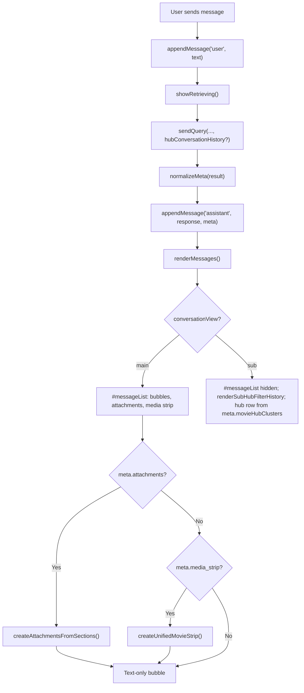

---

## Assistant Message Rendering Contract

Assistant responses are rendered as **structured text** using paragraphs and simple lists without allowing arbitrary HTML.

- **Input format (from backend):**
  - Plain text with newline separators.
  - Blank lines (double newlines) indicate paragraph breaks.
  - List items start with either `- ` (bulleted) or `1. `, `2. `, etc. (numbered).
- **Rendering behavior (`messages.js`):**
  - User and system messages are rendered as a single text node in `.message-bubble`.
  - Assistant messages use a helper in `messages.js` to:
    - Split content into blocks on double newlines.
    - Render blocks as `<ul>/<ol><li>` when **all non-empty lines** in the block start with `- ` or a number + `.`.
    - Otherwise, render the block as a `<p>` element.
    - Always insert text via `textContent`/`createTextNode` so HTML is escaped.
  - Before splitting, assistant text passes through `stripMarkdownNoiseForDisplay()` so echoed markdown (e.g. `***`, `**title**`, or `1. ***` on list lines) is removed and ordered lists render as clean plain text. Backend `output_validator.py` applies the same normalization on the server when possible (see [Prompt pipeline](../prompting/PROMPT_PIPELINE.md#output-validator-output_validatorpy)).
- **Styling (`chat.css`):**
  - `.message-bubble p` and `.message-bubble ul, .message-bubble ol` define spacing and indent within the bubble.
  - Lists are indented relative to the bubble, with compact spacing for `li` elements.

This contract keeps assistant answers **scannable** (paragraphs and bullets) while preserving the existing `MovieResponse` text field and avoiding HTML injection.

---

## Media & Poster System (`posters.js`)

The richest UI module — renders movie cards, carousels, and manages collections.

### Card Types

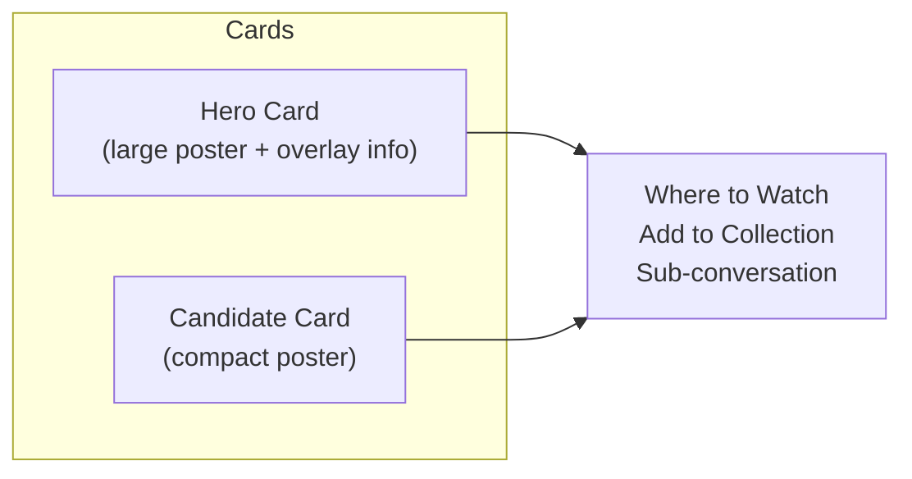

### Attachment Rendering

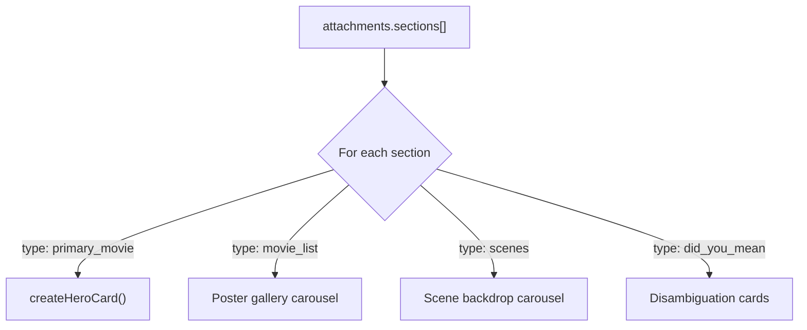

### Collections & Projects

| Feature | Storage | Scope |
|---------|---------|-------|
| Collections | In `appState.conversations[].collections` | Per-conversation |
| Projects | In `appState.projects` | Cross-conversation |

---

## Where-to-Watch Drawer (`where-to-watch.js`)

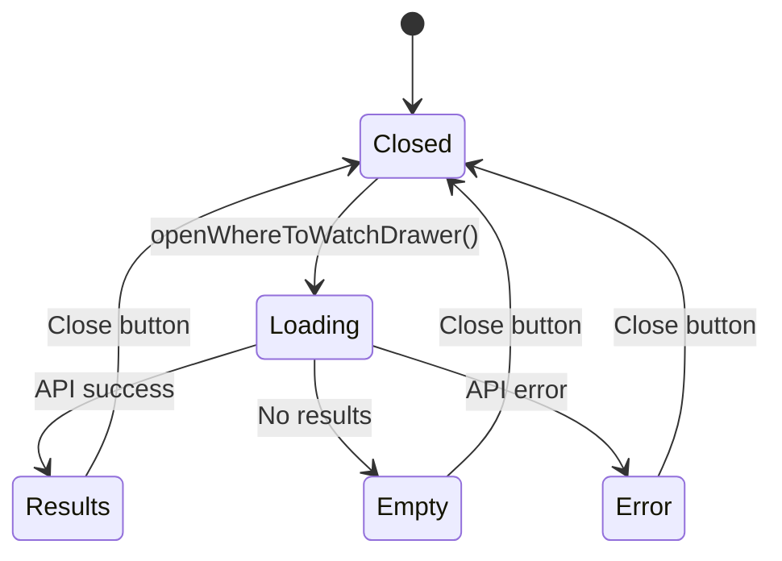

---

## CSS Architecture

### Import Chain

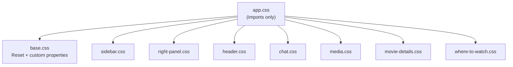

### CSS Custom Properties (Design Tokens)

**Full light-shell palette, typography scale, spacing, radii, shadows, and motion** live in [`base.css`](../../../web/css/base.css). Sub-view tokens (`--sub-*`) are defined there too; `--sub-text-primary` / `--sub-text-secondary` reference the global text tokens for alignment.

| Token | Value | Purpose |
|-------|-------|---------|
| `--sub-surface-bg` | `#e8e8ec` | Sub-conversation background |
| `--sub-surface-elevated` | `#e8e8ec` | Elevated surfaces |
| `--sub-surface-soft` | `#d8d8de` | Soft surfaces |
| `--sub-text-primary` | maps to `--text-primary` | Primary text |
| `--sub-text-secondary` | maps to `--text-secondary` | Secondary text |
| `--sub-border` | `rgba(0,0,0,0.1)` | Border color |
| `--sub-poster-width` | `clamp(3rem,9vw,5.5rem)` | Poster size |

See **[WEB_DESIGN_TOKENS.md](WEB_DESIGN_TOKENS.md)** for cross-surface parity, component patterns (buttons, list rows), and a manual verification checklist.

### Component ↔ CSS Mapping

| Component | CSS File | Key Classes |
|-----------|----------|-------------|
| Sidebar | `sidebar.css` | `.sidebar`, `.conversation-list`, `.sidebar-agent-toggle` |
| Header | `header.css` | `.header`, `.header-title`, `.header-sub-view`, `.mode-badge` |
| Chat | `chat.css` | `.chat-column`, `.message-*`, `.composer-*`, `.retrieving`, `.movie-hub-*`, `.movie-hub-filter-history-*` |
| Posters/Media | `media.css` | `.hero-card`, `.candidate-card`, `.carousel-wheel`, `.attachments-*` |
| Movie Details | `movie-details.css` | `.movie-details-*` (modal in `index.html`) |
| Right Panel | `right-panel.css` | `.right-panel`, `.collection-*`, `.project-assets-*` |
| Where-to-Watch | `where-to-watch.css` | `.where-to-watch-drawer`, `.where-to-watch-*` |

---

## Backend ↔ Frontend Contract

### Response Shape Consumed

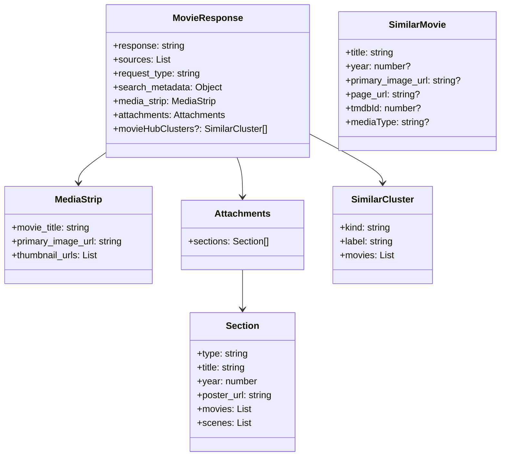

### Normalization (`normalize.js`)

`normalizeMeta()` handles backward compatibility:
- Legacy `media_strip` (object) → standardized format
- Missing `attachments` → infer from `media_strip` / `media_candidates`
- HTML escaping for user-generated content

---

## Dependencies

### Backend Endpoints Used

| Endpoint | Module | Purpose |
|----------|--------|---------|
| `POST /query` | `api.js` | Chat + sub-context hub queries (`hubConversationHistory` optional) |
| `GET /api/movies/{movie_id}/similar` | `api.js` | `fetchSimilarMovies` — hub fallback clusters |
| `GET /api/watch/where-to-watch` | `api.js` | Streaming availability |
| `GET /api/movies/{tmdbId}/details` | `movie-details.js` | Movie Details modal (when wired) |
| `GET /health` | (config check) | Mode detection |

### External Dependencies

**None.** Zero npm packages, zero CDN imports. Vanilla JS only.

### Browser Requirements

| Feature | Minimum |
|---------|---------|
| ES Modules | Chrome 61+, Firefox 60+, Safari 11+ |
| CSS Custom Properties | Chrome 49+, Firefox 31+, Safari 9.1+ |
| `clamp()` | Chrome 79+, Firefox 75+, Safari 13.1+ |
| `fetch` | Chrome 42+, Firefox 39+, Safari 10.1+ |

---

## Design Patterns & Practices

1. **No Build Step** — plain HTML/CSS/JS served as-is; no bundler, transpiler, or framework
2. **Callback Registry** — cross-module communication via `setXxxCallbacks()` avoids circular imports
3. **DOM Pre-rendered** — all elements exist in `index.html`; JS only toggles visibility and populates content
4. **State-First** — `appState` is the single source of truth; UI renders from state
5. **Progressive Enhancement** — error overlay in `index.html` catches load failures before modules execute
6. **CSS Component Files** — one CSS file per UI region; `app.css` is the import aggregator
7. **Design Tokens** — CSS custom properties in `base.css` for theming consistency

---

## Test Coverage

### Tests to Run When Changing the Frontend

```bash
# Smoke test (serves frontend, exercises API)
python -m pytest tests/smoke/test_playground_smoke.py -v

# Manual testing via playground server
python -m tests.playground.server
# Open http://localhost:8000
```

| Test Method | What It Covers |
|------------|---------------|
| `tests/smoke/test_playground_smoke.py` | FastAPI serves `web/`, basic request-response cycle |
| Playground server (manual) | Full UI testing: messages, posters, sidebar, Where-to-Watch |
| Browser DevTools console | Check for JS errors after changes |

> **Note:** The frontend has no automated unit tests. All validation is through the playground server smoke test and manual browser testing. When adding significant JS logic, consider adding tests via a lightweight runner or at minimum verifying no console errors.

---

## Change Impact Guide

| If you change... | Also check... |
|-----------------|---------------|
| `MovieResponse` shape (backend) | `normalize.js`, `messages.js`, `posters.js` |
| Sub-context hub / `movieHubClusters` / marker | [WEB_SUB_CONTEXT_PAGE.md](WEB_SUB_CONTEXT_PAGE.md), `layout.js`, `api.js`, `hub-history.js`, [API_SERVER](../api/API_SERVER.md) |
| Attachment section types | `posters.js` `createAttachmentsFromSections()` |
| Where-to-Watch API | `api.js` `fetchWhereToWatch()`, `where-to-watch.js` |
| CSS custom properties | All CSS files that reference `--sub-*` tokens |
| DOM element IDs | `dom.js` (all cached refs), `index.html` |
| State shape | `state.js`, `layout.js`, `messages.js` |
| API base URL | `config.js`, deployment configs |
| Callback signatures | `app.js` wiring, all `setXxxCallbacks()` consumers |
| `messages.js` ↔ `layout.js` hub imports | Avoid circular imports: `layout` must not import `messages` |
