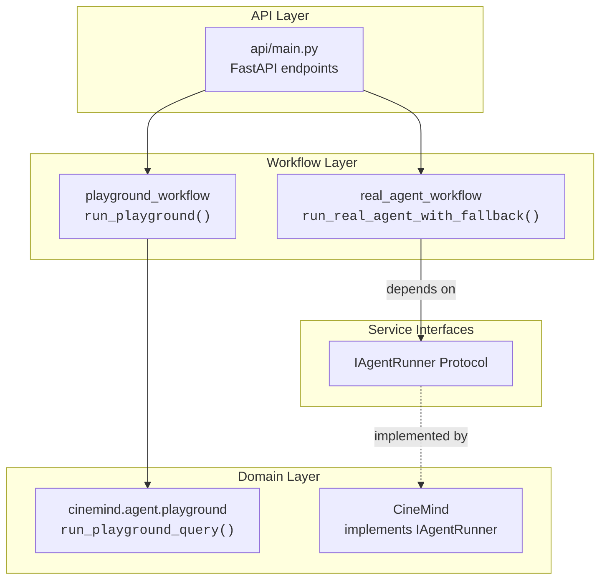
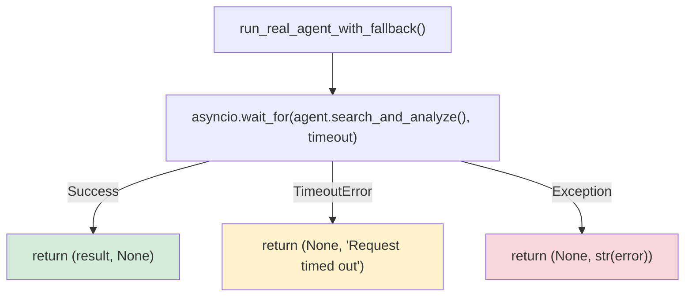
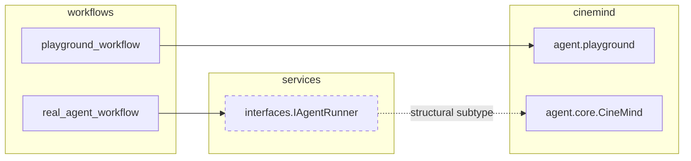

# Workflows

> **Package:** `src/workflows/`
> **Purpose:** Thin orchestration layer that decouples API endpoints from domain logic. Workflows depend on service interfaces, not on concrete implementations.

<details>
<summary><strong>Quick AI Context</strong> — Jump to what you need</summary>

| I need to understand... | Jump to |
|------------------------|---------|
| What files are in this package | [Module Map](#module-map) |
| How API calls the agent | [Architecture](#architecture) |
| Playground workflow details | [Playground Workflow](#playground-workflow) |
| Timeout and fallback logic | [Timeout & Fallback Logic](#timeout--fallback-logic) |
| The IAgentRunner protocol | [Service Interface](#service-interface) |
| Which tests to run | [Test Coverage](#test-coverage) |
| What else breaks if I change this | [Change Impact Guide](#change-impact-guide) |

**Example changes and where to look:**
- "Change the timeout duration" → [Timeout & Fallback Logic](#timeout--fallback-logic)
- "Add a new workflow variant" → [Architecture](#architecture) + [Service Interface](#service-interface)
- "Change how fallback works" → [Real Agent Workflow](#real-agent-workflow)

</details>

---

## Module Map

| Module | Role | Lines |
|--------|------|-------|
| `playground_workflow.py` | Delegates to `cinemind.agent.playground` | ~27 |
| `real_agent_workflow.py` | Runs real agent with timeout + fallback | ~52 |

---

## Architecture



---

## Playground Workflow

**File:** `src/workflows/playground_workflow.py`

A pure pass-through to `cinemind.agent.playground.run_playground_query()`. Exists so callers (API, tests) import from `workflows` and never directly from `cinemind`.

```python
async def run_playground(
    user_query: str,
    request_type: Optional[str] = None,
) -> Dict[str, Any]:
```

**Dependencies:** `cinemind.agent.playground` only.

---

## Real Agent Workflow

**File:** `src/workflows/real_agent_workflow.py`

Wraps the real LLM agent with timeout and structured error handling. The caller (API) supplies the concrete `IAgentRunner` — the workflow never imports `CineMind` directly.

```python
async def run_real_agent_with_fallback(
    user_query: str,
    request_type: Optional[str],
    use_live_data: bool,
    timeout_seconds: float,
    agent_runner: IAgentRunner,
) -> Tuple[Optional[Dict[str, Any]], Optional[str]]:
```

### Timeout & Fallback Logic



The API layer receives the `(result, fallback_reason)` tuple and switches to Playground if `fallback_reason` is set.

---

## Service Interface

**File:** `src/services/interfaces.py`

```python
class IAgentRunner(Protocol):
    async def search_and_analyze(
        self,
        user_query: str,
        use_live_data: bool = True,
        request_id: Optional[str] = None,
        request_type: Optional[str] = None,
        outcome: Optional[str] = None,
        playground_mode: bool = False,
    ) -> Dict[str, Any]: ...
```

This protocol enables:
- **Testability** — tests inject stubs without importing `CineMind`
- **Decoupling** — workflows never import domain classes
- **Substitutability** — any class satisfying the protocol works

---

## Dependency Graph



### External Packages

| Package | Used In | Purpose |
|---------|---------|---------|
| `asyncio` | `real_agent_workflow.py` | `wait_for` timeout |
| `logging` | `real_agent_workflow.py` | Error logging |

---

## Design Patterns & Practices

1. **Dependency Inversion** — workflows depend on `IAgentRunner` protocol, not `CineMind`
2. **Thin Orchestration** — no business logic in workflows; they wire inputs to domain functions
3. **Structured Error Propagation** — `(result, fallback_reason)` tuple avoids silent failures
4. **Single Import Direction** — API → Workflows → Domain (never reverse)

---

## Test Coverage

### Tests to Run When Changing This Package

```bash
# Direct unit tests
python -m pytest tests/unit/workflows/test_workflows.py -v

# Smoke tests (exercise full workflow paths)
python -m pytest tests/smoke/test_playground_smoke.py -v
python -m pytest tests/smoke/test_real_workflow_smoke.py -v
```

| Test File | What It Covers |
|-----------|---------------|
| `tests/unit/workflows/test_workflows.py` | `run_real_agent_with_fallback`: timeout, error fallback, success path |
| `tests/smoke/test_playground_smoke.py` | Playground workflow via FastAPI |
| `tests/smoke/test_real_workflow_smoke.py` | Real agent workflow (requires API key) |

---

## Change Impact Guide

| If you change... | Also check... |
|-----------------|---------------|
| `IAgentRunner` signature | `CineMind.search_and_analyze`, `real_agent_workflow.py`, all test stubs |
| `run_playground` signature | `api/main.py`, playground tests |
| Timeout behavior | `api/main.py` (reads `AGENT_TIMEOUT_SECONDS` env var) |
| Fallback reason format | Frontend error display logic |
