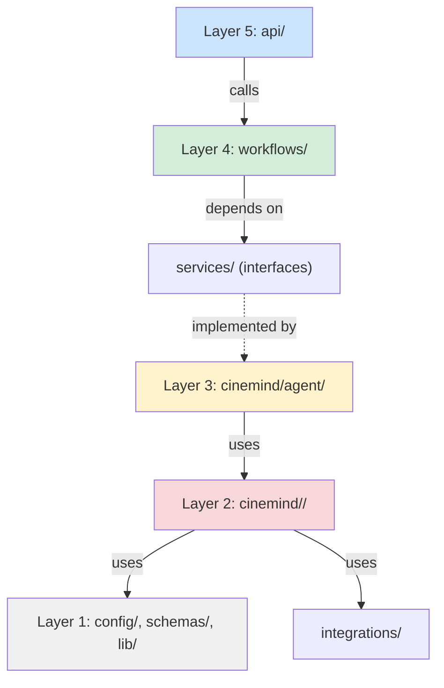
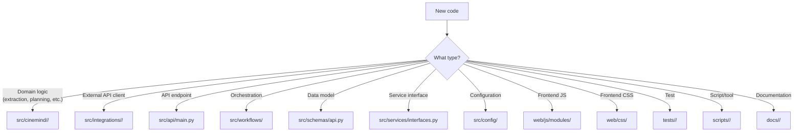

# Directory Structure Guide

> How to add new modules, packages, and features to the CineMind codebase following established conventions.

---

## Current Structure

```
src/
├── api/                    # API layer (FastAPI endpoints)
│   └── main.py
├── cinemind/               # Domain layer (agent + features)
│   ├── agent/              # Agent core, modes, playground
│   ├── extraction/         # NLP extraction pipeline
│   ├── infrastructure/     # Cache, DB, observability, tagging
│   ├── llm/                # LLM client abstraction
│   ├── media/              # Media enrichment & attachments
│   ├── planning/           # Request planning & routing
│   ├── prompting/          # Prompt building & validation
│   ├── search/             # Search engine & data retrieval
│   └── verification/       # Fact verification
├── config/                 # Environment configuration
├── domain/                 # Domain primitives (reserved)
├── integrations/           # External API clients
│   ├── tmdb/               # TMDB integration
│   └── watchmode/          # Watchmode integration
├── lib/                    # Shared utilities
├── schemas/                # Pydantic API models
├── services/               # Service interfaces (Protocols)
└── workflows/              # Orchestration layer
```

---

## Layer Hierarchy



**Import Rule:** Each layer may only import from the same layer or below. Never import upward.

---

## Adding a New Feature Sub-Package

### Example: Adding `cinemind/recommendations/`

A new module for advanced recommendation logic.

#### Step 1: Create the package

```
src/cinemind/recommendations/
├── __init__.py
├── engine.py
└── filters.py
```

#### Step 2: Define the public API in `__init__.py`

```python
"""Advanced movie recommendation engine."""
from .engine import RecommendationEngine, RecommendationResult
from .filters import GenreFilter, EraFilter, apply_filters
```

Only export what consumers need. Internal helpers stay private.

#### Step 3: Implement with dataclass contracts

```python
# engine.py
from dataclasses import dataclass
from typing import List, Optional
import logging

logger = logging.getLogger(__name__)


@dataclass
class RecommendationResult:
    movies: List[str]
    strategy: str
    confidence: float


class RecommendationEngine:
    def __init__(self, search_engine, intent_extractor):
        self.search = search_engine
        self.intent = intent_extractor

    async def recommend(self, query: str) -> RecommendationResult:
        ...
```

#### Step 4: Wire into the agent

```python
# In cinemind/agent/core.py
from cinemind.recommendations import RecommendationEngine
```

#### Step 5: Update documentation

- Create `docs/features/recommendations/RECOMMENDATIONS.md`
- Update `docs/features/README.md` index
- Update `docs/AI_CONTEXT.md` routing table

#### Step 6: Add tests

```
tests/
├── unit/
│   └── recommendations/
│       ├── test_engine.py
│       └── test_filters.py
└── integration/
    └── test_recommendations_pipeline.py
```

---

## Adding a New External Integration

### Example: Adding `integrations/letterboxd/`

#### Step 1: Create the package

```
src/integrations/letterboxd/
├── __init__.py
├── client.py
└── normalizer.py
```

#### Step 2: Follow the integration pattern

```python
# __init__.py
"""Letterboxd integration: user ratings and reviews."""
from .client import get_letterboxd_client, LetterboxdClient
from .normalizer import normalize_review_response
```

```python
# client.py
import os
import logging
import httpx

logger = logging.getLogger(__name__)

class LetterboxdClient:
    def __init__(self, api_key: str):
        self.api_key = api_key
        self.base_url = "https://api.letterboxd.com/api/v0"

    async def get_reviews(self, movie_title: str):
        ...

def get_letterboxd_client() -> LetterboxdClient:
    api_key = os.environ.get("LETTERBOXD_API_KEY", "")
    return LetterboxdClient(api_key=api_key)
```

```python
# normalizer.py
def normalize_review_response(raw_response):
    """Transform raw API response into frontend-friendly format."""
    ...
```

#### Step 3: Add the env var

```bash
# In .env.example
LETTERBOXD_API_KEY=           # Optional: Letterboxd API key for user reviews
```

#### Step 4: Wire into consumers

The integration is consumed by a feature module (e.g., `cinemind/media/`), never directly by the API.

#### Step 5: Update documentation

- Update `docs/features/integrations/EXTERNAL_INTEGRATIONS.md`
- Add env var to `docs/features/config/CONFIGURATION.md`

---

## Adding a New API Endpoint

### Example: Adding `GET /api/reviews`

#### Step 1: Add the Pydantic model

```python
# In schemas/api.py
class ReviewsResponse(BaseModel):
    movie_title: str
    reviews: List[Dict[str, Any]]
    source: str
```

#### Step 2: Add the endpoint

```python
# In api/main.py
@app.get("/api/reviews", response_model=ReviewsResponse)
async def get_reviews(title: str, year: Optional[int] = None):
    client = get_letterboxd_client()
    raw = await client.get_reviews(title)
    return normalize_review_response(raw)
```

#### Step 3: Update documentation

- Update `docs/features/api/API_SERVER.md`
- Update `docs/features/config/CONFIGURATION.md` if new env vars

---

## Adding a New Frontend Feature

### Example: Adding a "Reviews" tab

#### Step 1: Add HTML shell

```html
<!-- In index.html, inside #app -->
<aside class="reviews-drawer hidden" id="reviewsDrawer">
    <div class="reviews-drawer-header">
        <h2>Reviews</h2>
        <button type="button" class="reviews-drawer-close" id="reviewsDrawerClose">×</button>
    </div>
    <div class="reviews-drawer-content" id="reviewsDrawerContent"></div>
</aside>
```

#### Step 2: Add CSS

```css
/* css/reviews.css */
.reviews-drawer { /* drawer styles */ }
.reviews-drawer-header { /* header styles */ }
.reviews-drawer-content { /* content area */ }
```

```css
/* In app.css, add the import */
@import "reviews.css";
```

#### Step 3: Add DOM refs

```javascript
// In dom.js
export const reviewsDrawer = document.getElementById('reviewsDrawer');
export const reviewsDrawerClose = document.getElementById('reviewsDrawerClose');
export const reviewsDrawerContent = document.getElementById('reviewsDrawerContent');
```

#### Step 4: Add API call

```javascript
// In api.js
export async function fetchReviews(title, callback) {
    const url = API_BASE + '/api/reviews?title=' + encodeURIComponent(title);
    // ... fetch with error handling
}
```

#### Step 5: Create the module

```javascript
// js/modules/reviews.js
import * as dom from './dom.js';
import { fetchReviews } from './api.js';

let _callbacks = {};
export function setReviewsCallbacks(cb) { _callbacks = cb; }

export function openReviewsDrawer(movie) { /* ... */ }
export function closeReviewsDrawer() { /* ... */ }
export function initReviews() {
    if (dom.reviewsDrawerClose) {
        dom.reviewsDrawerClose.addEventListener('click', closeReviewsDrawer);
    }
}
```

#### Step 6: Wire in app.js

```javascript
// In app.js
import { setReviewsCallbacks, initReviews } from './modules/reviews.js';

setReviewsCallbacks({ /* cross-module refs */ });
initReviews();
```

---

## File Placement Decision Tree



---

## Checklist for Any New Module

- [ ] Package has `__init__.py` with public exports
- [ ] All data structures use `@dataclass`
- [ ] Logging uses `logging.getLogger(__name__)`
- [ ] Env vars documented in `.env.example` and `docs/features/config/CONFIGURATION.md`
- [ ] Feature doc created in `docs/features/<name>/`
- [ ] `docs/features/README.md` index updated
- [ ] `docs/AI_CONTEXT.md` routing table updated
- [ ] Tests added in `tests/unit/<name>/`
- [ ] No upward imports (only same level or below)
