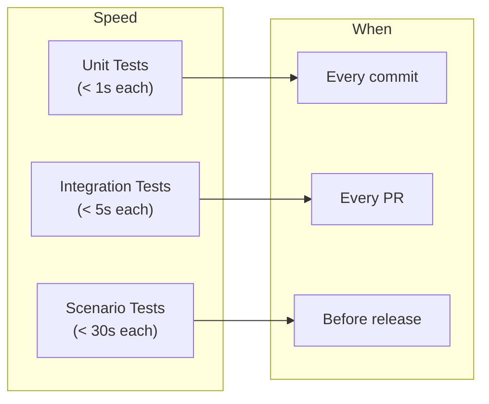

# Testing Practices

> How to organize, write, and run tests for CineMind.

---

## Test Structure

```
tests/
├── unit/                       # Fast, isolated, no external calls
│   ├── extraction/             # Mirrors src/cinemind/extraction/
│   ├── media/                  # Mirrors src/cinemind/media/
│   ├── planning/               # Mirrors src/cinemind/planning/
│   ├── search/                 # Mirrors src/cinemind/search/
│   ├── prompting/              # Mirrors src/cinemind/prompting/
│   ├── verification/           # Mirrors src/cinemind/verification/
│   └── infrastructure/         # Mirrors src/cinemind/infrastructure/
├── integration/                # Cross-module, may use fakes
├── scenarios/                  # End-to-end scenario tests
│   ├── gold/                   # Regression scenarios (must pass)
│   └── explore/                # Experimental scenarios (may fail)
├── playground_server.py        # Offline playground for UI testing
└── conftest.py                 # Shared fixtures
```

### Mirroring Rule

Test directories mirror the `src/cinemind/` structure:

```
src/cinemind/extraction/title_extraction.py
    → tests/unit/extraction/test_title_extraction.py

src/cinemind/media/media_enrichment.py
    → tests/unit/media/test_media_enrichment.py
```

---

## Running Tests

### Common Commands

```bash
# Run all tests
make test

# Run unit tests only
make test-unit

# Run a specific test file
python -m pytest tests/unit/extraction/test_title_extraction.py -v

# Run tests matching a pattern
python -m pytest -k "test_intent" -v

# Run with coverage
python -m pytest --cov=src tests/unit/

# Run scenario tests (offline)
python -m pytest tests/scenarios/ -v
```

### Environment Setup

```bash
# Always set PYTHONPATH
export PYTHONPATH=src:$PYTHONPATH

# Or use the Makefile (sets it automatically)
make test
```

---

## Writing Unit Tests

### Test File Template

```python
"""Tests for cinemind.extraction.title_extraction."""
import pytest
from cinemind.extraction import extract_movie_titles, TitleExtractionResult


class TestExtractMovieTitles:
    """Test cases for extract_movie_titles()."""

    def test_single_title_with_prefix(self):
        result = extract_movie_titles("who directed Inception")
        assert "Inception" in result.titles

    def test_multiple_titles_comma_separated(self):
        result = extract_movie_titles("compare The Matrix, Inception, and Interstellar")
        assert len(result.titles) == 3

    def test_empty_query_returns_empty(self):
        result = extract_movie_titles("")
        assert result.titles == []

    def test_non_movie_query(self):
        result = extract_movie_titles("what is the weather")
        assert result.titles == [] or result.intent == "unknown"
```

### Test Naming

| Pattern | Example |
|---------|---------|
| `test_<behavior>` | `test_single_title_with_prefix` |
| `test_<input>_returns_<output>` | `test_empty_query_returns_empty` |
| `test_<scenario>_when_<condition>` | `test_fallback_when_tavily_fails` |

### Rules

- One assert per test (or closely related asserts)
- Test behavior, not implementation details
- Use descriptive names — the name should explain what's being tested
- Group related tests in a class

---

## Writing Integration Tests

Integration tests verify that modules work together correctly.

```python
"""Integration test for the extraction → planning pipeline."""
import pytest
from cinemind.extraction import IntentExtractor
from cinemind.planning import RequestPlanner, RequestTypeRouter


class TestExtractionPlanningIntegration:

    @pytest.fixture
    def planner(self):
        return RequestPlanner(
            router=RequestTypeRouter(),
            intent_extractor=IntentExtractor(),
        )

    @pytest.mark.asyncio
    async def test_director_query_produces_correct_plan(self, planner):
        plan = await planner.plan("who directed Inception")
        assert plan.request_type == "director_info"
        assert plan.tool_plan.use_kaggle is True
```

---

## Using Fakes and Mocks

### Prefer Fakes Over Mocks

The codebase provides built-in fakes:

| Fake | Replaces | Use Case |
|------|----------|----------|
| `FakeLLMClient` | `OpenAILLMClient` | All tests that don't need real LLM |
| `set_default_media_cache(mock)` | Real media cache | Tests for enrichment logic |

```python
from cinemind.llm import FakeLLMClient

def test_pipeline_with_fake_llm():
    agent = CineMind(llm_client=FakeLLMClient())
    result = await agent.search_and_analyze("test query")
    assert result is not None
```

### When to Use `unittest.mock`

Only when there's no built-in fake and you need to:
- Verify a function was called with specific arguments
- Simulate a specific error condition

```python
from unittest.mock import AsyncMock, patch

@patch("cinemind.search.search_engine.tavily_search")
async def test_duckduckgo_fallback(mock_tavily):
    mock_tavily.side_effect = Exception("Rate limited")
    engine = SearchEngine()
    result = await engine.search("test query", tool_plan)
    # Should fall back to DuckDuckGo
    assert result is not None
```

---

## Scenario Tests

Scenario tests are end-to-end tests using predefined queries and expected behaviors.

### Gold vs Explore

| Category | Purpose | Policy |
|----------|---------|--------|
| `gold/` | Regression — must always pass | Failures block CI |
| `explore/` | Experimental — tests for new features | Failures are informational |

### Scenario Format

```yaml
- query: "Who directed Inception?"
  expected_type: "director_info"
  expected_contains: ["Christopher Nolan"]
  must_have_sources: true
```

### Running Scenarios

```bash
# Gold scenarios only
python -m pytest tests/scenarios/gold/ -v

# Explore scenarios
python -m pytest tests/scenarios/explore/ -v

# All scenarios with report
make test-scenarios
```

---

## Fixtures

### Shared Fixtures (`conftest.py`)

```python
import pytest
from cinemind.llm import FakeLLMClient


@pytest.fixture
def fake_llm():
    return FakeLLMClient()


@pytest.fixture
def sample_search_results():
    return [
        {"title": "Inception", "url": "https://imdb.com/title/tt1375666", "snippet": "..."},
        {"title": "The Dark Knight", "url": "https://imdb.com/title/tt0468569", "snippet": "..."},
    ]
```

### Rules

- Put widely-used fixtures in `tests/conftest.py`
- Put feature-specific fixtures in `tests/unit/<feature>/conftest.py`
- Name fixtures descriptively: `sample_search_results`, not `data`
- Prefer factory functions over complex fixtures

---

## Test Categories and When to Run



---

## Playground Server for UI Testing

For testing the frontend without the real agent:

```bash
python -m tests.playground_server
# Open http://localhost:8000
```

The playground server:
- Serves the `web/` frontend
- Responds to `/query` with TMDB-based responses (no LLM)
- Runs the full extraction/media pipeline
- Useful for testing UI changes without API keys

---

## Anti-Patterns to Avoid

| Anti-Pattern | Instead Do |
|-------------|-----------|
| Tests that require API keys | Use `FakeLLMClient` or mock the API |
| Tests that depend on network | Mock external calls or use offline data |
| Testing implementation details | Test behavior and output |
| Giant test functions | One logical assert per test |
| Shared mutable state between tests | Use fixtures with proper scope |
| Skipping tests instead of fixing | Fix or move to `explore/` |
| No assertions (smoke tests that just "don't crash") | Assert on specific output |
