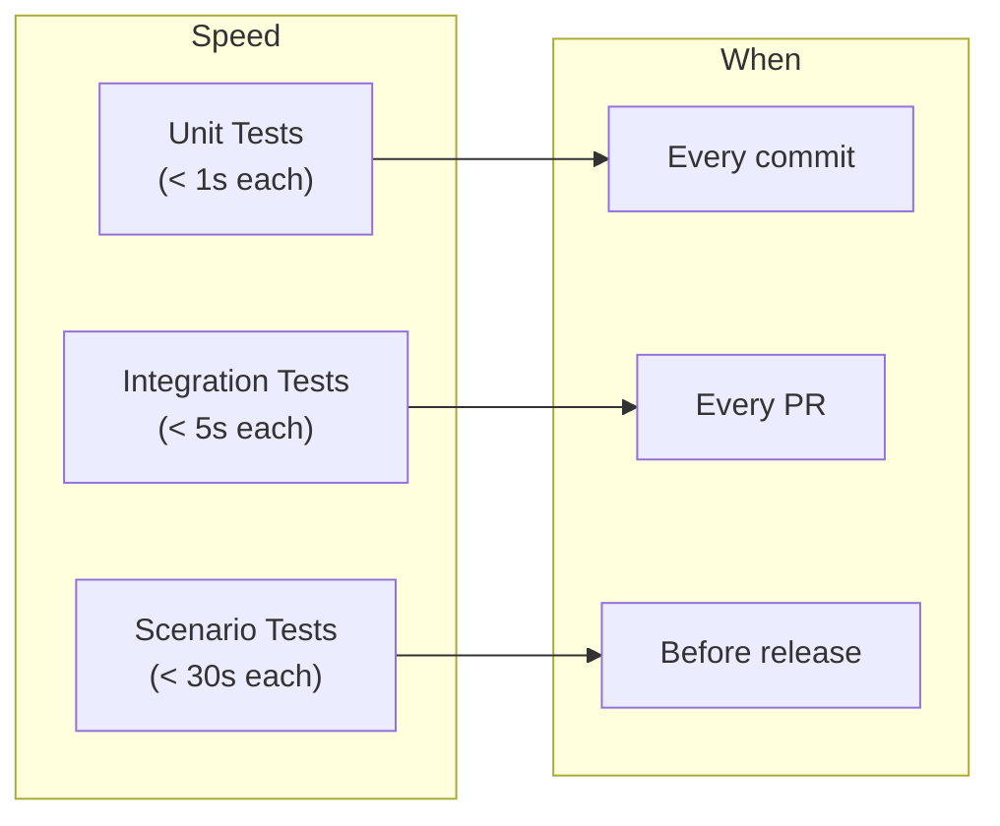
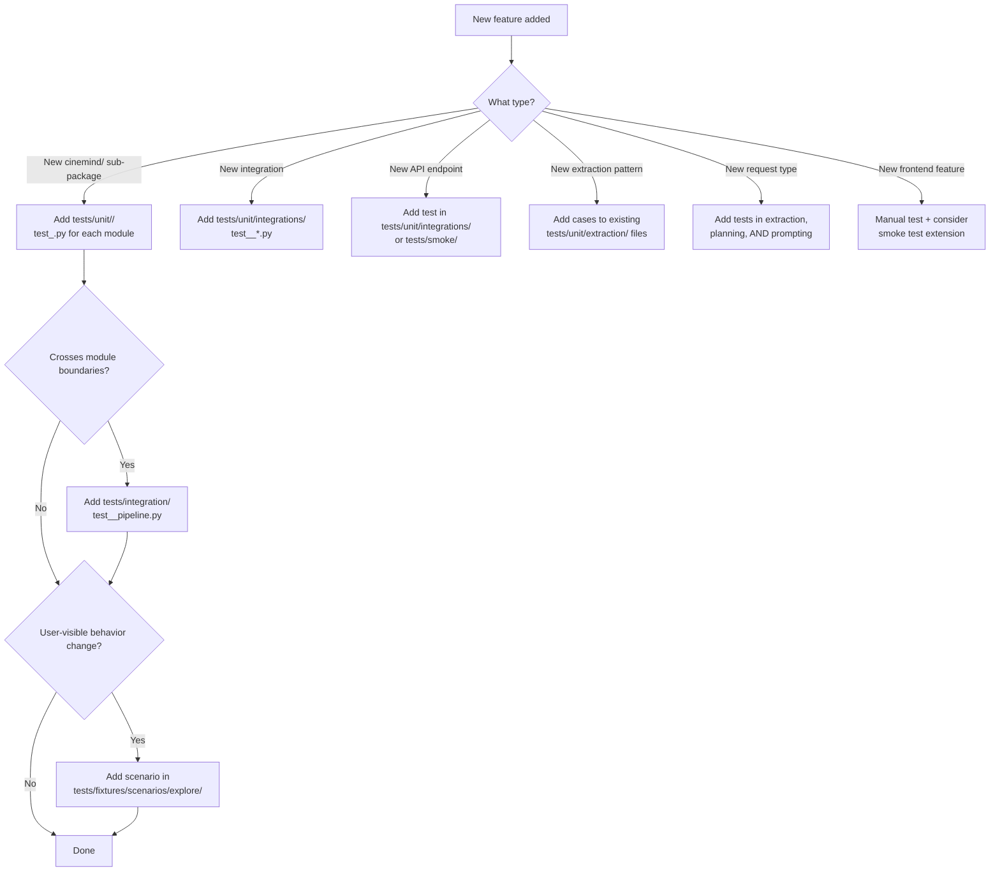

# Testing Practices

> How to organize, write, and run tests for CineMind.

<details>
<summary><strong>Quick AI Context</strong> — Jump to what you need</summary>

| I need to... | Jump to |
|-------------|---------|
| See the test directory layout | [Test Structure](#test-structure) |
| Run tests for a specific feature | [Feature Test Map](#feature-test-map) |
| Run common test commands | [Running Tests](#running-tests) |
| Write a new unit test | [Writing Unit Tests](#writing-unit-tests) |
| Write an integration test | [Writing Integration Tests](#writing-integration-tests) |
| Use fakes vs mocks | [Using Fakes and Mocks](#using-fakes-and-mocks) |
| Add tests for a new feature | [Adding Tests for New Features](#adding-tests-for-new-features) |
| Write a scenario test | [Scenario Tests](#scenario-tests) |
| Know when to run what | [Test Categories and When to Run](#test-categories-and-when-to-run) |
| What NOT to do | [Anti-Patterns to Avoid](#anti-patterns-to-avoid) |

</details>

---

## Test Structure

```
tests/
├── unit/                       # Fast, isolated, no external calls
│   ├── extraction/             # Mirrors src/cinemind/extraction/
│   ├── media/                  # Mirrors src/cinemind/media/
│   ├── planning/               # Mirrors src/cinemind/planning/
│   ├── search/                 # Mirrors src/cinemind/search/
│   ├── prompting/              # Mirrors src/cinemind/prompting/
│   ├── verification/           # Mirrors src/cinemind/verification/
│   └── infrastructure/         # Mirrors src/cinemind/infrastructure/
├── integration/                # Cross-module, may use fakes
├── scenarios/                  # End-to-end scenario tests
│   ├── gold/                   # Regression scenarios (must pass)
│   └── explore/                # Experimental scenarios (may fail)
├── playground_server.py        # Offline playground for UI testing
└── conftest.py                 # Shared fixtures
```

### Mirroring Rule

Test directories mirror the `src/cinemind/` structure:

```
src/cinemind/extraction/title_extraction.py
    → tests/unit/extraction/test_title_extraction.py

src/cinemind/media/media_enrichment.py
    → tests/unit/media/test_media_enrichment.py
```

---

## Running Tests

### Common Commands

```bash
# Run all tests
make test

# Run unit tests only
make test-unit

# Run a specific test file
python -m pytest tests/unit/extraction/test_title_extraction.py -v

# Run tests matching a pattern
python -m pytest -k "test_intent" -v

# Run with coverage
python -m pytest --cov=src tests/unit/

# Run scenario tests (offline)
python -m pytest tests/scenarios/ -v
```

### Environment Setup

```bash
# Always set PYTHONPATH
export PYTHONPATH=src:$PYTHONPATH

# Or use the Makefile (sets it automatically)
make test
```

---

## Writing Unit Tests

### Test File Template

```python
"""Tests for cinemind.extraction.title_extraction."""
import pytest
from cinemind.extraction import extract_movie_titles, TitleExtractionResult


class TestExtractMovieTitles:
    """Test cases for extract_movie_titles()."""

    def test_single_title_with_prefix(self):
        result = extract_movie_titles("who directed Inception")
        assert "Inception" in result.titles

    def test_multiple_titles_comma_separated(self):
        result = extract_movie_titles("compare The Matrix, Inception, and Interstellar")
        assert len(result.titles) == 3

    def test_empty_query_returns_empty(self):
        result = extract_movie_titles("")
        assert result.titles == []

    def test_non_movie_query(self):
        result = extract_movie_titles("what is the weather")
        assert result.titles == [] or result.intent == "unknown"
```

### Test Naming

| Pattern | Example |
|---------|---------|
| `test_<behavior>` | `test_single_title_with_prefix` |
| `test_<input>_returns_<output>` | `test_empty_query_returns_empty` |
| `test_<scenario>_when_<condition>` | `test_fallback_when_tavily_fails` |

### Rules

- One assert per test (or closely related asserts)
- Test behavior, not implementation details
- Use descriptive names — the name should explain what's being tested
- Group related tests in a class

---

## Writing Integration Tests

Integration tests verify that modules work together correctly.

```python
"""Integration test for the extraction → planning pipeline."""
import pytest
from cinemind.extraction import IntentExtractor
from cinemind.planning import RequestPlanner, RequestTypeRouter


class TestExtractionPlanningIntegration:

    @pytest.fixture
    def planner(self):
        return RequestPlanner(
            router=RequestTypeRouter(),
            intent_extractor=IntentExtractor(),
        )

    @pytest.mark.asyncio
    async def test_director_query_produces_correct_plan(self, planner):
        plan = await planner.plan("who directed Inception")
        assert plan.request_type == "director_info"
        assert plan.tool_plan.use_kaggle is True
```

---

## Using Fakes and Mocks

### Prefer Fakes Over Mocks

The codebase provides built-in fakes:

| Fake | Replaces | Use Case |
|------|----------|----------|
| `FakeLLMClient` | `HttpChatLLMClient` | All tests that don't need real LLM |
| `set_default_media_cache(mock)` | Real media cache | Tests for enrichment logic |

```python
from cinemind.llm import FakeLLMClient

def test_pipeline_with_fake_llm():
    agent = CineMind(llm_client=FakeLLMClient())
    result = await agent.search_and_analyze("test query")
    assert result is not None
```

### When to Use `unittest.mock`

Only when there's no built-in fake and you need to:
- Verify a function was called with specific arguments
- Simulate a specific error condition

```python
from unittest.mock import AsyncMock, patch

@patch("cinemind.search.search_engine.tavily_search")
async def test_duckduckgo_fallback(mock_tavily):
    mock_tavily.side_effect = Exception("Rate limited")
    engine = SearchEngine()
    result = await engine.search("test query", tool_plan)
    # Should fall back to DuckDuckGo
    assert result is not None
```

---

## Scenario Tests

Scenario tests are end-to-end tests using predefined queries and expected behaviors.

### Gold vs Explore

| Category | Purpose | Policy |
|----------|---------|--------|
| `gold/` | Regression — must always pass | Failures block CI |
| `explore/` | Experimental — tests for new features | Failures are informational |

### Scenario Format

```yaml
- query: "Who directed Inception?"
  expected_type: "director_info"
  expected_contains: ["Christopher Nolan"]
  must_have_sources: true
```

For AI Response UX, scenarios should focus on **structure and tone** rather than exact wording. Use fields such as:

- `expected.validator_checks.expected_violation_types` to assert when boilerplate or verbosity issues are detected.
- Simple checks for paragraph breaks (presence of blank lines) and list usage (lines starting with `-` or `1.`) in sample outputs.

### Running Scenarios

```bash
# Gold scenarios only
python -m pytest tests/scenarios/gold/ -v

# Explore scenarios
python -m pytest tests/scenarios/explore/ -v

# All scenarios with report
make test-scenarios
```

---

## Fixtures

### Shared Fixtures (`conftest.py`)

```python
import pytest
from cinemind.llm import FakeLLMClient


@pytest.fixture
def fake_llm():
    return FakeLLMClient()


@pytest.fixture
def sample_search_results():
    return [
        {"title": "Inception", "url": "https://imdb.com/title/tt1375666", "snippet": "..."},
        {"title": "The Dark Knight", "url": "https://imdb.com/title/tt0468569", "snippet": "..."},
    ]
```

### Rules

- Put widely-used fixtures in `tests/conftest.py`
- Put feature-specific fixtures in `tests/unit/<feature>/conftest.py`
- Name fixtures descriptively: `sample_search_results`, not `data`
- Prefer factory functions over complex fixtures

---

## Test Categories and When to Run



---

## Playground Server for UI Testing

For testing the frontend without the real agent:

```bash
python -m tests.playground_server
# Open http://localhost:8000
```

The playground server:
- Serves the `web/` frontend
- Responds to `/query` with TMDB-based responses (no LLM)
- Runs the full extraction/media pipeline
- Useful for testing UI changes without API keys

---

## Feature Test Map

Quick reference: which tests cover which feature area.

| Feature | Unit Tests | Integration Tests | Scenarios |
|---------|-----------|------------------|-----------|
| **Extraction** | `tests/unit/extraction/` (4 files) | — | `tests/test_scenarios_offline.py` |
| **Planning** | `tests/unit/planning/` (4 files) | `test_routing_mocked.py` | `tests/test_scenarios_offline.py` |
| **Search** | `tests/unit/search/` (2 files) | `test_routing_mocked.py` | — |
| **Media** | `tests/unit/media/` (including `test_media_alignment.py`) | — | — |
| **Prompting** | `tests/unit/prompting/` (3 files) | `test_agent_offline_e2e.py` | `tests/test_scenarios_offline.py` |
| **Integrations** | `tests/unit/integrations/` (4 files) | — | — |
| **Workflows** | `tests/unit/workflows/` (1 file) | — | — |
| **Agent Core** | — | `test_agent_offline_e2e.py` | `tests/test_scenarios_offline.py` |
| **Infrastructure** | — | `test_agent_offline_e2e.py` | — |
| **Verification** | — | `test_agent_offline_e2e.py` | — |
| **LLM Client** | — | `test_agent_offline_e2e.py` | — |
| **API Server** | `test_where_to_watch_api.py` | — | — |
| **Frontend** | — | — | Manual via playground |

### Test Gaps

The following areas lack dedicated unit tests and should be prioritized when modifying:

| Area | Missing Tests | Recommended |
|------|-------------|-------------|
| `cinemind/verification/` | No unit tests | Add `tests/unit/verification/test_fact_verifier.py` |
| `cinemind/infrastructure/cache.py` | No unit tests | Add `tests/unit/infrastructure/test_cache.py` |
| `cinemind/infrastructure/database.py` | No unit tests | Add `tests/unit/infrastructure/test_database.py` |
| `cinemind/infrastructure/tagging.py` | No unit tests | Add `tests/unit/infrastructure/test_tagging.py` |
| `cinemind/agent/core.py` | No unit tests (integration only) | Consider unit tests for individual methods |

---

## Adding Tests for New Features

When adding a new feature, follow this decision tree to determine what tests to write:



### Test Templates by Feature Type

#### New Backend Sub-Package

```python
# tests/unit/<feature>/test_<module>.py
"""Tests for cinemind.<feature>.<module>."""
import pytest
from cinemind.<feature> import <MainClass>, <ResultType>


class Test<MainClass>:

    @pytest.fixture
    def instance(self):
        return <MainClass>(...)

    def test_basic_behavior(self, instance):
        result = instance.<method>("test input")
        assert isinstance(result, <ResultType>)
        assert result.<field> == expected_value

    def test_edge_case_empty_input(self, instance):
        result = instance.<method>("")
        assert result.<field> == default_value

    def test_error_handling(self, instance):
        # Should degrade gracefully, not raise
        result = instance.<method>(None)
        assert result is not None
```

#### New Request Type (multi-module)

```python
# 1. tests/unit/planning/test_request_type_router.py — ADD cases:
def test_new_type_recognized(self):
    result = router.classify("example query for new type")
    assert result.request_type == "new_type"

# 2. tests/unit/extraction/test_entity_extraction.py — ADD cases:
def test_new_intent_extracted(self):
    intent = extractor.extract("example query")
    assert intent.intent == "new_type"

# 3. tests/unit/prompting/test_output_validator.py — ADD cases:
def test_new_type_template_applied(self):
    template = get_template("new_type")
    assert template is not None

# 4. tests/fixtures/scenarios/explore/<NNN>_new_type.yaml — ADD scenario:
# query: "example query for new type"
# expected_type: "new_type"
# expected_contains: ["expected output fragment"]
```

#### New External Integration

```python
# tests/unit/integrations/test_<service>_client.py
"""Tests for integrations.<service>.client."""
import pytest
from unittest.mock import AsyncMock, patch
from integrations.<service> import get_<service>_client


class Test<Service>Client:

    @pytest.fixture
    def client(self):
        return get_<service>_client()

    @patch("integrations.<service>.client.httpx.AsyncClient.get")
    async def test_happy_path(self, mock_get, client):
        mock_get.return_value = MockResponse(200, {"data": "value"})
        result = await client.<method>("test")
        assert result is not None

    @patch("integrations.<service>.client.httpx.AsyncClient.get")
    async def test_api_error_returns_empty(self, mock_get, client):
        mock_get.side_effect = Exception("API down")
        result = await client.<method>("test")
        assert result == [] or result is None  # graceful degradation
```

#### New API Endpoint

```python
# tests/smoke/test_<endpoint>_smoke.py  OR extend test_playground_smoke.py
"""Smoke test for /api/<endpoint>."""
import pytest
from fastapi.testclient import TestClient
from api.main import app

client = TestClient(app)

def test_endpoint_returns_200():
    response = client.get("/api/<endpoint>?param=value")
    assert response.status_code == 200

def test_endpoint_returns_expected_shape():
    response = client.get("/api/<endpoint>?param=value")
    data = response.json()
    assert "expected_field" in data
```

---

## Anti-Patterns to Avoid

| Anti-Pattern | Instead Do |
|-------------|-----------|
| Tests that require API keys | Use `FakeLLMClient` or mock the API |
| Tests that depend on network | Mock external calls or use offline data |
| Testing implementation details | Test behavior and output |
| Giant test functions | One logical assert per test |
| Shared mutable state between tests | Use fixtures with proper scope |
| Skipping tests instead of fixing | Fix or move to `explore/` |
| No assertions (smoke tests that just "don't crash") | Assert on specific output |
